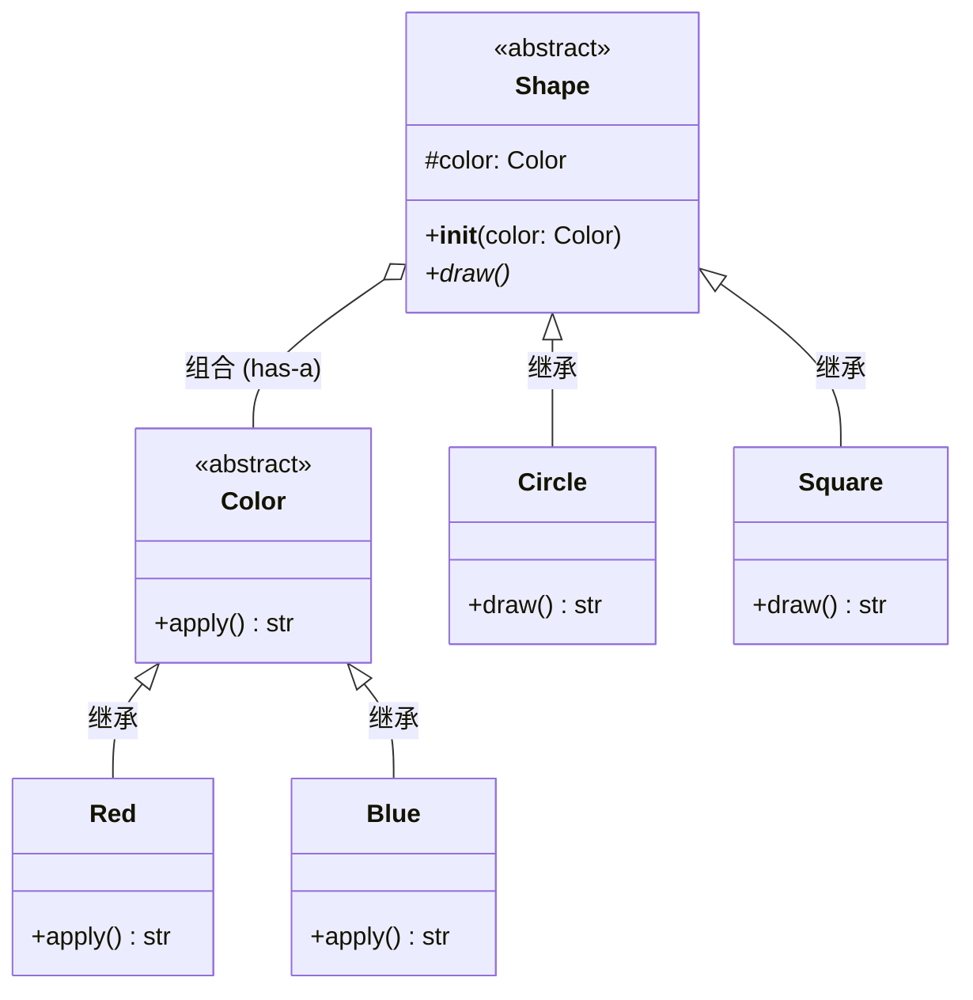

_Gang of Four（四人帮）_，经典书籍《Design Patterns: Elements of Reusable Object-Oriented Software》总结的 23 种经典模式

**创建型（5种）、结构型（7种）、行为型（11种）**

创建型	解决怎么创建对象，比如单例、工厂、建造者
```text
单例       → 只能有一个
工厂方法   → 创建一个产品
抽象工厂   → 创建一族产品
建造者     → 一步步构建复杂对象
原型       → 复制已有对象
```
结构型	解决怎么组合类和对象，比如适配器、装饰器、代理
```text
适配器     → 接口转换
装饰器     → 动态增加功能
代理       → 控制对象访问
外观       → 给复杂系统提供简单入口
桥接       → 两个变化维度独立
组合       → 一个和一群统一处理
享元       → 共享对象，减少重复
```
行为型	解决对象间怎么通信协作，比如观察者、策略、状态
```text
模板方法   → 流程固定，步骤变化
策略       → 算法可以替换
观察者     → 状态变化通知别人
责任链     → 一个个处理者传递
命令       → 把操作封装成对象
迭代器     → 统一遍历
中介者     → 通过中介通信
备忘录     → 保存/恢复状态
状态       → 状态决定行为
访问者     → 数据结构与操作分离
解释器     → 解释一套语言/表达式
```


# 创建型五种

核心解决：**对象怎么创建。** 一句话：**大家都用同一个对象。**

## 单例模式 Singleton

保证一个类只有一个实例，并提供全局访问点。比如，缓存，日志

``` java
class Singleton {

    private static Singleton instance;

    private Singleton() {}

    public static Singleton getInstance() {
        if (instance == null) {
            instance = new Singleton();
        }
        return instance;
    }
}
```
加载类的时候，静态方法直接加载到方法区里，那这个静态方法的Singleton实体应该是放在堆空间，然后有一个引用！这里对方法区，堆空间有点混乱

1. **Singleton 对象实体**（`new Singleton()` 创建出的数据）： 永远存放在**堆空间 (Heap)**。
2. **`instance` 静态引用变量**（指向上述对象的指针）：JDK 7 及以后 ,类的静态变量和 `java.lang.Class` 对象一起存放在**堆空间 (Heap)**。
3. **静态方法代码与类元数据**（`getInstance()` 的执行逻辑、类结构等）： 存放在**方法区 (Method Area)** 中
4. 方法调用的临时变量，操作数，都保存在当前线程的临时栈里。

**关于“方法区”的补充说明：** “方法区”只是 JVM 规范中的一个**逻辑概念**，JDK 8 及以后，永久代被移除，方法区由**元空间 (Metaspace)** 实现，且使用的是操作系统的本地内存。

**⚠️ 额外的致命问题（线程安全）：** 这段“懒汉式”单例代码**不是线程安全的**。如果有两个线程同时执行到 `if (instance == null)`，它们可能都会判断为 true，从而在堆中 `new` 出两个不同的对象。 _建议修改为**双重检查锁 (Double-Checked Locking，需加 `volatile`)** 或使用**静态内部类**来实现安全的懒加载。_
``` java
class Singleton {
    private Singleton() {}

    private static class Holder {
        private static final Singleton INSTANCE = new Singleton();
    }

    public static Singleton getInstance() {
        return Holder.INSTANCE;
    }
}

```


## 工厂方法模式 Factory Method

 **把“创建什么对象”交给子类/具体工厂决定， 把对象创建延迟到具体工厂。

**定义一个创建对象的接口，但由子类决定要实例化的类是哪一个。** 它将对象的创建推迟到了子类。

```python
class Dog:
    def speak(self): return "汪汪"
class Cat:
    def speak(self): return "喵喵"

class AnimalFactory:
    def create(self, kind):
        return Dog() if kind == "dog" else Cat()

factory = AnimalFactory()
print(factory.create("dog").speak())  # 汪汪
```
==对象实例的创建，推迟到需要的时候再用，但这也没啥区别呢？直接new为什么麻烦？为什么工厂好？== 工厂模式的价值要在"**创建逻辑复杂**"或"**未来可能变化**"时才能体现，如果直接new，写死了，假设new AlipayPayment()散落在项目各处，当未来需要加微信支付，就需要到处改。工厂模式就要求，后续添加任何模式，只能在工厂内部做决定，工厂判断要给什么，业务代码只管拿，不做任何判断给的是什么

```python
class PaymentFactory:
    def create(self):
        config_type = read_config_file("payment_type")  # 从配置文件读取！不是硬编码
        if config_type == "alipay":
            return Alipay()
        elif config_type == "wechat":
            return WechatPay()

# 客户端代码，不传字符串，工厂自己决定
factory = PaymentFactory()
payment = factory.create()
payment.pay()
```

从配置文件里读取是一种方式（==那这个不会出现，如果某些地方需要这个支付方式，某些地方需要那个，都从一个配置文件里读取假设config_type的值，不行，那如何某些部分读这个配置，某些读那个配置，这不又类似到处new的情况吗？==），核心的目的尽量让入口点在一个地方好改。

**如果不同地方本来就需要不同的支付方式，那无论是字符串判断还是读配置文件，都无法逃避"总得有个地方要做选择"这个事实**。真正的答案是：**"选择"这件事本身没法消除，但可以把"选择的逻辑"和"使用的逻辑"彻底分离**。这就是"**依赖注入（Dependency Injection）**"要解决的问题。

关键区别：谁来做"选择"，谁来做"使用"
**错误做法：业务逻辑里到处写判断（真正的坏味道）**，**问题在于"判断逻辑被重复写了很多遍"。** 如果以后要新增"银联支付"，你要去 `OrderService`、`RefundService`……每一个类里都加一个 `elif`
**正确做法：** 依赖注入（把"选择"和"使用"分开），核心思路是业务代码不做选择，只负责"用"，选择的动作提到外面，一次性做完，然后"传"进去
```python
class Payment:
    def pay(self): pass

class Alipay(Payment):
    def pay(self): return "支付宝支付成功"

class WechatPay(Payment):
    def pay(self): return "微信支付成功"


# 业务逻辑完全不关心是哪个支付方式，只管调用接口
class OrderService:
    def create_order(self, payment: Payment):  # 直接接收一个"现成的"支付对象
        return payment.pay()  # 不用任何if-else！

class RefundService:
    def refund(self, payment: Payment):
        return "退款：" + payment.pay()
```

回答你的核心疑问："如果某些地方读这个配置，某些地方读那个配置，这不又类似到处new的情况吗？"**是的，如果"选择逻辑"重复出现在很多地方，那确实等价于到处 `new`，工厂/配置文件都救不了你。**

**真正的解法是：把"选择"这个动作，提升到调用链的最顶端（一般是用户交互层、或者程序启动的地方），做**一次**选择，然后把选好的对象，通过参数"传递"下去（这就叫"依赖注入"），底层的业务代码永远只依赖"接口"（比如 `Payment` 这个抽象类），不依赖"具体是哪个类"。

这也是为什么现代框架（Spring、.NET Core等）都会提供"依赖注入容器"——**它们的核心思想就是：把对象的创建和组装，集中在一个地方管理，业务代码只管"用"，不管"从哪来"**。


## 抽象工厂模式（Abstract Factory）

创建一系列相关对象（一整套产品族）

```python
class Button:
    def render(self): pass
class WinButton(Button):
    def render(self): return "Windows按钮"
class MacButton(Button):
    def render(self): return "Mac按钮"

class GUIFactory:
    def create_button(self): pass
class WinFactory(GUIFactory):
    def create_button(self): return WinButton()
class MacFactory(GUIFactory):
    def create_button(self): return MacButton()

factory = MacFactory()
print(factory.create_button().render())  # Mac按钮
```


## 建造者模式（Builder）

**作用**：分步骤构建复杂对象。
```python
class Computer:
    def __init__(self):
        self.parts = []
    def add(self, part):
        self.parts.append(part)

class ComputerBuilder:
    def __init__(self):
        self.computer = Computer()
    def add_cpu(self):
        self.computer.add("CPU")
        return self
    def add_ram(self):
        self.computer.add("RAM")
        return self

pc = ComputerBuilder().add_cpu().add_ram().computer
print(pc.parts)  # ['CPU', 'RAM']
```
特别适合参数很多、对象构造复杂、有很多可选参数，一步一步把复杂对象造出来。


## 原型模式（Prototype）

作用：通过复制现有对象来创建新对象，而不是重新 new。

```python
import copy

class Sheep:
    def __init__(self, name):
        self.name = name
    def clone(self):
        return copy.deepcopy(self)

dolly = Sheep("Dolly")
dolly2 = dolly.clone()
print(dolly2.name)  # Dolly
```
适合创建对象成本比较高、而且新对象和旧对象结构非常相似


# 结构性七种

核心解决**类和对象之间怎么组织、组合。**

## 6. 适配器 Adapter

**两个类的方法名/参数不一样，导致不能直接互换使用**，适配器负责"翻译"

```python
# 现有的、旧的类（比如第三方库，你没法改它的代码）
class OldPrinter:
    def old_print_method(self, text):  # 注意：方法名是 old_print_method
        return f"[旧打印机] {text}"

# 新系统要求所有打印机都实现这个接口
class NewPrinterInterface:
    def print_document(self, text):  # 新系统要求方法名是 print_document
        pass

# 问题：OldPrinter 没有 print_document 方法，直接用会报错！
old_printer = OldPrinter()
# old_printer.print_document("你好")  # ❌ AttributeError!

# 用适配器来"翻译"接口
class PrinterAdapter(NewPrinterInterface):
    def __init__(self, old_printer):
        self.old_printer = old_printer
    
    def print_document(self, text):  # 新接口名字
        return self.old_printer.old_print_method(text)  # 内部调用旧接口

# 现在可以用新接口调用旧对象了
adapter = PrinterAdapter(old_printer)
print(adapter.print_document("你好"))  # [旧打印机] 你好
```
Java：旧接口——>Adapter_>新接口

一句话：**接口不兼容？我帮你转换一下。**


## 7. 装饰器 Decorator

**不修改原来的类，动态增加功能。**

例如：InputStream、BufferedInputStream、DataInputStream，一层一层增加功能。

一句话解释，**给对象套一层，再增加功能。**

```python
class Coffee:
    def cost(self): return 10

class MilkDecorator:
    def __init__(self, coffee):
        self.coffee = coffee
    def cost(self):
        return self.coffee.cost() + 2

coffee = MilkDecorator(Coffee())
print(coffee.cost())  # 12
```


## 8. 代理 Proxy

**为真实对象提供一个代理对象，在访问真实对象前后增加额外功能。**

Java里面：静态代理、JDK动态代理、CGLIB

简单理解就是加权限检查，访问某个服务，必须看你条件，但这些事务并不算是业务，加在业务代码就显得冗余，耦合，这种检查就是插件，即插即用，不需要跟业务纠缠在一起。

```python
class RealImage:
    def display(self): return "显示真实图片"

class ProxyImage:
    def __init__(self):
        self.real_image = None
    def display(self):
        if self.real_image is None:
            self.real_image = RealImage()  # 延迟加载
        return self.real_image.display()

proxy = ProxyImage()
print(proxy.display())  # 显示真实图片
```


## 9. 外观 Facade

**给复杂系统提供一个简单入口。**

例如有订单系统、库存系统、支付系统、物流系统

用户本来要：创建订单--扣库存--支付--通知物流

现在提供：
```java
orderFacade.createOrder();
```

内部帮你完成全部操作。

复杂系统，我给你一个简单门面。

```python
class CPU:
    def start(self): print("CPU启动")
class Memory:
    def load(self): print("内存加载")

class Computer:
    def start(self):
        CPU().start()
        Memory().load()

Computer().start()
# CPU启动
# 内存加载
```


## 10. 桥接 Bridge

**把抽象和实现分离，让它们可以独立变化。**

```python
class Color:
    def apply(self): pass
class Red(Color):
    def apply(self): return "红色"

class Shape:
    def __init__(self, color):
        self.color = color
class Circle(Shape):
    def draw(self):
        return f"画一个{self.color.apply()}的圆"

c = Circle(Red())
print(c.draw())  # 画一个红色的圆
```
`Circle` **继承**自 `Shape`，但 `Circle` **自己没有写 `__init__`**，所以它直接**用的是父类 `Shape` 的 `__init__`**，`Shape.__init__(self, color)` 里的参数名是 `color`（不是 `shape`），它本来就是设计成**接收一个颜色对象**，不是形状对象。


**没有桥接模式的写法**（类爆炸）：
```Python
class RedCircle: ...
class BlueCircle: ...
class RedSquare: ...
class BlueSquare: ...
# 如果有5种形状、5种颜色 = 25个类！
```

**桥接模式的写法**：只需要 形状数 + 颜色数 个类，而不是 形状数 × 颜色数，5种形状 + 5种颜色 = 10个类，而不是25个

`Shape` 通过持有一个 `Color` 对象（这就是"桥"），把"形状"和"颜色"两个维度**解耦**，可以自由组合，不需要为每种组合单独写一个类。

```python
class Color:
    def apply(self): pass

class Red(Color):
    def apply(self): return "红色"

class Blue(Color):
    def apply(self): return "蓝色"

class Shape:
    def __init__(self, color: Color):  # 明确类型提示：这里要传Color对象
        self.color = color
    def draw(self):
        pass

class Circle(Shape):
    def draw(self):
        return f"画一个{self.color.apply()}的圆"

class Square(Shape):
    def draw(self):
        return f"画一个{self.color.apply()}的方块"

# 桥接的精髓：形状和颜色可以自由组合
print(Circle(Red()).draw())   # 画一个红色的圆
print(Circle(Blue()).draw())  # 画一个蓝色的圆
print(Square(Red()).draw())   # 画一个红色的方块
print(Square(Blue()).draw())  # 画一个蓝色的方块
```





## 11. 组合 Composite

**把单个对象和对象集合统一对待。** **让“一个”和“一群”用同一种方式操作。** 统一成一个接口。
```python
class File:
    def show(self): return "文件"
class Folder:
    def __init__(self):
        self.children = []
    def add(self, item):
        self.children.append(item)
    def show(self):
        return [c.show() for c in self.children]

folder = Folder()
folder.add(File())
folder.add(File())
print(folder.show())  # ['文件', '文件']
```


## 12. 享元 Flyweight

**大量对象有相同数据时，把公共数据共享起来，减少对象数量。**

比如：100万个棋子，没必要每个棋子都保存颜色、字体、图片。可以创建共享对象，共享颜色，字体，图片，每个对象只保存简单的位置和状态。

一句话：**能共享的就别重复创建。**

先看__init__和__new__的执行时间
```python
# 执行 t = TreeType("橡树") 时，Python 内部做了 3 件事：
# 第1步：__new__ 创建对象（分配内存）
obj = TreeType.__new__(TreeType, "橡树")  
# 此时 obj 是一个 TreeType 类型的"空壳"
# 类型：TreeType
# 属性：还没有 name
# 第2步：__init__ 初始化对象（填充数据）
if isinstance(obj, TreeType):
    TreeType.__init__(obj, "橡树")
    # 此时 obj.name = "橡树"
    # 类型：TreeType
    # 属性：有 name = "橡树"
# 第3步：返回完整对象
t = obj
```

```python
class TreeType:
    _cache = {}
    def __new__(cls, name):
        if name not in cls._cache:
            cls._cache[name] = super().__new__(cls)
        return cls._cache[name] # 叫这个名字的[name]

t1 = TreeType("橡树")
t2 = TreeType("橡树")
print(t1 is t2)  # True，共享同一对象
```
` _cache`是类变量，存储在类本身，直接通过`TreeType._cache`调用，所有实例共享一份，生命周期是类加载到程序结束

==`return cls._cache[name] `还是不理解，super().__new__(cls)这句话的意思只是把TreeType赋值，但为什么就欧可以判断t1和t2是同一个对象？== 第一次“橡树”的t1确实是一个新的TreeType，但第二次t2，就不通过if了，直接返回t1创建的对象了。


# 行为型十一种

核心解决：**对象之间怎么协作、怎么分配职责。**

## 13. 模板方法 Template Method

 **父类规定算法的大致流程，子类实现具体步骤。**

例如：
```java
public void process() {

    step1();

    step2();

    step3();
}
```

父类规定流程：1 → 2 → 3
子类写实现具体的1、2、3


## 14. 策略 Strategy

**把一组可以互相替换的算法封装起来。  算法可以随时换。**

```python
from abc import ABC, abstractmethod

# ========== 策略接口 ==========
class CalculateStrategy(ABC):
    @abstractmethod
    def calculate(self, a, b):
        pass

# ========== 具体策略 ==========
class AddStrategy(CalculateStrategy):
    def calculate(self, a, b):
        return a + b

class SubtractStrategy(CalculateStrategy):
    def calculate(self, a, b):
        return a - b

class MultiplyStrategy(CalculateStrategy):
    def calculate(self, a, b):
        return a * b

class DivideStrategy(CalculateStrategy):
    def calculate(self, a, b):
        if b == 0:
            return "不能除以0"
        return a / b

# ========== 上下文 ==========
class Calculator:
    def __init__(self, strategy):
        self._strategy = strategy
    
    def set_strategy(self, strategy):
        """动态切换策略"""
        self._strategy = strategy
    
    def execute(self, a, b):
        return self._strategy.calculate(a, b)

# ========== 使用 ==========
calc = Calculator(AddStrategy())
print(calc.execute(10, 5))        # 15

calc.set_strategy(SubtractStrategy())
print(calc.execute(10, 5))        # 5

calc.set_strategy(MultiplyStrategy())
print(calc.execute(10, 5))        # 50

calc.set_strategy(DivideStrategy())
print(calc.execute(10, 5))        # 2.0
```
**策略模式 = 把算法封装成对象，让它们可以互相替换，外部选择用哪个。策略之间相互独立彼此不知道对方存在**

状态模式 =状态自己决定下一个状态，状态之间彼此知道。


## 15. 观察者 Observer

**一个对象（被观察者）状态变了，自动通知所有关注它的对象（观察者）**

**公众号**（被观察者）发布文章 → 自动推送给所有**订阅用户**（观察者）用户不用一直刷新去看有没有新文章，**等着被通知就行**

```python
from abc import ABC, abstractmethod

# ========== 观察者接口 ==========
class Observer(ABC):
    @abstractmethod
    def update(self, temperature):
        pass

# ========== 被观察者 ==========
class WeatherStation:
    def __init__(self):
        self._observers = []      # 订阅者列表
        self._temperature = 0
    
    def add_observer(self, observer):
        """添加订阅者"""
        self._observers.append(observer)
    
    def remove_observer(self, observer):
        """取消订阅"""
        self._observers.remove(observer)
    
    def set_temperature(self, temp):
        """温度变化 → 自动通知所有订阅者"""
        self._temperature = temp
        self._notify_all()
    
    def _notify_all(self):
        """通知所有观察者"""
        for observer in self._observers:
            observer.update(self._temperature)

# ========== 具体观察者 ==========
class PhoneDisplay(Observer):
    def update(self, temperature):
        print(f"📱 手机显示: 当前温度 {temperature}°C")

class TVDisplay(Observer):
    def update(self, temperature):
        print(f"📺 电视显示: 当前温度 {temperature}°C")

class LEDDisplay(Observer):
    def update(self, temperature):
        print(f"💡 LED屏显示: {'🔥' if temperature > 30 else '❄️'} {temperature}°C")

# ========== 使用 ==========
station = WeatherStation()

# 用户订阅
phone = PhoneDisplay()
tv = TVDisplay()
led = LEDDisplay()

station.add_observer(phone)
station.add_observer(tv)
station.add_observer(led)

# 温度变化 → 自动通知所有订阅者
station.set_temperature(25)
print("---")
station.set_temperature(35)
```


## 16. 责任链 Chain of Responsibility

**把多个处理者串成一条链，请求沿着链逐个处理。**

一句话：多个对象依次处理请求，直到有人处理。

```python
class Handler:
    def __init__(self, successor=None):
        self.successor = successor
    def handle(self, request):
        if self.successor:
            return self.successor.handle(request)

class ConcreteHandler(Handler):
    def handle(self, request):
        if request == "ok":
            return "处理成功"
        return super().handle(request)

h = ConcreteHandler()
print(h.handle("ok"))  # 处理成功
```


## 17. 命令 Command

**把一个操作封装成一个对象。**

一句话：**把“做什么”封装成对象。**

```python
class Light:
    def on(self): print("灯打开")

class Command:
    def execute(self): pass
class LightOnCommand(Command):
    def __init__(self, light):
        self.light = light
    def execute(self):
        self.light.on()

cmd = LightOnCommand(Light())
cmd.execute()  # 灯打开
```
==命令模式跟外观模式有什么区别？==
命令模式：关注"操作本身"，方便传递、存储、撤销，目的是解耦调用者和实现者。外观模式：关注"接口简化"

| 你的需求      | 用什么模式  |
| --------- | ------ |
| 支持撤销/重做   | 命令模式 ✅ |
| 操作需要排队    | 命令模式 ✅ |
| 简化复杂系统的调用 | 外观模式 ✅ |
| 隐藏子系统细节   | 外观模式 ✅ |
| 把操作当作参数传递 | 命令模式 ✅ |
| 提供一个简单入口  | 外观模式 ✅ |
还是没搞懂命令模式到底是什么意思？没看出来区别


## 18. 迭代器 Iterator

**不暴露集合内部结构，统一遍历集合。**

你平时写：

```java
Iterator iterator = list.iterator();

while (iterator.hasNext()) {
    Object obj = iterator.next();
}
```

就是典型迭代器。

一句话：**统一遍历不同集合。**

```python
class MyCollection:
    def __init__(self):
        self.items = [1, 2, 3]
    def __iter__(self):
        return iter(self.items)

for item in MyCollection():
    print(item)  # 1 2 3
```


## 19. 中介者 Mediator

**对象之间不要直接互相通信，统一通过中介者。**

原本：

```text
A ↔ B
A ↔ C
A ↔ D
B ↔ C
B ↔ D
C ↔ D
```

关系爆炸。

变成：

```text
       A
       ↓
B → Mediator ← C
       ↑
       D
```

一句话：**大家别互相联系，都找中介。**

```python
class ChatRoom:
    def show_message(self, user, message):
        print(f"{user}: {message}")

class User:
    def __init__(self, name, chatroom):
        self.name = name
        self.chatroom = chatroom
    def send(self, message):
        self.chatroom.show_message(self.name, message)

room = ChatRoom()
User("小明", room).send("你好")  # 小明: 你好
```


## 20. 备忘录 Memento

**保存对象某个时刻的状态，以便以后恢复。   给对象拍快照，之后可以恢复。**

```python
class Memento:
    def __init__(self, state):
        self.state = state

class Editor:
    def __init__(self):
        self.content = ""
    def save(self):
        return Memento(self.content)
    def restore(self, memento):
        self.content = memento.state

editor = Editor()
editor.content = "Hello"
saved = editor.save()
editor.content = "World"
editor.restore(saved)
print(editor.content)  # Hello
```
这个看懂了，但是具体实践还不知道怎么操作，不急


## 21. 状态 State

对象的行为随着内部状态的改变而改变，看起来像是换了"类"一样。**把每个状态的行为封装成独立的类，避免大量 if-else。**

```python
from abc import ABC, abstractmethod

# ========== 状态接口 ==========
class OrderState(ABC):
    @abstractmethod
    def handle(self, order):
        pass

# ========== 具体状态类 ==========
class NewState(OrderState):
    def handle(self, order):
        print("📦 新订单：等待支付")
        # 状态流转：新 → 已支付
        order.set_state(PaidState())

class PaidState(OrderState):
    def handle(self, order):
        print("💳 已支付：准备发货")
        order.set_state(ShippedState())

class ShippedState(OrderState):
    def handle(self, order):
        print("🚚 已发货：等待签收")
        order.set_state(DeliveredState())

class DeliveredState(OrderState):
    def handle(self, order):
        print("✅ 已签收：订单完成")
        order.set_state(CompletedState())

class CompletedState(OrderState):
    def handle(self, order):
        print("🏁 订单已完成，无法再流转")

# ========== 上下文 ==========
class Order:
    def __init__(self):
        self._state = NewState()  # 初始状态：新订单
    
    def set_state(self, state):
        self._state = state
    
    def next(self):
        """执行当前状态的行为，自动流转到下一状态"""
        self._state.handle(self)  # ← 把 self(order) 传给 handle
        # self = order, self._state = NewState() 就是NewState.handle(order)

# ========== 使用 ==========
order = Order()

order.next()  # 新订单 → 等待支付
order.next()  # 已支付 → 准备发货
order.next()  # 已发货 → 等待签收
order.next()  # 已签收 → 订单完成
order.next()  # 已完成，无法继续
```


## 22. 访问者 Visitor

**把对对象结构的操作从对象本身中分离出来。**

一句话：**数据结构不变，不断增加新的操作。** 这个模式相对难，先混个脸熟就行。

```python
from abc import ABC, abstractmethod

# ========== 访问者接口 ==========
class Visitor(ABC):
    @abstractmethod
    def visit_food(self, food):
        pass
    
    @abstractmethod
    def visit_electronics(self, electronics):
        pass
    
    @abstractmethod
    def visit_clothing(self, clothing):
        pass

# ========== 具体访问者：税务员 ==========
class TaxVisitor(Visitor):
    def visit_food(self, food):
        # 食品税率 5%
        tax = food.price * 0.05
        print(f"🍔 {food.name}: 食品税 {tax:.2f} 元")
        return tax
    
    def visit_electronics(self, electronics):
        # 电子产品税率 15%
        tax = electronics.price * 0.15
        print(f"📱 {electronics.name}: 电子税 {tax:.2f} 元")
        return tax
    
    def visit_clothing(self, clothing):
        # 服装税率 10%
        tax = clothing.price * 0.10
        print(f"👔 {clothing.name}: 服装税 {tax:.2f} 元")
        return tax

# ========== 具体访问者：折扣员 ==========
class DiscountVisitor(Visitor):
    def visit_food(self, food):
        discount = food.price * 0.1
        print(f"🍔 {food.name}: 食品折扣 {discount:.2f} 元")
        return discount
    
    def visit_electronics(self, electronics):
        discount = electronics.price * 0.05
        print(f"📱 {electronics.name}: 电子折扣 {discount:.2f} 元")
        return discount
    
    def visit_clothing(self, clothing):
        discount = clothing.price * 0.2
        print(f"👔 {clothing.name}: 服装折扣 {discount:.2f} 元")
        return discount

# ========== 被访问者接口 ==========
class Element(ABC):
    @abstractmethod
    def accept(self, visitor):
        pass

# ========== 具体被访问者 ==========
class Food(Element):
    def __init__(self, name, price):
        self.name = name
        self.price = price
    
    def accept(self, visitor):
        return visitor.visit_food(self)

class Electronics(Element):
    def __init__(self, name, price):
        self.name = name
        self.price = price
    
    def accept(self, visitor):
        return visitor.visit_electronics(self)

class Clothing(Element):
    def __init__(self, name, price):
        self.name = name
        self.price = price
    
    def accept(self, visitor):
        return visitor.visit_clothing(self)

# ========== 使用 ==========
items = [
    Food("苹果", 10),
    Electronics("手机", 5000),
    Clothing("羽绒服", 800),
]

# 计算税收
print("=" * 30)
tax_visitor = TaxVisitor()
total_tax = 0
for item in items:
    total_tax += item.accept(tax_visitor)
print(f"总税额: {total_tax:.2f} 元")

# 计算折扣
print("=" * 30)
discount_visitor = DiscountVisitor()
total_discount = 0
for item in items:
    total_discount += item.accept(discount_visitor)
print(f"总折扣: {total_discount:.2f} 元")
```
什么时候用访问者模式？
```
# 1. 对象结构稳定，但操作经常变化
# 2. 需要对不同对象做不同操作
# 3. 不想修改已有类
# 场景：
# - 编译器：语法树节点 + 不同操作（类型检查、代码生成）
# - 报表系统：不同数据源 + 不同报表格式（PDF、Excel、HTML）
# - 文件系统：不同文件类型 + 不同操作（压缩、扫描、加密）
```


## 23. 解释器 Interpreter

**定义一套语言/表达式的规则，然后解释执行。**

一句话：**自己定义一套小语言，然后解释它。**

```python
class Expression:
    def interpret(self): pass
class Number(Expression):
    def __init__(self, value): self.value = value
    def interpret(self): return self.value
class Add(Expression):
    def __init__(self, left, right):
        self.left, self.right = left, right
    def interpret(self):
        return self.left.interpret() + self.right.interpret()

expr = Add(Number(2), Number(3))
print(expr.interpret())  # 5
```


