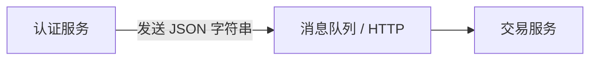

### 序列化（Serialization）

**把内存中的对象，变成可以存储或传输的格式（如字符串、JSON、字节流）。**

### 反序列化（Deserialization）

**把存储或传输的格式，还原成内存中的对象。**


在 redis 里提过一嘴


**`Principal`** 类来举例，让你彻底理解序列化和反序列化在这个上下文里是干什么的。

## 现实场景：你的系统是一个多服务架构

想象你的项目（Vibe-Trading）有两个服务：
- **认证服务（Auth Service）**：负责验证用户身份，生成 `Principal` 对象。
- **交易服务（Trading Service）**：负责执行交易，需要知道“是谁在操作”。

这两个服务之间**不能直接共享内存**，只能通过网络或消息队列通信。而网络只能传输**字节流/文本**，不能直接传 Python 对象。

**这就是序列化和反序列化的用武之地。**

## 第一步：序列化（把对象变成字典/JSON）

认证服务验证完用户后，有一个 `Principal` 对象：

```python
# 在认证服务中
principal = Principal(
    subject="zhangsan",
    auth_method=AuthMethod.FEDERATED_IDENTITY,
    tenant="company_a",
    display_name="张三"
)

# 此时 principal 在内存里，包含：
# - subject: "zhangsan"（字符串）
# - auth_method: AuthMethod.FEDERATED_IDENTITY（枚举对象）
# - tenant: "company_a"（字符串）
# - display_name: "张三"（字符串）
# - attributable: True（自动计算出来的布尔值）
```

因为要发给交易服务，先把它变成字典：

```python
# 调用 to_dict() 方法
data = principal.to_dict()
print(data)
# 输出：
# {
#     "subject": "zhangsan",
#     "auth_method": "federated_identity",  # 枚举变成了字符串
#     "tenant": "company_a",
#     "display_name": "张三",
#     "attributable": True
# }
```

然后把这个字典转成 JSON 字符串，发送到消息队列或 HTTP 请求体里：

```python
import json
json_str = json.dumps(data)
# 现在 json_str 是：
# '{"subject": "zhangsan", "auth_method": "federated_identity", "tenant": "company_a", "display_name": "张三", "attributable": true}'
```

**这个将内存对象 → 可传输/存储格式（JSON字符串）的过程，就是序列化。**

---

## 第二步：传输



网络传输的是纯文本：`'{"subject": "zhangsan", ...}'`，不包含任何 Python 对象。

---

## 第三步：反序列化（把 JSON 还原成对象）

交易服务收到了这个 JSON 字符串：

```python
# 在交易服务中
received_json = '{"subject": "zhangsan", "auth_method": "federated_identity", "tenant": "company_a", "display_name": "张三", "attributable": true}'

# 1. 先把 JSON 解析成字典
import json
received_dict = json.loads(received_json)
# received_dict = {
#     "subject": "zhangsan",
#     "auth_method": "federated_identity",
#     "tenant": "company_a",
#     "display_name": "张三",
#     "attributable": True
# }

# 2. 用 from_dict 把字典还原成 Principal 对象
principal = Principal.from_dict(received_dict)

# 现在 principal 又变回了一个完整的 Python 对象
print(type(principal))           # <class '__main__.Principal'>
print(principal.subject)         # "zhangsan"
print(principal.auth_method)     # AuthMethod.FEDERATED_IDENTITY（又变回枚举了）
print(principal.attributable)    # True（重新计算出来的，不是直接从 data 里读的）
```

**这个将可传输格式（JSON）→ 内存对象的过程，就是反序列化。**

---

## 为什么 `from_dict` 里不用 `data["attributable"]`？

这是你之前代码里的一个关键设计：

```python
@classmethod
def from_dict(cls, data: Dict[str, Any]) -> Principal:
    return cls(
        subject=data["subject"],
        auth_method=AuthMethod(data["auth_method"]),  # 重新构造枚举
        tenant=data.get("tenant"),
        display_name=data.get("display_name"),
        # 注意：attributable 没有从 data 里取！
    )
```

**原因**：`attributable` 应该由系统**根据 `auth_method` 自动计算**，而不是相信网络上传过来的值。因为网络传输的数据可能被篡改：

```python
# 恶意攻击者篡改了数据
malicious_data = {
    "subject": "hacker",
    "auth_method": "shared_key",      # 用的是共享密钥
    "attributable": True               # 试图假装自己是真人
}

# 如果 from_dict 直接信任 data["attributable"]，就会被欺骗
# 但实际上，from_dict 会忽略它，重新计算：
# shared_key → 不在 ATTRIBUTABLE_AUTH_METHODS 里 → attributable = False
```

---

## 完整流程对比表

| 阶段 | 数据形态 | 位置 | 操作 |
|------|---------|------|------|
| **序列化前** | `Principal` 对象（含枚举、布尔值） | 认证服务内存 | 正常运行 |
| **序列化** | `to_dict()` → 字典 → JSON 字符串 | 网络传输 | `.to_dict()` |
| **传输中** | `'{"subject":"zhangsan",...}'` | 网络/消息队列 | 纯文本 |
| **反序列化** | JSON 字符串 → 字典 → `Principal` 对象 | 交易服务内存 | `Principal.from_dict()` |
| **反序列化后** | `Principal` 对象（枚举、布尔值恢复） | 交易服务内存 | 继续使用 |

---

## 一句话总结

> **序列化（`to_dict`）是把认证服务里的 `Principal` 对象变成 JSON 字符串，以便通过网络发给交易服务；反序列化（`from_dict`）是交易服务收到 JSON 后，重新还原成 `Principal` 对象。反序列化时故意忽略 `attributable` 字段，强制根据 `auth_method` 重新计算，防止伪造。**

如果你想知道 **`json.dumps()` 遇到枚举类型为什么不报错**，或者 **如果数据里有 `datetime` 类型怎么序列化**，我可以继续给你讲。😊