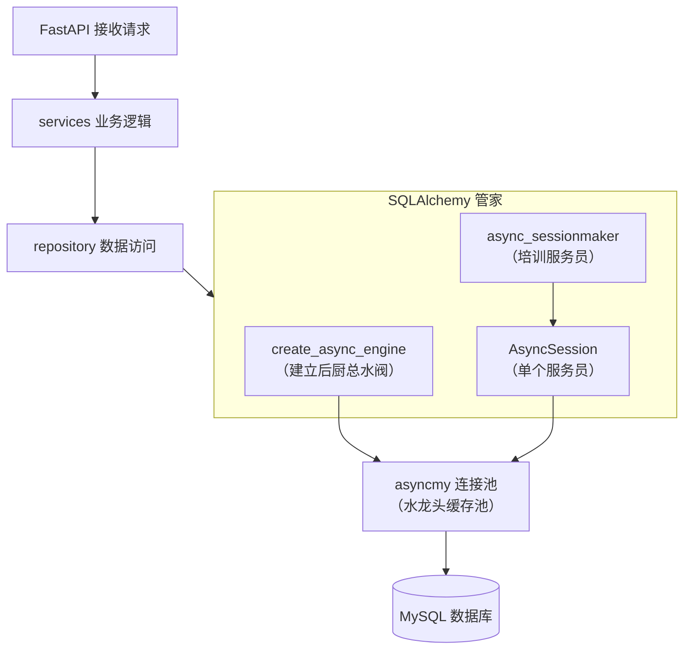

# SQLAlchemy + AysncSession + 连接池

FastAPI -- services -- repository -- SQLAlchemy -- conn pool --asyncmy --mysql

SQLAlchemy负责数据库连接，连接池，session，orm，sql构造，事务管理
asyncmy 负责 和 mysql通信

```
app/
└── db/
    ├── mysql.py   # 数据库相关的东西
    ├── session.py # 负责 数据库引擎engine --> conn pool --> AsyncSession 
    └── __init__.py 让 `db` 成为 Python package
```




