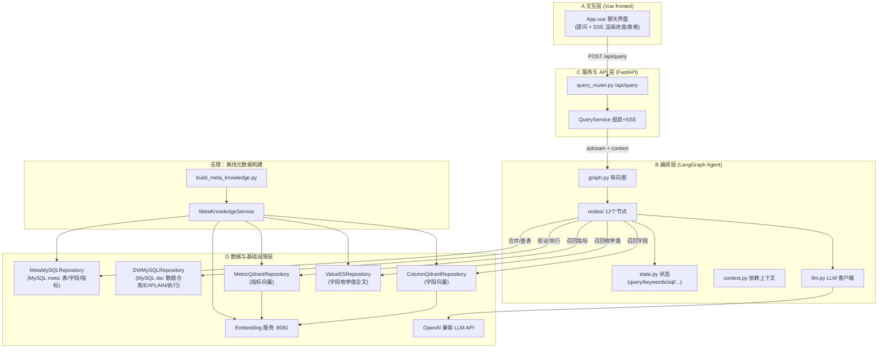

一句话：问个问题——转为对应的sql语句——查后台数据

（介绍）用户信息存在业务仓库里，如果想要分析用户行为，直接在业务仓库会很耗资源，需要导出到数据仓库里操作，不管是业务仓库还是数据仓库，都需要sql语句查询，当前agent就是在数据仓库里，自然语言执行sql查询。

（意义）这个功能直接给ai不也行？有以下几个问题
1. 数据表很多，字段很多的情况下，几百张表都塞到大模型的上下文，不行
	1. 这里的解决方法还是RAG，把核心的字段做索引，提问找到对应的索引，根据索引拿到对应的数据库信息，把（表+要求）一起送给大模型
	2. 梳理：根据要求——找索引——找到数据表，要求+数据表——>给大模型
2. 
这个功能以后一定不存在，ai的发展，这种常见的需求一定有办法解决，但现在还需要定制化

数据表有两种类型：记录业务的事实表，记录描述信息的维度表
记录业务的事实表，比如某时某刻买了一杯咖啡
记录描述信息，比如，人的特征，咖啡的特征
![[Pasted image 20260728085947.png]]
固定分析流程：关联事实表与相关维度表→按维度分组→对度量值聚合
事实表——今天卖了1000杯咖啡，维度表每个事实都有对应的dim_product，可以根据brand做统计，能得到瑞幸的100杯，蜜雪的500杯，霸王茶姬的400杯，这个数据

核心流程：自然语言→SQL转换，包含12个处理节点
流程：抽取关键词→召回字段/指标信息→合并召回信息→筛选表信息→生成SQL→验证执行
关键技术栈：
	前端：Vue.js框架
	后端：FastAPI框架
	数据库：MySQL+Qdrant+Elasticsearch
	AI框架：LangGraph工作流
开发周期：6天完成，前3天构建基础设施，后3天开发智能体

关键阶段:
1. 基础设施搭建：部署数据仓库环境，这是基础，如何把数据处理好，喂给ai
2. 元数据知识库建设：完成数据字典，怎么构建好格式
3. 智能体开发：实现核心NLP功能，如何能识别自然语言？并找到对应的数据？
4. 系统集成：API与前后端联调
后续可以优化方向:1.提升查询理解准确率，2.增强复杂查询处理能力，3.优化结果可视化呈现

**Elasticsearch**：是一个**全文检索引擎**。它擅长根据你输入的**具体字词**（关键词）进行匹配，比如搜“苹果”就找出所有带“苹果”的文章。它不关心意思，只关心字有没有出现。
    
**Qdrant**：是一个**向量数据库**。它擅长把图片、文字、音频变成一串数字（向量），然后找**数学意义上最接近**的内容。比如你搜“手机”，它能给你找出“iPhone”、“华为”甚至“充电宝”，因为它懂这些词在数学空间里离得近（语义相似）。

**Elasticsearch 负责“找得准”（精确匹配），Qdrant 负责“找得全”（语义联想）** **组合后的专有名词**：这叫 **“混合搜索（Hybrid Search）”**

**普通 ChatGPT（单次对话）** = **临时工**。你问一句，他答一句，没有记忆，不会主动追问，也不会分步骤干活。**LangGraph** = **项目经理 + 多个专家组成的流水线**。他会把一个大任务拆成小步骤，每一步交给不同的“专家AI”处理，并且根据上一步的结果，**动态决定**下一步该找谁、该干什么，**LangGraph的核心概念是 **“图（Graph）”**， **“图（Graph）”** 允许你定义**节点（Node）**和**边（Edge）**
    **节点** = 每一步做什么（比如“生成”、“审核”、“搜索”）。
     **边** = 决定下一步去哪（比如“如果审核通过，去打包；如果没通过，回去重写”）。

**最核心的优势**：它内置了**状态管理（State）**。就像一个白板，所有 AI 专家都在这个白板上读写信息，后面的 AI 知道前面发生了什么，因此可以实现**多轮对话、循环迭代、甚至人机交互**（比如卡住了就问你要不要继续）。
