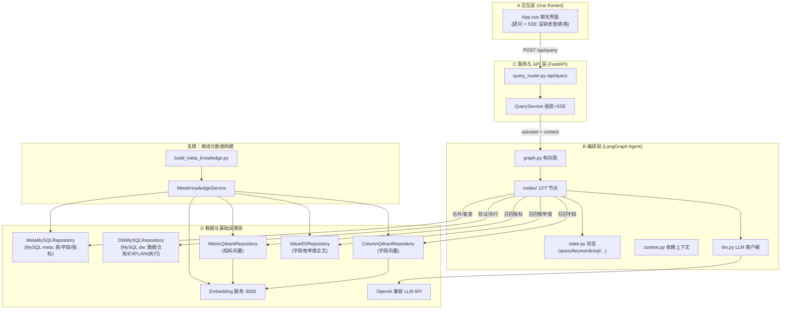

一句话：问个问题——转为对应的sql语句——查后台数据

（介绍）用户信息存在业务仓库里，如果想要分析用户行为，直接在业务仓库会很耗资源，需要导出到数据仓库里操作，不管是业务仓库还是数据仓库，都需要sql语句查询，当前agent就是在数据仓库里，自然语言执行sql查询。

（意义）这个功能直接给ai不也行？有以下几个问题
1. 数据表很多，字段很多的情况下，几百张表都塞到大模型的上下文，不行
	1. 这里的解决方法还是RAG，把核心的字段做索引，提问找到对应的索引，根据索引拿到对应的数据库信息，把（表+要求）一起送给大模型
	2. 梳理：根据要求——找索引——找到数据表，要求+数据表——>给大模型
2. 
这个功能以后一定不存在，ai的发展，这种常见的需求一定有办法解决，但现在还需要定制化

数据表有两种类型：记录业务的事实表，记录描述信息的维度表
记录业务的事实表，比如某时某刻买了一杯咖啡
记录描述信息，比如，人的特征，咖啡的特征
![[Pasted image 20260728085947.png]]
固定分析流程：关联事实表与相关维度表→按维度分组→对度量值聚合
事实表——今天卖了1000杯咖啡，维度表每个事实都有对应的dim_product，可以根据brand做统计，能得到瑞幸的100杯，蜜雪的500杯，霸王茶姬的400杯，这个数据

