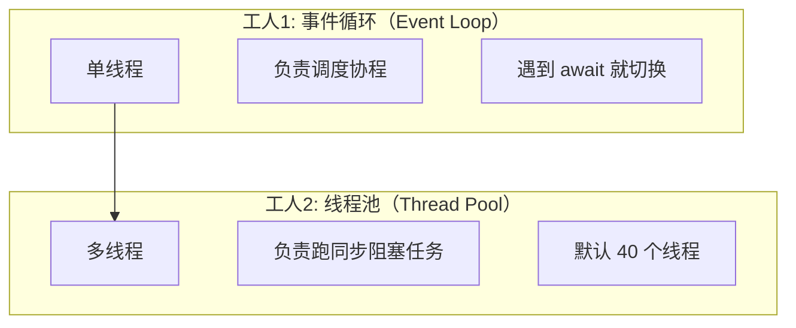

关键规则：

async def 函数 → 丢给事件循环（单线程）

def 函数 → 丢给线程池（多线程）


## def（同步函数）	✅ 并行

```PYTHON
def _slow_task(message: str):
    print(f"start: {message}")
    time.sleep(1)      # 阻塞 1 秒
    print(f"done: {message}")
```

为什么并行？每个任务在独立线程里、线程之间互不阻塞、time.sleep(1) 只阻塞当前线程，不影响其他线程


# async def + time.sleep()	❌ 串行（阻塞）

```PYTHON
async def _slow_task(message: str):
    print(f"start: {message}")
    time.sleep(1)      # ❌ 阻塞了事件循环！
    print(f"done: {message}")
```


## async def + await asyncio.sleep()	✅ 并行