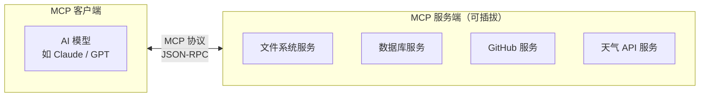
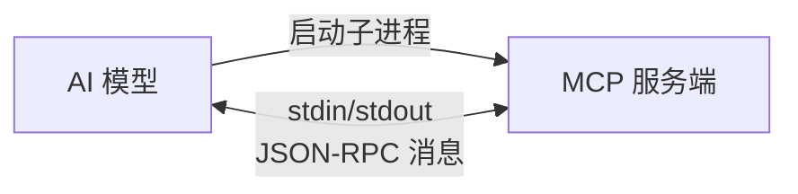
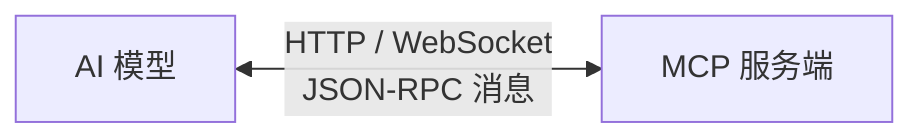

MCP（Model Context Protocol）是一个**标准化的进程间通信协议**，基于 JSON-RPC

流程：
Claude Code (MCP Client) <--JSON-RPC(stdio 或 HTTP/SSE)--> MCP Server (独立进程/服务)


**MCP（Model Context Protocol，模型上下文协议）** 是一个**标准化协议**，用来让 AI 模型（如 Claude、GPT）和外部工具/数据源进行通信。

用人话说就是：**给 AI 模型装了一个“万能插头”**，让它可以按统一的方式调用各种外部工具（数据库、文件系统、API 等）。

## 为什么要 MCP？

在没有 MCP 之前，你要让 AI 调用一个工具（比如查天气 API），需要写**定制代码**：

```python
# 每个工具都要单独写一套集成代码
if tool == "weather":
    call_weather_api()
elif tool == "database":
    call_database()
elif tool == "filesystem":
    call_filesystem()
```

问题：每加一个新工具，就要改代码、重部署，非常麻烦。

**有了 MCP**：工具提供方（Server）和 AI（Client）都遵循同一个协议，**加新工具就像插拔 U 盘一样简单**，AI 自动发现并使用，无需改代码。

---

## MCP 客户端和服务端之间的关系



- **MCP 客户端**：AI 模型那一侧，负责向服务端发送请求（"帮我读文件"、"查数据库"）。
- **MCP 服务端**：工具/数据源那一侧，暴露能力（"我能读文件"、"我能查天气"），接收并执行客户端请求。

**一个客户端可以连接多个服务端，一个服务端也可以服务于多个客户端。**

---

## 它们怎么通信？（两种方式）

### 方式一：进程内通信（stdio）

**客户端启动服务端作为一个子进程**，通过标准输入/输出（stdin/stdout）交换消息。



特点：
- 简单、轻量，不需要网络
- 适用于**同一个机器**上的本地工具（如文件系统、本地数据库）

### 方式二：网络通信（HTTP/WebSocket）

**客户端和服务端通过网络连接**，比如通过 HTTP 或 WebSocket 通信。



特点：
- 支持**远程部署**（服务端可以跑在另一台机器上）
- 适合云端工具、微服务架构

---

## MCP 消息格式（JSON-RPC）

所有 MCP 消息都使用 **JSON-RPC 2.0** 格式。举个例子：

**客户端请求：**
```json
{
  "jsonrpc": "2.0",
  "id": 1,
  "method": "tools/call",
  "params": {
    "name": "read_file",
    "arguments": { "path": "/tmp/test.txt" }
  }
}
```

**服务端响应：**
```json
{
  "jsonrpc": "2.0",
  "id": 1,
  "result": {
    "content": "Hello, World!"
  }
}
```

这种格式的好处是：
- **语言无关**：任何语言都能生成/解析 JSON
- **有请求 ID**：可以区分"哪个请求对应哪个响应"
- **标准化**：所有 MCP 服务端都遵守同一套规范

---

## 核心概念：Tool（工具）

MCP 里最重要的概念是 **Tool**。服务端注册 Tool，客户端调用 Tool。

**服务端注册 Tool：**
```json
{
  "tools": [
    {
      "name": "read_file",
      "description": "读取指定路径的文件内容",
      "inputSchema": {
        "path": { "type": "string", "description": "文件路径" }
      }
    }
  ]
}
```

**客户端调用 Tool：**
```json
{
  "method": "tools/call",
  "params": {
    "name": "read_file",
    "arguments": { "path": "/tmp/test.txt" }
  }
}
```

---

## 与 Agent 系统的关系

回到你之前发的时序图，那里面的 **`ToolRegistry`** 就是 MCP 客户端的思想雏形——它管理了所有可用工具（`load_skill`、`write_config`、`backtest` 等），AgentLoop 通过 ToolRegistry 来调用工具。

MCP 把这个模式**标准化了**：
- ToolRegistry 变成 **MCP 客户端**
- 每个工具变成**独立的 MCP 服务端**
- 通信协议统一为 **JSON-RPC**

---

## 一句话总结

> **MCP 是一个让 AI 模型（客户端）和外部工具（服务端）之间按统一格式（JSON-RPC）通信的标准化协议。通信方式可以是进程内管道（stdio）或网络（HTTP/WebSocket），核心是让“加新工具”像插拔 U 盘一样简单。**

如果还有不清楚的地方，比如想知道 "JSON-RPC 具体怎么定义方法名"，或者 "MCP 和 Function Calling 的区别"，可以继续问我。😊