# 前言

## 笔记/路线设计思路

大家好啊， 我希望设计的这份资料是：**自学入行大模型应用开发**的**最全的记录。**

**为什么是自学路线？**

我是从0开始自学的，自学了200多天，面试了2个月，拿到6个Offer（夸克千问，京东（算法岗），SAP（世界500强外企），网龙，平安证券，华林证券），所有信息小红书可查。


这份资料是按照**我自己学习自学路线**，我希望把我完整的**自学路线**，**心得**，**笔记，面试重点，**&#x90FD;分享给大家，让自学的人少走弯路。

笔记包括：**详细的大模型八股**，**知识点参考资料（视频，文章），讲解视频，项目实战（源代码，设计思路，讲解视频）。**&#x9879;目实战是可以直接写在简历上的。

我的所有笔记的来源，是可以在我的小红书笔记中看到的，都是我根据面试总结出来原创的，而不是随便搬运网上，这个真实可查。

**为什么是最全记录？**

因为我在转行路上，**所以的心得，笔记，复习资料以及所有的面试记录都记录**在这里面。这也是我自己学习的资料，我在面试中**任何**发现面试出现的问题，我都会补充在里面，分析出题频率，复习思路，面试的最真实完整的记录，还包括岗位介绍，面试反思。从0开始到上岸，这份笔记记录了我**所有的学习资料和心得感受.&#x20;**&#x8FD9;份笔记会更新到我真正入职新公司，真正转行完成。到目前为止我也在一直不断地更新这份笔记，一旦发现问题，就会补充迭代，这份文档会越来越完整。但到目前为止，其实内容已经**非常详细和完整**，对于一般的面试都足够了。


**适用人群**

**自学进入这个行业的社招同学和校招同学**。 大家完全可以先按照这个路线和笔记去学习，我后面更多更新的是一些更**高级，更深入**的进阶技巧，支持获得**更高薪资**的岗位的一些技巧和知识。并且整个笔记我都想告诉的你是，哪部分最重要，这部分为什么要学，这部分怎么学，除了知识部分，我更想告诉你的是**学习的思路和方法。**


**为什么要从应用入手？**

对于转行或者想进入这个赛道的同学，大模型应用相比**大模型算法/Infra, 大模型应用是最好入手的。**&#x5927;模型算法/Infra 技术难度相对更大，需要你对**深度学习/机器学习&#x20;**&#x6709;比较深入的了解， 同时也需要比较高的**硬件资源**来支持你完成相关的实验和项目， 同时很多大厂在算法这一块对背景的要求同样更高，倾向于有**论文/有竞赛的背景。**&#x6240;以，如果你是想入行，从算法/Infra上入行，明显难度更高，从进入这个行业的角度来说，从应用侧切入是更更好的选择？我的项目是面向于应用的，应用的笔记非常详细。但是同时，针对于应用的岗位经常也会问算法，我的整套学习路线包含了一些算法：微调/模型推理/压缩（量化） 的知识。对于大模型应用岗位来说，这个足够了。这样的设计让大家既有广度，又能抓住重点。

对于很多同学，你的目标如果是入行大模型，那么其实你从应用入手，把算法相关的东西过一下，你就可以去面试，不用特别复杂的深度学习，前后训练相关的算法知识。不过，这份笔记也会包含更进阶的内容，就是你想要挑战**算法，算法工程**。相关岗位的同学们，这份笔记也会包含相应我学习算法的内容，也是我正在更新的部分。学习算法，一个是有利于提高薪资，算法的薪资明显高于应用。另外其实也有助于让我们面试的时候有更多的选择。我的建议仍然是如果你没有算法基础，你是纯开发，甚至是转行，先学好应用（我自己也是学了大半年，应用拿了Offer 6个offer后，我才开始慢慢学算法），虽然我们文档也会记录算法内容，但是请注意自己的目标和学习重点，当然我后面具体学习路线会说的。


**路线/笔记的设计思路**

**1.提供可写简历的实战项目**

我在做一个RAG-Agent项目，这个项目也是我自己用来学习，准备写在简历的。

我用了很多方法帮助大家理解，掌握这个项目：**提供详细的项目设计文档（看目录的项目实战），**&#x63D0;供讲解视频，将代码分成几十个commit的节点，每个节点完成一个小的事情。这些做法，都是能够帮助大家更好掌握项目的。

另外这个项目有通用性，支持扩展，可以针对于每一个人的具体业务去展开，后面也会给大家参考这个项目如何写在简历等等。&#x20;

目前这一套项目是已经完成了的。除了项目之外，在reademe中写了完整的思路，就是不同的人群如何去使用这个项目。

项目包含的如何用AI完全完成这个项目，如何用AI去写简历，如何面试前突击进行模拟面试，项目准备，如何用AI一键setup这个项目，我都写成了SKILL。这整套方法其实也很值得学习，学了以后你会知道自己如何写一个新项目，可以完全复用这整套方法。

目前已经有人那这个offer去面试，去了暑期实习的offer，相关内容可以看我小红书笔记查证。我自己也会去用这个项目面试，后面会变成面经形式补充进来。

目前这个项目后续的规划是扩展更多的面试真题。

另外非常可能的是，我们后面会有一个算法的项目。我目前在学习算法进阶路线，后面肯定要弄个项目，所以整个过程也会记录，到时候会有算法项目。具体算法学习其实你可以看我小红书笔记，我目前在学pytroch，学完所有的路线我都整理好，大家照抄。


**2.完全面向面试知识**。

这份笔记目标非常明确，分为**知识/八股部分**和**面试实战部分**。这两部分都是完全面向面试的，完全是根据面试的重点来总结的。

知识部分都是面试内容总结的，面试出现就总结，不出现就不总结。知识部分适合自己根据学习路线和**知识/八股&#x20;**&#x53BB;总结，理解，学习，背诵八股。

面试实战部分完全真实的面试题目，**而且都比较新，标记有时间。&#x20;**&#x6211;设计这一部分的思路是：

**1.完整。&#x20;**&#x9762;试部分的记录是我根据我自己面试录音一个字一个字扒的，保证完整真实。

**2.包含岗位jd 和反思。** 每个面试我都收录了岗位jd，因为我希望大家可以通过岗位和知识点去推测和关联出一些重点，体会不同的岗位要求可能会面试什么内容。 反思部分是我自己面试完的一些感受，供大家参考。


面试真题也在持续总结，比如我25年12月面了十几家公司，以及笔记里这个项目粉丝投稿的真题，以及我26年面试的内容，都会补充。


**3.弄清楚什么是重点**

我特别希望告诉大家的是什么是重点？为什么要复习某一部分，因为我觉得自学的同学最困惑的是抓不住重点，资料那么多，要学哪个，为什么要学。

所以我设计资料的时候，**基本在每个笔记开始前会写一些注释**：告诉大家这个知识点出现的频次，是不是必考的。 有的知识点是针对于我个人情况而问的，我也会告诉你，让你酌情参考。 有些地方我也设计的是一些拔高的，不是面试官问的，但是是我自己准备的一些亮点，是靠我自己引导面试官去问，然后借助这个契机给面试官讲解从而加分的。 每一部份资料是针对于什么情况设计的，我都会告诉你，希望你复习的时候做到心中有数，也结合自己的情况针对性复习。


另外在每一个面试实战的视频讲解和笔记中，我也会告诉你什么是重点，面试官为什么问这个问题？我为什么这么回答。 除了笔记部分，我特别教会大家的是对考察重点有一个自己的判断。


**4.每个面试实战内容都会有视频**

每一份面试实战部分，都会对应视频讲解。视频讲解会讲解知识点，更多的想和你分享面试的技巧和感受，以及对重点的把控。 这个讲解视频我会按照顺序发在我的x站视频账号中，预计一周1\~2更，请大家放心，笔记里出现的面试实战内容x站就会有对应视频讲解。


**5.行业新知识**

&#x20;       我会持续关注行业的动态。比如这份笔记是25年12月上线的。但是基本到现在（26年3月），我是一直在几乎每天更新的。 除了上面的内容外，我会关注行业知识，比如25年年底才推出的SKILL，26年初火起来的Openclaw。这些都有总结。我会关注行业动态，行业里什么要考，我们会一起讨论，我都会持续跟进。


**6. 其他内容**

那可太多了，我可能列不完，因为基本上我觉得对大家有帮助的，对我有帮助的我都记在这个上面。所以你看除了我提到上述内容。笔记还有**大模型岗位介绍和学习建议，粉丝的提问和答疑**（相信有朋友有共同的疑问，行业困惑，所以我汇总了大家都能参考）**，论文导读**（读论文也很重要，即使是开发岗，原因论文导读一栏写了）, **VibeCoding 推荐视频**（其实这个适用于所有人，包括产品，新时代如何用AI编程，未来如何发展），**面试技巧**（简历如何写，自我介绍怎么介绍，反问问啥）

总之是在学习路上，我认为有帮助的都会总结，未来也是，我很难说会有啥内容，但是在我学习，了解行业的时候，只要我认为对大家有用，就会补充进来。


**7.配有参考资料**

我会整理学习路上**自己看的视频，文档，参考资料**。都会以内嵌链接的形式推荐给大家。所以笔记内容很丰富，除了我整理的文字，还有很多视频和推荐书籍，论文。

我会提供给大家一些我学的SKILL。特别是算法部分。因为我在学算法的时候，其实是26年了，26年SKILL出来以后就我就觉得特别好用。所以在算法这个部分，我很多时候依赖于SKILL，比如我学习Pytorch的时候，我写了SKILL，里面包含了我推荐的视频，编写的教案，相当于你用它就可以直接按照我的路线，让AI给你讲。在算法部分，我想是提供各种SKILL，Pyorch入门教学SKILL，前后训练SKILL等等，这些是我的学习来时路，分享给大家，大家在算法部分学习方向，资料方法就特别完整了。


**8.优化和迭代**

我希望能以最好的笔记，最优质的内容呈现给大家。请大家购买后可以进入这个小红书笔记交流群，可以交流一些笔记的内容，重点，疑问，我会尽量回答，也欢迎大家讨论，我会根据大家的讨论，后续也会补充一些内容和心得，我们一起完善这个笔记。文档是开放评论权限的，大家可以提问题和讨论，有问题我都会fix。但是注意的是因为这个涉及多份文档的拷贝（一份文档最多500人），所以我在用自己写的拷贝脚本拷贝的时候，评论会被冲掉，还请理解，如果提了评论我没处理，可以多提几次。


## 大模型应用/算法学习路线

在制定学习路线学习路线的时候，每个人的情况：校招，社招，学校层次，工作年限，之前从事的方向，给自己找过做留的时间是不一样的。所以我希望先讲清楚思路，原理，大家在参考的时候也需要根据自己情况调整。

首先是先看岗位，具体可以看笔记：**<span style="color: rgb(222,120,2); background-color: inherit">大模型岗位介绍部分</span>。**&#x7C97;略地说：大模型分为算法工程师（前后训练），推理工程师（负责模型推理），应用开发工程师（做agent,rag,垂类应用），数据工程师（准备数据）。但是，现在的趋势是：岗位之间倾向于融合，交叉。

比如算法工程师：很多时间要要自己做数据。我们公司的同事，我问他做啥，他说是做模型训推，也就是推理，训练都做，同时算法岗位也会要求了解Agent,RAG.

比如应用开发工程师：Agent,rag这是要专精的，但是很多又会涉及微调，推理框架的。所以现在的趋势岗位对于人才的要求是复合型，多少大家都得掌握。所以这一点告诉我们求职大模型需要广度。

**但是大家也不用慌张，不用害怕企业要求这么多东西，我怎么能学会呢？大模型太难了吧？**&#x4F60;要知道的是，企业确实要求这么多，但不代表你一定要把这些都学的非常好才能拿到offer。大部分人求职不会要求你又广又深，如果真的是每个都掌握的很好，年薪肯定100以上了。所以不用太害怕，你需要广度学习，但是第二个请大家记住的是，你也需要抓住重点，选择自己合适的路线。

比如上面我所说的，建议大部分人是应用入手，深入应用，了解算法，这样去求职，入行。进阶的话，就是算法也学深一点，然后做算法工程，甚至算法。或者先学好了应用，先入职了，再慢慢转。那你一上来的路线一定是先学好应用啊，做几个项目啊，别在pytorch，推理框架，前后训练那些算法的原理，数学公式上纠结了。我的实际经验是，你把算法的流程走通，微调怎么做的弄清楚，甚至没有真的做，然后了解相关概念，面试官大概率会问你怎么做的微调，准备下相关问题，笔记里写的有，目前这样就够了！你去面试，肯定有offer的，如果你还有时间，那可以去学Pytorch， 手写attention， 微调，你的路线是这样的，这也是我的路线。原因是门槛低，另外时候本身就是开发路线的。

另外如果你是算法出身，本身就会pytorch，训练微调都做过，那我也是建议你直接转算法啊。那么训练算法，论文就是你的强项，你要深入学习的。当然你学要了解Agent,RAG, 这是你的加分项。

所以我们也要找准方向，你的优势，路线是什么。下面我讲学习路线的时候，是一张大网，你需要根据你的实际情况去调整的。我真的不希望一个小白，刚入行大模型，agent还没学会，就迷失方向，去手撕attention，看深度学习的论文，然后被劝退了，这样我会很伤心的。

我把大模型学习路线图分成以下几个部分，然后具体讲解。

**Agent, RAG,  后端知识，前后训练，模型推理，行业素养，项目。**


**Agent:&#x20;**

1.**python基础**： 如果完全没有Python 基础，需要先学语言，找一些0基础快速学习Python 视频（x站搜：python入门零基础），不用过于较真语法，会用就好。因为实测 面试上考察python 具体语法的并不多，这里学习是保证你看得懂，改得了代码。


2.**入门了解Agent**：你需要对Agent 特点，怎么做的有一个印象和概念。可以结合一些Agent的入门介绍视频，比如Tina老师的介绍视频：https://www.youtube.com/watch?v=qU3fmidNbJE。

清华大学出版社的《AI Agent开发与应用 - 基于大模型的智能构建》这本书质量不太行，但是好处是特简单，容易读懂上手，也有一些很简单的Agent的例子。也可以通过这个例子去上手。

了解Agent是啥后，可以跑一个100行左右的Agent代码，调用通LLM， 来感受一下这个过程，比如你跑跑这个例子：https://zhuanlan.zhihu.com/p/1922809649868022076


**3.MCP/Function call：** 了解这俩是啥，常见概念，可以对照我笔记去看。依然推荐Tina老师入门MCP 视频:

https://www.youtube.com/watch?v=kOhLoixrJXo

其实YT有非常多MCP 很好的视频, 讲的很清楚：

爬爬虾老师讲的也很好：

https://www.youtube.com/watch?v=McNRkd5CxFY

里面介绍了一些MCP 的功能，可以上手去试，去感受。


**4. Agent框架。** 最常见的试Langchain三件套：LangChain, Langsmith,Langgraph，如果没有倾向，就学这个，用这个面试也会问这个比较多。这个网上视频就很多了。

比如入门视频：

https://www.youtube.com/watch?v=1bUy-1hGZpI

不过这里推荐大家稍微学深入一点，可以在YT里找相关视频。

一些典型低代码平台，扣子，Dify可以去了解下，虽然很出名，但是我面试感受下来没怎么问到，可以知道下概念。


**5.Agent评估方法**，很重要。我的笔记里有整理，这个常考，所以你要熟练掌握，具体笔记部分和参考资料我都写了，大家直接去看。包括在笔记章节，我推荐了一些Agent的论文（比如美团龙猫的评估），这些都可以作为Agent评估的学习资料。


**6.Agent设计范式。** 直接推荐了这本书，把它放在学习路线上，因为他设计很多面试考点，然后有一些知识，比如React，我路线没有，他也都有补充，推荐大家阅读，这个网上可以免费看。顺着这本书去读，他其实就串起了Agent应用的各个部分，记忆啊，React啊，跟着他的思路，把Agent的技术掌握了，可以顺着书，一边读，一边搜一些资料。

https://github.com/fzy2012/rhzl-Agentic-Design-Patterns-cn


**7. SKILL. SKILL很火，**&#x5DF2;经是必考的了，是26年火起来的。常见的问题：是什么，怎么用，你用SKILL做了啥。我们的笔记SKILL章节整理的很全面，本身并不难，怎么学习在SKILL章节有详细介绍和推荐视频。


**8. 提示词工程**

看Tina老师这一个视频，把它消化好就行, **思考清楚提示词工程涉及原则和常用策略**，注意应用到你的工程就好。面试考的少，看完这个视频知道推荐的提示词怎么写，有什么常见策略就行。

https://www.youtube.com/watch?v=p09yRj47kNM


**9. 复杂的Agent 实战，**&#x6BD4;如我说的书《AI Agent开发与应用 - 基于大模型的智能构建》，就有很多的实战例子，可能代码会长一些，跟着写，跑一跑。或者自己找个复杂点的Agent项目，去跑一边跑，感受一下。也可以看一些经典的Agent的例子，比如说Openclaw（笔记里有讲），本身也开源，包括我提到的Claude Code 25年举办的Hackathon，看一下这些项目Agent怎么实现的，思路是啥。


**10**. 理论上经过了上面的学习和沉淀，你对Agent是啥，而且也让大家看了简单的，复杂的Agent的项目，理论上你就可以具备开发Agent项目的能力了。这时你该设计一个项目了，从项目选题，立意，用什么框架开始思考。项目设计就是可以参考openclaw，现有成熟架构，怎么设计我的RAG项目里的视频讲解有写，思路完全可以复用我们的RAG项目，学会了笔记里的RAG项目，你就按这一套来完成Agent项目。


**RAG:&#x20;**

1.**RAG 入门体会**：还是可以看看视频讲解快速入门。

类似快速入门视频很多，大家去搜搜，用个几个小时去理解一下。

https://www.youtube.com/watch?v=WWdlme1EAGI

我自己也看了清华大学出版社《大模型RAG应用开发 - 构建智能生成系统》 说实话质量依不行，但好处是简单，看下来很快，也有很多例子。不过YT上也有很多人讲解的时候，附带有代码，你可以去找一下，照着它的视频和代码跑一下，入门RAG.


2.**向量数据库**：了解向量数据库是什么，常见的向量数据库，为什么RAG要用向量数据库？

https://www.youtube.com/watch?v=gl1r1XV0SLw

我自己还看了这本书《大模型RAG实战-RAG原理，应用于系统构建》 这本书质量可以，可以买，这本书vx读书好像也能搜到。很多面试内容后面我都从这本书上去查。不过第一次看可能有点难懂。这个书上也有一节讲向量数据库。


**3.RAG的具体过程和策略:**

这个就非常重要了。 整个RAG中涉及的各个步骤，你脑袋里要知道他们是怎么串起来的。 **知识库准备，切块，召回，召回的优化，以及效果评估**。这些每一步都很重要，面试最高频考点。

《大模型RAG实战-RAG原理，应用于系统构建》 这本书都有，我的笔记也照着这个总结的，不过大家可以搜搜RAG深入讲解视频，把这几部分搞清楚，这就是面试最常考的。


**4. RAG新方向**

Graph RAG 和Agentic RAG. 可以看一下我笔记的概念介绍，这是RAG的进阶方向。一般并不是所有岗位都需要特别深入的RAG的，所以这里看是否有余力深入学习，我个人没有深入学习。如果你需要从事偏RAG技术的岗位，那是有学习的必要，如果是普通Agent/应用方向，算法方向，那么可以先放一下，先把概念了解。


**5. 项目实战**

笔记中有一个RAG项目，就是把RAG的各个环节串起来了。有了上述的理论基础，相信你可以做出来这个RAG项目，就去参考笔记的RAG项目部分吧，可以作为RAG知识的学习扩展，也可以作为简历项目，进行包装。


**&#x20;后端知识**

对于后端知识的要求。推理岗>>应用岗>算法岗。以应用方向为目标，最好还是知道一些后端知识。Docker, k8s, 容器化这些是简历Jd经常出现的。坦诚地讲，我现在也没学，而且也暂时没管它在学算法。因为我的目标是全栈，算法工程。这个不会也没妨碍我拿offer。 要学的太多了，你们看这个路线也可以看出来的，事情有轻重缓急，根据自己路线定夺吧。

你要是不做算法，那么应用学完了，可以学一下后端。提升竞争力，否则可以和我一样，先去学SFT, 强化学习了。当然后面我学完了可能回来补，目前这块没有。不过笔记中岗位介绍以及其他地方说清楚了后端到底要补啥，大家可以看着关键字自己学。


**&#x20;前后训练**

其实前后训练这个概念很大了，直接概括了算法同学的工作，里面水也很深。算法本身就是应该出个专门的学习路线，算法本身不同岗位差别也很大，有些算法岗主导创新，要发论文的，那种年薪几百万。腾讯招的ysy, 小米的天才少年，人家都是算法岗。我这里的路线还是以应用侧转行到大模型，有余力进阶学习算法的同学的路线来讲解。

1. 常见的概念：弄清楚前后训练，推理在大模型行业的流程，怎么和应用交互的，前后训练是干啥的，有哪些常见方法，微调，强化学习是干啥，有啥好处。

2. 了解面试问题：走一遍流程，不管是微调，还是强化学习，稍微了解下代码，假设真的走一遍，流程是啥，要哪些代码。


学习了a,b 我相信就能回答出来常见的面试问题：你是怎么做微调的，你是什么做强化学习的。微调是啥。这些我笔记整理的都有。a,b 是所有人都要学习的，即使你没有走到算法进阶，学一下a,b 不会花多长时间。

这里我想说的是，学习a,b主要是为了，面试官问你：你了解微调，做过微调么？的问题的时候，你说了解，做过。注意这里不要露怯，因为你只学了这么多，你就害怕，主动承认说了解不深，没必要，很多面试官都深入问了。按照我们笔记里怎么做微调的方法，想好，就行。 如果真的深入问了，答不上来，再说了解不多。

好了，接下来路线是你要进阶学习，学好了应用，冲击应用算法，算法工程，算法的岗位，要学的。


* **深度学习/pytorch：**&#x6211;们不求深入，很多学生学深度学习是抱着深度学习书籍，公式学习来的。我们面向找工作，绝对没那么多时间。我们的目的就是入门，因为大模型网络是深度学习经典网络基础上发展来的，所以我们要了解之前的传统网络，前向传播，反向传播的知识。 我们要学习pytorch，是因为这是我们做微调，训练的工具呀。 以快速入门为基础学习。

* **现代大模型知识：**&#x5F3A;化学习，SFT等大模型相关后训练方法，这个就不是上面a,b说的概念了，深入原理，pytorch代码，公式学习。

* **开源项目/论文：**&#x63;,d打好了基础，那么e就是调研了，为我们实战项目做准备。调研现有项目，人家怎么做的，达到什么目标，怎么评测。

* **实战：**&#x6709;了上面基础，我们会做一个小的Project，真正去实现强化学习，微调，提升效果，做训练，最后结题写一个小论文，说明你做的事情，方法，评测，参考论文。

* **简历包装：**&#x6709;了实战(f）步骤，想想怎么写在简历吧，和你的业务结合。写好了要投递面试了。

* **面试和迭代:&#x20;**&#x5176;实这是所有方向都要做的。面试根据反馈，改进技巧，改进项目。


有没有注意到本节没有推荐任何视频。那是因为我正在学习！而且我会有更好的方式呈现给大家这个路线。我还在c阶段，马上要完成c阶段了。c\~h的所有阶段，我都会总结好最方便大家的形式去学习，包括思路，参考资料。有些地方准备以Skill的形式。 也就是说到时候c\~h我提供完整的学习教程，大家跟着做就行了。


**推理**

还是一样的，推理框架需要丰富的后端知识，以及模型推理框架，优化的知识。目前的侧重还是说掌握概念，大体方法。有哪些推理框架，剪枝，蒸馏，量化的概念。不会深入学习和实战。这些概念在笔记：<span style="color: rgb(222,120,2); background-color: inherit">模型推理加速 </span>都有。

至于为啥不深入学习，原因很简单，时间有限。学完应用去学算法了，学完算法再学后端，学完后端再学推理。 这是我的路线。不是所有人都要都学完的，很多人基本是学完应用就能上岸了，总之根据自己情况慢慢来吧。


**行业素养**

我把这个专门作为一个考察的方向，其实他也很重要，这是在我不断面试的时候才慢慢总结出来的。他不是硬知识，问你专业问题。而是素养。比如面试官问题：你使用什么AI Coding工具呀？你有没有了解过Openclaw啊？你平时怎么用AI工具的呀？你看过哪些论文 吗？

这些问题看似不经意问对吧，之前有面试官问我用什么AI Coding，我说我只用过copilot，其实就很掉分，可能这就是默默给我没过的原因。

其实这些问题很重要，体现你的行业素养。比如用什么AI 工具，怎么用的？这是体现你有没有积极拥抱AI，用AI的技巧。比如你使用copilot ,cluade code，他们可能各有优势，你有没有了解他们的优势？他们的进阶用法？没有的话，说明你这个使用AI的技巧不行。

你有没有了解Openclaw?如果你没了解，说明你没有关注行业动态，他作为Agent行业爆款应用，他有哪些特点值得学习？你竟然没去看吗？面试官觉得你会了解行业动态。

包括论文，大模型这个行业需要读论文的，即使是开发，原因我在论文章节提了。

所以我把这些归为行业素养，但他同样很重要，在面试中考察频率很高。

这块怎么学习，与时俱进吧，抓住动态。当然我自己一直在总结，比如新的东西，Openclaw的架构，SKILL， 论文这些都是在笔记中的，我也在实时关注，给大家总结，大家看我小红书，一起讨论，一起更新。


**项目：**

其实所有上述理论的学习，都是要有个项目。转行的人，有个项目你才能去面试对吧，你没有项目，你是做c++的开发，拿个c++简历去投大模型，清北的都没面试机会。

**应用的项目：**

我在RAG项目中写了非常完整的如何从0做一个项目，从立项到选题，到开发，到面试突击，你就看这个内容，而且它可以复用到Agent。

**算法项目：**

在笔记 ：算法0基础学习全记录章节，会记录完整学习算法过程和怎么弄项目（注意在更新中哦，这块内容），大家直接参考就行。

所以项目就不多讲了。


## 问题说明

此部分总结群友问题。

**1.为什么看上去强化学习这一块内容不多？**

因为所有知识我都是根据面试总结的。面试考的越多，我就总结的越多，越深入。面试考的不多，就几乎不会出现。笔记是面向应用路线的，强化学习部分我自己的复习思路就是带一下，我只是了解了一个皮毛，然后做了一遍流程，加入在了我的项目介绍中：我做了推理优化：量化-微调-DPO 之类的，做到这里就够了，面试官问我，我就讲这一套，并且面试官从没有深入问DPO的细节，所以对于强化学习没有深入笔记。


我希望笔记是面向面试的，是**精而专而不是大而全**。 如果是面向与应用岗位，去学习很深入的强化学习知识，甚至是数理公式，在目前看来（至少在面试的角度上来说），是性价比不高的。从笔记你也可以看出来，笔记篇幅多的一定是常考的，没有笔记或者占比较少的，一定是不常考的。


**2.为什么没有多模态？**

同上。 多模态属于应用部分，但是我面试下来，他不是硬性要求的。除非很少数的岗，本身做多模态，他可能会有点考察。以我的经验，没有多模态经验，不太影响面试，我个人对多模态这块是完全没经验的，如果面试官真要问我，我准备直接说不会。但所以这里确实完全没涉及。所以我不会多模态完全不阻碍拿offer，所以我这里没任何笔记，自己也没学。 当然如果你自己想做多模态方向，那么你需要自己补充下相关知识。

## 更新记录

2025/12/07&#x20;

1\. 学习路线中增加自学转行如何确定项目，设计项目的原则，怎么完成自己的项目？

2\. 补充12月小红书大模型岗位一面内容，更新完了问题部分，反思和知识部分待整理。


2025/12/08

更新完善小红书面试对应问题答案。 答案部分快总结完了，还差一点，明天可以完成小红书的答案部分。


2025/12/09

完成小红书一面笔记的答案部分，开始更新字节面试笔记（字节面了两个部门，两个都会整理）


2025/12/10

整理完字节大模型工程岗， 一面面试问题


2025/12/11

基本完成字节大模型工程岗， 一面面试问题对应答案。根据面试情况完善了MCP笔记八股部分，八股部分新增A2A协议的概念（因为出现过两次了，说明A2A协议也是要准备的）


2025/12/13

更新Multi Agent对应的知识。 在之前的参考资料中，我给大家推荐的《Agentic Desgin Pattern》中的Multi-Agent这一章，但是这一章的讲解不够深入，特别是对于架构设计这一块也比较浅，这是在针对小红书的面试的时候，这些知识显得不够。

我将Multi-Agent相关的知识更新，替换成《Towards a Science of Scaling Agent Systems》这篇论文相关的内容，补充了相关知识，参考材料和思路，让相关内容更加权威，准确，深入。（没总结完，总结更新ing)


2025/12/14

完善了多Agent 八股部分，采用更权威论文作为知识总结来源，也完善了小红书一面对于多Agent架构问题讨论的回答。

添加面试讲解视频：

小红书一面，滴滴一面，安克科技一面，灵动时刻一面，京东一面，京东二面


2025/12/17

完善了下Langgraph的八股，加了一个很全面的Langgraph知识的参考文档，是个很全的Langgraph知识大全，遇到不懂的可以直接查这个文章。具体文章链接看Langgraph八股部分。

添加了多Agent的通信方法和状态管理，也是面试考点。

总结了阿里国际站的问题和反思，答案和解析部分未完成。

优化常见Agent框架知识：按照目前最火的5个架构整理，忽略其它top5之外的框架


2025/12/18

更新完阿里国际站一面答案部分，根据面试情况，更新了Langchain版本相关的八股内容和参考资料。


2025/12/20\~21

重构Agent性能评估八股部分，包括**参考资料**，**常见的问题**，以及**答题思路和准备方法**。

完成**京东三面面**试题答案和面试思路，上传 对应**讲解视频。**

今天我通过京东这个面试复盘，彻底重新梳理了Agent 性能评估这个超重要考点，在京东三面讲解视频中也着重讲这个点如何复习，准备策略，相信通过这一面的知识你能把这个点弄透。

上传了阿里国际站 电话面讲解视频


2025/12/23

整理字节一面面试问题


2025/12/24\~25

整理字节一面面试的答案，并根据面试内容，调整八股内容：

1. 微调方法论部分，加入参考文档，详见八股（你是怎么做微调的）

2. Multi-Agent八股部分，增加Single/Multi agent的对比

3. 添加八股 你在做项目中遇到最困难的问题以及如何解决的 相关问题答案和解决思路。


2025/12/28

总结完了夸克千问一面，二面面试问题


2025/12/29

1. 上传字节（豆包）一面讲解视频。

2. 完成夸克千问一面答案，千问二面反思部分。

3. 完善了问题-你在项目中遇到的最难的问题，如何解决的？


2026/1/4

1.完善多Agent八股部分，设置第四小节，多Agent的架构设计题目，结合笔记给出的参考论文例子和笔记的面试内容，来汇总架构设计题目和答案。

2.总结完成夸克千问二面问题和答案。


2026/1/5

录制并上传夸克千问二面讲解视频。


2026/1/5 \~2026/1/8

主要在做项目的调研，我开始丰富完善项目部分，今天写完了项目实战的介绍部分。

接下来会继续调研，写这个项目的技术选型和具体方案。

因为我后面会花比较大的经历在项目上，可能更新面试实战部分会慢一些，我这周会把所有面试的公司先都加载目录上，如果有个哪个朋友特别需要某一个公司的题目，可以私信我，我先更新。&#x20;


2026/1/10

1.更新完阿里HR面。

2.把所有未整理的面经素材留了个白，后面陆续整理。

3.更新项目实战，技术方案选型。


2026/1/12

更新项目文档：项目概述和核心特点部分

RAG分块内容加入一个讲解参考视频


2026/1/13

更新项目文档：项目概述和核心特点部分 3.1 RAG核心流水线设计。


2026/1/15

更新项目文档：MCP服务设计


2026/1/16

更新项目文档：可插拔架构设计 pro


2026/1/17

新增Skills 的八股部分：概念，和mcp对比，和prompts对比，运行模式，设计理念。

提供参考视频和参考项目


2026/1/21

新增项目Github地址。接下来几天我重心会放在更新面经部分，更新几期面经哈。


2026/1/22

更新完啦Deepwisdom的问题部分


2026/1/23

新增粉丝提问和答疑章节，我把粉丝朋友问我的一些问题和答案汇总在这里，这样大家可以参考，共同进步哈！其中问题部分我已经做了优化，在我的认知里不会有隐私问题，但是如果粉丝朋友觉得这个问题不便于公开，联系我我删除哈。 大家一起进步！


2026/1/24

更新完deepwidsom的问题解析。

优化了八股答案： 你是怎么做Agent评估的，之前有点太AI化了，优化成一个可以直接回答，更口语的答案。

根据面试问题新增八股模型部分：如何判断模型能不能跑，跑的有多快


2026/1/25

更新平安证券一面面经和答案。

八股增加了一个面试技巧环节，更新自我介绍和反问的一些策略。

八股增加模型部分Qwen2.5->3的升级

上传录制视频：项目实战部分skills的使用视频，Deepwisdom 一面讲解视频， 平安证券1面讲解视频


2026/1/26\~2026/1/27

项目进度完成17%, 提交相关代码


2026/2/1

Rag-Agent项目进度45%，目前在写C阶段，C阶段是数据存储阶段，等写完C阶段，就可以有一些可以展示的东西了，他是独立的，对数据处理然后存到数据库中的一个离线模块，也是整个系统比较重要的模块。

更新了平安证券二面相关问题和回答。

Skills 推荐项目部分加了一些链接介绍。


2026/2/7\~2/8

1. Rag-Agent项目进度已经完成84%，目前也录制一些项目相关的视频，放在了小红书上，我会都归档在笔记链接中。

2. 更新一期面经：盛大AI一面

3. 更新八股： 我在笔记中 你的项目遇到的最困难的问题是什么，如何解决的这个问题，又加一个例子。这个例子是结合我们RAG项目写MCP Server总结的。

4. 更新参考视频。在MCP章节，我更新了一个MCP 参考视频，从入门到进阶的视频。这些都是我当时看的。MCP从0基础到精通，把这几个视频看了就差不多了。（另外粉丝朋友说有的人不能科学上网，所以我视频也尽量找的都是中文的视频网站了，虽然这几个推荐视频我当时在油管看的，但还好他们是中国博主，国内也能找到地址，不过还是建议程序员要能科学上网呀，有的资料可能真的必须要要到外网去看了）


2026/2/10

更新项目视频


2026/2/24

休假结束，开始更新啦。今天更新了一个大章节。大模型岗位介绍。


2026/2/25

全面优化补充Skill 章节笔记，加入更多内容，参考文档，润色内容。


2026/2/28

笔记更新了简历编写技巧和面试准备建议

另外dev分支更新了自动编写简历的SKILL(暂时没有同步到其他分支），感兴趣可以先试。


2026/3/1

更新项目相关视频：介绍test skill和resume skill如何写的，视频里讲了项目SKILL如何写的，SKILL设计思路，以及使用这个项目面试的一些建议。

更新了盛大AI面试的讲解视频。


2026/3/6

**项目更新了setup SKILL和对应视频**：大家使用它可以一键配置环境。

**项目更新了项目复习和模拟面试SKILL以及对应视频**： 大家在面试前通过它，可以快速突击，掌握核心知识。

**项目更新了完整的README：**&#x63D0;供了一些说明，不同的人群如何使用，常见的问题的说明。

整理了项目，DEV, Main,Clean Start相关的分支整理完毕，请大家按需使用。


2026/3/7

更新了Openclaw常见的技术细节和框架，掌握这一小节，你将知道Openclaw到底为什么这么神奇，如何实现的？他不是魔法，而是一个合理的框架。

最后总结了8个Openclaw面试问题，快问快答，帮助大家检验是否掌握。

最后也给出了参考视频：如何配置Openclaw以及openclaw技术讲解。

**Openclaw，面试必看哈\~！**


2026/3/11

主要在学习pytorch， 我准备把这些变成一套超级叼（自认为）的SKILL，里面包含了我的复习路线，参考视频，到时候大家学习复刻我的路的时候，直接用就好了。

然后就是会出一些论文专题，因为论文特别重要，你们这周会看到笔记会多一个论文阅读专栏。

最后就是RAG项目的真题，已经有粉丝朋友和我反馈他用这个项目的面试真题了，我也真的希望大家也可以反馈给我，这样我都会整理更新在笔记中，帮人帮己。当然我自己也会去面试的，但是我太忙了，有太多东西要更新了，等我反馈RAG项目真题可能比较慢了。


2026/3/12

增加了笔记的新的篇章：论文部分。

写了为什么要读论文的思路，也总结了我们这个部分的第一篇论文：《Evaluating AGENTS.md: Are Repository-Level Context Files Helpful for Coding Agents?》


2026/3/13

更新了笔记项目部分的一个 面试实战和问题解析。


2026/3/14

笔记设计思路和大模型学习路线彻底大重构。

我之前写这个学习路线的时候是25年12月，现在有了更新的技术，思路，所以路线值得重构。


2026/3/15

1.更新SKILL学习路线，新增一个推荐视频：某个博主讲如何写SKILL的实战。

2.更新RAG进阶内容：包括Graph RAG, Agentic RAG, 知识图谱。

3\. 新增RAG项目面试真题：离线解析部分相关面试真题。


2026/3/17

1\. 更新Openclaw的记忆模块解析，我认为这里很重要，因为记忆功能面试必考，Openclaw本身也值得学习。

2\. 优化八股：Agent记忆是如何实现的。直接加入Openclaw实例，结合经典知识讲解，面试官问到直接秒杀。


2026/3/19

RAG项目新增两个大厂面试真题及解析（感谢粉丝朋友的投稿！！！！）


2026/3/20

抱歉拖延久了，上传了Pytorch/深度学习入门的SKILL，在大模型算法0基础学习全记录，2.1小节。需要的朋友请自己取


2026/3/21

上传了联想大模型岗位一面面经记录。


2026/3/22

上传了华林面试一面面经揭露


2026/3/23

添加了Harness工程的内容，有几个同学反映这是面试会考察的内容。

另外新增了AI通用素养章节，我将SKILL, VibeCoding等技巧放在了其中。因为我相信这是新时代对每一个人的要求，它不属于大模型应用开发，算法等大模型岗位，而是每一个程序员，甚至是产品在新时代必须掌握的技巧。

# 大模型岗位介绍

大模型的岗位主要分成：**算法工程师，开发工程师，数据工程师推理，推理工程师，垂直领域微调工程师**。

大模型的整个链路：

**&#x20;     数据 → 训练/对齐 → 评测 → 推理部署 → 应用落地 → 监控迭代**

从岗位的具体工作上，其实我们可以很清楚对应到这个岗位处于整个链路中的哪个环节。

&#x20;     不同岗位对于技术深度，系统理解，工程实现，行业知识的要求重点不同，面试考察方式也有所差异。针对于不同的岗位，需要我们针对性调整复习策略和深度。另外，**复合型人才更为吃香**，能够清晰说明**跨岗位协作逻辑**以及**边界交互细节**，掌握多个岗位的技术。比如既具备工程能力与算法创新能力的人才将更加具有优势。

速览

**应用开发工程师**：最容易入门，重工程与业务落地，是新人和转岗首选。

**大模型算法工程师**：含金量最高 / 天花板最高。深度依赖数学、训练与架构能力，少而精，对个人技术上限要求最高。大厂卡学历，背景，论文最严重。

**大模型推理部署工程师**：最稀缺、工程壁垒最高。解决“模型怎么跑得快、跑得稳、跑得便宜”，强后端 + 系统 + GPU，能直接决定线上成本与性能。

**大模型数据工程师**：最容易被低估、但不可或缺。做数据通常被认为是脏活累活，话语权也低。门槛比开发低。

**垂直领域微调工程师：**&#x6700;贴近行业、最容易做专家化。把通用模型变成“法律/医疗/金融专家”，拼的是领域理解 + Prompt / 微调经验，越做越值钱。

以下岗位介绍内容，是书籍清华的学出版社的：《大模型工程面试》 - 算法原理，开发，实践与系统部署。

## **算法工程师**

大模型算法工程师是大语言模型技术体系中的核心岗位之一，主要负责模型的结构设计、算法优化、训练流程管理以及性能评估等工作。该岗位通常要求具备扎实的深度学习理论基础与丰富的实践经验，能够从算法层面出发，构建具备通用能力、可扩展性的模型体系。

### 1.1 岗位定位和核心职责

在实际工作中，大模型算法工程师通常参与以下核心环节：模型架构设计与优化、训练任务定义、任务目标建模、损失函数调整、训练策略制定（如优化器选择、学习率调度等），以及训练过程的监控与效果分析。

&#x20;部分高级岗位还需参与算法创新，如设计新的注意力机制、稀疏结构或低秩模块，用以提升模型效果与表达能力。

### 1.2 关键技术能力要求

（1）**深度学习理论基础**：掌握深度神经网络结构、前向与反向传播机制、梯度计算与参数更新原理。这些是算法工程师进行模型设计的基础。特别是对 Transformer 架构的结构细节、注意力机制、位置编码等要素需具备深入理解。

（2）**主流训练范式掌握**：熟悉预训练–微调范式的各阶段任务设计，包括自监督目标（如语言建模、掩码建模）、指令微调、强化学习阶段（如人类反馈训练）。需了解如何根据任务特性制定合理的训练目标与数据配比。

（3）**大规模训练优化经验**：具备在分布式环境下进行模型训练的能力，熟悉数据并行、模型并行、混合精度训练、梯度累积、ZeRO 优化等常用方法，能够在高效利用资源的同时保证模型性能。

（4）**算法调优与性能分析**：能够通过 Loss 曲线、梯度变化、参数分布等指标分析模型训练状态，判断是否出现梯度爆炸、收敛异常或过拟合问题。具备调参经验，如 Dropout 设置、正则化手段、学习率调整等。

（5）**论文阅读与实现能力**：需具备快速阅读理解前沿论文的能力，能够将新提出的算法结构或优化策略快速落地，并结合自身任务场景进行调整与工程实现，如引入 MoE 模块、Flash Attention 机制、ReLU 变体等。

### 1.3 典型工作流程

（1）**任务理解与模型设计**：根据任务目标（如通用对话、代码生成、知识问答等），确定模型规模、结构类型（编码器、解码器、编码解码混合），以及预训练目标等核心设计决策。

（2）**数据适配与样本处理**：参与设计 Tokenization 策略，构造多轮输入格式，划分训练集、验证集，并进行数据清洗与分布分析，为训练提供质量保障。

（3）**训练调试与性能迭代**：在训练过程中监控模型的损失变化、准确率、泛化能力等关键指标，适时调整训练参数，诊断异常现象，从而改进训练策略。

（4）**评估验证与结果产出**：基于验证集与测试集进行定量评估，如 BLEU、ROUGE、Accuracy、Perplexity 等指标，并结合人类评价对任务表现进行定性反馈。

（5）**算法报告与优化闭环**：撰写算法设计文档，记录训练流程、参数配置与调优历程，为版本迭代与团队协作提供文档支撑。

### 1.4 常见技术工具与平台

该岗位常使用的深度学习框架包括 PyTorch、TensorFlow，训练平台包括 DeepSpeed、ColossalAI、Megatron、MindSpore 等。分布式调度工具如 NCCL、Horovod、Ray 为常见组件，此外还需掌握用于可视化的工具，如 TensorBoard、Weights & Biases、Matplotlib 等。

在工程实践中，算法工程师还需与平台团队协同解决内存调度、模型并行、训练失败容错等底层工程问题。

### 1.5 岗位价值与方向发展

大模型算法工程师作为 AI 技术研发链条的源头角色，其贡献直接影响模型能力的上限与智能水平。随着模型复杂度与多模态需求的提升，该岗位的技术门槛与决策权重同步上升。

在发展路径上，该岗位可向算法科学家、高级研究员、模型负责人等方向进阶，也可拓展至智能体系统构建、通用 AI 架构设计等更具系统性与前瞻性的技术领域。在实际岗位竞争中，具备工程能力与算法创新能力并重的复合型人才将更具优势。

## 2 大模型开发工程师

大模型开发工程师主要承担大模型在工程化过程中的实现、封装与平台集成任务，是连接底层算法研究与上层应用系统的关键岗位。该岗位的工作重心在于将已有的大模型能力通过可调用接口、模块化组件、服务化架构等方式封装起来，使其能在实际业务中高效、安全、稳定地运行。

### 2.1 岗位定位与职能边界

在大模型的生命周期中，开发工程师通常介入模型推理服务搭建、接口 API 封装、前后端调用、缓存机制设计、任务调度实现、多模型集成、模型评估体系建设等多个工程层面，是大模型应用落地的直接执行者与系统支撑者。

### 2.2 关键技术能力要求

（1）**大模型调用与封装能力**：需具备使用主流框架（如 HuggingFace Transformers、OpenAI API、ChatGLM、Qwen 等）加载并调用大模型的能力，熟悉 Prompt 构造、Token 控制与输出解析等细节。

（2）**推理服务部署与优化经验**：能够完成本地部署、云端部署及容器化部署，掌握 Docker、Conda、Kubernetes 等工具，熟悉推理性能优化（如 KV Cache、批处理、并发控制）。

（3）**系统架构与微服务设计能力**：了解 Web 系统与微服务设计理念，能基于业务需求完成模块划分、服务拆分、任务路由与模块协同，实现 RESTful 接口设计、模块解耦、异常处理、日志记录等系统级能力。

（4）**任务调度与控制逻辑构建**：负责构建智能体或多模块系统中 Prompt 调用的状态机、上下文管理模块、历史信息追踪与决策逻辑，确保多轮交互、插件调用、RAG 融合等高级功能具备良好扩展性。

（5）**工程代码质量与可维护性**：具备良好的代码组织、测试覆盖、日志记录与错误处理能力，能够对模型调用链路中的每个步骤进行模块化、抽象化处理，提高系统可扩展性与稳定效率。

### 2.3 典型工作流程

（1）**模型能力接入与封装**：从算法工程师或开源模型处获取模型权重与接口文档，完成模型加载、Prompt 输入格式适配、Token 编码处理，并对输出内容做结构化封装，形成标准可调用服务接口。

（2）**模型服务化与性能优化**：通过 FastAPI 或 Triton 部署推理服务，结合负载均衡、缓存策略与请求分流机制，构建支持高并发、低延迟的服务体系。

（3）**功能集成与系统设计**：将大模型能力嵌入业务流程或系统中，构建智能问答、代码生成、文档摘要等应用场景。对接 RAG 系统、知识库、搜索引擎、数据库等外部模块，完成数据驱动与结果增强。

（4）**多模型管理与调用路由**：设计统一模型管理接口，实现多模型版本切换、上下文状态路由、多语言模型选择、跨任务模型组合等能力，保障多样化业务需求的灵活响应。

（5）**系统监控与异常处理**：构建模型调用链的健康监控体系，包括响应时长统计、异常次数记录、内存使用跟踪等，结合 Prometheus、Grafana、ELK 等工具构建可视化监控看板与日志系统。

### 2.4 常用技术工具与平台

大模型开发工程师常用的核心语言为 Python 和 Go，主要框架涵盖 Transformers、vLLM、FastAPI、Triton、Flask、LangChain 等；数据处理与缓存机制中常使用 Redis、MongoDB、SQLAlchemy 等工具；

&#x20;监控体系中常使用 Prometheus、Grafana、Loguru、Sentry 等组件。

&#x20;在模型服务容器化方面，需熟悉 Dockerfile 构建与镜像管理流程；对于大规模部署，还需了解 Kubernetes、Nginx 反向代理、服务网关等相关技术。

## 3. 大模型数据工程师

在大模型系统中，数据工程师是支撑预训练、微调与推理各阶段的底层力量，负责数据的采集、清洗、结构化、存储与分发，是整个模型生命周期的数据保障者。与传统数据分析岗位不同，大模型领域的数据工程师需要处理的是大规模、高维度、多模态的非结构化数据，不仅要解决数据可用性问题，更要保障数据对模型训练效果的正向支撑。

### 3.1 岗位定义与职责核心

岗位主要职责包括：搭建数据获取与处理流程，构建高质量训练语料，设计分词策略与 Token 机制，实现分布式数据加载优化，建立数据版本与可追溯机制，支持多语言与多模态数据并行处理等。在真实工程场景中，数据工程师的工作直接影响模型训练效率、性能表现及微调的效果边界。

### 3.2 关键技术能力要求

**（1）大规模文本数据处理能力**
&#x20;需要掌握海量文本数据的清洗、去重、切分与规整等操作，熟练使用正则表达式、文本处理库、分布式文件系统等工具，能够在百万到数十亿级文本样本中构建符合训练标准的语料。

**（2）分词与 Token 机制理解**
&#x20;熟悉常见分词器（如 BPE、SentencePiece、WordPiece），掌握 Tokenizer 构建、词表训练、Token 长度分布控制、文本对齐机制等关键技术。能够根据中文、英文及多语言任务需求选择合适的分词策略。

**（3）数据增强与样本构造经验**
&#x20;具备使用反事实生成、数据混合、格式转换、指令生成等手段进行样本增强的能力，能够围绕对话、问答、生成、翻译等任务构造标准训练样本，提升模型泛化能力。

**（4）分布式数据加载与预处理优化**
&#x20;在大模型训练中，数据加载速度直接影响整体训练效率。工程师需熟悉 DataLoader 优化、Sharding 机制、缓存策略、异步加载与数据流水线设计，避免数据成为训练瓶颈。

**（5）多模态与多语言数据处理能力**
&#x20;随着大模型向图像、音频、视频等模态扩展，数据工程师需具备将多模态数据转换为统一编码输入的能力，如语音转文本、多语种语料对齐等，并构建统一的数据格式供模型使用。

### 3.3 典型工作流程

**（1）语料采集与初筛**
&#x20;从开源项目、公开网站、内部知识库、社交平台等渠道自动或半自动获取文本，进行初步清洗与合规审查，剔除无效、违规、低质量信息。

**（2）数据清洗与格式规整**
&#x20;统一文本编码，清除特殊字符与冗余标记，处理 HTML 标签、异常断句与乱码等，并根据任务需求完成多轮清洗。

**（3）数据切分与 Token 统计**
&#x20;将长文本切分为适合 Token 限制的段落，统计样本平均长度、分布范围、最大 Token 数，设置上下文窗口，确保模型输入不溢出并具备语义连续性。

**（4）训练样本构造与增强**
&#x20;结合任务目标构造训练样本，如为问答系统设计包含 Prompt、Query、Answer 结构的样本，为 RLHF 构建带有偏好标注的数据，或构造 Few-shot 示例序列。适时进行样本增强，对抗样本添加等方法提升模型鲁棒性。

**（5）数据版本管理与溯源机制**
&#x20;每次训练数据的构建过程均需记录版本号、处理脚本、时间戳与来源，确保模型结果可回溯、可复现，便于后期调参、复训与问题追踪。

### 3.4 常用技术工具与平台

大模型数据工程师常用语言为 Python 和 Bash，主要处理工具包括 Pandas、Datasets 库、HuggingFace Tokenizer、spaCy、OpenCC、Jieba、NLPAug 等。分布式数据处理场景多使用 Spark、Flink、Ray 等；数据管理平台包括 Airflow、MLflow、DVC、Delta Lake 等。

对于特定语料（如代码、法律、医学数据），还需具备专业领域数据理解能力，进行精细化的结构映射与语义分类。对于多模态数据，则需配合图像标注工具、语音转文本引擎等完成前期处理。

### 3.5 岗位价值与发展方向

数据工程师是支撑大模型构建的基础力量，其工作成果决定了模型学习能力的上限与泛化能力的边界。在当前数据驱动为核心的模型发展趋势下，该岗位的重要性持续提升。

未来，数据工程师的发展方向包括复合的数据架构设计者、大模型训练的数据管道构建者、专注于安全与对齐的数据质量管控专家，以及承担合成与任务数据生成责任的 “Prompt 数据工程师”等角色。随着大模型对数据精度、结构与任务匹配度要求不断提高，具备算法理解与工程能力融合背景的数据工程师将在模型研发团队中扮演愈发关键的角色。

## 4. 推理工程师

推理部署工程师是大模型工程体系中负责模型上线、服务发布与推理性能优化的关键岗位，主要任务是将训练好的大语言模型从离线环境转换为可在线调用的服务接口，并在推理过程中保证系统的稳定性、可扩展性与高性能响应。

与算法工程师负责模型训练不同，推理部署工程师更为关注如何在有限算力下实现最优推理效率、如何在多端场景中稳定运行模型，以及如何将模型能力集成进实际应用/系统中。

### 4.1 岗位定位和核心职责

该岗位通常需要与算法、开发、系统运维、安全团队紧密协作，在模型格式转换、量化/硬件适配、服务封装、资源调度等多个层面形成闭环工作流，是大模型从实验室走向落地的最后“一公里”执行者。

### 4.2 关键技术能力要求

**模型格式转换与兼容性适配**：掌握主流模型格式之间的转换流程（如从 PyTorch 转 ONNX、TensorRT、vLLM 格式），理解不同部署框架对模型结构支持的差异，能够进行图优化与结构裁剪，确保模型在目标平台可顺利加载并运行。

**推理精度加速与性能优化**：熟悉推理阶段的常见加速方法，包括半精度计算（FP16）、量化计算（INT8）、稀疏矩阵加速、KV缓存机制、Batch 合并处理、多线程异步调用等，能够根据模型特征选择最合适的推理路径，以实现吞吐与响应时间的优化平衡。

多卡部署与资源调度：掌握多卡部署的通信机制与并行调度策略，了解模型并行、流水并行与张量并行的基本逻辑，能通过 NCCL、TorchRun、DeepSpeed 等工具实现横向扩展能力，熟悉 CUDA 资源管理，显存分布与 GPU 负载监控等底层细节。

**服务封装与接口管理**：具备使用 FastAPI、Flask、Triton、BentoML 等构建模型服务接口能力，能够完成 API 路由管理、请求参数解析、Token 长度控制、错误响应处理、调用日志收集等，保障部署服务具备高可用性与可维护性。

**系统监控与容错能力建设**：熟练构建服务运行时的监控体系，包括请求量、响应时延、失败率、硬件利用率等指标收集与可视化展示。能够设置异常熔断、自动重启、超时堵塞、回退机制等防故障能力，提高整体系统鲁棒性。

### 4.3 典型工作流程

**模型接收与格式标准化**：从算法工程师处获取已训练完成的模型及配套配置文件，完成必要的格式转换与静态图构建，并对输入/输出结构进行标准化处理，适配部署框架要求。

**推理引擎选择与性能测试**：评估部署场景对性能的需求，选择合适的推理引擎（如 ONNX Runtime、TensorRT、vLLM、DeepSpeed Inference 等），并结合测试脚本对不同部署方案进行 Latency、Throughput 等关键指标测试与对比分析。

**服务封装与线上部署**：基于选定的推理方案，使用 FastAPI 或 Triton 封装模型服务，设置并管理推理接口参数、配置多进程并发机制，实现可扩展的线上服务部署，并进行 Docker 化与持续集成配置。

**资源调度与运行监控**：根据模型资源需求配置合适的 GPU 或混合 CPU‑GPU 部署方案，设置 Prometheus 与 Grafana 完成推理链路的全量监控，定期检查系统负载、运行日志与异常警告，确保服务运行稳定。

**优化迭代与问题修复**：基于真实调用数据与用户反馈，持续优化模型响应路径与服务性能，解决兼容性问题、性能瓶颈和异常瓶体，以满足业务增长的需求。

### 4.4 常见技术工具与平台

推理部署工程师常使用的核心工具包括：

（1）**格式转换工具**：ONNX Exporter、TorchScript、TF Converter。

（2）**推理框架**：TensorRT、ONNX Runtime、vLLM、Triton Server、DeepSpeed Inference。

（3）**服务封装工具**：FastAPI、Flask、BentoML、gRPC。

（4）**容器与部署**：Docker、Kubernetes、NVIDIA Docker、Nginx。

（5）**监控与日志系统**：Prometheus、Grafana、Loguru、Sentry。

同时，还需熟悉 **Linux 环境下的 GPU 调度、CUDA 工具链、Python 后端逻辑编写与 HTTP 接口设计等**。

### 4.5 岗位价值与发展方向

推理部署工程师是保障大模型从理论能力到实际服务转化的关键角色，承担将模型高效、安全、稳定部署至生产环境的责任。其专业性不仅体现在工程实现效率上，更体现在对系统稳定性、性能可控性的理解与掌控中。

随着边缘部署、模型压缩、多模态推理、低功耗计算的快速发展，该岗位将逐步向“系统级优化工程师”“AI 基础设施工程师”“多模型编排调度专家”等方向拓展，成为 AI 工程体系中不可替代的关键节点。对于追求工程深度与系统稳定性的技术人员而言，推理部署工程师是一个技术挑战性与价值感兼具的发展路径。

## 5. 垂直领域微调工程师

垂直领域微调工程师是大模型团队中专注于模型在特定行业或任务上进行再训练与能力定制的技术岗位，主要负责在预训练模型基础上，通过有限或特定领域的数据进行微调，使模型具备更强的专业理解能力与场景适配能力。该岗位连接通用模型能力与下游应用需求，是实现模型产品化与行业落地的关键角色。

### 5.1 岗位定位和核心职责

与算法工程师不同，微调工程师不负责构建模型底层结构，而是更多地参与数据处理、训练策略设计、指标评估与迭代优化，围绕某一具体任务（如法律问答、医疗报告生成、金融分析、政务问询等）构建专业能力闭环。

### 5.2 关键技术能力要求

（1）**行业知识与任务理解能力**：
&#x20;垂直领域微调工程师需对目标行业的语言风格、知识结构、任务类型有较强理解，能够抽象出符合业务需求的任务定义与评价标准，确保模型在语义层面具备专业性与可控性。

（2）**模型微调与参数优化能力**：
&#x20;需要掌握全参数微调、冻结微调、参数高效微调（如 LoRA、Adapter、Prefix Tuning 等）等不同技术路线，能够根据数据规模、算力预算与业务场景灵活选择训练策略，并掌握训练过程中的调参技巧与稳定性控制方法。

（3）**指令构造与 Prompt 设计能力**：
&#x20;能够针对具体任务构造高质量 Prompt 模板、示例指令与上下文配置，优化 Few-shot、Zero-shot 等输入形式，引导模型在生成过程中表现出符合预期的语义风格与逻辑结构。

（4）**数据增强与标注指导能力**：
&#x20;具备设计反事实样本、扰动样本、边界样本等方法提升模型泛化能力的经验，能够协助标注团队构建高质量样本集，并在数据层面对模型泛化能力形成正向反馈。

（5）**评估指标与质量控制能力**：
&#x20;熟悉多种评估指标，如 BLEU、ROUGE、EM、F1、准确率、召回率、人工评分体系等，能够构建自动化评估流程，监测模型在不同迭代过程中的表现变化。

### 5.3 典型工作流程

（1）**场景需求分析与任务定义**：
&#x20;根据业务部门或产品线提出的功能需求，提炼出可落地的模型任务定义，如医疗问答、合同生成、证券分析等，明确输入/输出格式、预期效果与边界条件。

（2）**语料准备与数据构建**：
&#x20;联合数据工程师完成语料搜集与结构化，设计指令体系、示例样本、标签体系等，构建符合微调需求的高质量样本集，必要时进行领域知识注入或术语标准化处理。

（3）**模型选择与训练策略制定**：
&#x20;根据任务复杂度与资源条件选择合适的预训练模型（如 Qwen、ChatGLM、Baichuan 等），并确定训练策略，包括是否冻结部分层、是否应用 LoRA 插入、训练轮数与学习率设置等。

（4）**训练调试与指标监控**：
&#x20;进行模型训练并持续监控 Loss 变化、精度提升、样本覆盖情况，诊断过拟合、漂移、语义偏差等问题，调整超参数以实现更稳定的训练表现。

（5）**评估验证与业务集成**：
&#x20;使用测试集与评估指标对模型效果进行定量验证，并通过业务场景下的人工评估或 AB 测试进行实战验证，确保模型在目标场景下具备上线条件，最终对接开发或推理部署团队完成集成。

### 5.4 常见技术工具与平台

垂直领域微调工程师常使用的训练框架包括：

&#x20;Transformers（HuggingFace）、PEFT 库、DeepSpeed、ColossalAI 等。

模型监控与训练日志通常使用 Weights & Biases、TensorBoard 等可视化工具。

数据处理常依赖 Pandas、SpaCy、NLPAug 等文本增强工具，训练环境通常部署于多卡 GPU 服务器或分布式云平台，如阿里 PAI、华为昇腾平台等。

在多语言场景下，还需结合 OpenCC、Jieba、FastText 等工具处理中文英文混合、术语翻译与对齐问题。

### 5.5 岗位价值与发展方向

垂直领域微调工程师是大模型产品化过程中不可或缺的角色，决定了模型能否真正理解业务语境并满足特定场景下的精度需求与用户交互预期。其岗位价值不仅体现在提升模型表现，更在于构建模型与业务之间的连接通道，将抽象能力转化为可落地产品。

随着多行业对大模型应用需求的深入，该岗位可进一步拓展至“任务建模专家”“Prompt 设计工程师”“AI 产品交付工程师”“行业知识增强建模专家”等方向，成为推动大模型在垂直领域深度落地的关键推动者。对于具备行业知识与算法理解能力兼具的工程师而言，该岗位提供了广阔的发展空间与实践价值。

## 6. 不同岗位技术侧重点和面试技巧

大模型相关岗位虽都围绕同一类核心技术展开，但在实际职责、技能要求与评估重点上存在显著差异。了解不同岗位的技术关注点，有助于应聘者制定有针对性的备考策略，从而在面试过程中有效展现能力优势与岗位匹配度。

1. **大模型相关岗位的能力维度差异**
   &#x20;整体来看，大模型工程师岗位可分为五类：算法工程师、开发工程师、数据工程师、推理部署工程师和垂直领域微调工程师。每一岗位对技术深度、系统理解、工程实现或行业知识的要求和面试考察方式也有所差异。

2. **岗位技术侧重点分析**

   * **算法工程师**：该岗位强调对模型架构、训练机制、优化策略的深度掌握，技术考察通常集中于 Transformer 结构细节、自注意力机制、训练范式（如预训练、微调、RLHF）、梯度更新原理与算法创新能力。具备扎实的数学基础与科研阅读能力是加分项，常涉及论文复现、模型重构、Loss 函数调优等实战题。

   * **大模型开发工程师**：该岗位更注重工程实现与系统集成能力，重点考察模型封装、API 接口设计、任务调度、状态控制、上下文缓存、日志系统等模块开发能力。熟悉 FastAPI、LangChain、Triton 等框架，能够独立搭建模型服务并实现业务对接是关键能力之一，面试中常通过系统设计题或代码走查与实际部署经验提升进行评估。

   * **大模型数据工程师**：该岗位要求具备处理海量文本、设计分词策略、数据增强与Token分析能力，尤其强调数据质量控制与处理效率。面试中常考察对语料清洗流程、Tokenizer构建、分布式数据加载、格式规范化处理等方面的理解与实操能力，可能要求编写数据预处理脚本或解释复杂的样本结构。

   * **大模型推理部署工程师**：该岗位关注模型上线后的服务性能与稳定性，技术重点包括模型格式转换（如 ONNX/TensorRT）、推理加速（如 FP16、INT8）、KV缓存机制、多卡并行部署与资源调度策略。面试中常要求分析推理延迟瓶颈、设计高并发推理方案、或解释模型在不同引擎上的性能表现。

## 7. 学习路线

了解了上述介绍后，我们在制定学习路线，应该根据自己的背景，专长等实际情况来分析。 我结合我个人背景来讲解一下我的学习路线的理由。

首先，我的背景主要是做的客户端开发，我没有后端知识。其实后端/前端/客户端甚至是测开，测试开发，都可以归类于开发。只是我们之前做的不是大模型的开发。 我预期之前做后端/前端/客户/测开/测试 等的同学们，应该都没有太多深度学习基础。 大模型算法本身要求就比较高，直接转行算法难度太高。数据工程师本身活杂，话语权低，上限也比较低。部署的话，还是需要强后端知识，还有模型知识，这些背景一般开发也没有。 所以我选择应用入手。有深度学习背景的同学，之前就做过模型训推，发论文的同学可以考虑从直接转大模型算法，推理工程师。如果有强领域倾向，比如做医疗的，法律行业的同学，可以侧重垂直领域微调方向。如果本身开发基础都比较少，也可以试试从数据工程师角度入手。

回到我们面向大模型应用开发的路线。我们的学习路线思路（其实也就是这个笔记的思路），先学完Agent,RAG 最核心的知识和项目，常见的应用技术：Skill,MCP, A2A等。然后你需要理解整个大模型的链路，从预训练到部署等，所以笔记设计了一些微调，强化学习，模型的知识，面试也会问，但是笔记设计的比较浅，偏向于理解。最后笔记思路是跑通了一个 数据准备/量化/LoRa/强化学习来使用本地模型推理，把推理，训练串起来。注意我这里用词&#x662F;**&#x20;跑通。&#x20;**&#x56E0;为我确实没有深入做这些内容，侧重于用GPT写一个代码，了解流程，用云平台跑一下，准备好答案（你是怎么做微调的，你项目怎么做的量化之类，这些在笔记中有些）。到这里就够了，我没有深入，更不用去手撕注意力机制网络。

到这个阶段，我已经可以获取很多Offer了。接下来的路线：可以去学一下后端知识（如上节讲很多应用岗要求云端部署，Docker,kubernets)，有些后端出身同学可能已经掌握，但是其它比如前端，客户端，测试可能不会，可以去学一下，这个会加强竞争力，但是不是必要的。 我的个人选择是先放掉这里，去学习训练，推理，部署。 因为这样可以跳脱应用的框架，可以往算法，算法工程这些岗位去靠，上限更高，我后面即将和大家一起学一个训练的综合项目，就是为了深入学习。

所以路线供大家参考，大家可以根据自己情况修改。我想强调的一点是，这个行业其实倾向于综合型人才，我一直的给自己的目标是 懂算法，精工程，善部署。 如果目标是算法岗的同学是一样的，也需要学习，了解工程比如Agent相关知识。 这点也确实体现在面试中。我面试其实一直学习的路线是应用路线，我后面做复盘，才发现很多岗位其实他是算法岗，或者交叉岗位。 另外一点我想说的是你只学工程（Agent,RAG)， 其实也可以找到工作。特别是有些大厂，比如阿里千问，我面试的时候，他们工程岗完全不关注你算法知识，让你从工程岗位回答。但是我建议学一下算法，这样上限高，竞争力也更强。如果你时间很紧，也可以趁现在行业发展刚起步，应用入行。 但是咱们有这个意识，以后朝着算法方向再去靠，入行了再去学，上限比纯工程会高很多。

## 8. 相关问题

1.后端知识在大模型行业中重要吗？

从这个表中，我们可以看出来大模型的某些岗位和后端知识有重叠。比如有的**应用岗**要求本地，云端部署，容器化（Docker), Conda, Kubernets。 而**推理部署岗**注重推理服务性能，成本，稳定性。 二者相比，应用岗对于后端虽然重要，但不是必要要求（我没有后端经验，但是面试了很多应用岗位），优先级会低于Agent,RAG 的核心技术栈。比如我面试的阿里夸克千问C端，就是一个应用的后端岗，但其实面试官没问过我后端知识，我也没后端技术栈，最后也通过了。 我承认后端知识对于应用岗是重要的，但是因为非必要，我还是稍微降低了后端知识的优先级，学完了应用，先去学习部署/算法。  相比于应用岗，**推理部署岗位**明显对于后端要求更高，同样需要Docker,K8s, 但进一步要求推理服务，延迟，吞吐测评，后端是该岗位的核心竞争力。 总结来说，算法岗/应用岗/推理岗对于后端能力的要求是：

**推理部署岗>>应用岗>算法岗**

所以，具体的路线还是要因人而异，自己适当调整。我的路线是先学了应用->算法，变成一个复合型人才。然后可能再去考虑后端。 但是如果说自己的定位就是纯应用，学完Agent,RAG, 再去学习补齐后端知识是合理的。 希望大家通过本小节的知识，自己能有一些判断能力，可以根据自己的实际情况去微调。

# 项目实战

## 1. 项目介绍

对于项目完成的技术方案，请看项目仓库的Dev\_SPEC.

对于项目的使用建议，项目仓库的Readme.

其它的一些实际思路，比如项目如何启动，从0到1的过程，项目如何配置环境，如何开发的，如何写的SKILL,SPEC，以及一些如何面试前的准备，请看视频讲解。

视频讲解，我提供完整的思路，从0开始，到立项，设计思路，开发，测试，写简历，项目前突击都展示了对应的思路。更多开发过程可以看我的小红书，Rag-agent项目实战，里面记录了一些开发过程的新的，但是精华都在代码仓库和下面视频中了。

如果进行突击前的准备，比如项目会问哪些问题，那就请看我的5.8的视频。用这个方法，带你复习整个项目70多个知识点和八股，并进行模拟面试。 项目基本整个流程已经完毕，**不会增加新的功能了。**&#x8BF7;各位需要深入扩展，**比如加一个新功能，自定义评估模块，垂直业务适配 大家按照思路自己扩展就好了。看看我上述的思路，扩展应该并不难。**&#x5177;体的项目八股部分，我没有总结，但是请你使用5.8 视频的方法，让AI带你过完整个项目。我想要继续总结的是真实场景下，该项目的面试问题。

项目基本完成了，我希望后面补的内容是第四部分，就是真实的面试记录和问题：**如果有同学想要投稿**，**使用整个项目面试了，可以提供给我真实的视频素材（音频），我会帮你总结面试问题**，给一些点评，并会将设计这个项目的面试问题复盘，总结在笔记中，这样大家可以一起进步。 同时我自己也会面试，把这个项目往简历些，遇到了问题也会总结。

## **2. Github地址**

GitHub上的Dev\_spec是更完整/更新的版本。推荐Git仓库看整个Spec, Spec甚至是包含了完整的目录结构和项目管理，包括上传了Skills 教大家如何用AI来完成整个项目。有兴趣欢迎尝试呀！

https://github.com/jerry-ai-dev/MODULAR-RAG-MCP-SERVER


## **3. 面试真题**

这一小节会展示真实的面试问题。非常欢迎/鼓励大家投稿，最好是以音频的形式，因为这样我能够分析出来完整的问题，其实你看我的笔记做面试真题的部分，我都是拿着录音一个字一个字扒的，这样不会漏掉细节，也能够体会当时的氛围，回答的语气。即使不给我录音，也建议大家自己面试录音，然后自己复盘的时候就根据录音去听细节。 当然并不是每个小伙伴都愿意提供录音，毕竟有一些隐私性，那么你可以尽量回忆当时的细节，可以给我文字版，我会把你的内容整理，告诉你怎么改进，也会记录在文档中，也是一个一起学习的过程。

本节呢，会展示该项目的真实的面试问题，素材来自于粉丝投稿和自己面试。粉丝投稿有时细节可能就有限了，因为可能是以回忆的文字形式整理的。但是我自己面试的话，那么就会比较全面。


#### 3.1 小哥A投稿

##### 3.1.1 你的项目是从Github找的吗？

从这个问题的反馈上，我觉得老哥可能比较诚实。我估计小哥是直接把我的Git项目名字直接写上去的。具体细节怎么写的我不太确定了。但是！更合理的做法是包装呀，我其实在readme中写了，在我的项目的Resume-Writer SKILL也明确让他使用了包装的技巧，我的思路一直是你要把这个项目和你的业务去结合，编也要遍一个，而且你用我项目里的SKILL就能编出来，用它生成的简历最少面试官看上去不是直接问你是不是Git上找的项目啊！

一个项目是结合自己的工作/学习自己写的，它是有背景/需求/痛点/解决方案/设计思路，它是有故事讲的。你直接这么写，人家觉得你是Git上找的项目，首先第一个怀疑的是你自己到底做了多少。 所以我的第一个建议是简历重新写一下，至少用项目这个SKILL写一个简历出来看上去面试官也不会问这个问题。


##### 3.1.2  PDF不规范、乱码多的情况下，MarkItDown转换效果不好怎么办？

**思路：**&#x5176;实这个问题挺好的，在我做完这个项目的时候，我和大家说的，我强烈的建议是你真的把它用在你的业务场景中。这时你可能会遇到各种问题，比如输入文档质量不好，太大，或者文档中的表格处理不到。这块你遇到的问题和解决思路就是很好的经验和面试问题。 你在解决了他们的时候，可以提高系统的准确性，可以讲出来为啥你的系统效果更好，因为你可能做了xx针对性的调整等经验。

所以这个问题其实是该项目在真实场景下可能会遇到的问题，值得我们去思考。当然答案其实不唯一，我也只能纸上谈兵，给一个我思考的答案。

**参考答案：**

这个问题我们在设计时是有考虑的，整体是**三层防线**的思路，采用 Garbage In Garbage Out的思路。

第一层，Pipeline 入口有**文档质量检测的前处理**。 文档进入系统后，Loader 不会直接无脑解析，而是会先做一轮质量预检：提取前几页文本，计算有效字符占比和可识别文本密度。如果有效字符率低于阈值（我们设的是 80%），说明这个 PDF 的文本层本身就有严重问题，这种文档即使硬塞进去，后面切出来的 chunk 也是垃圾，检索质量根本没法保证。所以直接拒绝入库，在 Dashboard 上给用户一个明确的提示：'该文档质量不达标，请检查后重新上传'。与其让脏数据污染整个知识库，不如在入口就拦住。（<span style="color: rgb(222,120,2); background-color: inherit">注意哦，这里其实我们项目并没有做这个前处理，你可以加进去，你试试让AI完成，他能很快完成。另外即使你没做，想清楚了怎么做的，大胆说就行了，面试的时候真的不用完全实事求是</span>）

第二层，**从业务场景来说，这个问题在实际中的影响面其实有限**。 我们这个系统定位是**企业内部知识库**，文档来源主要是团队内部产出的技术文档、产品文档、会议纪要这类——这些基本都是 Word/LaTeX 导出的文本型 PDF，格式规范、编码正常。MarkItDown 底层用的是 pdfminer.six，对这类标准文本型 PDF 的提取准确率是很高的。所以在我们的实际场景中，大部分文档走主路径就能处理好。

第三&#x5C42;**，即使文本提取有轻微的噪声，后面的 Transform 阶段还有 LLM 做兜底**。 我们在 Splitter 切分完之后有一个 Transform & Enrichment 阶段，会用 LLM 对每个 Chunk 做智能重组——合并被物理切断的段落、剔除页眉页脚和残余乱码、补全上下文。所以对于那种'**大部分正常、偶尔几段有点问题**'的情况，Transform 阶段的 LLM 去噪能力是可以兜住的。

退一步讲，就算有**少量噪声数据漏进了知识库**，**也不会影响最终检索质量**。 因为乱码文本生成的 Embedding 向量在语义空间中是没有方向的噪声，跟用户任何有意义的查询之间的相似度都会很低，检索排序时自然就沉底了。所以本质上就是浪费了一点存储空间，但不会污染检索结果。


##### 3.1.3 图转文用的视觉模型有什么考量？

**思路：**&#x5176;实也是一个非常好的问题，面试喜欢问，你为什么选xx的模型。不光是这个RAG项目的视觉模型，还有你自己做Agent，这些都是常考的问题。有人说我spec写的细，问我怎么写出的spec, 其中一个因素就是经验啊，我的学习和面试，告诉我什么需要考虑。比如通过这次面试，总结了这个问题，我就会对是觉得模型多考虑一层。但是现在分析看来，我还是有些东西没有考虑到， 比如**文本质量差如何前处理，视觉模型的选型**。 总结这些问题的时候，还要思考，查资料。 项目要考虑的东西还是很多的，经验这个东西还是学无止境的，我们慢慢积累，你看这个笔记，以及做项目，以及面试，都会增加你的经验，让你以后写spec，考虑的更全面。

**答案：**

首先，传统RAG处理图像主要有两条路线：一种是用**CLIP这类多模态Embedding模型**，把图片和文本映射到同一个向量空间，做视觉相似性匹配；另一种是用**Vision LLM做图转文**，把图片内容理解成自然语言描述，然后复用文本RAG链路去检索。我们选的是图转文。因为我们的业务场景是内部技术文档，图片基本都是架构图、流程图、表格截图这些，用户问的是'调用链路是什么'、'超时配多少'这种具体的技术问题，要的是图里的含义不是外观。CLIP匹配不到这个层面的语义，Vision LLM可以。

然后，具体选哪个Vision LLM，我们用了**双模型策略**。英文文档和复杂图表主选**GPT-4o，理解能力最强；中文场景主选Qwen-VL-Max，中文OCR和图表理解更好，价格大概GPT-4o的三分之一到五分之一，国内访问延迟也低。通过配置切换，代码层是解耦的**。

最后，用法上也做了一些优化。不同类型的图片用不同的结构化prompt，比如流程图侧重提取节点关系，数据图表侧重提取数值和结论。调模型的时候会把图片前后的文本段落一起传进去，让模型理解图在文档中的上下文。另外做了内容哈希缓存，同一张图不会重复调用。

（<span style="color: rgb(222,120,2); background-color: inherit">这里我设想的我的RAG场景是业务内部技术文档。所以有如下的答案。我希望大家要参考这个思路，比如CLIP和Vision LLM, 对于不同提示词的使用，然后针对性修改，来放在自己项目的回答中</span>）


##### 3.1.4 项目的一些常规问题

**思路：**&#x5C0F;哥没有给我展示具体的问题。但是他说他这里基本答上来了。可以预测，可能是一些常见的项目问题,比如如何做的粗排，精排。如何用的双路检索，数据库存了啥。这个偏项目的细节以及基础知识。这里其实也有另一个小哥（他都拿到offer），他在群里的反馈是把博主的RAG项目倒背如流，拿到了暑期实习Offer. 这部分就是项目的细节，我这里设置了 **模拟面试和项目细节的SKILL。&#x20;**&#x4F60;去用它，一定会给你把项目讲的很清楚，所以我没有总结，但是这些也很重要，涉及基本知识和你的项目细节。 我思路都做好了啊，你用我的SKILL去学就完了。先用项目细节的SKILL，它把整个项目分为几十个知识点一个个打开，你学习。然后他帮你模拟面试，你去检验就行了。 这块没有什么技巧，答不上来就是功夫没下够，按我建议的方法去学就行。


##### &#x20;  3.1.5 本地有没有实现过

**思路：**&#x9762;试官问这个问题，还是这个小哥简历写的太老实了，都没包装，面试官觉得是从网上找的项目，才会这么问，见3.1.1，结合自己业务包装了，面试官肯定不会问这个问题呀。


##### &#x20;  3.1.6 有没有了解RAG的新方向

**思路：**&#x5176;实方向还是挺明确的，Agentic RAG 和 Graph RAG.我的复习思路是先去理解概念，当面试官问到相关问题，通常第一个问题都是解释概念，问你了解不，然后就按照以下内容答就行了。**我暂时不会深入学习。**&#x4E3A;什么呢？因为不是说每个人都需要把RAG学的比较深的，RAG如果脱离了Agent，它也不算大模型方向了。所以在大模型方向Agent的重要性比RAG重要，RAG基本的知识就是我们的项目相关的。学习好这些个RAG基本相关的内容，是基础，有余力当然可以去学这两个方向，或者做相关项目。但是并不是每个岗位都需要很深的RAG，深入到Agentic 和 Graph，个人精力也有限嘛。所以我个人会先学习概念，然后我目前是在学算法，微调这个，考的也很频繁。总而言之，我不深入学习Agentic 和 Graph RAG是因为在我这里他没优先级没排上。

但是提醒大家的还是根据自己的情况去分析。因为有的人的岗位就是偏RAG这一块的，那你他肯定就需要把RAG多学一点。如果你的目标岗位是宽泛的，比如大模型应用，大模型算法。可以先把其他的内容，Agent, RAG基础内容，微调，推理相关的东西学好了，再来。

还想提醒的一点是个人面试技巧。确实也是有个小哥问我，他说我微调只会一点，但我简历写了。明天面试要问了，我要不要主动承认我微调经验少啊。我的答案是不要，这个问题和这个Graph Rag类似。<span style="color: rgb(222,120,2); background-color: inherit">我们不主动认怂。        </span>比如面试官问你了解Graph Rag吗？我就说我了解！然后告诉他Grpah Rag是啥。真的问到了你不会的地方，你再说不会，不要认怂。很多时候面试官问题也只是流于表面，问你了解不，你说了解，然后答了概念，这个题就过去了，你说你主动先承认你了解不深的意义是啥子呢？

**答案：**

Agentic RAG的核心是把RAG从一个固定流水线变成一个有决策能力的Agent。传统RAG就是检索一轮、生成答案、结束了。但很多复杂问题一轮检索根本不够，Agentic RAG让模型自己判断——检索结果够不够？不够就再检索一轮，或者换个检索策略。像Self-RAG、Corrective RAG都是这个思路，本质就是让检索过程变得更智能、可以自我纠错。

Graph RAG解决的是另一个问题——传统向量检索擅长找语义相似的内容，但很难处理跨文档的关联推理。比如问人物之间的关系，信息散落在十几个段落里，靠embedding相似度很难串起来。Graph RAG的做法是先从文档里抽取实体和关系建成知识图谱，检索时在图上做关系遍历，特别适合需要全局理解的问题。"

我觉得这两个方向是互补的——一个解决检索策略的智能化，一个解决知识关联和推理，未来可能会结合起来用。

#### 3.2  离线数据处理

总结这个专题其实来自于粉丝的投稿。他说小红书上有一篇文章讲 [RAG离线解析](https://www.xiaohongshu.com/explore/69aecf0700000000260338ca?app_platform=ios\&app_version=9.21\&share_from_user_hidden=true\&xsec_source=app_share\&type=normal\&xsec_token=CBE6ZSz8wn-1caMnQRIdxULN7ulSwYE6rUpdpLvyPd7gQ=\&author_share=1\&xhsshare=WeixinSession\&shareRedId=ODgyNUdJSk42NzUyOTgwNjczOTdINzlO\&apptime=1773580945\&share_id=e3879d385a0646b9bbea9b61e5ea0701)  ，也是以他们项目是输入PDF格式构建数据库的。文章核心就是：强调离线数据构建的核心，强调它的重要性，提供了一些离线构建的问题。这个文章可以作为我们准备面试的思路，我是建议大家真正跑一些Pdf试一下，就可以知道具体可能会遇到哪些问题。我个人是没有做这些事，但是没关系，我们想清楚，准备清楚一些问题，以应对面试官可能的考察。看了这个文档，我觉得我们项目在离线解析这一块，还是做的比较全的，我提取一下这个笔记中讲到的离线解析的问题，预测一些可能的考点和答案，供大家参考：

**1. 你们项目处理的文档都是什么格式？PDF 多栏排版你是怎么处理的？**

我们项目处理的文档以 PDF 为主。用 MarkItDown 把 PDF 统一转成 Markdown，它能识别段落、标题、列表等结构化元素，比纯文本提取更好地保留文档逻辑结构。同时用 PyMuPDF 做图片提取，确保图文信息不丢失。后续通过vision llm来提取图片内容，实现图片的检索。


**2. 你们文本分块是怎么做的？如果一段完整的业务流程被从中间切断了怎么办？**

我们用了多层策略来尽可能避免切断，以及切断后的补救机制：

**避免切断**： 用 **RecursiveSplitter**，按分隔符优先级递归切——先尝试在段落（`\n\n`）处断开，不行再降到换行（`\n`），再降到句号（`. `），最后才是空格。也就是说它会优先在自然语义边界切分，而不是无脑按字符数硬切。一段完整的理赔流程如果在一个段落内，就不会被拆开。

**切断后的容错**： 设置&#x4E86;**&#x20;chunk overlap 重叠窗口**，上一个 chunk 的尾部几句话会同时出现在下一个 chunk 的开头。即使流程被切在了中间，上下两个 chunk 都保留了切断点附近的上下文，检索时任何一个被命中，都能拿到切断点前后的关键信息，**不会出现"半句话"的情况**。

**检索阶段兜底**： 每个 chunk 都带有 `chunk_index`（序号）和 `source_ref`（父文档 ID）。如果检索命中了某个 chunk，系统可以根据 chunk\_index 找到它的前后相邻 chunk，把上下文拼回来送给 LLM 生成答案。这样即使切分不完美，在检索和生成阶段也能还原完整信息。

**后处理兜底**： Transform 阶段的 ChunkRefiner 会对每个 chunk 做规则清洗和可选的 LLM 精炼，确保每个 chunk 是语义自包含的。LLM 调用失败自动降级为纯规则，不阻塞流水线。


**3.** **chunk 大小你是怎么定的？太大太小都有问题，你怎么平衡的？**

chunk\_size 和 chunk\_overlap 全部通过 `settings.yaml` 配置驱动，不需要改代码就能调。整个 Pipeline 是工厂模式架构，Splitter、Embedding、VectorStore 都通过 Factory 实例化，切换策略只改配置。实际调优时结合下游 LLM 的上下文窗口大小和评估指标来实验确定最优值。而且在线阶段我们用了 Dense + BM25 混合检索 + Cross-Encoder Rerank 的三级策略，先大范围召回再精排，减少了对单个 chunk 粒度的过度依赖。


**4. chunk 大小你是怎么定的？太大太小都有问题，你怎么平衡的？**

我们最终定的是 chunk\_size=1000 字符，chunk\_overlap=200，这个值是综合三个因素平衡出来的：


第一个因素是 Embedding 模型的输入上限。 我们用的 Embedding 模型 token 上限一般在 512-8192 之间，1000 字符大概 300-500 token，留够余量不会被截断，保证每个 chunk 完整编码。


第二个因素是 LLM 上下文窗口的承载量。 在线回答时我们通常召回 top-5 到 top-10 个 chunk 拼成 context 给 LLM。如果 chunk 太大比如 3000 字符，5 个就是 15000 字符，很容易撑满窗口、挤压生成空间；1000 字符的话，10 个也才 10000 字符，LLM 还有充足空间做推理和生成。


第三个因素是语义完整性。 太小比如 200 字符，一个 chunk 可能只有一两句话，语义残缺，检索精度反而下降——一句话脱离了上下文，Embedding 向量质量也差。1000 字符大约是一个自然段落的长度，能包含一个相对完整的信息单元。


200 的 overlap 是 chunk\_size 的 20%，目的是让相邻 chunk 在切断点处有足够重叠，不会因为切分而完全丢失边界处的上下文。


这些参数都在 settings.yaml 里配置驱动，不用改代码。实际上线前我们可以通过评估模块跑对比实验——不同 chunk\_size 下的召回率和生成质量——来验证和微调。


**5. 输入的数据有很多噪声数据，质量很差怎么办？**

这个问题我们在设计时是有考虑的，整体是**三层防线**的思路，采用 Garbage In Garbage Out的思路。

第一层，Pipeline 入口有**文档质量检测的前处理**。 文档进入系统后，Loader 不会直接无脑解析，而是会先做一轮质量预检：提取前几页文本，计算有效字符占比和可识别文本密度。如果有效字符率低于阈值（我们设的是 80%），说明这个 PDF 的文本层本身就有严重问题，这种文档即使硬塞进去，后面切出来的 chunk 也是垃圾，检索质量根本没法保证。所以直接拒绝入库，在 Dashboard 上给用户一个明确的提示：'该文档质量不达标，请检查后重新上传'。与其让脏数据污染整个知识库，不如在入口就拦住。（<span style="color: rgb(222,120,2); background-color: inherit">注意，这里其实我们项目并没有做这个前处理，你可以加进去，你试试让AI完成，他能很快完成。另外即使你没做，想清楚了怎么做的，大胆说就行了，面试的时候真的不用完全实事求是</span>）

第二层，**从业务场景来说，这个问题在实际中的影响面其实有限**。 我们这个系统定位是**企业内部知识库**，文档来源主要是团队内部产出的技术文档、产品文档、会议纪要这类——这些基本都是 Word/LaTeX 导出的文本型 PDF，格式规范、编码正常。MarkItDown 底层用的是 pdfminer.six，对这类标准文本型 PDF 的提取准确率是很高的。所以在我们的实际场景中，大部分文档走主路径就能处理好。

第三&#x5C42;**，即使文本提取有轻微的噪声，后面的 Transform 阶段还有 LLM 做兜底**。 我们在 Splitter 切分完之后有一个 Transform & Enrichment 阶段，会用 LLM 对每个 Chunk 做智能重组——合并被物理切断的段落、剔除页眉页脚和残余乱码、补全上下文。所以对于那种'**大部分正常、偶尔几段有点问题**'的情况，Transform 阶段的 LLM 去噪能力是可以兜住的。

退一步讲，就算有**少量噪声数据漏进了知识库**，**也不会影响最终检索质量**。 因为乱码文本生成的 Embedding 向量在语义空间中是没有方向的噪声，跟用户任何有意义的查询之间的相似度都会很低，检索排序时自然就沉底了。所以本质上就是浪费了一点存储空间，但不会污染检索结果。


**6. 面试回答：你们的离线解析是怎么做的？**

**（先讲挑战）** 我们要处理多格式文档，主要是 PDF，也有 PPT 和扫描件。核心挑战四个：PDF 解析错乱、图片信息丢失、分块切断语义、缺元数据导致检索过滤维度不够。


**（再讲方案）** 我们设计了六阶段流水线：

**SHA256 文件校验**，未变更文件自动跳过，保证幂等。

**文档解析**，用 MarkItDown 把 PDF 转 Markdown 保留结构，PyMuPDF 提取图片并插入占位符。

**语义感知分块**，RecursiveSplitter 按段落、换行、句号等自然边界递归切分，不硬切；设 chunk overlap 200 字符重叠窗口防上下文断裂；每个 chunk 带 chunk\_index 和 source\_ref，检索命中后可沿序号拼回前后上下文。

**Transform 三件套**——ChunkRefiner 清洗噪音做内容精炼；ImageCaptioner 调 Vision LLM 给图片生成自然语言描述回填到文本，解决图片信息丢失；MetadataEnricher 用规则+LLM 给每个 chunk 打 title、summary、tags 标签，支持检索时多维过滤。三个组件 LLM 调用失败都自动降级，不阻塞流水线。

**双路编码**，Dense 向量 + BM25 稀疏索引，语义匹配和关键词匹配互补。

**三路存储**，VectorStore、BM25 Index、ImageStorage 各司其职。

**（最后讲效果）** PDF 解析错乱→MarkItDown 结构化转换从源头保证质量，不让乱码污染 Embedding；图片丢失→Vision LLM caption 回填解决；分块切断→递归切分+overlap+chunk\_index 上下文拼接多层兜底；元数据不足→MetadataEnricher 注入语义标签，配合混合检索+Rerank 做多维筛选。chunk\_size 1000、overlap 200 全部配置驱动，可以结合评估指标实验调优。


#### 3.3 某大厂二面（来自粉丝B）

（3.3和3.4都来自同一个粉丝朋友，我会先抹去一下公司信息，等过段时间可以加上。不过先剧透一下，3.3和3.4的面经都是大厂，甚至是一线大厂，非常感谢这个粉丝朋友的投递，我觉得里面问的问题都不难，是比较基础细致的内容，但是很深入，并不是每个公司都会问的这么深入的。非常有借鉴价值。但是其实不难，只要我们把项目理解透了，对应的知识点理解透了，包括我也汇总了这么多项目面经，自己多表达几遍，这些问题都不在话下。）

##### 3.3.1 **大模型增强部分是做什么的？有什么用？元数据都有什么？增强前后效果对比了吗？**

（前三个问题，其实就是项目的最基本的模块，我设置的机器人都会带大家复习过。理解了以后，其实自己对于这些问题需要自己尝试表达一下，因为理解和表达流畅是不一样的。最后一个问题：前后效果对比了吗，我觉得就是编吧，或者叫自圆其说，结合我们做测评制定json的数据集以及使用ragas的经验，把最后一个问题编出来）

**Q1: 大模型增强做了什么**

**A1:&#x20;**&#x6211;们的 Ingestion Pipeline 里 Transform 阶段主要围绕"脏、乱、不可搜、难展示"的痛点，设计了三个核心模块来进行数据增强，分别针对**纯文本、元数据，以及文档中的图片**。

**第一部分是 ChunkRefiner（文本块精炼）。**

主要解决 PDF 解析后的排版噪声。我采用了“规则兜底 + LLM增强”的两阶段处理模式：

\- **规则兜底**：首先用正则低延迟地去掉连续空行、分页符和 HTML 残留，并精准保留所有的代码块。这一步是必做的，0成本覆盖 80% 场景。

\- **LLM 增强**：对于规则搞不定的分页造成的段落断开、OCR 识别错别字，交给大模型进行上下文合并和修正，让文本变得连贯。

**第二部分是 MetadataEnricher（元数据增强）。**

它的作用是为每个 chunk 生成结构化的语义元数据（Title、Summary、Tags），方便后续做字段级别的检索过滤和结果展示。这部分当没有使用LLM的时候，会使用基于正则化匹配的方式提取这三部分，使用LLM的时候，会用LLM的语义分析功能来完成。

**第三部分是 ImageCaptioner（图片多模态增强）。**

这是解决传统 RAG 丢失插图信息的关键。解析阶段图片会被存在本地，并在原文对应位置留下 `[IMAGE: id]` 的占位符。增强阶段，`ImageCaptioner` 会利用正则扫描这些占位符，一旦发现便调用视觉大模型（Vision LLM）对图片进行跨模态解读。生成的详尽图像描述（Caption）不仅会被注入该区块的元数据中，还会同步回填进正文里，从而使得原本不可检索的图片转化为语义向量，最终实现了强大的“以文搜图”能力。


**Q2: 元数据具体有什么**

元数据主要包括4块内容：

第一个是 **title**，限制在 150 字符以内，用来描述这个 chunk 的主题。规则提取时，我的逻辑是有优先级的：首先用正则去匹配文本里有没有 Markdown 标题，也就是 \`# Heading\` 这种格式，如果有就直接用；如果没有标题，就看第一行够不够短、像不像一个标题（不以句号逗号结尾、长度不超过 100 字符），满足条件就用第一行；再不行就取第一句话截断到 150 字符。LLM 增强时会理解语义后生成更准确的主题描述。这个字段主要用于检索结果的展示和快速浏览。

第二个是 **summary**，限制在 500 字符以内，是 2 到 3 句话的核心摘要。规则提取的做法比较简单，就是按句号、感叹号、问号做分句，取前三句拼接起来。LLM 增强的话，生成的摘要概括力会更强，不是机械截取前几句，而是真正理解内容后提炼要点。这个字段用于结果预览和上下文补充。

第三个是 **tags**，3 到 10 个关键词标签。规则提取是从文本里用正则抓三类东西：大写开头的专有名词（比如 Azure、OpenAI）、camelCase 和 snake\_case 风格的代码标识符（比如 \`text\_embedding\`、\`baseTransform\`）、以及 Markdown 加粗标记 \`...\` 里的词——因为作者特意加粗的通常是关键概念。LLM 增强的优势在于它能推断出文本中没有直接出现但语义相关的标签，比如文档讲的是微服务拆分，LLM 可能会生成"分布式系统"、"SOA"这类语义关联的标签。tags 主要用于分类过滤和关联检索。

第四个是 **enriched\_by**，标记这条元数据的来源。取值有三种：\`"llm"\` 表示是 LLM 生成的，\`"rule"\` 表示是规则提取的，\`"error"\` 表示处理过程出了异常。如果 LLM 调用失败降级到了规则结果，还会额外附带一个 \`enrich\_fallback\_reason: "llm\_failed"\` 字段，便于事后追溯哪些 chunk 的元数据质量可能不够理想。

第五个是 **image\_captions**，这个是 ImageCaptioner 处理后追加的。如果一个 chunk 的文本里包含 \`\[IMAGE: id]\` 占位符，说明这个 chunk 引用了图片，ImageCaptioner 会调用 Vision LLM 对图片生成描述，然后以列表的形式写入 metadata，每个元素是 \`{"id": "img\_001", "caption": "这张图展示了系统架构图..."}\`。


**Q3: 增强前后效果对比了吗？**

做过对比。我们通过**两种方式来**评估增强效果.

**第一种方式是在测试集数据中**手动标注了一些典型的"脏乱"文本块，包含分页符、冗余空行等，然后对比增强前后的文本质量。增强前这些文本块往往是断断续续的，甚至有些关键信息被分页符分开了；增强后文本变得连贯，关键信息完整保留了下来。


**第二种方式是，我们比较了我们的测试集**，在将llm 增强打开和关闭后，使用ragas进行评分的结果对比，在打开了llm增强后，整体的 Fluency和 Coherence 评分提升了约 15%，说明增强环节确实提升了整体RAG系统的准确性和可靠性。


##### 3.3.2 **BM25 怎么构建的？稀疏向量还是倒排索引？多少维度？Dense 多少维？向量数据库支持稀疏检索吗？嵌入模型用了什么？为什么？**

(其实这个题不难，是一些基础知识。除了项目本身如何实现的，需要理解的一些概念是：**BM25，稀疏向量，倒排索引，向量数据库。**&#x8FD9;些部分在RAG八股里有，不懂的话其实就是建议让AI给你解释，让他给你举例子。明白了概念以后，其实就是照着项目实现回答面试官问题就好。面试官很有可能顺着这个问题问一些概念，比如稀疏/稠密向量的区别，BM25的原理，向量数据对比等，这些都是基础八股了，就不展开了，但希望你能自己掌握，特别是里面的**倒排索引和BM25的公式可能会复杂一点**，可以深入掌握一下原理，怕面试官追问。）

**Q1: BM25 怎么构建的？稀疏向量还是倒排索引？**

（这里其实可以深入了解BM25和稀疏向量的公式的，防止被追问）

我们的 BM25 构建分两步：

**第一步建倒排索引**。 SparseEncoder 用 jieba 对每个 chunk 分词、统计词频，BM25Indexer 汇总后建成 词 → posting list 的倒排结构，每条 posting 存 chunk\_id、词频 tf、文档长度。同时预算好每个词的 IDF 和全局平均文档长度，整个索引以 JSON 持久化到磁盘。

**第二步查询时在线打分**。 query 分词后，查每个词的 posting list，用 BM25 公式对命中文档打分、求和、排序，返回 top-k。

用的是**倒排索引，不是稀疏向量**。因为稀疏向量需要向量数据库支持，我们用&#x7684;**&#x20;ChromaDB 只支持稠密向量，所以自建了倒排索引，独立于向量数据库运行。**


**Q2：多少维度？Dense 多少维？**

BM25 是倒排索引，没有维度概念。它存的是 词 → posting list，不产生向量。

Dense向量的维度一般都是由不同的嵌入向量模型决定的，我们使用的是text-embedding-ada-002，维度是:1536 维. 比如用Ollama，则是768维。


**Q3：嵌入模型用了什么？为什么？**

（面试官就很喜欢问这种，为什么选择这个方案，出于什么考虑？老实讲有时候我们自己做项目哪里考虑那么多啊，每个地方都做技术选型和对比，毕竟又不是商业项目。但是面对这些问题的时候，我们还是得思考，编也要编一个理由自圆其说）

项目目前使用的是text-embedding-ada-002，维度是 1536 维。稍微提一句，整个项目采用的是工厂模式和插件注册的方式，所以其实修改不同的嵌入模型特别容易，只用准备好api，修改配置文件即可。我采用text-embedding-ada-002的原因是：

1. 成熟稳定、生态完善：ada-002 是 OpenAI 最早大规模商用的嵌入模型之一，社区文档和最佳实践丰富，踩坑少。

2. 性价比高：在 OpenAI 的嵌入模型中价格最低（$0.0001/1K tokens），对于中小规模文档库来说成本可控。

3. 1536 维度够用：1536 维对于文档级别的语义检索已经有足够的表达能力，同时 ChromaDB 等向量数据库对这个维度的支持也很成熟。

4. 与项目混合检索架构契合：项目采用 Dense + BM25 混合检索 + Reranker 的三阶段召回策略，Dense 部分负责语义召回，ada-002 的语义表征能力足以覆盖这个场景；精排阶段还有 Cross-Encoder Reranker 做二次排序，因此对嵌入模型本身的排序精度要求可以适当放宽。


##### 3.3.3 **时间消耗、延迟测量了吗？每个环节多少？嵌入部分耗时多少？**

（其实面试官喜欢问这个东西，不管是Agent还是RAG,这也是为什么我设计整个项目的时候，观测环节就加入了耗时，并且是每一步的耗时统计，大家跑Dashboard的时候在界面上可以看到的。这里告诉它每一步消耗，哪里耗时比较多，为什么，体现出我们工作的全面和真实性）

测了，整个系统从 Ingestion 到 Query 每个环节都有打点记录耗时，最终可以在 Dashboard 的 Trace 面板里可视化查看。

**Ingestion 端到端，一份 10 页左右的 PDF，规则模式总耗时大概 2-5 秒**，如果开了 LLM 增强会到 10-20 秒。其中加载、分块、存储这些环节都很快，加起来也就几百毫秒。耗时最突出的两个环节是 Transform 和嵌入编码——Transform 一旦开了 LLM 增强，因为每个 chunk 都要调一次 LLM API，光这一步就要 3-8 秒，是整条链路的最大瓶颈；嵌入编码调远程 Embedding API 大概 1-3 秒，占总耗时的 30%-50%，所以我们专门做了逐 batch 的计时，方便定位是网络延迟还是某个 batch 数据量大导致的慢。

**Query 端到端大概 0.5-3 秒。Dense 和 Sparse 检索是并行跑的**，加上 RRF 融合，检索阶段总共也就两三百毫秒。最影响查询延迟的是 Rerank，如果用 Cross-Encoder 大概 300-800ms，换成 LLM Rerank 就要 1-3 秒，基本决定了用户感知到的响应速度。


##### 3.3.4 **为什么进行混合检索？有什么作用？具体举个例子？是因为业界都这么做吗？**

（其实这题很好，有点像个典型八股，就是问你为啥RAG一般都用双路检索，通过这个题了解着两路检索的优缺点）

**Q1: 为什么进行混合检索？有什么作用？具体举个例子？**

我做混合检索的核心原因是：单一的检索路径都有明显的盲区，Dense 和 Sparse 的能力刚好是互补的。

**Dense 检索是把 query 和 chunk 都嵌入到同一个向量空间，算余弦相似度来排序**。它的强项是语义理解——用户问的和文档写的不是同一个词，它也能匹配上。但它的弱点也很明显：对精确关键词不敏感。比如用户查一个很具体的配置项名称，像 text-embedding-3-small 这种，语义向量可能会把它和一堆"嵌入模型"相关的段落混在一起，排序并不可靠。


**Sparse 检索走的是 BM25 + 倒排索引这条路，本质是词频匹配**。它对精确关键词、专有名词非常敏感，你搜 text-embedding-3-small，只要文档里出现了这个词，它就能精准命中。但它的短板是不理解语义——用户如果问"怎么把文档灌进系统"，文档里写的是"ingestion pipeline"，BM25 根本匹配不上，因为一个中文一个英文，词完全不一样。


所以在我们的项目里，混合检索就是同时跑两条路：DenseRetriever 用 embedding 做语义搜索，SparseRetriever 用 BM25 做关键词搜索，然后用 RRF（Reciprocal Rank Fusion）把两路结果合并成一个统一排序。RRF 的好处是它只看排名不看分数，不需要对两路完全不同量纲的分数做归一化，实现简单又稳定。


**Q2: 是因为业界都这么做吗？**

(怎么感觉有点压力测试的感觉，一路确实不行啊，我觉得上面的Q1的回答就已经回答了这个问题，不过既然他要问，我们就回答吧）

不完全是。业界确实普遍采用这个方案，Elasticsearch 8.x 加了向量搜索也是走的混合路线，各大 RAG 框架也都推荐这么做。但我在项目里选择混合检索更多是从实际问题出发的：我们面对的文档既有大量专有名词和代码标识符（BM25 擅长），又有很多自然语言描述和同义表述（Dense 擅长），单一路径的召回率确实不够。而且我们在设计上做了 Graceful Degradation——如果任何一路出错或超时，系统会自动降级到另一路继续工作，不会整个检索挂掉。这个容错能力也是混合架构额外带来的好处。


##### 3.3.5 **检索召回部分的 TopK 选的多少？为什么？**

**第一层是 Dense 和 Sparse 各自的召回阶段**，TopK 都设的 20。 这一层的目标是"宁可多捞，不要漏掉"，因为这一步的成本很低——Dense 就是一次向量相似度查询，Sparse 就是一次 BM25 倒排索引查找，速度都很快。设 20 是因为我们测试下来，大部分查询的相关文档基本在前 20 条以内就能覆盖到了。如果设太小比如 5 或 10，有些相关文档可能在其中一路排名靠后就被截断了，后面融合也救不回来；设太大比如 50、100，虽然召回更全但会给后续的融合和 Rerank 带来不必要的计算开销。

**第二层是 RRF 融合之后，TopK 设的 10**。 Dense 返回 20 条，Sparse 返回 20 条，两路合并去重后可能有 30 多条，经过 RRF 融合排序后只取前 10。这一步相当于把两路的结果做了一次交叉验证——如果一个文档在两路都排得靠前，融合分数会很高；如果只在一路出现，也不会被丢掉但排名会相对靠后。取 10 条是给下一步 Rerank 一个合理的候选池。

**第三层是 Rerank 之后，TopK 设的 5**。 这一步会用 Cross-Encoder 对这 10 条候选逐一和 query 做精排打分，Cross-Encoder 的精度比双塔模型高很多，但代价是它需要把 query 和每条文档拼在一起过一遍模型，计算量是线性增长的。所以候选不能太多，10 条进 5 条出是一个比较平衡的选择。最终送给大模型生成答案的就是这 5 条最相关的文档。（其实代码用的llm Rerank，不过扩展cross-encoder很好扩展，cross-encoder也是常考的rerank模型，有余力可以深入了解）

为什么是 20→10→5 这个比例？ 核心思路就是"**粗筛多召回、精排少而精**"。前面的阶段计算便宜，多拿一些保证召回率；后面的阶段计算贵但精度高，逐步砍掉不相关的，最终给到 LLM 的上下文窗口里塞的都是高质量内容。这也避免了把太多文档塞进 prompt 导致 token 浪费和注意力稀释的问题。


##### **3.3.6 是否对 Query 进行了处理？意图识别？**


#### 3.4 某大厂一面（来自粉丝B）

（这个面经和3.3来自于同一个粉丝，所以其实是对同一份简历，不同的面试关的考察。这个面试官就没有问那么细，也确实不是所有面试官都能问那么细。3.3那个面试官问那么细，问这个项目估计都得花20分钟。所以你要是准备好项目，整个面试60分钟话，这个项目问题答的好，你已经成功了1/3了）

##### 3.4.1项目背景，为什么要做这个系统？

（结合着自己场景编吧，可以参考这个模板）

**核心回答框架（三段式：场景痛点 → 现有方案局限 → 解决思路）**

**场景痛点（为什么要做）**

我们xx 平台开发团队，日常涉及的版本发布信息非常多样——Release Notes、变更日志、补丁公告、兼容性说明、架构文档等，而且这些信息**分散在多个系统**里：内部 Wiki、文档仓库、Bug 系统、邮件通知等。工程师排查版本差异或回答客户问题时，经常需要**跨系统翻找**，效率很低，而且容易遗漏关键信息。

**现有方案的问题（为什么不用现成的）**

我们其实尝试过直接用 Copilot / 通用 RAG 框架，但遇到几个核心问题：

* **数据源多且异构**：我们有多个独立的知识库和文档系统，通用工具很难做好统一的索引和检索，召回率不够。

* **针对性不足**：通用方案对我们团队的特定术语、文档结构、查询模式没有做优化，检索精度不够，返回的内容经常不是工程师真正需要的。关键问题的命中率不到 50%。

* **过程黑盒**：传统工具你只能看到最终结果，不知道它检索了什么、排了什么序、为什么给你这个答案。出了问题没法调试，也**无法针对性地优化**。

**针对性解决方案（问题 → 改进一一对应）**

所以我们决定自己构建一套面向团队场景定制的 RAG 系统，**针对上面三个问题分别做了改进**：

**针对"数据源多且异构"** → 自建 Ingestion Pipeline，自主控制数据源

* 不依赖通用框架预设的信息源，而是**自己定义文档来源和处理流程**。设计了 6 阶段 Ingestion Pipeline，把团队散落在各系统的文档统一采集、解析、切分、向量化后存入同一个检索库，数据源完全可控

**针对"针对性不足"** → 两段式混合检索 + 精排

* 通用方案只用单路 Dense Embedding，对专有术语（版本号、API 名称）匹配差。我们做了 **BM25 + Dense 混合粗排**兜底关键词匹配，再加 **Cross-Encoder 精排 Rerank** 二次排序，把真正相关的内容推到前面

**针对"过程黑盒"** → 全链路可观测 + 自动化评估

* 搭建了 **Streamlit Dashboard** 可视化每次 Ingestion 和 Query 的完整 Trace（每阶段输入输出、耗时），集成 **Ragas 评估框架**做回归测试，改了策略能立刻量化效果变化


##### 3.4.2 图片处理怎么设计的？

（没啥好说的吧，这个属于介绍你的项目了，很简单的问题）

我们的文档里有大量的架构图、流程图、截图，用户搜索的时候经常需要"搜文字能出图"。我的做法是 **Image-to-Text**，就是把图片转成文字描述，然后复用纯文本的 RAG 检索链路，不引入 CLIP 这样的多模态向量库。

整个流程跟着 Ingestion Pipeline 走。**首先是图片提取**，在解析 PDF 的时候，用 PyMuPDF 逐页把图片提取出来存到本地，同时在文本中插入一个 `[IMAGE: image_id]` 的占位符，并且在 metadata 里记录这张图的 ID、路径、页码等信息。

**然后是生成描述**，在 Pipeline 的 Transform 阶段，有一个 ImageCaptioner 组件会扫描 chunk 里的图片占位符，对每张图调用 Vision LLM（比如 GPT-4o）生成一段文字描述。生成的描述会追加到占位符后面嵌入 chunk 文本中，这样后续向量化的时候图片的语义就自然包含在内了。

**生成的 Caption 会跟 chunk 文本一起做向量化**，Dense + Sparse 双路编码，完全复用现有的文本检索链路，不需要额外的多模态向量库。

**最后在检索返回的时候**，有一个 MultimodalAssembler 组件，从命中的 chunk metadata 里提取图片引用，把图片读出来做 Base64 编码，按 MCP 协议组装成文本+图片+描述的混合内容块返回给客户端。


**追问：为什么不用 CLIP / 多模态向量？**

CLIP 更适合"以图搜图"的场景，但我们的需求是"用自然语言搜文档里的图"。用 LLM 生成 Caption 有个很大的优势：它能理解图表里的**逻辑关系和具体数据**，比如流程图里的步骤顺序、表格里的数值对比，CLIP 只编码视觉特征，对这类语义理解比较弱。而且 Image-to-Text 方案不需要引入额外的向量库，架构更统一，运维也更简单。


##### 3.4.3 怎么做端到端测试？方便做吗？

（这个结合ragas来答吧，其实rag有很多评估方法，但是ragas最简单，不用准备数据集，讲别的还得讲如何准备数据集。一般来对于大部分场景，答ragas的评估也够用了。）

我们的端到端测试主要是做**检索质量的回归测试**。做法很简单：准备一批典型的 query list，然后直接跑系统，每条 query 走完整的 RAG 链路——检索、重排、生成，跑完之后收集日志，汇总指标做对比。

具体来说，评估质量用的是 **Ragas 框架**。Ragas 的核心思想是 **LLM-as-Judge**，就是用一个 LLM 来自动评判 RAG 系统输出的质量，不需要人工标注。它从三个维度打分：

* **Faithfulness（忠实度）**：回答有没有编造。做法是把回答拆成多个陈述句，逐条检查每句话能不能在检索到的上下文里找到依据，找不到的就是幻觉。得分 = 有依据的陈述数 / 总陈述数。这个指标卡住的是**生成环节**有没有乱编。

* **Answer Relevancy（回答相关性）**：回答跟问题相不相关。做法是从回答反向生成几个"可能的问题"，算这些生成问题和原始问题的语义相似度，相似度越高说明回答越切题。这个指标卡住的是**最终回答**有没有答非所问。

* **Context Precision（上下文精度）**：检索到的内容有没有用。检查返回的每个 chunk 是否跟问题相关，排在前面的越相关分越高。这个指标卡住的是**检索环节**有没有把无关内容混进来。

除了 Ragas 的三个质量指标，我们还会记录**性能指标**：端到端延迟（从发出 query 到拿到完整回答的总耗时），以及各阶段的耗时（检索耗时、重排耗时、生成耗时），因为系统本身有全链路 Trace，每个阶段的输入输出和耗时都会记录在日志里。

每次改了策略（比如换了 chunking 方式、调了 embedding 模型、改了 rerank 参数），就重新跑一轮同样的 query list，对比前后的指标变化，看质量有没有掉、延迟有没有涨。设好阈值做回归门控，比如 Faithfulness ≥ 0.7、P95 延迟 ≤ 5s，低于阈值就报警。

## 4.视频讲解

5.1 项目Skills使用：

如何让AI 使用Skill 遵循dev spec 完成代码：

我用夸克网盘分享了「项目skills 技巧.mp4」，点击链接即可保存。打开「夸克APP」，无需下载在线播放视频，畅享原画5倍速，支持电视投屏。

链接：https://pan.quark.cn/s/60d6c9e45662


5.2 RAG-Agent项目设计思路和学习方法

我用夸克网盘分享了「RAG-Agent项目设计思路和学习方法.mp4」，点击链接即可保存。打开「夸克APP」，无需下载在线播放视频，畅享原画5倍速，支持电视投屏。

链接：https://pan.quark.cn/s/b7f566904c3d


5.3 项目数据处理流水线讲解

我用夸克网盘分享了「项目数据处理流水线讲解.mp4」，点击链接即可保存。打开「夸克APP」，无需下载在线播放视频，畅享原画5倍速，支持电视投屏。

链接：https://pan.quark.cn/s/cd0bdeab1744


5.4 集成到Cursor效果

我用夸克网盘分享了「集成到Cursor效果.mov」，点击链接即可保存。打开「夸克APP」，无需下载在线播放视频，畅享原画5倍速，支持电视投屏。

链接：https://pan.quark.cn/s/7e3883ad392d


5.5 项目初步demo展示

我用夸克网盘分享了「项目初步demo展示.mp4」，点击链接即可保存。打开「夸克APP」，无需下载在线播放视频，畅享原画5倍速，支持电视投屏。

链接：https://pan.quark.cn/s/46b58cbc29a9


5.6 Resume-Writer SKILL

这个视频讲了项目中的Resume-Writer设计的思路和演示。视频讲了一下使用Copilot 来使用SKILL的配置，环境准备。视频还涉及了项目包装以及一些你拿到项目，是否扩展，如何扩展，如何使用的面试相关技巧。

我用夸克网盘给你分享了「让AI帮你写简历.mp4」，点击链接或复制整段内容，打开「夸克APP」即可获取。

/\~c9043LqY5H\~:/

链接：https://pan.quark.cn/s/6210f1392393


5.7 Test SKILL

展示了使用AI 来完成自动化测试的功&#x80FD;**。其中讲了如何写SKILL, 如何写dev\_spec文档的**

我用夸克网盘给你分享了「AI测试-SKILL-文档编写.mp4」，点击链接或复制整段内容，打开「夸克APP」即可获取。

/\~7be03LqXsd\~:/

链接：https://pan.quark.cn/s/8c178085e27f


5.8 Setup SKILL

展示了如何使用Setup SKILL, 拉去了项目后，通过该SKILL一键配置好环境。

我用夸克网盘给你分享了「AI自动配置环境-Setup Skill.mp4」，点击链接或复制整段内容，打开「夸克APP」即可获取。

/\~f6bd3LvVRt\~:/

链接：https://pan.quark.cn/s/caeac0eb3a1a


5.8 模拟面试SKILL

视频展示了如何使用项目准备SKILL，帮助你快速过完面试前的知识点，更好地掌握项目。如何使用模拟面试SKILL，快速进行面试前突击。最后一部分讲了项目使用技巧和速成建议。

我用夸克网盘给你分享了「模拟面试-项目速成 SKILL.mp4」，点击链接或复制整段内容，打开「夸克APP」即可获取。

/\~0ef83LvVoz\~:/

链接：https://pan.quark.cn/s/0e9f01a31609

#### 4.1 附录

视频中5.7 讲到的一些prompt模板：

**1.使用plan的方式，让AI先设计计划，然后走通流程，最后根据经验来写出SKILL：**

目标：我不是让你直接跑 UI 测试；我是要教你“如何根据 AQ\_TEST\_PLAN 运行并验证 UI 测试（含修复/回归）”，最终请产出一个可复用的 skill.md。


上下文（你需要用到）：

* 输入：QA\_TEST\_PLAN（描述要测的功能与步骤）

* 输出：QA\_TEST\_PROGRESS.md（记录你做了什么、结果是什么、下一步是什么） + 最终 skill.md


请先在 Plan Mode 给出一个计划（plan），包含：

* 你需要我补充哪些信息（最少必需项）

* 你要如何从 repo/示例中学习正确的测试写法与运行方式

* 你会如何把 AQ\_TEST\_PLAN 转成可执行步骤与验收标准

* 你会如何记录到 AQ\_TEST\_PROGRESS.md

* skill.md 的结构大纲（包含：目的、触发条件、步骤、失败处理、Anti-patterns、示例调用）


然后我们按计划执行：先把这个流程“手动跑通一次”，中途有问题请及时问我。当我们一起跑通流程后，我确认以后再生成对应的skill


**2.生成SPEC 初稿的prompt:**

我想写一份完整的开发规范文档（DEV\_SPEC），用于指导一个 Python 项目的全部开发流程。请帮我生成一个大致的框架和初步内容。


项目是什么


我要做一个**模块化的 RAG (Retrieval-Augmented Generation) 系统**，同时把它包装成一个&#x20;

**MCP Server（Model Context Protocol）**，这样 GitHub Copilot、Claude Desktop 等 AI&#x20;

助手可以直接调用我的知识库进行问答。


通信方式使用 **Stdio Transport**（本地子进程模式），不做 HTTP 部署。


项目定位与特色


这个项目不仅是一个功能完备的系统，更重要的是它是一个**面向学习和面试求职**的实战项目：

* "教是最好的学"——我会边做边录视频教学，所以架构设计要清晰、易于讲解

* 配套有技术文档、代码示范和视频讲解

* 每个模块会整理面试高频题和简历撰写建议

* 开箱即用但同时支持深度扩展，可以作为简历项目


我已有的技术方向（需要体现在文档中）


1. **RAG 策略**：

   * 智能分块（语义感知，不是简单定长切分）+ 上下文增强（元数据、图片描述注入 chunk）

   * 混合检索：BM25（稀疏）+ Dense Embedding（稠密），用 RRF 融合

   * 精排重排：支持 Cross-Encoder 和 LLM Rerank，两段式（粗排→精排）


2. **全链路可插拔架构**：

   * LLM、Embedding、Reranker、VectorStore、Splitter、Evaluator 都要能通过配置切换

   * 工厂模式 + 抽象基类 + 配置驱动（settings.yaml）

   * 首批实现：Azure OpenAI、OpenAI、Ollama、DeepSeek（LLM）；Chroma（向量库）；

   LangChain RecursiveCharacterTextSplitter（切分）


3) **多模态**：采用 Image-to-Text 策略（Vision LLM 生成图片描述，缝进 chunk 文本），

不用 CLIP 多模态向量


4. **可观测性**：

   * 全链路 Trace（Ingestion 链路 + Query 链路），用结构化 JSON Lines 日志

   * Streamlit 本地 Dashboard，不依赖 LangSmith 等外部平台

   * Dashboard 要有多个页面：系统总览、数据浏览、Ingestion 管理、追踪查看、评估面板等


5. **评估体系**：可插拔评估框架，支持 Ragas 和自定义指标（hit\_rate、MRR 等）


6) **MCP 集成**：用 Python 官方 MCP SDK，暴露 tools（query\_knowledge\_hub、

list\_collections、get\_document\_summary 等）


7. **数据摄取**：PDF → Markdown（用 MarkItDown）→ 分块 → LLM 增强（重写、元数据注入、

图片描述）→ 双路 Embedding → Chroma Upsert，支持 SHA256 增量跳过


文档结构要求


请按以下结构来组织这份 DEV\_SPEC：


1. **项目概述**：设计理念、项目定位

2. **核心特点**：每个亮点的简要说明

3) **技术选型**：

   * RAG 核心流水线设计（Ingestion Pipeline、Retrieval Pipeline，要详细）

   * MCP 服务设计

   * 可插拔架构设计（接口定义、配置管理）

   * 可观测性与 Dashboard 设计

   * 多模态图片处理设计

4) **测试方案**：TDD 理念，分层测试（单元/集成/E2E），RAG 质量评估

5. **系统架构与模块设计**：

   * 整体架构图（ASCII art）

   * 完整的目录结构树

   * 模块职责说明表

   * 数据流说明（Ingestion Flow、Query Flow）

   * 配置驱动设计示例

6. **项目排期**：

   * 按阶段划分（A→I），每阶段有明确目的

   * 每个子任务要有：修改文件列表、实现的类/函数、验收标准、测试方法

   * 约 1 小时一个可验收增量

   * 包含进度跟踪表


其他要求

* 语言：中文

* 技术栈：Python，不使用 LlamaIndex/LangChain 框架（仅使用 LangChain 的 splitter）

* 向量库先只实现 Chroma，架构上预留扩展

* 本地优先，轻量级，零外部服务依赖（SQLite 做持久化）

* 测试框架用 pytest


# LLM模型结构

## LLM模型训练

（模型是怎么训练出来的，其实暂时没有在面试中反映出来，没有面试问这个问题。不过我觉得这是自己需要理解的，通过这个知识点，你可以对大模型有个一个更好的认识，把这个微调，强化学习，预训练分别在哪个阶段串起来，这个知识点我给大家推荐这个链接，他讲的很好，而且还贴心的准备了一些小工具，比如你直观去看大模型分词效果的网站，特别好

https://baijiahao.baidu.com/s?id=1826882165583568205\&wfr=spider\&for=）

### 1.1LLM是如何被训练出来的

**1. 构建基础模型（构建通用大模型）**

* **预训练（Pre-training，非监督）**

  * 使用海量的通用、未标注数据（如网页、书籍、代码等）。

  * 目标是让模型具备**语言理解、推理、世界知识**等通用能力。

* **微调（SFT）**

  * 使用**指令-响应数据**、任务特定数据、人工标注数据。

  * 让模型学会**遵循指令**，更贴近实际应用。

* **对齐（如 RLHF、DPO）**

  * 基于**人类偏好数据**，通过奖励模型或偏好分数进行优化。

  * 目的是让模型输出更符合人类价值观和安全要求。

**2. 微调基础模型（提升指定场景性能）**

* 从通用 LLM/SLM 出发，模型已经具备：     &#x20;

  * **语言能力、推理能力、世界知识、聊天、指令跟随、代码能力**等。

* 再次进行：&#x20;

  * **微调（SFT）**：针对特定领域或任务的数据。

  * **对齐（RLHF、DPO）**：确保输出符合特定用户或行业需求。

* 最终得到**针对特定场景优化的模型**。


### 1.2 Function calling是否如何被训练出来的

Function calling是通过在模型训练的**预训练阶段**使用**自监督学习**，在**微调阶段**使用**SFT技术**，以及在**对齐阶段**使用**RLHF技术**来是模型具有能够理解用户意图并生成函数结构化的函数调用请求的能力。

具体来讲：

预训练阶段的自监督学习使得模型能够理解自然语言。

微调阶段的SFT技术使用标注数据让模型理解何时该调用函数，调用函数的格式是什么。

对齐阶段使用RLHF，使用人类的反馈来优化调用结果，使模型的调用更符合人类的习惯。

&#x20;

## 2. Transformer

(这一块其实不管在任何书籍，课程或者你去上机构给你的学习路线上，Tranformer都占比很大。但是其实我在面试的时候问的确实不多。但还是建议学习一些，特别是想要面一些有点涉及算法的岗位，比如算法工程的同学。另外虽然面试官没有直接问这些问题，但是这些内容时不时在面试中会被提到。比如问你推理加速，提到KV-CACHE的时候，你如果连Transformer的QKV都不知道，肯定KV-CACHE也弄不懂。 比如问你为啥这几年LLM发展这么强大，你就可以提到Transformer的**并行计算**和**长距离依赖&#x20;**&#x6765;谈谈为啥transformer出来之后AI发展如此迅速。 总之这节虽然不会直接考到，但是需要建议理解学习的）

### 2.1 简单介绍Transformer架构

Transformer是最在2017年在论文《Attention is All You Need》提出的深度学习架构，现在的大语言模型，比如GPT系列，Claude等都是基于Transformer架构设计的。

Tranformer的架构由**编码器**和**解码器**组成。它们的基础模块主要由**输入嵌入**，**自注意力机制**，**多头注意力机制**，**前馈神经网络**，**残差连接**与**层归一化**组成。

注意力机制是Transformer最重要的设计，相比于RNN，**解决了并行计算和长距离依赖&#x20;**&#x4E24;方面的问题，有更高效的**并行计算能力**和**语义理解能力。**&#x662F;AI领域的一次重大突破。

&#x20;

### 2.2 编码器和解码器的区别

Transformer 的**编码器和解码器**组成的，都是基于**注意力机制**的**序列建模架构**。

**编码器&#x20;**&#x4E3B;要是**用来处理输入序列**，**提取上下文信息并表示生成表示的**。 **解码器**主要是用**来生成输出序列**。（用途层面）

**编码器**通常处理整个输序列，因此可以**并行计算所有**的位置表示，**因此它的并行性高，推理速度更快**。 **解码器**大多使用**自回归**的方式，每一步生成一个Token, 无法并行生成多个Token，因此在推理时**速度较慢**。

&#x20;

### 2.3 Transformer vs RNN

Transformer相比RNN，主要在**并行计算方面**和**长距离依赖**两方面，具有高效的并行计算能力和语义理解能力。

具体来讲：

1.因为RNN处理是逐步进行的，每一步依赖前一步的输出状态，无法并行，训练速度慢。而Transformer基于自注意力机制，可以同时处理整个序列，充分利用GPU的能力，训练速度大幅提升。

2.RNN网络中，容易出现**梯度消失或者爆炸**，**捕捉长距离依赖困难**。而Transformer通过注意力机制，任意两个位置可以直接建立联系，长距离依赖问题得到了显著的缓解。

&#x20;

### 2.4.大模型分词器是什么？

因为大语言模型无法直接理解自然语言，我们需要先把他转成数字输入。分词器就是将**自然语言拆分成更小的单位**（我们把它叫做token），**并将每一个token映射成一个唯一ID**。为后续的词嵌入做准备。从而连接起人类语言和模型语言的桥梁。

### 2.5.Embedding 是什么？

因为大语言模型无法直接理解自然语言，我们需要先把他转成数字输入。Transformer的做法是通过对自然语言进行**分词&#x20;**+ **embedding**得到最终的输入的。具体来讲，embedding就是将离散的输入：**包括分词的id和位置id**，分别通过**词编码**和**位置编码**转换成稠密向量，最后组合成模型输入的过程。                                                                                                                                                                                                              &#x20;

### 2.6 注意力机制

#### *2.6.1 简单介绍注意力机制*

（概念简述）注意力机制是在处理一个词时，模型可以关注输入序列的其他词，并根据它们的重要性加权融合信息。

（计算公式简述）它的做法时对每一个词生成3个向量，Q, K, V。Q代表当前词要关注什么， K代表当前词是什么 ， V代表当前词能提供什么信息。 使用Q,K点积计算相似度，使用Softmax得到注意力权重，最后对V进行加权，得到Attention矩阵。

（好处，总结）这个向量可以**捕捉词和词之间的长距离依赖**，信息融合灵活，不依赖固定窗口或顺序，**且并行计算的效率相比RNN更高**。

&#x20;

#### *2.6.2 简单介绍多头注意力机制*

多头注意力机制是Transformer架构的核心组件，主要用于增强模型在处理序列数据的表达能力。它的核心思想是：**通过多个注意力头并行计算不同的注意力表示，从而捕捉输入序列和不同位置之间的关系。**

它的主要过程是，生成多组Q,K,V， 对每一组 Q, K, V得到的Attention矩阵进行拼接，得到最终的一个结果。

使用多头注意力机制，可以让模型在**不同的子空间中学习不同的关注模式**，避免单一注意力机制只关注某一个种关系的问题，提升模型捕捉**全局信息的能力**。

&#x20;

#### *2.6.3 多头注意力机制为何可以增强模型？*

1. **有利于捕捉长距离依赖**。传统的模型比如RNN在处理长文本时容易遗忘前面的信息，而注意力机制可以直接关注任意位置的词，无论距离多远。

2. **动态信息融合**。每个词的表示不再是固定的了，而是根据上下文动态生成，从而得到不同的语义表示。

3. **并行计算。** 注意力机制不依赖于序列顺序，可以一次性处理整个序列，从而极大提升了训练效率

4. **可解释性强**。注意力权重可以可视化，帮助我们理解模型是如何‘思考’的。

&#x20;

## 3.Bert vs GPT？

BERT 和 GPT **是两种基于 Transformer&#x20;**&#x7684;自然语言处理模型，但它们的设计理念和应用方向不同。BERT 使用**编码器结构**，采用**双向上下文理解**，**通过遮盖部分词语进行训练，适合文本分类、问答等理解类**任务。而 GPT 则基于**解码器结构**，采用**自回归方式从左到右生成文本**，擅长**写作辅助**、**对话系统等生成类任务**。简单来说，BERT 更擅长“理解”，GPT 更擅长“生成”。

&#x20;

## 4.简单介绍一下千问模型？

（我在面试阿里前，临时准备的这个问题，害怕面试阿里他会问道，最少不会一问三不知）

**1. 基本定位**

* 千问是一个**多语言、多模态的大模型**，支持文本、图像、音频等输入，具备问答、写作、代码生成、翻译、文档处理等能力。

* 最新版本是 **Qwen3 系列**，于 2025 年发布，参数规模从 **0.6B 到 235B**，涵盖稠密模型和 **MoE架构**模型。

**2. 技术亮点**

* **混合推理机制**：支持“快思考”和“慢思考”两种模式，用户可根据任务选择快速响应或深度推理。

* **MoE 架构**：通过稀疏激活专家子网络，在降低计算成本的同时保持高性能。

* **长上下文能力**：旗舰模型支持 **128K\~1M tokens**上下文，适合长文档和复杂对话。

* **多语言支持**：覆盖 **119 种语言**，全球化应用能力强。

* **训练规模**：基于约 **36万亿 tokens**预训练，后训练包括指令微调、强化学习（RLHF）、思维链优化。&#x20;

**3. 应用场景**

* **通用对话与问答**

* **代码生成与编程辅助**（专用模型 Qwen-Coder）

* **多模态任务**：图文理解、OCR、音视频速读（Qwen-Omni、Qwen-VL 系列）

* **企业级智能体**：支持工具调用、Agent框架。

**4. 开源与生态**

* 已在 **魔搭社区、HuggingFace** 等平台开源，支持免费商用，下载量超 6 亿次，形成全球最大开源模型生态之一。


## 5.简单介绍一下Gemini3模型？

（Gemini3 是目前最强模型，也有面试官直接问你对Gemini3 的理解，看你有没有关注前沿技术，所以我们准备一个Gemini3的模型知识，防止面试问了啥也答不上来的尴尬）

**Gemini 3 的真正差异化优势**

1. **推理深度 + 控制能力**

   * 其它模型也能做 CoT，但 Gemini 3 引入了 **可控推理层级（thinking\_level 参数）**，开发者可以动态选择“快思考”还是“慢思考”，而不是固定模式。这意味着它能在延迟和准确率之间灵活权衡，适应不同场景（聊天 vs 科研）。

   * 结合 **Deep Think 模式**，它在博士级推理测试（GPQA Diamond）和 ARC-AGI-2 上刷新纪录，证明不仅能“慢思考”，而且能“正确慢思考”。

2. **原生多模态，不是外挂**

   * 很多模型支持多模态，但大多是“文本为主 + 插件式视觉”。Gemini 3 是 **从架构层面统一文本、图像、视频、音频、代码**，并且在 Video-MMMU、UI理解（ScreenSpot-Pro）测试中大幅领先 GPT-5.1 和 Claude。

   * 这意味着它不仅能“看图回答问题”，还能做 **跨模态推理**，比如结合视频内容和代码逻辑完成任务。

3. **智能体能力的落地**

   * 其它模型也在尝试 Agent，但 Gemini 3 搭配 **Antigravity 平台**，实现了端到端工作流：不仅能调用工具，还能 **自主规划、执行代码、验证结果**，真正从“回答问题”进化到“完成任务”。

   * 这让它更像一个“数字员工”，而不是一个聊天助手。

4. **超长上下文 + 高效架构**

   * 支持 **100 万 tokens 上下文**，并且通过 **MoE（Mixture of Experts）架构 + TPU v6**，在保证性能的同时降低成本。

   * 其它模型即使能处理长上下文，往往会出现性能衰减，而 Gemini 3 在长上下文场景下仍保持高准确率。

5. **安全与透明创新**

   * 引入 **思维签名（Thought Signatures）**，让长链推理过程可验证，适用于金融、法律等高合规场景。这是目前其它模型没有的。


## 6 模型和硬件

这个问题其实做Infra/算法的人需要知道更多，因为他会做推理加速，他会用专业的卡去做一些调整。 但是通常如果是说做应用的岗，可能很多使用的是远端模型，如果你使用的是远端模型而且是应用岗，这个问题被考察到的概率不大。

那么我们为什么要讲这个问题，如果你按照我的思路，去使用了本地模型，然后微调，量化，推理走了个大概的话，重点是你用了本地模型，那么面试官很可能在问你项目的时候，就会涉及到硬件问题。 问：那你的机器能跑的了这个模型吗？ 这个参考夸克千问一面以及Deepwisdom 一面。 在这里我们讲清楚 模**型能不能跑，跑的有多快**和什么相关，有了这个背景，你就比较清楚如何去回答这个面试官问题了。

### 6.1 模型能不能跑

**核心原则**：**模型必须能放进内存/显存**中。&#x20;

你可以这么理解，模型 = 一堆参数。 模型运行，需要把参数加载到**显存/内存**中。

模型内存要求 = 参数量 \* 每参数字节数 \* 1.2 \~1.3（额外开销，用于kv cache，激活值等）

每参数字节数：

├── FP32：4 字节

├── FP16/BF16：2 字节

├── INT8：1 字节

└── INT4：0.5 字节

&#x20;所以：7B-INT8 的模型，需要的内存/显存要求：&#x20;

&#x20;7B \* 1字节   =  7,000,000,000 字节 - 7GB。&#x20;

&#x20;如上面所说，还需要1.2\~1.3 的额外开销。也就是8\~9GB

所以如果说你的电脑 使用cpu 内存大于 9GB， 使用gpu，多卡显存之和大于9GB，你的硬件就能跑这个模型，很简单对吧！

### 6.2 跑的有多快

跑的有多快，相对来说更复杂：取决于你的算力和任务。

**核心原则：**&#x7B97;力越强，并行度越高 -> 越快。

影响因素：

├── 硬件算力（ 每秒浮点运算次数，好的显卡，cpu 算力更强，速度也更快）

├── 内存带宽（数据搬运速度）

├── 并行度（多核/多卡）

└── 软件优化（推理框架）

└── 任务类型（任务复杂，prompt 和 时间复杂度成o(n^2）关系（从Attention结构上来讲））

其实这个问题相对来说就更加复杂，在《大模型工程师面试实战- 算法原理，开发实践与系统部署》（清华大学出版社） 书中是由专门讲解这个推理速度相关的问题，以及如何优化。这个和硬件，Infra的岗位相关，是他们优化的工作。所以具体还是很复杂的，但是作为应用，我们了解到这里就可以啦！

## 7. 不同模型的对比和选择

（这个问题相对来说算是中频吧，建议掌握。在很多公司做Agent项目的时候，其实他们自己没有对应的模型，所以会去常见的模型中选择对应的模型来使用在自己项目，所以他其实会问你你为什么选择这个模型，常见的模型对比有哪些，目前有好几个公司都考到这个知识点，包括**小红书，平安证券。**&#x57FA;本来说这里涉及两个问题：**模型选型原则，常见的模型特点对比**。想清楚这一点，就可以讲最后一点，你的项目为什么选择xx模型，你是如何选型的？）

### **7.1 模型的选型策略**

（ 这个回答不是非常精心准备/迭代过的一个回答，如果所说，还是说面的不多，我先按这个思路答，如果遇到这个回答不够深入全面的地方，我会回来完善的）

一般来说，我会从这几个维度去考虑模型的选型：

**1.思考明确任务类型** → 决定模型规模和能力。

**2.确定部署方式** → 权衡隐私、延迟、硬件条件。

**3.结合成本模型** → 远端 vs 本地长期投入。

**4.参考榜单** → 初步筛选候选模型。

**5.** **数据驱动测试** → 用 Playground 或数据集验证。

具体来讲：

**部署方式：远端 vs 本地**

* **远端（API 调用）**

  * **优点**：无需维护硬件，快速接入，模型更新及时。

  * **缺点**：依赖网络，存在延迟；隐私和合规风险；成本按调用量计费。

  * **适用场景**：原型验证、低频调用、对隐私要求不高的任务。

* **本地部署**

  * **优点**：数据安全可控，低延迟，长期成本可控。

  * **缺点**：硬件投入大，维护复杂，模型更新滞后。

  * **适用场景**：高频调用、敏感数据处理、对延迟要求极高的场景。

***

**成本考量（结合部署方式）**

* **远端成本**：按 Token 或调用次数计费，适合小规模或弹性需求。

* **本地成本**：一次性硬件投入 + 运维成本，适合长期、大规模使用。

* **策略**：&#x20;

  * 如果任务量小且迭代快 → 远端更划算。

  * 如果任务量大且长期稳定 → 本地更经济。

***

**任务性质**

* **简单任务**（分类、摘要、问答）：可选轻量模型（如 GPT-3.5、Qwen-1.8B）。

* **复杂任务**（多轮推理、代码生成、长文本处理）：需选大模型（如 GPT-4、Claude、Qwen-MoE）。

* **多模态任务**：选择支持图像/音频的模型（如 GPT-4V、Gemini、Qwen-VL）。

* **策略**：任务复杂度越高，模型参数量和推理能力要求越高。

***

**看测评榜单**

* **参考榜单**：&#x20;

  * **OpenLLM Leaderboard**（HuggingFace）

  * **Chatbot Arena**（LMSYS）

  * **中文榜单**：SuperCLUE、C-Eval

* **策略**：榜单可作为初筛，但需结合实际场景验证，避免只看排名。

***

**数据驱动验证**

* **快速验证方法**：&#x20;

  * 用 Playground（如 OpenAI、阿里通义）做小样本测试。

* **系统验证方法**：&#x20;

  * 准备任务相关数据集（如问答、代码、对话），跑 Benchmark。

  * 关注指标：准确率、鲁棒性、推理速度、成本。

* **策略**：榜单只是参考，最终要用自己的数据验证。


### **7.2 不同模型对比**

（这个题主要是面试官会问你的项目是如何选择模型的，这个时候你需要对不同的模型特点有一些了解，从大的系列（OpenAI系，千问系） 到一个系列下面的具体模型（OpenAI 系列下面的具体不同版本的特点），然后你要挑几个重点熟练掌握，比如你使用了OpenAI，知道OpenAI系列下的不同模型特点，建议深入了解的系列：**GPT系列（远端）和阿里（本地）**，这两个分别是两个类型，也是比较有名模型系列。有了这些知识，需要能结合你的项目讲清楚，你是如何选择模型的，为什么选择xx个模型）

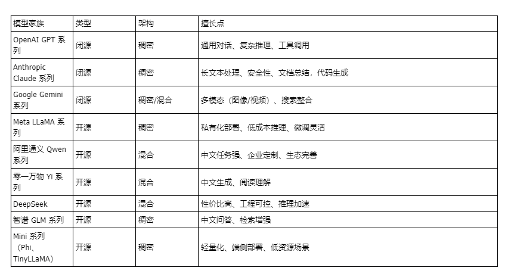

（ps:这个开源和闭源，主要的影响是开源的我们就可以下载到本地，使用本地推理，闭源的只可以使用云API推理。另外既然讲到了架构，希望大家也可以了解一下稠密（Dense), MoE(混合）架构。 ）


**OpenAI 系列模型不同点对比**

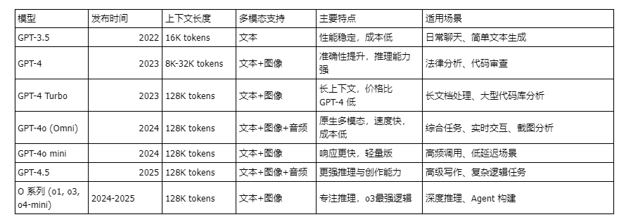

✅ **关键亮点**

* **GPT-4o**：目前最全面的模型，支持多模态（文字、图片、音频），速度快，价格比 GPT-4 Turbo 低约 50%，适合大多数场景。

* **GPT-4 Turbo**：适合处理超长文本（128K tokens），但不支持音频，价格略高。&#x20;

* **GPT-4.5**：研究预览版，推理和创作能力更强，适合技术写作和复杂任务，但成本高。

* **O 系列（o3、o4-mini）**：专注逻辑推理，o3适合复杂多步骤分析，o4-mini性价比高，适合高频调用。&#x20;

✅ **选择建议**

* **日常聊天/轻量任务**：GPT-4o mini 或 GPT-3.5。

* **长文档/代码审查**：GPT-4 Turbo 或 GPT-4.1。

* **多模态任务（图像+音频）**：GPT-4o。

* **深度推理/Agent开发**：o3 或 o4-mini-high。

* **高性价比场景**：o4-mini（成本极低，速度快）。


### **7.3 你的项目是如何选择模型的？为什么？**

（上面的知识积累一定程度上是为了这个题目准备，结合自己项目背景 和模型知识去回答，还是言之有理即可，我的回答供大家参考）

我们项目的模型选型主要考虑任务类型、部署方式和成本。**项目核心任务是分类、信息抽取和工具调用，整体不复杂**，**不需要超大模型**。当前阶段是原型验证，调用量不大，对隐私要求适中，所以选择远端 API 模型，免维护、迭代快。

综合**性能和成本**，我们选用 **GPT-4o mini**，因为它**推理能力足够，速度快，成本低，适合高频调用，同时 API 接入方便**。如果未来进入大规模部署且涉及敏感数据，我们会考虑本地部署开源模型，比如 **Qwen-2.5-1.8B**，它中文能力强，硬件要求低，适合分类和信息抽取。

总结来说，当前阶段选 GPT-4o mini 是因为性能、成本和易用性最优，未来会根据隐私和成本需求迁移到本地开源模型。


### **7.4 千问2.5到3的升级**

（作为应用，我们不要关注千问模型一些升级的原理，但是这个知识点要了解一下。为什么呢？因为你做大模型，很多公司需要用别人的模型，那么国内千问是标杆，所以即使做应用，多少要了解一下千问的特点，升级之类的。 第二个在大模型这个行业，你要关注行业动态，千问，Deepseek是国内标杆。 那么当有重大产品发布升级的时候，多少你要去了解它的特点的。否则人家一问你知道都不知道，显得很井底之蛙。

所以对于这个个问题：应用岗位，我的建议是：要关注，了解大概特点，不用深入。实时更新，当千问4出来，咱么也会把这里问题换成3到4的升级大概特点）

千问3是阿里25年4月发布的模型，相比千问2.5，它的主要升级点是：

1.支持**思考模式和非思考模式**。复杂模式可以用思考模式，内部线推理，在输出答案，而简单任务可以直接用非思考模式，响应快。

2\. 推理能力大幅增加：在数学，代码，逻辑推理上显著提升。

3\. MoE架构优化： Qwen3 提供MoE混合版本，同等效果下推理成本降低。

4\. 支持更多上下文，支持过多语言。

# RAG

RAG的话，其实我们的项目就是一个最好的经典RAG的例子。所以建议了解RAG的八股，知识后，可以去了解这个项目，这个项目把RAG最经典的环节都串起来了，并且这个项目配的模拟面试/项目复习的SKILL，就是去掌握项目，学习RAG各个环节的好方法。 该项目部分也会配一些该项目面试的真题，和前面的RAG理论相互补充。学好这个理论/项目，经典RAG就差不多了。

RAG进阶是：Graph RAG, Agentic RAG, 知识图谱这里。 我笔记总结了基本概念，我的策略是问到我就说会，讲述我的概念，但是我没有深入，因为这是RAG进阶技巧，对于那种对RAG要求比较高的岗位，专门做RAG的组可能会用。如果求职方向就是大模型应用，大模型算法，算法工程，没有指定RAG方向的话，没有余力的话，对于RAG的进阶部分，可以就只看一下笔记本节**RAG进阶**的概念，了解基本概念就好。

### 1.RAG vs 微调&#x20;

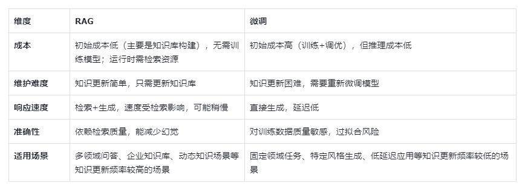

### 2.RAG评价指标

（Reference: 大模型RAG实战 ：4.5小节）

Rag场景下，比较著名的评估模型方法的框架是：**RAGAS**。RAGAS方法在评估过程中主要使用**忠诚度**，**答案相关性**，和**上下文相关性**来评判整个RAG系统中llm生成答案的质量。 RAGAS方法的一个优点是不需要参考答案。

具体来讲，**忠诚度**是指用户判断LLM的输出是否是根据召回文本的内容生成的。

**答案相关性**是衡量生成的答案是否和用户的答案相关的。

**上下文相关性**是用于判断召回文本是否和用户问题相关的。

（下面的可以挑一个具体的指标来展开给面试官讲，都展开讲太长了，而且内容有点抽象，如果讲完面试官不懂，可以给他举具体的例子讲解）


具体来讲：

**忠实度**的计算方式通常包括两个步骤。1：使用LLM生成的问题和答案，让大模型生成多个陈述。 2. 让LLM判断是否可以通过召回的文本，推断出这些陈述。 最后的采用能够推断出来的陈述/总陈述量最为忠诚度的评分。

**答案相关性：**&#x6839;据LLM的回答生成若干个假问题，然后计算假问题和真实问题的相似度，将相似度平均值作为答案相关性的评分。

**上下文相关性**：让LLM挑选出召回文本片段中能够回答用户问题的文本子集，用文本子集占召回文本的比例作为上下文的相关性数值。

&#x20;

### 3. 常见的向量数据库

（参考自RAG书籍）

常见的向量数据库有Milvus, Weaviate, Chroma, Qdrant。具体来讲：

**Milvus&#x20;**&#x5EFA;立在Faiss, Annoy等开源向量搜索库的基础上，能够支持**数十亿级别**甚至万亿级别的向量搜索库，并且**检索速度快**，万亿向量数据集上检索速度的延迟可以控制在毫秒级。

除此之外，Milvus还支持**数据分片**，**数据持久化，流式数据摄取**，**混合搜索**等很多高级功能。具有**高可用性**，**高性能**和**易扩展**的特点，用户还可以将其部署在Kubernetes上。并且可靠性强，具有**数据复制**和**故障恢复**的功能。

&#x20;

**Weaviate** 具有**鲁棒性**，**云原生性**和**可扩展性**的特点。它结合了向量搜索和结构化过滤的能力，同时拥有云原生数据库的容错性和可伸缩性。在百万级的向量数据上，可以实现毫秒级的检索。它可以方便调用OpenAI, Cohere以及Hugging Face平台提供的先进的数据向量化接口和模型。缺点是：目前只支持HNSW这一种检索算法。

&#x20;

**Chroma** 是一款AI原生的开源向量数据库，主要功能和特点围绕AI应用开发而设计。主要针对大模型RAG场景，目前只实现了单机方案。相比Weaviate和Milvus，Chroma更轻量化。 检索上实现了FAISS索引，不支持GPU加速。

&#x20;

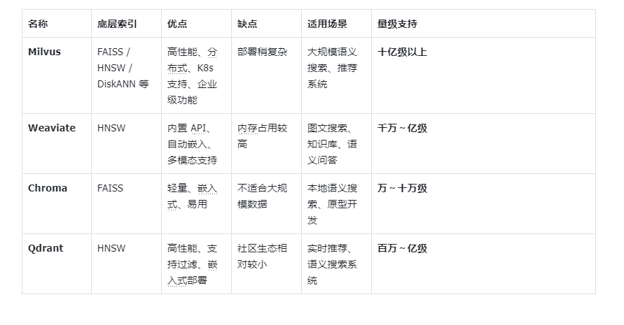

### 4. RAG的重要步骤&#x20;

参考视频

<iframe src="https://open.douyin.com/player/video?vid=7522119790514998591&mode=pc" sandbox="allow-scripts allow-same-origin allow-presentation allow-forms allow-popups allow-downloads" allowfullscreen allow="encrypted-media; fullscreen; autoplay" referrerpolicy="strict-origin-when-cross-origin" frameborder="0" style="width: 100%; min-height: 575px; border-radius: 8px;"></iframe>

#### *4.1 切割*

这个切割是非常高频的一个考点。一定要掌握。常见的问题包括 介绍一下RAG 中常见的分割策略（4.1.1），如何避免语义被切掉（4.1.2），你的项目中是如何使用分块策略的, 为什么?（4.1.4)

##### 4.1.1切割策略

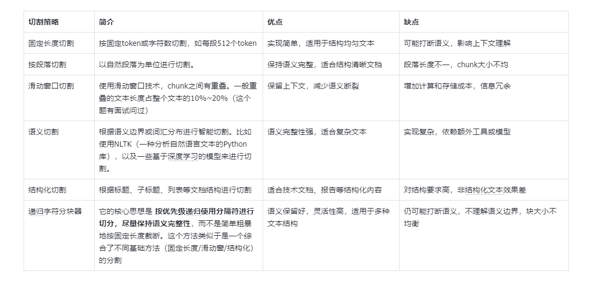

&#x20;

##### 4.1.2 如何避免语义被切掉？

滑动窗口方法中，切割的相邻两块之间都会有一些重叠。按照语义切割的方法，天然也会想语义表达一个意思的块来切割到一个chunk中，这些方法会缓解语义被切掉的问题。

同时，也可以使用一些对切割后的结构进行评估方法，比如使用模型来判断语义是否完整等方法来进行评估，对于语义丢失严重的切块重新分割。

&#x20;

##### 4.1.3 为什么需要切割？

1. 大语言模型(LLM)的限制。LLM有最大上下文窗口限制，直接输入整篇文档可能会超出限制。通过切割后的文本输入到LLM中可以控制上下文大小，确保模型能够正常处理并生成准确回答。

2. 嵌入模型的限制。嵌入模型存在两方面问题：一是输入长度限制（如`bge-base-zh-v1.5`的512 token限制），超出时会被截断导致语义信息丢失；二是即使不截断，文档过长也会稀释关键信息，使得embedding向量无法有效表示核心语义，影响检索精度和相关性。

&#x20;

##### 4.1.4 你的项目是如何分块的？

（这个问题希望大家能够自己思考，其实是要理解了上面的问题，然后结合自己的项目来回答，言之有理即可，我来给大家展示一下我结合自己的项目的回答）

在按摩房预约系统中，我根据不同的场景使用了不同的分块策略

**第一类：针对技师列表、服务菜单等强结构化数据**
我采用了 '不分块'  的策略。

* **具体做法**：将每一个技师的完整介绍（包括姓名、技能、工龄、评价）作为一个独立的 Document 存入向量库，不做任何切分。

* **这么做的原因**：技师信息是一个**不可分割的语义实体**。如果强行按长度切分，很容易导致'张冠李戴'——比如检索到了'擅长针灸'这个片段，但却丢失了'张三'这个名字的上下文。保留整体能确保 LLM 获取到完整的实体画像，保证推荐的准确性。

**第二类：针对用户协议、门店介绍、退改规则等长文本非结构化数据**
我使用了**递归字符分块&#x20;**&#x7B56;略。

* **具体做法**：利用 **LangChain** 提供的标准工具 `RecursiveCharacterTextSplitter` 进行处理。我通常将 `chunk_size` 设定在 400-500 tokens 左右，并设置 50 tokens 的 `chunk_overlap`（重叠）。

* **这么做的原因**：

  1. **语义完整性**：这种方法不是生硬地按字数切割，而是**优先尝试按段落（`\n\n`）切割**，其次按句子（`\n`或`。`）切割。这最大程度地保留了文本的自然语义逻辑。

  2. **上下文连贯**：通过设置重叠区域（Overlap），解决了'滑动窗口'的问题，防止关键信息（如电话号码）刚好被切断在两个块中间，导致检索失效。

  3. **适配模型**：切分后的长度非常适合 Embedding 模型的输入窗口，也避免了将数千字的长文直接塞给 LLM 导致'Lost in the Middle'现象或 Token 浪费。

&#x20;

#### *4.2 召回*

##### 4.2.1 召回的常用策略

RAG系统可以使用**粗排** + **重排**两个阶段来完成召回。 粗排通常使用**稠密向量检索模型**来做**语义匹配，召回语义相关文档。**&#x5F53;然也可以再结合**稀疏向量检索模型**来补充使用，因为**稀疏向量检索模型**更擅长**捕捉关键信息**来提高召回效果。

粗排后，可以使用**交叉编码器**，比如BERT来对候选文档进行**深入语义排序**，提高召回质量。

&#x20;

##### 4.2.2 稠密向量和稀疏向量

参考书籍《大模型RAG实战》 第三章文本召回模型

RAG系统中的文本向量检索模型大致分成两类：一类是基于**BERT， GPT等深度学习模型**的**稠密向量检索模型**，另一类是以**TF-IDF, BM 25 为代表的稀疏向量检索模型。 稠密向量检索模型更擅长提取文本中语义信息**，**稀疏向量检索模型更擅长提取关键信息**。

&#x20;

##### 4.2.4 对称检索和非对称检索

参考书籍《大模型RAG实战》 第三章文本召回模型

**对称检索是找到相似的句子**，与向量检索基于计算向量相似度的原理天然匹配，只需要模型具有较强的内容抽象的能力即可。


**非对称搜索是根据问题召回答案**，要求模型能够将问题和答案映射到同一空间，而问题和答案通常具有不同的文本结构。并非所有的向量化模型都支持非对称检索，只有经过大量问答数据的模型才能提供支持。


#### 4.3 召回优化策略

4.3.1 短文本全局信息增强

&#x20;   因为切块的过程难免会造成全局文本信息的丢失，因此我们为切块后的短文补充其所属的长文本信息。

&#x20;   比如以论文《DAPR: A Benchmark on Document-Aware Passage Retrieval》中提到，我们可以将**长文本的前三句话， 长文本的标题，长文本的关键词** 作为全局信息，和切块后的文本一起保存。


4.3.2 召回内容上下文扩充

&#x20;   在RAG切块的时候，对长文本切块后，可能会有较大的信息损失，因为我们从数据库中召回的通常是短文本。这时我们可以采用召回内容上下文补充的方法：**召回的是短文本，但是输入LLM处理的是短文本的父文本（长文本）**。 好处是既**精准**（基于短文本匹配），**又完整**（基于长文本输入）

&#x20;   在Langchain中，我们可以使用**ParentDocumentRetriever** 来完成这一功能，它使用了两个分割器，**Parent\_splitter**和**child\_splitter**。 前者用于确定在RAG场景下输入到大模型的父文本块的大小，后者确定从向量数据库中召回的子文本块的大小。同时还会存储父子文本块的映射关系。 当使用get\_relevant\_documents召回时，返回的实际上是父文本的内容。


4.3.3 文本多向量表示

&#x20;    在构建向量数据库的时候，可以使用多种向量来表示同一段文本。比如有一段文本A，我们不仅可以使用完整的A来生成向量，还可以使用它的**子集**，**总结句**来生成补充向量。当召回任意的补充向量对应的文本后，并不是将其输入大模型中，而是将其对应的文本A输入。

常见的生成补充向量的方法有：

&#x20;  &#x20;**&#x20; 文本切块:&#x20;**&#x5C06;原始文本切块后保存到数据库中，可以在召回时增强对更细粒度的表示。

&#x20;     **文章摘要：**&#x5229;用LLM生成摘要。

&#x20;     **假设性回答：**&#x53EF;以利用大模型的能力，根据文本提出问题，把问题作为补充信息。这种方法的思想是用问题召回问题会比用问题召回答案更容易。


4.3.4 内容查询优化

&#x20;    很多情况下，用户提出的内容有口语化，语义模糊，无关内容多的问题。 因此直接将问题变成向量可能和用户的真实意图不相关，从而影响RAG场景下的召回效果。因此，我们可以对用户的原始问题进行改写和扩充，再进行召回。

常见的对原始问题优化的方法有：

&#x20;      1.使用LLM 改写和扩充，比如LangChain提供的MultiQueryRetriever就能集成了这个功能。

&#x20; 2.对历史问题进行总结，然后再进行召回，这个特别适用于多轮对话中。比如&#x20;

&#x20;   用户：中国的首都在哪里？

&#x20;   LLM：北京

&#x20;   用户：那里有哪些好玩的景点？

&#x20;   这时直接用原来的问题召回显然太模糊，如果用LLM总结后，问题就变成了北京有哪些好玩的景点。


4.3.5 召回文本重排序

&#x20;       在RAG场景下，默认使用的是向量召回，检索效率高。但是由于文本向量化的过程中存在着信息损失，并且在召回过程无法考虑查询用户和候选文本上下文关系，因此召回精度不高。 所以在召回向量后，通常还会进行召回文本的重排序的精筛。

最常用的重排序的模型是基于**Transformer编码器架构的交叉编码器**。将用户查询和一段候选文本同时输入到模型之中，预测它们之间的相关性分布。使用这种方法可以考虑到用户查询和候选文本的上下文关系，因此有更高的精度。


4.3.6 结合元数据召回

在实际场景中，很多情况我们不需要在整个向量数据库中进行召回。如果在存储文本向量的时候同时记录了每个向量相关的标签，就可以在召回时现根据标签信息过滤出所需的向量子集，有利于提高检索速率，避免检索无用的信息。

现在的大模型应用框架，Langchain就基于多种向量数据库，集成了元数据写入和召回过滤的能力。我们可以使用**Langchain的Create\_metadata\_tagger**的接口，借助大模型的能力，自动生成元数据。

&#x20;

### 5.常见文本嵌入的方式

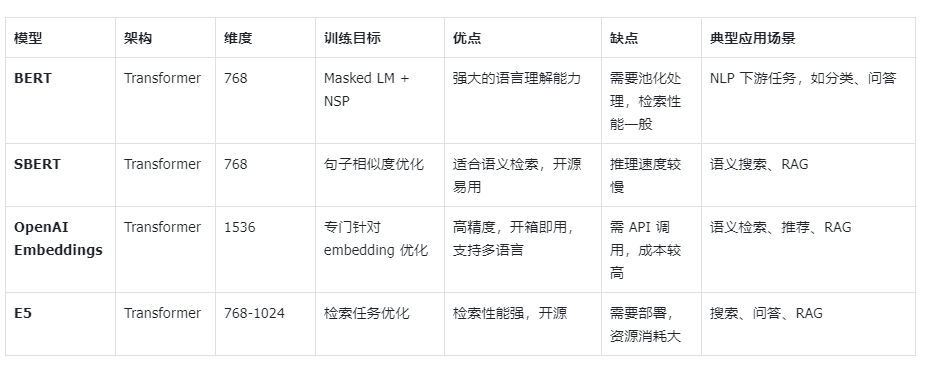

### 6. RAG进阶

此部分为RAG进阶部分，如前所述，一般岗位可能不会考察这么深，除非你自己简历写了Graph Rag, Agentic RAG或者本身就是专门做RAG的组，可能会考到这里。 我的原则是，该部分概念要会，问RAG有啥新方向，相关概念答得出来，但没有深入研究。

#### 6.1 RAG新方向

（这俩新方向，虽然可能没深入研究，但是得知道，概念要能讲出来）

目前典型的RAG的新方向是 Agentic RAG和Graph RAG, 具体来讲：

**Agentic RAG**的核心是把RAG从一个固定流水线变成一个有决策能力的Agent。传统RAG就是检索一轮、生成答案、结束了。但很多复杂问题一轮检索根本不够，Agentic RAG让模型自己判断——检索结果够不够？不够就再检索一轮，或者换个检索策略。像Self-RAG、Corrective RAG都是这个思路，本质就是让**检索过程变得更智能、可以自我纠错**。

**Graph RAG**解决的是另一个问题——**传统向量检索擅长找语义相似的内容**，但很难处理跨文档的关联推理。比如问人物之间的关系，信息散落在十几个段落里，靠embedding相似度很难串起来。Graph RAG的做法是先从文档里抽取实体和关系建成知识图谱，检索时在图上做关系遍历，特别适合需要全局理解的问题。"

我觉得这两个方向是互补的——一个解决检索策略的智能化，一个解决知识关联和推理，未来可能会结合起来用。


#### &#x20; 6.1 RAG与知识图谱

（知识图谱也能和RAG结合使用。但是其实对于可能80%的问题，靠高质量的切片和双路召回就能够解决，只有20%的问题，需要跨文件全局关联的硬核需求，值得花200%的精力去建立图谱。总结来说，知识图谱较为复杂，不是每个企业都会用，成本高。也属于进阶路线。 所以如果你没有学好传统的双路召回RAG，先不用来学这个结合图谱的RAG，这里的建议依旧是作为概念，先理解什么是知识图谱，为什么和RAG能结合？优势和劣势是啥？我就只学到这里。如果哪天他变得很火了，考的多了，可以继续学）

##### 6.1.1 什么是知识图谱？

知识图谱是一种结构化的知识表示形式，通过图模型来描述现实中的实体及其之间的关系：核心包括：

**节点：**&#x8868;示实体或者概念，如'北京'，'小刘'

**边：**&#x8868;示实体间的关系，比如'小刘-就职于-阿里'

**属性：**&#x63CF;述节点的额外信息，如'北京-人口-2154万'等。

知识图库通过三元组的形式组织数据，从而构建出一个庞大的网络。

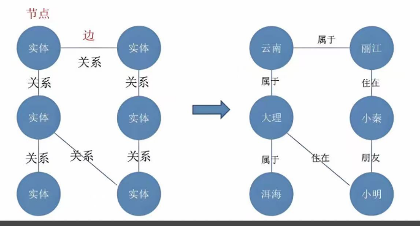

##### 6.1.2 知识图谱在RAG的应用？

传统的RAG是基于分块，向量召回的思路来对输入数据增强的。但是对于强调跨文档/多文档综合，需要多跳推理/链路关系的时候，可以将知识图谱和RAG结合，即KG-RAG。 它的做法是先用普通语义检索拿到一批chunk，然后把这些chunk映射到知识图谱的实体上，沿着图的边做扩展检索，把原本鼓励的文本片段补齐成一条/多条与问题相关的关系链，最终按图结构把组织起来的片段交给LLM（简单说，向量召回的结果作为起点，KG扩展把点连成线，再将整合结果送入LLM）

##### 6.1.3 知识图谱vs普通RAG？

普通RAG **落地快，成本低，适合'答案就在某几段文档里'的定位性问题**，但是它的弱点是需要**跨多端/多条文档做综合，需要多跳推理和关系链路时**，他只能拿到碎片，此种场景适合使用KG-RAG, 但是它的缺点是：**需要抽取/维护实体关系、做图扩展与组织，构建与维护成本更高**。


### 7.RAG场景题

7.1. 如果我做 rag 召回的相关内容里，会有人恶意注入了一些错误的信息， 你觉得会影响大模型的生成内容吗？怎么避免？

会影响生成内容。 我认为：

1. 可以限制拿到的数据的来源，只选择可靠的数据源。

2. 可以对拿到的数据进行安全性检验，检验是否包含恶意指令

# Agent

## 1.Agent开发框架&#x20;

（Agent的开发框架是必考的内容，必须要会，最常见的问法就是让你讲解现在主流的框架有什么，他们的区别，然后往深入了问，问的最多的是Langchain/langgraph的区别，他们的组成。 除此之外，如果你自己的项目中比如使用了某个特定框架，你也需要对这个特定框架有更深入的理解）

### 1.1常见的Agent开发框架

&#x20;（参考文章：https://mp.weixin.qq.com/s/qyCLff0WG15bEQvjodF-GQ，为啥总结这5个框架，因为这5个是最火的（参考Github star数量）。通常来说，你项目用到了哪个框架，哪个框架就要继续深入了解知识，我用的是Langchain，所以对于Langchain/Langgraph就要深入。如果你们使用了其它框架，请针对于你使用的框架，自己深入准备相关知识。）

**AutoGPT**

自主型 Agent 框架，通过“思考–执行–反思–再规划”循环自动推进任务，强调高自主性与多步任务拆解能力，但可控度较弱。

**LangGraph**

基于有向图的 Agent 流程框架，用“状态机 + 图结构”确保任务步骤可控、可观测、可解释，适合多步工作流的稳定执行。

**Dify**

面向应用构建的 LLM 平台，提供 UI 化的工作流、工具集成与模型管理，降低 Agent/AI 应用开发门槛，强调易用性与产品化。

**CrewAI**

多 Agent 协作框架，让多个具备角色与技能的 Agent 自主协作完成任务，适合开放式探索和需要团队式分工的复杂任务。

**AutoGen**

微软开源的多 Agent 协作框架，强调“人机协作 + 多 Agent 对话控制”，具备较强的可调试性、可观测性与对话流控制能力。

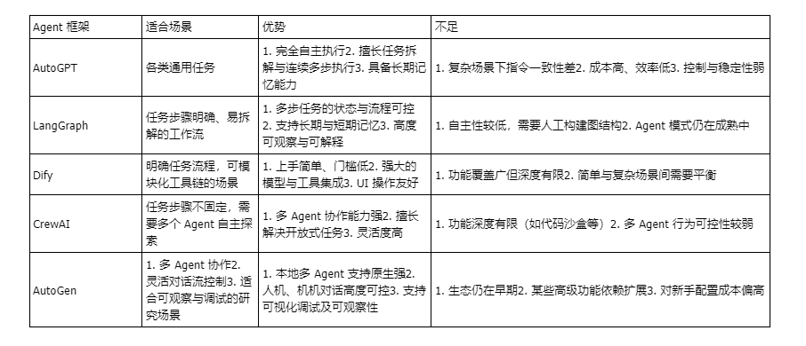

### 1.2 LangChain 核心设计理念和框架

（算是基本概念，得背）

Langchain 的核心思想是 通过模块化组件： **Prompt, Memory, Tool, Chain 将LLM与外部数据源，工具（向量数据库，多种LLM）结合**，形成**可复用的“链式逻辑**“。特点是灵活，生态丰富，适合快速原型开发。

特点是：**以链为核心，逻辑是线性和简单分支**，不擅长复杂状态管理。


#### **1.2.1 LangChain的版本**

（面试官偶尔会问你使用的是哪个Langchain版本，因为Langchain版本更新的确实比较频繁，我知道大家可能有时没太关注版本，我这里整理了一个表格，你需要根据表格里对应Langchain的时间来推断出你当时大概用的哪个版本，要心里有数。从这个表中，大概率可以看出在25年中的时候，我开发的项目，使用的是v0.3.6的Langchain版本，也是在这个时候引入了Graph的概念。弄清楚你用的哪个版本是我们要掌握的）

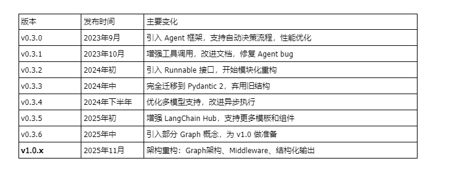

#### **1.2.2 LangChain 1.0新版本**

(LangChain在25年11月份发布了新版本，其实是大的变化。如果你已经做完了项目，并不是说你就要用最新的版本再做一遍，讲起来Langchain的时候，你还是按照我上面设计的答案去回答就行，然后面试官可能会问你新版本你了解吗？你再给讲讲1.0版本的特性。如果你还没做项目，现在开始做，那么推荐你直接用1.0。现在这个还不是硬性要求的，面试很多时候其实并没有一定要考察你新版本，他这个刚刚发布，可能面试官都没太用。暂时我们先粗略了解1.0的新特性就够了，如果后面我发现面试官开始倾向于问1.0的问题，我再来总结更多新版的知识。

我这里的复习思路是**大概理解一下新特性思路和思想就好了，不用太深入研究，**&#x56E0;为目前问的不多，面试官最多问道你知不知道langchain新版本。 如果你想要深入学习一下，可以看https://mp.weixin.qq.com/s/asAiFhl8mWIl01s-LSD9VA）

Langchain v1.0的升级 标志着 LangChain 已经走出“实验阶段”，成为一个稳定、可用于生产的框架。具体来讲，在这次升级，引入了以下新特性：

1. 智能体（Agent）的全新创建方式

   * 之前的 Agent 创建方式比较复杂，需要手动配置多个组件。

   * v1.0 提供更简洁的 API，通过标准化的构建流程，开发者可以快速定义 Agent 的行为、工具调用逻辑，并且支持更复杂的任务编排（比如多步骤推理、条件分支）。

2. 中间件机制（Middleware）

   * 类似 Web 框架的中间件概念，可以在执行链路中插入逻辑。

   * 应用场景：日志记录、性能监控、错误重试、缓存、权限控制。

   * 好处：开发者无需修改核心逻辑，就能在执行过程中添加这些功能，提升可维护性。

3. 结构化输出

   * 之前 LLM 输出是纯文本，容易出现格式错误。

   * v1.0 支持 JSON Schema 和 Pydantic 类型验证，可以强制模型输出符合预期结构。

   * 好处：减少 LLM 不确定性，适合生产环境，尤其是需要严格数据格式的场景（如 API 响应、数据库写入）。

4. 标准内容块

   * 提供标准化的 Prompt 模板、工具接口、链组件。

   * 好处：降低重复开发，开发者可以直接复用官方标准块，减少定制成本。

5. 全新的包结构与模块化设计

   * 命名空间重构：拆分为 `langchain_core`（核心逻辑）、`langchain_community`（社区集成）、`langchain_experimental`（实验功能）。

   * 好处：模块职责更清晰，升级和维护更方便，避免以前版本中“包太大、依赖混乱”的问题。


#### 1.2.3 LangChain 不方便的地方

（ 这个问题相比前面的Langchain的基本问题，肯定没有出现的那么频繁。不过这个题目是我从面试真题截取的来，而且这个问题其实也不止被问到一次，反应了面试官想了解你对Langchain的理解是不是浮于表面，有没有一些更深的理解，建议也需要掌握，即使面试官不主动问，你在和面试官聊Langchain的时候也可以找个时机回答出来这两点，体现你其实对这个框架有一些深入的思考，答出来一定会加分。当然这个问题的反面题，你觉得Langchain有没有一些方便的地方，这个你可以回答它集成了各种方法，比如RAG的召回优化，RAGAS的评测方法等，之前笔记我都写出来了）

**1.依赖过多，复杂度高**

LangChain集成了大量向量数据库，模型提供商和工具，虽然理论是可选，但是实际使用中很多功能需要安装一堆依赖，导致项目臃肿，容易出现"依赖地狱", 对于只需要简单功能的项目，这种设计显得过度。

**2.频繁更新，接口不稳定**

LangChain迭代速度太快，但是带来大量破坏性更新，API接口经常变化，文档之后，导致开发需要不断重构代码，维护成本高。

**3.性能和延迟问题**

LangChain的链式调用每一步都可能涉及外部API， 导致延迟明显，尤其是需要实时响应的场景中表现不佳，链式调用其实也增加了出错概率和调试难度。

**4.不够灵活，定制困难**

高度抽象导致很多底层逻辑无法轻易改变，遇到特殊需求时，开发者往往需要绕过框架，甚至重写部分功能。

### 1.3 LangGraph&#x20;

（LangGraph 相关知识，深入学习可以看这个，很全面 + 有代码示例https://mp.weixin.qq.com/s/XhFbLTLcSjDj0r3KGT9EOg）

#### 1.3.1 LangGraph 介绍/主要模块

（基本概念，肯定得背）

LangGraph 通过将任务组织为 **有向图**，而不是线性链，来解决 LangChain 在复杂任务中的局限。它支持 **条件分支、循环、并行执行和状态共享**，并且能够实现多 Agent 协作和复杂工作流。核心模块包括：

Graph：整体工作流的图结构

Node：图中的计算单元

State：共享状态，用于节点间传递上下文

Edge：连接节点，定义控制流和数据流

这种设计使 LangGraph 在处理动态逻辑和多步骤推理时更灵活、更可扩展。

#### 1.3.2 LangGraph 过程是如何流转的？

**定义图结构**：用 `StateGraph` 添加节点和边，指定入口节点（`set_entry_point()`）和结束条件（`END`）。

**编译图**：调用 `graph.compile()`，生成一个**可执行图对象**（相当于执行器，负责调度和状态管理）。

**启动执行**：通过 `invoke(initial_state)` 或 `stream(initial_state)` 开始运行，传入初始状态。

**执行逻辑**：&#x20;

* 从入口节点开始执行。

* 根据边决定下一个节点，如果多个节点同时满足条件，就**并行执行**。

* 每个节点跑完后，把输出合并到共享状态。

* 重复调度，直到路由到 `END` 或没有后续节点。

**结束**：返回最终状态，或者用 `stream()` 观察每一步的状态变化。

### 1.4 Semantic kernel核心设计理念

(其实Semantic kernel 用的并不多，微软内部的框架，因为我在微软，所以我的项目用的它，面试起来难免问到它，**大家基本可以不用复习**）

Semantic Kernel的核心理念是让AI**能力像插件一样无缝嵌入到企业应用和现有系统**。核心思想是通过插件化技能，结合LLM，传统代码和外部服务，**构建安全，可治理的AI**应用。

&#x20;

## 2.Function Calling

（Function call的能力其实一直都是 Agent非常重要的考点，虽然在实际面试中考察的并不是特别多，以下两个问题是来自于某次面试原题）

### 2.1 Function calling是如何被训练出来的

Function calling是通过在模型训练的**预训练阶段**使用**自监督学习**，在**微调阶段**使用**SFT技术**，以及在**对齐阶段**使用**RLHF技术**来是模型具有能够理解用户意图并生成函数结构化的函数调用请求的能力。

具体来讲：

预训练阶段的自监督学习使得模型能够理解自然语言。

微调阶段的SFT技术使用标注数据让模型理解何时该调用函数，调用函数的格式是什么。

对齐阶段使用RLHF，使用人类的反馈来优化调用结果，使模型的调用更符合人类的习惯。

&#x20;

### 2.2 工具调用失败问题

在使用一些Function call的接口设计的时候，如果参数比较多，实际使用中发现LLM调用失败（可能是没理解调用的时机）或者是缺少了必填的参数（导致调用失败），这个应该如何避免呢？

1.**重构函数设计**：《代码整洁之道》中就写过，函数参数最理想的是0个，其次是1，再次是2，我们应该尽量避免有3个及以上的参数，所以出现这种情况我们可以先考虑是否有必要重构。

2.**可以拆分函数**，让函数满足单一职责地原则，避免有过多地参数。

3.**优化JSON Schema设计**。 在JSON Schema中清晰地标明参数类型，是否必填，默认值，写清楚参数描述。

4.**优化函数/参数命名**。 让命名更具有描述性，便于LLM理解。

4.**优化提示词设计**。可以在提示词中加入一些引导，给出一些调用示例。

6.**可以增加一些验证，反馈，重试机制**。比如在调用前对参数进行验证，判断是否有误，如果调用失败，可以把失败的信息传回给LLM，让他利用这个信息重试。


## 3. Agent 性能评估

（参考资料：第一个资料更多的是理论上的知识，告诉我们评估一个Agent的性能，我们应该如何做？怎么做？

&#x20;  第二个资料是工程实践，具体到某一个任务中，美团针对他们的业务是怎么做评测。

&#x20;  二者结合，刚好从理论到实践，全方面来学习这个知识。

&#x20;  本节是面试高频考点，必须仔细学习。 学完后可以应付以下面试问题：

&#x20; 1\. 如何评价一个Agent的性能？（参考资料1）

&#x20; 2\. 你的项目中如何是对Agent进行评估的？（结合参考资料1和参考资料2，针对自己的项目，设计你的评估方法，用上参考资料1和参考资料2的思想，我下面笔记会展示针对我项目总结回答，你可以参考，你必须要准备一个针对你的项目的自己的回答，**这个知识点很重要**，再次强调。）

&#x20; 3\. 最近看了什么论文，可以讲一下吗？（参考资料2）

**参考资料：**

1. 《Agentic Design Pattern》https://github.com/fzy2012/rhzl-Agentic-Design-Patterns-cn

2. 美团龙猫论文 ：《VitaBench: Benchmarking LLM Agents with Versatile Interactive Tasks in Real-world Applications》 https://arxiv.org/pdf/2509.26490

&#x20;   ）

### 3.1 如何评价一个Agent的性能？

（Agent性能评估的理论知识，**必考**.&#x20;

&#x20;我下面这个答案的**设计原则**：

**&#x20;第一段是一个总体性的回答**： 点出各个指标对于传统工程和Agent工程的区别，因为有一些指标是Agent特有的，这也是面试可能问的点，我直接在总体性回答中点出这一点，并列举相关评测指标。

**&#x20;第二块对所有的指标具体讲解**： 注意这里我不光讲了这个指标是啥，还讲了怎么做，其实面试官问这一问题的时候，我们可以只一一回答是什么，怎么做可以不讲，要不太多了，但是大家需要知道怎么做，所以我列举了，具体细节也可以看这个参考资料1，3.1的回答都是基于这个总结

**最后一块是总结，告诉面试官这是理论，具体实现要根据工程结合**。这块其实就埋下了伏笔，面试官可能问你那到底怎么落地呢？你就可以接下来根据3.2和3.3 来讲具体的落地实现细节。）


**对于 Agent 性能的评估，既需要对传统工程里本来就有的指标进行评估**（如**延迟、资源/成本、A/B 测试**），**又由于 Agent 的语义生成、概率性与长流程/工具使用等特性**，**需要新增或强化一些特有指标**（如**响应质量，轨迹评估，RAG系统评测**）。&#x20;

一、传统工程通用指标（Agent 也必须做）

1. **延迟**
   **是什么**：请求→输出的耗时，直接影响交互体验与整体效果。
   **怎么实现**：将延迟写入**持久化**系统（结构化日志/JSON、数据仓库 、可观测平台），做趋势分析与阈值告警。&#x20;

2. **资源与成本**
   **是什么**：生产环境下跟踪计算与外部服务消耗；在 LLM 场景，成本与 **Token 数量**强相关。
   **怎么实现**：为每次交互记录**输入/输出 Token**并累计统计，用于预算管理与提示/生成流程优化。

3. **A/B 测试**
   **是什么**：并行比较不同 Agent 版本或策略，系统性识别更优方案。
   **怎么实现**：在生产/灰度环境对两版 Agent 同时运行，持续比较关键 KPI（解决率、响应时间、错误率）。&#x20;


二、Agent 特有/更突出的指标

1. **响应质量**
   **是什么**：判断输出是否**相关、正确、合逻辑、无偏见**且**符合用户意图**
   **怎么实现**：

   * **基线**：**严格匹配**。&#x20;

   * **进阶**：**字符串相似度**、**关键词命中**、**嵌入语义相似度**。&#x20;

   * **主观/细粒度**：**LLM‑as‑a‑Judge** + **Rubric** 产出结构化评分，用于“有用性”等主观维度。&#x20;


2. **轨迹评估**
   **是什么**：不仅看最终答案，还要看**过程是否合理**：工具选择、调用顺序、策略质量、是否遵循理想路径。
   **怎么做**：将**实际步骤**与**理想轨迹**对比，可采用：

   * **精确匹配**（步骤完全一致）、

   * **顺序匹配**（序列一致）、

   * **任意顺序匹配**（集合一致）、

   * **查准率/查全率**（命中该用的工具与必要步骤）。&#x20;


* **RAG 系统评测**

  **是什么**：评估答案是否**只依据检索到的证据**（忠实度）、是否**紧扣用户问题**（相关性），以及**引用是否可追溯**（归因/来源标注）

  **怎么做：**&#x6211;们可以使用RAGAS 这一套评估标准来对RAG系统进行评估。


值得一提的是为 AI 智能体开发一个全面的评估框架是一项具有挑战性的工作，其复杂性可与一门学术学科或一本实质性出版物相媲美。这种困难源于需要考虑的众多因素，例如**模型性能、用户交互、伦理影响和更广泛的社会影响**。具体的工程落地的评估方法还需要根据具体的项目实际情况进行方案定制。


### 3.2 美团龙猫论文的核心思想和方法论

（此问题用来给面试官讲解你看的论文，或者有相关契机，你也可以把话题引到这里讲，我简单的总结了美团龙猫的思想，其实里面还有非常多具体的实现信息，感兴趣的当然是继续深入学习，知道每一个细节知道他到底是怎么做的比较好。当然从面试的角度来说，一般面试官都没有继续追问细节。）

美团龙猫这篇论文在讨论如何制作数据集，如何对Agent的性能进行评测，具体来说他们的做法是：

**数据集的制作：**

将真实本地生活业务抽象成一个"**可交互的工具环境**", 他们将外卖，到店，旅行等场景提炼出一张工具以来图和配套的数据和用户模拟器，组合出**单场景和跨场景任务**，从而制作出一套数据集。


**性能的测评**：

他们将对Agent的测评维度拆分成：**推理，工具，交互**三个维度。具体来讲：

**推理维度**是指Agent是否可以在部分可观测，信息不完备的环境中，将分散线索整合并做出正确抉&#x62E9;**。**

**工具维度是指&#x20;**&#x5728;工具依赖图中，Agent是否可以**正确选择工具，满足前置条件，使用正确的参数。&#x20;**

**交互维度是指**指在多轮对话中，能否识别模糊意图，主动澄清，在用户画像与表达差异中维持上下文一致，确定关键决策点。


基于这三个维度，创建一个评判规则，并且把每个任务拆分成不同的步骤，通过一个**滑动窗来**对这些步骤进行基于这些规则进行评分，最终按条目汇总这些每一步的结构，得到 **任务成败 + 工程命中率 + 失败归因**的多个指标。

### 3.3 你的项目中是如何对Agent进行性能评估的

（其实说实话我的项目没有太做Agent评估，毕竟不是一个企业项目，我自己没做到那一步，但这个问题是必考。结合3.1 和 3.2的理论知识，我准备的回答是这样的。其实是把上面的一些思想结合自己的业务大概想一下是怎么实现评估的。如果你也没做，这里尽量想的细一点知道整个流程大概是怎么做的，然后结合自己业务，你要自己说服自己，以下就是你自己做的。以下是我的答案供大家参考。）

系统中主要使用**离线测试**和**在线追踪**两种方式对Agent进行评估。&#x20;

**离线测试**中，我们会构建  JSON/JSONL 的数据测试集文件。主要从**对应的响应质量**，**轨迹状态&#x20;**&#x548C;**效率&#x20;**&#x4E09;个方面对Agent系统做测评。

**响应质量**主要包括：

分类的结果：比如邮件是否和行程相关。

邮件提取内容：包含主题，地点，人物等。

**轨迹状态：**&#x6570;据集中会指定预期的Agent标准输出路径和工具调用情况。比如第一步是分析邮件->提取信息->发送通知 的路径，会将输出和数据集路径对比，判断Agent是否遵循了标准流程。

**响应质量**和**轨迹状态&#x20;**&#x4F1A;采用LLM Judge的方式，将采集到的输出和数据集Json进行比较，输出评测报告。


**在线追踪**是指：对于过程也会统计整个过程端对端延时，每一步token占用情况，每次系统运行时都会统计并且上传到云端面板，实时分析。制定阈值方案，当发生异常时，也会及时报警。


## 4.MCP

（这章的所有内容都是面试出现过的真题，都是我根据真题来总结的，都建议掌握，这个问题是MCP的概念，肯定是必背的）

MCP 是一种**标准化接口协议，**&#x7EDF;一了AI模型与外部资源的连接方式，用于让LLM能够访问外部的**数据**，**工具**和**提示词**。

MCP采用**客户端-服务端架构**，包含三个关键组件：Host, Client,和Server. 其中Host是运行LLM的应用程序。Client是在Host中运行，负责与MCP Server通信。Server中暴露了**工具**，**数据资源**，**提示模板**等，供LLM使用。

MCP的典型优点是**动态能力更新(**&#x5DE5;具参数变更时无需重写客户端代码)，**接口标准化**(不同工具统一接入，减少开发成本)的特点。

### 4.1 MCP 和 Function calling 的区别

（面试也出现过，挺基础的一个考点）

《Agentic design pattern》第10章专门有对这一问题进行讲解。

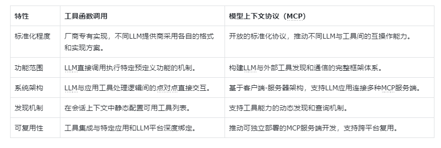

### &#x20;4.2 MCP 本地Server和远端Server 的对比

（我根据这个视频https://www.youtube.com/watch?v=wlerSyHzoCI总结的，但是如果有余力，还是建议自己看一下这个视频，表格的东西不难，重要是你自己能够理解，视频里都有，大家可以更深入理解一下，我在字节跳动一面的讲解视频中应该也会过一下这个表格，大概讲一下）

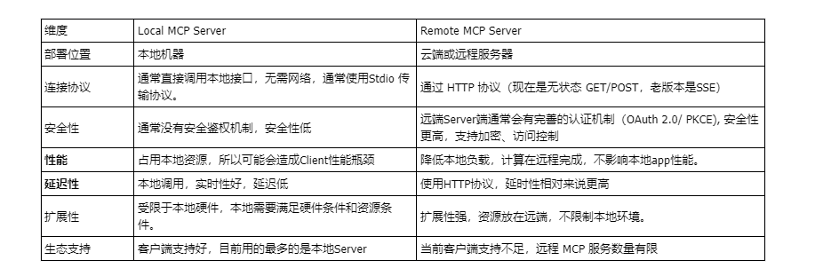

### 4.3 MCP的传输协议

(最开始我复习的时候就是弄清楚了两种协议，本地:Stdio 远端：SSE，这也是有一些视频这么讲的。但我在面试的时候，其实因为这个答案被挑战过，因为现在SSE在MCP里已经被替代了，所以我有了以下答案，相对来说这个答案是比较完整的，这题也是面试会考的题）

MCP的传输协议针对于**本地服务器**和**远端服务器**有明显区别。

对于远端MCP Server, 协议在 2025 年 3 月进行了重大更新：原先采用 **有状态的 HTTP 长连接**，并强制使用 **Server-Sent Events (SSE)** 来实现服务器实时推送，这种方式复杂且对网络稳定性要求高。新版本改为 **无状态协议**，主要通过 **标准的 GET 和 POST HTTP 请求**完成交互，SSE 变为可选增强功能，只有在需要实时推送时才启用。这一改动降低了实现复杂度，提高了兼容性和灵活性，使协议更接近 REST 风格，易于集成和扩展。

对于 **本地 MCP Server**，通常运行在开发者机器上，直接通过本地接口或 STIDO（标准 I/O）进行通信，不涉及网络传输，因此不需要复杂的认证或长连接管理。

### 4.3 MCP的参考资料

基础视频：推荐两个，马克的和爬爬虾的，这两视频可以从你0MCP基础到了解知道MCP是啥，可以动手接一接。

<iframe src="https://open.douyin.com/player/video?vid=7493337216203148563&mode=pc" sandbox="allow-scripts allow-same-origin allow-presentation allow-forms allow-popups allow-downloads" allowfullscreen allow="encrypted-media; fullscreen; autoplay" referrerpolicy="strict-origin-when-cross-origin" frameborder="0" style="width: 100%; min-height: 575px; border-radius: 8px;"></iframe>

<iframe src="https://open.douyin.com/player/video?vid=7481284652561337609&mode=pc" sandbox="allow-scripts allow-same-origin allow-presentation allow-forms allow-popups allow-downloads" allowfullscreen allow="encrypted-media; fullscreen; autoplay" referrerpolicy="strict-origin-when-cross-origin" frameborder="0" style="width: 100%; min-height: 575px; border-radius: 8px;"></iframe>


进阶视频：马克老师的进阶视频其实挺好的，特别是讲了抓包，让我们详细了解了中间发生了什么。看完内容对于我们笔记部分<span style="color: inherit; background-color: rgba(255,246,122,0.8)"> 其他问题-你在项目中遇到的最难的问题，如何解决的-MCP偶尔连接失败</span> 的问题理解有很大帮助。 这几个视频就是当时我0 MCP基础去看的，也没有看其他视频。应该来说你把这几个按顺序看懂了，MCP就理解了，自己再动手做做，看看真题就行了。

<iframe src="https://open.douyin.com/player/video?vid=7495023371781033266&mode=pc" sandbox="allow-scripts allow-same-origin allow-presentation allow-forms allow-popups allow-downloads" allowfullscreen allow="encrypted-media; fullscreen; autoplay" referrerpolicy="strict-origin-when-cross-origin" frameborder="0" style="width: 100%; min-height: 575px; border-radius: 8px;"></iframe>

<iframe src="https://open.douyin.com/player/video?vid=7499835360306842919&mode=pc" sandbox="allow-scripts allow-same-origin allow-presentation allow-forms allow-popups allow-downloads" allowfullscreen allow="encrypted-media; fullscreen; autoplay" referrerpolicy="strict-origin-when-cross-origin" frameborder="0" style="width: 100%; min-height: 575px; border-radius: 8px;"></iframe>

## 5 Agent的记忆功能

（属于**必考内容**，熟练掌握

《Agentic design pattern》第八章有对这一问题专门讲解

[https://github.com/fzy2012/rhzl-Agentic-Design-Patterns-cn/blob/feature/interactive-website/14-Chapter-08-Memory-Management.md](https://github.com/ginobefun/agentic-design-patterns-cn/blob/main/14-Chapter-08-Memory-Management.md)。我把这个经典面试问题，结合了理论知识和现在最火的Openclaw结合，我相信这个回答会更让面试官眼前一亮。然后你这么回答其实把话题引到了Openclaw，所以Openclaw的知识要好好看，接着面试主动权就在我们手里了！）

Agent 的记忆功能通常分为**短期记忆**和**长期记忆。**

**短期记忆**通常存在于上下文窗口，包含最近的对话消息，智能体回复，工具调用结果，以及当前交互的反思内容。但是上下文窗口的容量有限，所以当多轮对话时，我们可以通过总结旧对话片段、强调关键细节等技术来维护这个上下文窗口。以 OpenClaw 为例，它的 Compaction 机制就是一个典型实现：当上下文 token 接近模型窗口上限时，系统会把最近约 20,000 tokens 的消息原样保留，更早的旧消息则用 LLM 分块生成结构化摘要来替代，摘要中会强制保留任务状态、决策理由、TODO 和关键标识符等信息，压缩后上下文变为"摘要加上最近原文"的结构，这样既释放了空间又尽量减少了信息损失。

当会话结束，短期记忆会丢失，**所以我们通常也会让 Agent 支持长期记忆。**&#x6211;们通常使用一个知识库，存储智能体在各种交互场景、任务执行过程中需要长时间保存的信息。数据通常存在智能体运行环境之外，比如数据库，知识图谱，或者向量数据库中。当智能体需要使用长期记忆时，会查询外部存储，检索相关信息和数据并整合到上下文窗口中然后进行使用。**还是以 OpenClaw 为例**，它的长期记忆就是工作空间里的 Markdown 文件——`MEMORY.md` 存策展过的持久知识和偏好，`memory/YYYY-MM-DD.md` 按日期存追加式日志。在检索侧，系统会对这些文件建立混合搜索索引，同时使用向量语义搜索和 BM25 关键词搜索，按 7:3 权重做混合排序。Agent 需要回忆历史时，通过 `memory_search` 工具按需检索相关片段再拉进上下文，而不是把全部记忆都塞进去，这就是典型的 RAG 式长期记忆方案。

此外还有一个值得一提的设计，**就是短期记忆向长期记忆的自动沉淀机制**。OpenClaw 在压缩前会静默触发一轮 agent 回合，提醒模型把当前对话中重要的信息写入记忆文件，这样短期记忆中真正有价值的内容能在被压缩丢弃之前沉淀为长期记忆，保证了记忆的连续性。

### 5.1 介绍Langchain中的记忆功能的实现。

(短期记忆）Langchain中通过**ConversationBufferMemory**的接口，可以实现只保存几轮对话，或者使用LLM总结历史对话的短期记忆功能。

（长期记忆）通过**VectorStoreRetrieverMemory**可以将信息变成嵌入向量，存入Chroma, weative, FAISS的数据库中，并且支持语义搜索。

### 5.2 介绍Langgraph中的记忆功能的实现。

(参考https://mp.weixin.qq.com/s/XhFbLTLcSjDj0r3KGT9EOg， 这个文章对Langgraph的各方面写的很详细，想深入学可以仔细阅读，想简单学习可以当字典查。比如这个Langgraph的记忆功能，这里面就有现成答案，我直接照抄，不理解的可以看原文，里面也有讲解，原文里还有代码。）

&#x20;记忆是智能体运行中记住先前交互信息的组件，是能够连贯对话的核心能力，LangGraph中提供了**短期记忆和长期记忆。**

**1、短期记忆：**&#x5B58;储当前对话上下文的信息，作用于单次会话或线程，通过thread\_id（会话id）区分，通过**图状态**（State）和**检查点**（Checkpoint）实现。

**2、长期记忆：**&#x957F;期记忆用于存储那些需要在不同会话间保留的信息。它通过 **存储库（Store）** 接口实现，类似于一个键值数据库，并支持基于向量嵌入的语义检索。与线程范围的短期记忆不同，长期记忆保存在自定义的“命名空间”中。

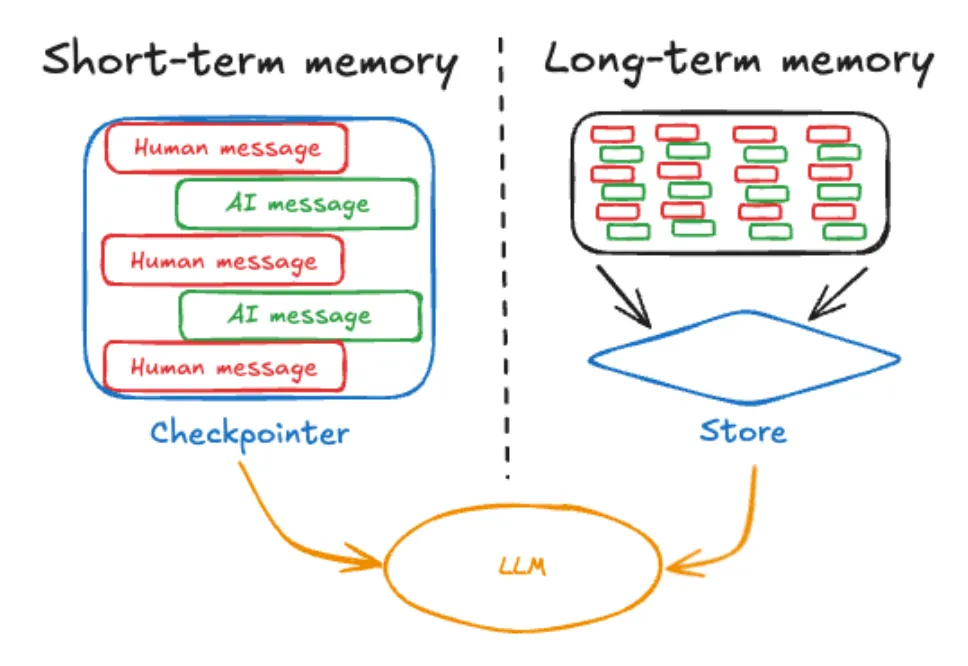

### 5.3 长期记忆的常见应用场景

（依旧是从我推荐的书籍《Agentic design pattern》中给大家总结， 在面试聊到长期记忆的时候，我们可以给面关举一些常见应用场景下具体的长期记忆的例子，这个问题倒是不会直接被问。不过记忆部分是重点，很多场合其实会聊到。聊到了能清晰有条理的列举一些长期记忆典型例子就很好。）

https://github.com/fzy2012/rhzl-Agentic-Design-Patterns-cn/blob/feature/interactive-website/14-Chapter-08-Memory-Management.md

常见的长期记忆的例子是：

1\. 聊天机器人 / 对话式 AI：

**存储内容：**&#x7528;户偏好、过往对话摘要、关键话题记录。

**作用**：提供个性化且连贯的交互体验，避免用户重复自我介绍，让对话更自然流畅。


2.个性化服务AI：

**存储内容：**&#x7528;户偏好、历史行为模式、个人画像信息

**作用**：动态调整响应策略和推荐内容，提供更精准的个性化服务。


3.智能客服 / 售后 AI

**存储内容：**&#x5386;史工单、问题解决记录、用户满意度反馈

**作用**：快速定位老用户的历史问题，避免重复排查，提升服务效率。

>
>
>


## 6 Multi-Agent 架构

（Multi-agent 设计架构应该来说是Agent项目里最常用的设计方法了。面试的时候难免会和面试官讲到。面试是我也不止一次被问到 多Agent 和 单Agent架构的区别。这里的重点就是弄清楚，多Agent 有哪些架构？各个不同架构的优缺点是什么？我们应该怎么设计架构？如果知道了这些，比如小红书面试资料中和你讨论架构设计的时候，其实你就可以比较游刃有余了。 其实这些问题都在这个论文中（https://arxiv.org/pdf/2512.08296v1 ），这个论文不光回答了这些问题，回答的还很深入，从数学，实验数据的角度来回的。本节整理了相关问题，和参考资料）

**参考资料：**

**https://github.com/fzy2012/rhzl-Agentic-Design-Patterns-cn/blob/feature/interactive-website/13-Chapter-07-Multi-Agent-Collaboration.md**（这个资料比较浅，对于多Agent架构设计这块显得不够，可以作为多Agent入门参考资料）

https://arxiv.org/pdf/2512.08296v1 （这个论文很权威，对于多Agent问题讲的非常深入，包括架构设计，如何选择Agent架构，非常建议阅读，**说实话你能把整个论文吃透，在Agent架构这里就掌握的差不多了**，但是直接看原文可能比较费力，可以看一些相关对这个论文的总结文章，比如下面推荐的文章。笔记部分也是根据这个论文内容来整理的。另外大家在讲这个Agent架构/多Agent的时候，也可以自信的告诉面试官，你是看了这个google的最新的论文来得到的知识，或者面试官让你分享最近看的论文的时候，也可以讲一篇，这篇是25年12月google刚发布的，具有时效性和权威性。）

以下是一些针对于这个论文的辅助资料，其实你能消化清楚这个论文

，可以不用看辅助资料，如果读论文吃力，可以配合一些辅助资料。

https://mp.weixin.qq.com/s/QD9oYVrD7mHKKZu802vovQ （上面这篇论文的辅助资料，论文原文可能太深奥，这个是对上面论文的总结）

https://zhuanlan.zhihu.com/p/1982756998425632940（辅助资料）

）

### **6.1 典型的Agent架构**

（看着就是几种模式，其实你更要想清楚，这几种模式为什么好/不好，使用什么场景，理解复杂度指标，这个需要一些理解成本的，不要以为这个很简单，请大家结合上面资料理解一下，另外这块确实很重要，也值得我们仔细理解）

1\) **SAS（Single-Agent System）单体架构**

**交互类型**：一个 Agent 顺序地感知→推理/规划→行动→迭代。

**复杂度指标:**

* LLM调用次数:O(T)  (T为推理轮次)

* 顺序深度:T

* 通信开销:0

* 并行化能力:1

**特点**：**最简单、最稳**。当单体基线已经不错（论文里经验阈值≈**45%**），再加协调通常**收益递减或为负**。顺序型长链推理（一步错步步错）用单体更安全

**适用场景**:工具密集型任务、顺序推理任务、单Agent基线性能已经较高的场景。


2\) **MAS（Independent）独立多体**

**交互类型**：多个 Agent **独立并行**做同一任务，最后做**聚合/投票/综合（Synthesis）**。

**复杂度指标:**

* LLM调用次数:O(N·T) + O(1)

* 通信开销:1(仅最终聚合)

* 并行化能力:N

**特点：并行度最高、协调成本最低**，但缺少互相纠错的机制；论文发现这种拓扑的**错误放大**最严重（**17.2×**），因为各自错误会在聚合时被“叠加/扩散”。

**适用场景**：**独立样本批处理**（如并行评审、并行方案生成），且**容错**要求不高的场景。若任务需要大量工具或严格一致性，谨慎使用。


3\) **MAS（Centralized）中心化**

**交互类型**：有一个协调者/主管（Orchestrator）分解任务、分派子任务、收集结果、裁决与收敛。

**复杂度指标:**

* LLM调用次数:O(R·N)  (R为编排轮次)

* 通信开销:R·N

**特点**:**稳健性更好**，论文显示集中式能把错误放大从 17.2× 控到 **4.4×**；在**可并行的金融推理**等任务上，集中式提升可达 **+80.9%**。核心在于**有权威收敛与质量门控**。
**适用场景：**&#x53EF;拆分且需要**统一口径与质量控制**的任务（财务核对、批量报告编制、数据清洗流水线）。注意主管本身可能成为**瓶颈**，需把轮数 r 控制在合理范围。


4\) **MAS（Decentralized）去中心化辩论**

**交互类型**：Agent 之间**点对点交流/辩论（Debate）**，通过多轮互相质询与改进，最终**多数表决或共识**。

**复杂度指标:**

* LLM调用次数:O(D·N)

* 通信开销:D·N²

**特点：**&#x80FD;带来多视角对齐与相互检验，在**动态网页导航**这类需要不断相互纠偏的环境中，论文观测到去中心化略优（+9.2% 相对集中式 +0.2%）。但辩论的通信/时延开销显著。

**适用场景**：信息动态、需要探索与互评的任务（例如复杂检索、策略博弈）；但在**工具密集或预算受限**时，通信税会拖累表现。


5\) **MAS（Hybrid）混合式（层级 + Peer）**

**交互类型**：在集中式的**层级管控**之上，允许**定向的点对点交流（Peer）**——既有 Orchestrator，也允许子 Agent 之间按需互通。

**复杂度指标:**

* LLM调用次数:O(R·N + P·M)  (P为点对点轮次)

* 通信开销:R·N + P·M

**特点：**&#x7ED3;合了**集中式的收敛**与**去中心化的灵活**，适合大型复杂任务，但要小心 **Peer 通信税**与**一致性管理**。设计时通常加**通信限流/白名单**，避免消息爆炸。

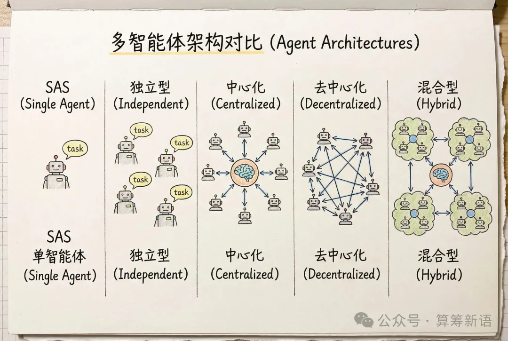

### 6.2 Agent架构设计原则

（在将这个给面试官之前，你可以直接说你是看了Google 《Towards a Science of Scaling Agent Systems》来总结的，也能体现你看论文的能力，而且你这个回答由google背书，足够经典）

我参考了Google 在25年12月发布的《Towards a Science of Scaling Agent Systems》论文，结合这一论文来回答这一问题。

谷歌的这篇论文的**核心思想**，不同架构下Agent性能受到 ： **Agent 数量、Agent架构、模型能力、任务属性 &#x20;**&#x5171;同影响，他在不同的场景下，统一了工具，提示词和预算，配置了180种对照模型，用一组可量化的协调指标 - 效率，开销，错误放大，冗余 - 创造了一个跨任务可泛化的预测指标，通过这个方法和我们可以从 数据的角度，量化衡量和选择使用不同模型Agent性能的好坏。


抛开数据和推导，这项实验得出的原则Agent架构的设计原则是：

**1.首先确认多Agent/单Agent架构**

多Agent 不是一定比单Agent好。特别是在:

1.**强顺序**，长推理链，一步错，步步错的情况下。

2.**单体Agent能力已经比较强**，论文指出单体基线收益（>=45%时)

3.**工具密集且预算固定时**（因为引入多Agent，会协调税，增加沟通成本，吞噬有效Token）

倾向于使用单Agent，盲目引入多Agent 架构反而会导致性能下降。


**2.如果使用多Agent架构，根据特点和场景进行有效选择**

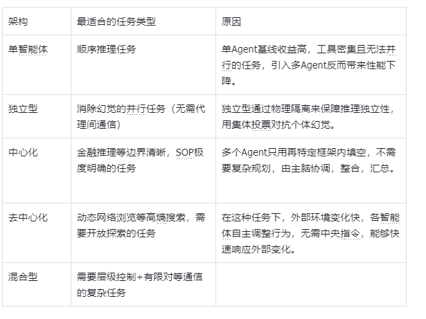


### 6.3 单Agent和多Agent的对比

（如果你对这个知识点理解深入了，你发现下面的答案很多的点，你都知道为什么，可以深入解释，比如Agent适用的顺序调用，工具密集和单Agent基线收益较高的情况，比如选择错误架构方法误差的问题，这些都是我们上面看的论文和参考资料所写的，希望大家不光知道答案，还知道为什么，经得起和面试官深入交流里面的细节）

单Agent系统指的整个系统的决策和上下文都使用一个智能体，多Agent系统指的是系统由多个智能体通过分工和并行来完成。&#x20;

单Agent的优势在于**不需要承担Agent之间的协调**，通信开销和拓扑带来的误差传播，在**顺序调用，工具密集，单Agent的基线收益已经较高**（达到45%的时候）使用单Agent效果会更好，盲目使用多Agent架构反而会性能下降。

多Agent的优势在于在复杂的任务中，特别是**需要分工和并行**的问题上，可以突破单Agent的**能力边界，提高效率和鲁棒性**，但是我们也需要注意在不同的任务系统中，需要选择合适的多Agent 的架构，**错误选择架构可能也会显著放大误差**，降低收益。


**快速测试：**

通过本章学习/论文，请你自测你能否回答清楚以下几个问题：

1.Multi-agent 有哪些架构，他们有什么特点？

2.MAS （独立多体）型架构，为什么会放大错误？如何避免？

3.如何设计一个Agent架构？你是拍脑袋想的吗？

4.中心化架构中，过度于依赖中心Agent，会有什么弊端，怎么避免？

5.哪些场景更适合单Agent，为什么？

6.这篇论文中提到了不同场景：金融分析，网页导航，工作流，游戏规划，他们分别适用于什么架构，为什么？你能不能举一反三，在你的项目场景下，用什么架构最合适？为什么？


### **6.4 Agent之间通信和状态管理**

（这个知识点不是上面提到的论文中的内容，但是这个点和多Agent相关，有了多Agent同样要知道的它们之间是如何交互的，以及传递什么信息？虽然不算特别高频考点，但是也是被问到过的，需要准备。）

**常见的Agent的通信模式：**

**1.通信模式：**&#x5E38;见的两种通讯模式是通过移交（handoffs）和工具调用

* **移交：**&#x4E00;个智能体将其执行上下文和执行权传递给另一个智能体。

* **工具调用：**&#x4E00;个智能体（如主管）将另一个智能体作为工具进行调用。

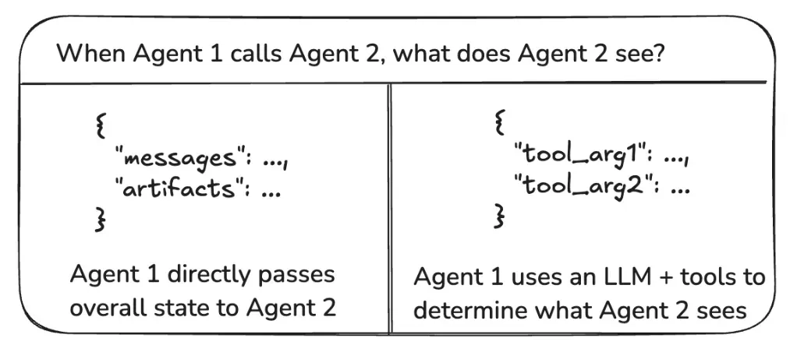

移交更适用于自主协作的场景，而工具调用则提供了更明确的层级控制和接口约束。


**2.消息传递内容：**&#x41;gent与Agent之间应该传递所有的消息还是部分消息，需要根据具体的业务场景权衡。

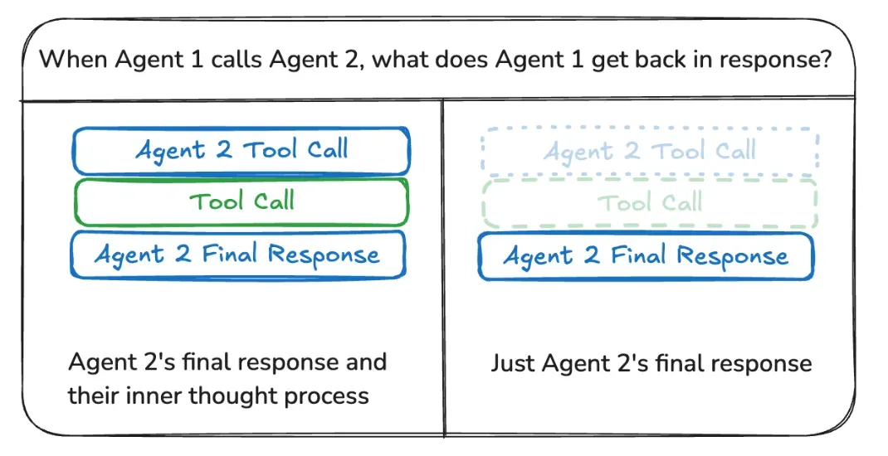

* **共享完整推理数据：**&#x667A;能体将其所有中间步骤（如链式思考、工具调用）写入共享通道。相当于提供了一个共享区，用于其他智能体理解其推理过程，可以提升系统的整体协作与推理能力。但是这种方式的缺点是会导致状态空间快速膨胀，给上下文窗口和内存管理带来挑战。

* **仅共享最终结果：**&#x667A;能体在私有空间内完成其计算，仅将最终结果写入到共享区。它能有效控制状态的复杂度，实现此策略需要为每个智能体定义独立的状态模式。


**快速测试：**&#x5982;果Agent之间通信，某些东西不想给另一个Agent看到，应该怎么做？（面试原题）

（这题就是常见的Agent消息传递方法对吧，上面的仅共享最终结果，就是用来应对这个问题的）


### 6.5 Agent架构设计实战

（这个小节，我从**参考论文的例子**以及**面试真题**中抽取出来几个典型的例子和问题，帮助大家来掌握Agent架构设计相关的内容。现在很多面试都会考察一个小型的场景下的Agent架构设计题目，我会持续将架构设计相关内容汇总于此，这样大家复习更加方便。

在我整理了几个例子后，某种程度上，我觉得这个问题其实可以套模板，大家看一下是不是，如果你认为你的任务应该用去中心化架构，你就参考这个6.5.1,对于架构的好处，通信方式都可以复用，唯一不同的是Agent的设计和功能。）

#### 6.5.1 动态网络浏览问题

（此例子截取自论文）

**问题描述**：我们需要通过网络搜索，找到 **某公司2024年可以持续发展报告中关于碳排放的问题**，请你针对这个问题设计一个Agent架构。

**架构设计：**

因为网页导航是**高熵，路径不唯一**的场景。 不同的来源（官网，媒体，报告）可以被并行搜索更快覆盖。在这种场景下，我会使用去中心化架构设计整个系统，使用去**中心化架构既能够提升并行速度**，可以**减少中心调度的串行瓶颈。**

具体来讲，整个系统各个Agent是平级的，他们自主并行探索。系统里面使用**事件总线/共享黑板**的方式，所有Agent订阅相关话题，他们可以**发布任务，认领任务，提供帮助，提交答案，**&#x6765;实现点对点的协作。

具体来讲，系统里有：

&#x20;任务规划Agent，将用户目标拆分成子任务后，发布任务。

&#x20;然后官网探索Agent， 媒体报告等Agent认领任务后，各自探索，调用工具汇总任务，直到达到标准然后会提交任务，交给验收Agent验收。

验收Agent验证通过后，交付给汇总机器人汇总信息，如果汇总Agent认为目标达成，及时发布停止信息，终止流程进行交付。


#### 6.5.2 金融推理任务

（此例子截取自论文）

**任务描述：**&#x8BBE;计一个分析某个上市公司的估值的Agent。

**架构设计：**&#x91D1;融估值的**流程通常比较规范**，天然具有**分而治之**的特点，多个子**问题之间相对独立，可以并行。**&#x8FD9;种情况下我会使用**中心化**架构设计整个系统：由一个Orchestrator（中心指挥官）统一拆解，分派和收敛，降低并发协作带来的协调成本和不一致风险，**确保各步骤按既定顺序和策略并发执行。**

具体来讲：

我会先设计一个主管Agent, 他将任务分解成**多个阶段，设计并行窗口，验收，**&#x5C06;任务下发给子Agent去并行完成。

主管Agent下设置多个子Agent，比如**收集官网信息Agent, 收集市场监管信息Agent，收集友商信息做对比的Agent。**

整个过程由主管Agent负责验收，当Orchestrator验收通过，下发停止信号中止整个流程并交付。


#### 6.5.3 中心Agent架构子Agent膨胀问题

在小红书一面中面试官对中心架构下子Agent膨胀问题进行了探讨，这里只做问题汇总，具体内容请转到面试实战，小红书一面


#### 6.5.4 时空冲突检测任务

（选自真题：夸克千问架构设计题目，我就准备直接套用6.5.2的模板）

**任务描述：**&#x8BBE;计一个Agent系统，让它完成当用户创建一个行程后，判断这个行程是否和其它冲突，如果有冲突，给出重新规划的建议。

**架构设计：**&#x884C;程冲突检测 和 规划本质是约束满足 + 顺序调整，**流程比较规范，**&#x9700;要考虑**时间窗口，地点，偏好等特点，**&#x8FD9;些因素也相对独立，可以并行。 这种情况下我会使用**中心化&#x20;**&#x67B6;构设计整个系统，由一个Orchestrator统一拆解，分派和收敛，降低并发协作带来的协调成本和不一致风险，**确保个步骤按既定顺序执行也能够并发。**

具体来讲：我会先设计一个Agent作为总指挥，根据当前阶段来分配下发任务，控制并发窗口，验收，和控制中止。

然后我会设计多个子Agent。 比如行程Agent：负责整理相关的行程，和行程时间相关的数据。 地点Agent：评估各个行程地点相关Agent的 通行时间等，冲突检测Agent, 用户喜好分析Agent 和 生成重新规划的Agent。 他们之间在某些阶段可以并行，某型阶段是串行，由主管Agent统筹规划和管理。


## 7. 大模型参数设置

（这个知识点其实面试官主动考察的并不多，目前只有平安证券的一面面试官问到了，你有没有对模型做一些参数的调整，怎么设置的penalty， temperature. 目前没有其它面试官问到。所以总体来说，这不是一个特别常考的考点。 从面试角度，可以适当放低学习优先级。另外其实如果你学好了本章，其实在一些和面试官讨论的过程，讨论一些发散性的知识的时候，很常用被用到。 比如说夸克千问面试官再和你讨论说：如何避免一些极端情况的输出呀？那这个时候，调整模型参数将会是一个可讨论点。另外从实战角度，其实在你的项目中，去调整参数做适配也挺常用的对吧，从这两个角度，也是可以推荐去学一下的）


### 7.1 常见参数和选择策略

<iframe src="https://open.douyin.com/player/video?vid=7534775858423254306&mode=pc" sandbox="allow-scripts allow-same-origin allow-presentation allow-forms allow-popups allow-downloads" allowfullscreen allow="encrypted-media; fullscreen; autoplay" referrerpolicy="strict-origin-when-cross-origin" frameborder="0" style="width: 100%; min-height: 575px; border-radius: 8px;"></iframe>

LLM 推理参数详解表

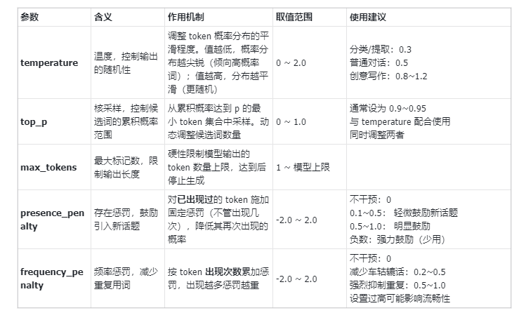

常见场景配置推荐

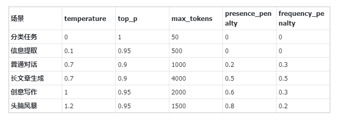

### 7.2 Temperature & Top-p

#### 7.1.1 详细原理

（想深入理解这两个参数的原理，请看这个视频）

<iframe src="https://open.douyin.com/player/video?vid=7578100067626781979&showTab=like&mode=pc" sandbox="allow-scripts allow-same-origin allow-presentation allow-forms allow-popups allow-downloads" allowfullscreen allow="encrypted-media; fullscreen; autoplay" referrerpolicy="strict-origin-when-cross-origin" frameborder="0" style="width: 100%; min-height: 575px; border-radius: 8px;"></iframe>

在大语言模型生成文本时，通常会用到两个参数：**temperature** 和 **top-p**，它们决定了采样的**随机性**和**多样性**。

首先我说一下大模型生成回答的**大致原理**：

模型先为每个候选 token 计算分数（logits），再通过 softmax 转换成概率分布，然后根据这些概率进行加权采样。

在这个过程中：

**temperature** 会在 **softmax 前调整 logits，温度低时分布更尖锐，模型更确定，输出更保守；温度高时分布更平滑，增加随机性，输出更有创意**。

**top-p** 则通过“核采样”限制采样范围，只在累计概率达到 p 的最小集合中选择 token，p 越小越集中，p 越大越多样。

简单来说，**temperature 控制概率分布的陡峭度，影响确定性；top-p 控制采样范围，平衡质量与多样性，两者结合决定生成结果的稳定性与创造性。**


#### 7.1.2 不同参数组合情况

(进一步补充，以防面试官追问）

**temperature 低 + top-p 小**

* **效果**：输出非常稳定、保守，几乎总是选择概率最高的 token。

* **特点**：答案更确定、更接近训练数据，适合需要精确、严谨的场景（如代码生成、事实问答）。

* **缺点**：缺乏创造性，容易重复。

***

**temperature 高 + top-p 大**

* **效果**：输出非常多样化，随机性强，可能出现意料之外的表达。

* **特点**：适合创意写作、头脑风暴，能生成新颖内容。

* **缺点**：连贯性和逻辑性可能下降，甚至出现不相关或错误内容。

***

**temperature 低 + top-p 大**

* **效果**：整体仍偏稳定，但允许更多候选 token，输出稍微丰富。

* **特点**：在保持连贯的同时，增加一点灵活性，适合对话或内容生成。

* **缺点**：仍然不够有创意。

***

**temperature 高 + top-p 小**

* **效果**：在有限候选集中引入较强随机性，输出有一定变化但不会太离谱。

* **特点**：适合需要一定创造性但又不能完全失控的场景，比如营销文案。

* **缺点**：可能出现轻微逻辑跳跃。


### 7.3 你的项目是如何设置参数的？

（这个是真实地面试问题了，平安证券1面问的。大家根据答案也想想自己的项目应该如何回答）

我的项目中，总体是一个分析型的任务。核心需求是稳定，准确。总体设置的温度较低，在0.1\~0.3，然后Top\_p保持默认，让模型在合理参数选择，不用太多调整。惩罚因子设置较低的值，因为形成建议可能会多次提到相同的地点，时间。所以惩罚因子设置在0.1左右。

##

## 8 A2A

（根据最新面试情况，A2A协议的概念，A2A 考的没有MCP那么多，没有那么热，但是还是偶尔会问到。暂时问的不深，我们先记一下概念）

A2A（Agent-to-Agent）协议的核心目标是**让不同智能体之间能够互操作和协作**，即使它们来自不同厂商、框架或运行环境。下面是一个简洁介绍：

***

**A2A 协议的关键特点**

1. **互操作性**

   * 通过标准化的消息格式和通信机制，让不同 Agent 可以发现彼此并交换任务或信息。

   * 常用技术：JSON-RPC、HTTP、SSE 等。

2. **Agent 卡片（描述元数据）**

   * 每个 Agent通过“卡片”描述自己的能力、接口、身份和安全策略，方便其他 Agent发现和调用。

3. **长时协作与异步交互**

   * 支持多轮对话、任务委派、进度更新、流式响应，适合复杂场景（如旅行规划、企业流程自动化）。

4. **内部实现不透明**

   * 调用方只知道对方是一个 Agent，不关心它内部用什么模型或工具，保证封装性。

***

**适用场景**

* **跨团队或跨厂商的 Agent 协作**：例如客服 Agent 与账单 Agent协作处理用户请求。

* **复杂任务编排**：多个专长 Agent分工完成一个大任务（如行程规划、供应链优化）。

* **生态互通**：构建开放的 Agent 网络，而不是单一厂商闭环。


## 9. 如何减少Agent的幻觉问题？

**（先谈一下幻觉的本质和产生原因，让面试官觉得你知道幻觉产生的底层原理，在根据这个产生原因来谈解决方案**）

幻觉这个问题核心的**产生原因**还是**因为模型并不理解事实，只是根据预训练数据预测最可能生成的单词序列**。所以在某些低置信度场景，他会生成一个编造的事实，所以我可以通过：

1.**使用RAG技术**：将Agent的回答和外部的知识库或搜索引擎结合，确保生成内容有真实依据。

2.**可以使用RLHF/DPO进行人类反馈微调**：使用人类标注的反馈数据训练模型，减少幻觉倾向。这个方法的原理，模型被显示处理低置信度的输出，并用预定义的回答来应对，而不是生成一个编造的事实。

3\. **使用一些提示词技巧让Agent多轮验证并对答案反思**，比如使用Chain-of-though + self ask模式，这个核心原理是让LLM 在推理过程分配更多的计算资源，允许LLM更多的处理时间和步骤来处理查询并生成响应，通常能显著**提升准确性，连贯性和稳健性，**&#x51CF;少幻觉的发生。

4.可以使用**融合模型**或者**投票机制**：让多个模型或者Agent协同工作，通过投票或者加权减少单一模型出现的幻觉。


## 10 Openclaw

（写于2026年3月份）OpenClaw一定是一个必考的问题，大模型应用岗位，产品岗，必须得会。原因很简单，我想先和大家讲清楚这里面的底层逻辑，为什么会考。 因为他是目前最热门的AI Agent产品了。在这个大模型高速发展的时代，热门的东西一定是要了解会考察的。 有人说2025年是Agent年，从2025发展到到现在，Agent的形式在不断演进。火爆出圈的Agent从去年的Manus到今年的Openclaw, 它是整个行业发展的风向标。 我回想去年（2025年）面试的时候，很多面试官问我Manus是什么，我说不知道，当时觉得没啥，现在觉得很掉分。对于行业爆品，一定要掌握，是高频考点。网上很多视频基本都是讲的Openclaw如何配置，有什么能力。相关视频太多了，在本章我会给大家推荐2个我自己看的部署，玩openclaw的视频，感兴趣可以去玩。 但是本章更侧重的是Openclaw的原理，技术，为什么出圈。讲的人不多，但是作为开发，或者产品，从面试的角度，你无疑是要掌握这个产品里面包含的核心技术的，本节就从功能，技术层面来讲解Openclaw, 相信他一定是你准备面试必不可少的素材。学了本章，你可以在面试的时候和面试官说你看过Openclaw的源码（其实也有必要看，作为Agent开源项目），Manus其实也可以去学习，因为他也是很火的Agent，而且和Openclaw 侧重点是不同的。可以当作课外作业大家自己去学一下。


### **10.1 OpenClaw是什么**

（一定会问的问题，一般面试官引入一个问题都是先问你概念，所以精心准备一个表达流畅的回答是非常必要的）

&#x20;OpenClaw 是一个开源的、可自托管的**个人 AI 助手平台**。

* 核心用 TypeScript (ESM) 编写，运行在 Node.js 22+ 上

* 通过 `npm install -g openclaw` 安装，`openclaw` CLI 是主要入口

* 所有数据和密钥都存在本地（`~/.openclaw/`），不经过任何云中转

总结来说，**它是一个事件驱动的 Agent 执行引擎，前面放了一个多渠道网关。**


### 10.2 Openclaw 架构

（这节很核心哈，我结合这个架构图，然后把各个模块功能都讲清楚，你学明白了其实你就知道了它到底是个啥东西，为啥看上去很神奇很主动？Openclaw神秘的面纱就揭开了）

简单来讲，OpenClaw 的架构为**触发、网关、Agent 三层**：

* **触发层**负责产生事件 — 五种来源（消息、心跳、定时任务、钩子、Webhook）不断向系统注入事件

* **网关层**负责接入和路由 — 把不同协议的事件统一收进来，认证后分发到正确的 Agent 会话

* **Agent 层**负责智能执行 — 推理（Think）、调工具（Act）、记忆（Remember）

三层的本质是一个**事件驱动的执行管道**：事件产生 → 网关路由 → Agent 消费执行 → 状态持久化 → 等待下一个事件。这是一个永不停止的循环。

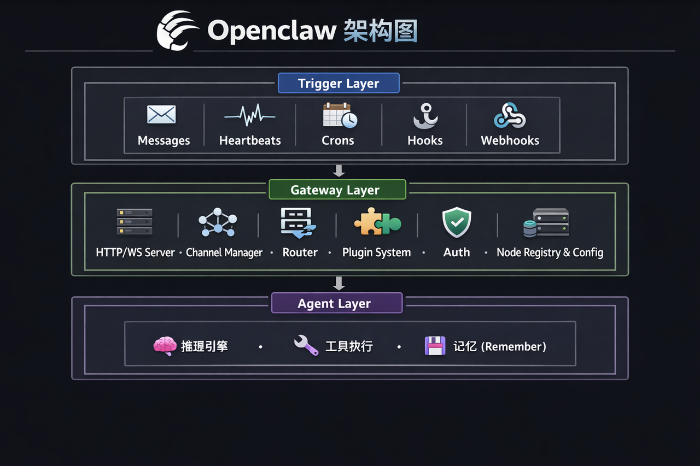


#### **10.2.1  触发层 - 5层信号源**

Agent 不是只在用户发消息时才工作。OpenClaw 有**五种独立的触发维度**，每一种都能唤醒 Agent 执行：

通过上述图片，我们知道它触发的方式很多，我们通常给他发消息其实只是一种（Message）。不过Message可以触发的方式也很多：通过CLI，通过应用（feishu,telegram), 包括Openclaw的dashboard。 所以其实看上去openclaw好像一直在思考，很主动，其实不过是有记忆功能加上 自动的触发源罢了。（最后我会举例说明）

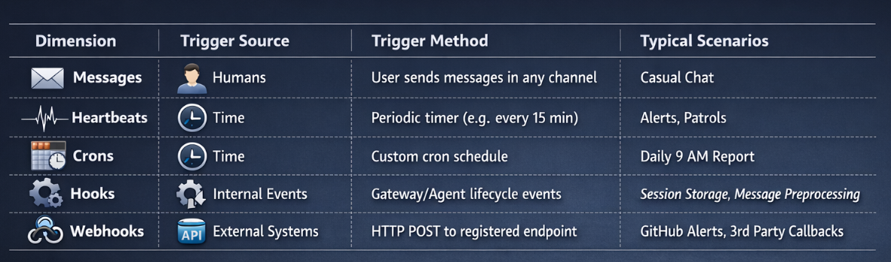


#### **10.2.2 网关 - 大名鼎鼎的Gateway**

Gateway 是一个**本地长驻 Node.js 进程**，监听端口 `:18789`（HTTP + WebSocket），是触发层和 Agent 层之间的**中间件**。

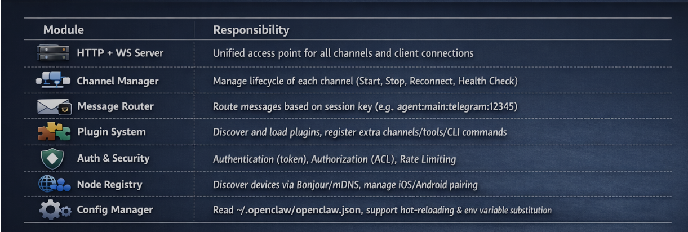

**Gateway 的核心职责：连接管理、协议转换、路由分发、安全控制。**

**关键边界：Gateway 不做推理，不调 LLM，不执行工具。** 它只负责"消息到了该给谁"和"回复该送回哪里"。

#### 10.2.3 Agent层&#x20;

这层就是咱们熟悉的Agent的知识啦。React, LLM 的调用，Function Call, Memory都在这里啦\~都是我们学过的知识啦\~\~。

##### 10.2.3.1 推理 (think)

Agent 的核心是 **Pi Embedded Agent**，一个多轮推理循环。它收到消息后开始思考，决定是直接回复还是需要调用工具获取更多信息，调完工具拿到结果后继续思考，如此循环直到生成最终回复。

推理过程中需要调用 LLM。LLM 调用是从本地 Gateway 进程直接发往模型提供商 API 的（OpenAI、Anthropic、Gemini、Ollama 等），不经过 OpenClaw 的任何云服务。如果用 Ollama 等本地模型，整个流程甚至完全不出你的局域网。

**Auth Profiles** 管理多套 API 凭证，支持轮换和 failover——一个 key 被限速了会自动切到下一个。**Session Manager** 维护多轮对话的上下文，当历史过长时自动压缩（compact），管理 token 预算。

##### 10.2.3.2 工具执行 (Act)

Agent 推理时可以自主决定调用工具。内置的核心工具包括：

* **exec** — 执行 Shell 命令，有 allowlist 安全策略控制哪些命令可以运行

* **browser** — 通过 CDP 协议控制 Chromium 浏览器，可以浏览网页、截图、操作页面

* **message** — 向任意渠道发送消息，实现跨渠道通信

* **nodes** — 远程调用已配对的 iOS/Android 设备上的能力

* **subagents** — 启动子 Agent 并行处理复杂任务

* **apply\_patch** — 修改代码文件

除了内置工具，插件也可以通过 `registerTool` 注册额外的工具，能力可以无限扩展。

##### 10.2.3.3 记忆(Memory)

记忆是 Agent 主动调用的，不是每次对话都自动塞入上下文（那样会浪费 token）。Agent 自己判断"需不需要回忆过去的信息"，然后调用 `memory_search` 工具进行混合检索——70% 权重给向量语义搜索，30% 权重给 BM25 关键词搜索（**哇，这不是我们比例的RAG项目的稀疏向量和稠密向量双路检索吗\~**）。找到相关结果后，再通过 `memory_get` 读取完整的记忆内容。

底层存储是一个 SQLite 数据库，同时维护向量 embedding 索引和全文索引。记忆的原始数据是 Markdown 文件（MEMORY.md 以及自动生成的会话摘要文件）。

记忆的写入有两种方式。第一种是自动捕获：当会话结束时（用户输入 `/new` 或 `/reset`），hook 会自动把最近的对话保存为 `memory/YYYY-MM-DD-slug.md` 文件。第二种是文件同步：用户手动编辑 MEMORY.md 或 memory 目录下的文件，chokidar 文件监听器检测到变化后，自动进行分块、计算 embedding、写入索引库。


#### 10.2.4 总结&举例

朋友们，所以你看，Openclaw其实也没有什么特别大不了的对吗？比如Agent模块，我们的描述并不复杂，没有用什么深奥的技术。如果你看完了我这个笔记Agent，我相信你很容易理解，所以OpenClaw本什么也没啥大不了的对吧。我在这一节再给大家用实际例子来讲解，其实他就是这么回事\~.

**先总结**，OpenClaw的本质是**事件驱动模型**，看起来主动是有定时任务以及间隔触发，看起来能记事是因为有记忆，采用双路检索。看上去功能强大，可以用应用驱动是因为用了Gateway做适配。快速总结：

Time    → Heartbeats, Crons

Humans   → Messages

External   → Webhooks

Internal   → Hooks → Queue → Agent Executes → State Persists

Agents     → Subagents

**再举例：**&#x4E00;个外国小哥哥使用了Openclaw，然后发帖说他给他的妻子用Openclaw设置了定时发送早上好，结果晚上回去，他发现他的龙虾和妻子从早聊到晚，他的妻子完全不知道对面不是真人。他觉得太amazing了。我们先现在知道，他看上去主动的原因是，因为你设置了定时器，然后还有间隔触发。Agent每次触发，会根据上下文，思考调用工具比如可以打电话，发新闻，图片。所以整体看上去你没和它主动聊天，他也会和你说话甚至会打电话。无非是这么实现的。


### 10.3 Openclaw 记忆

#### 10.3.1 导语

为什么这一小节我认为很重要，给大家先说明原因：

1.**&#x20;首先记忆功能是常考的，甚至必考**，从面试的角度，Agent的记忆是如何实现的，这已经是背烂了的八股对吧，这部分就是这个问题的经典实现，所以你学习这一部分是对这个高频考点的补充，我会将Openclaw的记忆功能融入笔记八股部分，更新我们的回答，让我们的回答结合现在最火的Agent的例子去答，是不是就比干巴巴答概念要更好。

2\. 如果你想玩openclaw的话，**Openclaw为什么总是忘记事情？**&#x5982;果你学了本节，那你自己就能够尝试去解决，你也可以修改里面的记忆文件，手动确定让你的龙虾能记住什么，高效组织你的龙虾记忆。

3\. 我想借助这个机会，学习Openclaw，大家可以理解这个产品的架构是怎么设计的的，记忆模块是怎么组织的。这样的的好处是**建立你的审美**，大家在设计自己的agent的时候，如果你去设计架构，你用上他这个**心跳机制，定时机制&#x20;**&#x800C;不是干巴巴的只有一个用户输入作为触发，你用上它的4层记忆，哪怕你不改，你就去抄它的，是不是也比自己设计的高级一些，所以通过这个学习，也是为我们自己设计Agent项目打基础，站在他们的肩膀上设计你的项目，让面试官觉得你的项目是高级的，有想法，有深度的。


#### 10.3.2 四层记忆架构总览

OpenClaw 的记忆不是一个系统，而是 **四层独立机制** 协同工作，类似计算机的存储层次：

1. **Bootstrap Files**（≈ 硬盘）— Agent 的永久身份与规则，完全免疫 Compaction

2. **Session Transcript**（≈ 文件系统日志）— 完整对话历史存档，旧消息会被压缩为摘要

3. **Context Window**（≈ RAM 内存）— 模型当前能"看到"的所有内容，满了就触发压缩

4. **Retrieval Index**（≈ 搜索引擎）— 语义搜索记忆文件，独立于会话

> **知道哪一层出了问题，就能解决 90% 的"Agent 忘事"问题。**
>
>

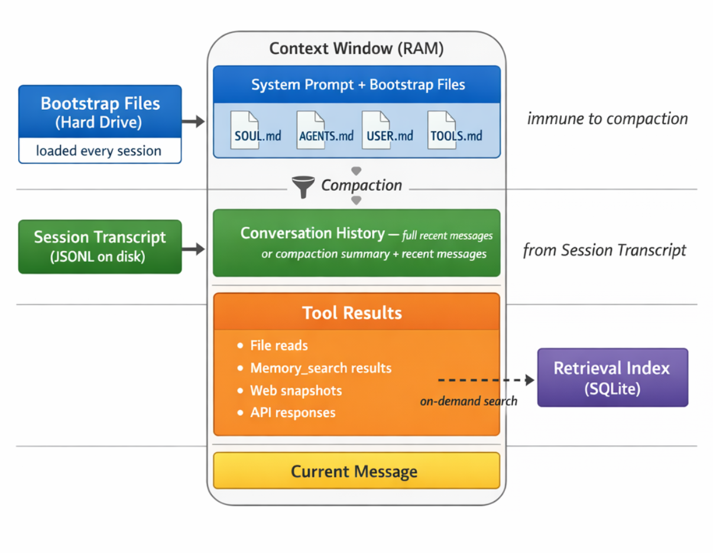

#### 10.3.3 Bootstrap Files（引导文件）

**本质**：工作空间里的 Markdown 文件，每次会话开始时从磁盘读取、注入上下文。

**文件清单**

`SOUL.md` — 人格、语气、边界

`AGENTS.md` — 操作指令、行为规则

`USER.md` — 用户身份信息

`TOOLS.md` — 工具使用说明

`IDENTITY.md` — Agent 名称与风格

`MEMORY.md` — 策展的长期记忆（仅主会话加载）

`HEARTBEAT.md` — 心跳任务清单（可选）

`BOOTSTRAP.md` — 首次运行仪式（一次性）

位置：`~/.openclaw/workspace/`

**关键要点**

**每次会话重新从磁盘读取**，不存在对话历史中 → 免疫 Compaction

**字符限制**：单文件 20,000 字符，总计 150,000 字符，超出会被截断

**子 Agent 只收到** `AGENTS.md`、`SOUL.md`、`TOOLS.md`、`IDENTITY.md`、`USER.md`，拿不到 `MEMORY.md` 和 `HEARTBEAT.md`

用 `/context list` 可查看每个文件的注入状态

**所有 Bootstrap Files 都应尽量精简**——它们每轮都注入上下文，内容越多占用越大。实践中 `SOUL.md` 最容易被写得过长，建议各文件都保持简洁。


#### 10.3.4 Session Transcript（会话记录）

（我觉得这节还是挺重要的，他其实是你怎么组织Agent长短记忆的一些原理。我们做agent的时候都知道把历史对话记录每次拼接，放到下一轮对话。那么窗口满了，如何压缩，压缩保留什么东西，这时要把什么东西存到本地做长期记忆，这些技巧在本节都讲了，面试也是爱问的，建议掌握，要是能面试时候说出来，或者用到你的项目中，都会大大加分）

**本质**：完整对话历史，以 JSONL 文件追加写入磁盘。

**存储位置**

```plain&#x20;text
~/.openclaw/agents/<agentId>/sessions/
├── sessions.json          # 会话元数据
└── <sessionId>.jsonl      # 对话记录（包含消息、工具调用、压缩摘要）
```

**关键要点**

* **每条消息自动追加到 JSONL**，包括用户消息、助手回复、工具调用

* 继续会话时从 JSONL 重建上下文，**跨重启持久**

* 磁盘上的原始记录**始终保留**，但模型只看到上下文窗口中的部分

**Compaction（压缩）详解**

**两种触发方式：**

* **自动触发（Auto-Compaction）**：上下文使用量达到阈值时自动触发。有两种情况：

  * **溢出恢复**：模型返回 context overflow 错误 → 压缩 → 重试

  * **阈值维护**：成功完成一轮后，`contextTokens > contextWindow − reserveTokens` 时触发

* **手动触发**：输入 `/compact`，可带自定义指令如 `/compact 重点保留决策和待办事项`

触发公式：`上下文窗口 − reserveTokensFloor(默认20000) − softThreshold(默认4000)`，200K 模型 → 约 176K 时触发。

**压缩的具体过程:**

1. **划分保留区和压缩区**：最近的 \~20,000 tokens 消息被划为"保留区"，**原封不动保留**，模型看到的就是原文。保留区之前的所有旧消息进入"压缩区"

2. **分割压缩区**：把压缩区的旧消息按 token 数分成若干块（默认分 2 块，自适应调整块大小）

3. **逐块总结**：用模型对每个块生成摘要（调用 `generateSummary`，失败会重试 3 次）

4. **合并摘要**：如果有多个块的摘要，再用模型把它们合并成一个连贯的总摘要

5. **写入 Transcript**：在 JSONL 文件中写入一条 `compaction` 类型的条目，包含摘要文本和 `firstKeptEntryId`（保留区最早消息的 ID）

压缩后模型看到的上下文结构：`[压缩摘要] + [保留区原文（最近 ~20,000 tokens）]`

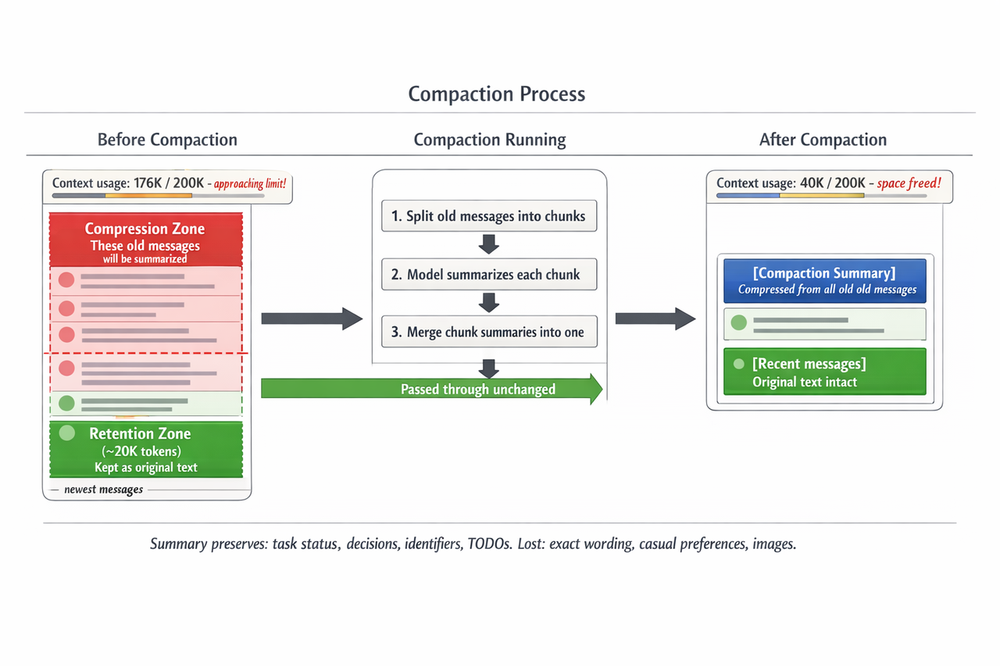

**什么时候触发**

总结过程有明确的指令，**必须保留**：

* 进行中的任务及其状态（进行中、阻塞、待办）

* 批量操作的进度（如"17 项中已完成 5 项"）

* 用户最后请求的内容以及正在做什么

* 已做出的决策及其理由

* TODO、开放问题和约束条件

* 承诺的后续行动

默认还会**完整保留所有不透明标识符**（UUID、哈希、ID、token、API key、主机名、IP、端口、URL、文件名），不缩写不重构。这由 `identifierPolicy: "strict"` 控制。


**Pre-Compaction Memory Flush**

压缩前 OpenClaw 会静默运行一轮，提醒 Agent 把重要内容写入 `memory/YYYY-MM-DD.md`，用户不可见（`NO_REPLY`）。每个压缩周期只触发一次。

> ⚠️ **聊天中说的指令不会自动保存到文件**——不写入文件就会被压缩丢掉。这是最常见的"Agent 失忆"原因。
>
>


#### 10.3.5 Context Window（上下文窗口）

**本质**：固定大小的 token 容器，大小由模型决定（如 Claude 200K、GPT-4 128K、Gemini Pro 1M），模型每轮推理时所有信息都要挤进来。

**关键要点**

* **每轮竞争空间的内容**：系统提示 + Bootstrap Files + 对话历史 + 工具调用结果（包括 `memory_search`/`memory_get` 检索到的记忆片段） + 当前消息

* **最大的 token 消耗者是工具结果**（文件读取、检索结果、网页快照、API 响应）

* Bootstrap Files 每轮都占空间，所以要尽量精简

* **满了就触发 Compaction**，旧对话被压缩

* 用 `/status` 监控使用量，建议在 75–80% 时手动压缩


#### **10.3.6 Retrieval Index（检索索引）**

**本质**：为记忆文件建立的搜索索引，Agent 通过工具按需检索，不用把所有记忆都塞进上下文。

索引范围

* `MEMORY.md` + `memory/**/*.md`（默认）

* 可通过 `memorySearch.extraPaths` 添加额外路径（如 Obsidian 笔记库）

* 存储在 `~/.openclaw/memory/<agentId>.sqlite`

检索工具与触发方式

OpenClaw 提供两个记忆工具：

* `memory_search` — 语义搜索，返回相关片段（文件路径 + 行号 + 分数）

* `memory_get` — 按路径读取指定记忆文件的具体内容

**检索不是每次对话自动触发的**。`memory_search` 是一个工具，由模型自己判断是否需要调用。系统提示中会指导模型"在回答关于过去的决策、日期、人物、偏好、待办等问题前，先调用 `memory_search`"，但最终是模型自行决定何时搜索、用什么关键词搜索。简单闲聊不会触发检索。

工作流是两步走：先 `memory_search` 找到相关片段 → 再 `memory_get` 读取完整上下文。

混合搜索

同时使用向量语义匹配（擅长同义词）+ BM25 关键词匹配（擅长精确 ID/代码符号），加权合并：

```plain&#x20;text
finalScore = 0.7 × vectorScore + 0.3 × textScore
```

关键要点

* **只索引文件**——聊天中说过但没写入文件的内容搜不到

* 文件变动后自动重新索引（去抖 1.5 秒）

* 支持 MMR 去重（过滤近似重复结果）和时间衰减（默认半衰期 30 天，新笔记排名更高）

* 常青文件（`MEMORY.md`、非日期命名的 `memory/*.md`）不受时间衰减影响

* **反复引用的重要知识**建议直接放在 `memory/` 目录下按主题组织（如 `memory/trading-system/`），而不是只存在外部

### 10.4 安全风险

OpenClaw 之所以强大，是因为它深度接入了你的系统——它可以运行 Shell 命令、读写文件、执行脚本、控制浏览器。但 access 是一把双刃剑：同样的能力让它能帮你干活，也让它成为潜在的攻击面。

风险有多大

Cisco 的安全团队分析了 OpenClaw 的生态系统，发现 **26% 的可用 skill 包含至少一种安全漏洞**。他们称之为 "security nightmare"。主要风险包括：

* **Prompt Injection（提示词注入）**— 攻击者可以在邮件、文档、网页中嵌入恶意指令。当 Agent 读取这些内容时，可能被诱导执行非预期操作（比如泄露数据、发送消息、执行命令）。这是当前 AI Agent 最普遍且最难防御的攻击向量。

* **恶意 Skill / 插件** — Marketplace 上的第三方 skill 可能包含恶意代码。安装一个 skill 等于授予它 Agent 的全部能力——Shell 执行、文件访问、网络请求。一个看似无害的 "天气查询" skill 可能在后台做任何事。

* **凭证泄露（Credential Exposure）**— Agent 运行在你的机器上，可以访问环境变量、配置文件、SSH key、API token 等。如果 Agent 的行为被 prompt injection 劫持，这些凭证可能被外泄。

* **命令误解（Command Misinterpretation）**— Agent 可能误解你的意图，执行了你不想要的操作。比如你说"清理一下这个目录"，Agent 可能删掉你没打算删的文件。Shell 命令是不可逆的，`rm -rf` 不会问你确认。

官方怎么说

OpenClaw 的官方文档也承认**没有完美的安全 setup**。他们建议：

* **使用隔离账号（isolated accounts）**— 不要用你的主账号运行 OpenClaw，创建一个权限受限的专用账号

* **使用次要设备（secondary machine）**— 最好在一台非关键机器上运行，而不是你的主力工作机

* **限制 skill 数量** — 只安装你确实需要的 skill，减少攻击面

* **监控日志（monitor logs）**— 定期检查 Agent 的执行日志，了解它做了什么

本质矛盾

这是所有 AI Agent 平台面临的根本矛盾：**能力越强，风险越大。** OpenClaw 的价值在于它能深度操作你的系统，但这也正是它的风险所在。它不像一个沙箱里的聊天机器人——它拥有真实的系统权限，运行真实的命令，访问真实的文件。任何一次 prompt injection、一个恶意插件、一次命令误解，都可能造成真实的后果。

### 10.5 面试问题

吸收了上面的问题，我觉得你可以足够应付大部分的openclaw面试问题。这一小节快速总结上述知识，给出标准面试参考答案，毕竟面试时不可能啰里吧嗦说的一堆。用这些面试问题检验自己吧\~

**Q1: OpenClaw 是什么？**

OpenClaw 是一个开源的、可自托管的个人 AI 助手平台。本质上是一个事件驱动的 Agent 执行引擎，前面放了一个多渠道网关。用 TypeScript 编写，运行在你自己的机器上，所有数据和密钥不离开本地。


**Q2: OpenClaw 的架构是什么？**

三层架构：触发层、网关层、Agent 层。触发层有五种事件源（Messages、Heartbeats、Crons、Hooks、Webhooks）不断产生事件；网关层负责协议转换、认证和路由分发；Agent 层负责推理（Think）、工具执行（Act）和记忆（Remember）。本质是一个事件驱动的执行管道：事件产生 → 网关路由 → Agent 执行 → 状态持久化。


**Q3: Gateway 是什么？它的作用是什么？**

Gateway 是一个本地长驻的 Node.js 进程，监听单一端口（默认 18789），同时提供 HTTP 和 WebSocket。它是触发层和 Agent 层之间的中间件，负责渠道连接管理、协议转换、会话路由、认证鉴权、插件加载和设备配对。关键边界是：Gateway 不做推理、不调 LLM、不执行工具，只负责"消息到了该给谁"和"回复该送回哪里"。


**Q4: 有哪些消息源/触发源？**

五种：

1. **Messages** — 用户通过聊天渠道发消息，事件驱动

2. **Heartbeats** — 固定间隔定时器（如每 15 分钟），让 Agent 主动唤醒

3. **Crons** — 用户定义的计划任务（cron 表达式），执行具体的定时工作

4. **Hooks** — Gateway/Agent 内部生命周期事件触发的回调

5. **Webhooks** — 外部系统通过 HTTP POST 触发

加上 Agents 可以派生 Subagents，形成递归执行。


**Q5: 为什么能接入各个平台？**

因为 Gateway 层的 Channel Manager 把每个渠道封装为一个独立的 Channel Plugin，每个插件实现统一的接口（ChannelGatewayAdapter、ChannelMessagingAdapter、ChannelOutboundAdapter）。不同渠道的协议差异（Telegram Bot API、Discord WebSocket、WhatsApp Baileys 等）被封装在各自插件内部，对上层 Agent 暴露一致的消息接口。加一个新渠道只需写一个 Channel Plugin，Agent 代码零改动。目前支持 20+ 个渠道。


**Q6: 记忆能力是如何实现的（或者说是长期记忆，注意和后面的记忆系统区分开）？**

记忆是 Agent 主动调用的工具，不是自动注入 prompt。Agent 通过 `memory_search` 工具进行混合检索（70% 向量语义搜索 + 30% BM25 关键词搜索），再通过 `memory_get` 读取完整内容。底层是 SQLite 数据库，同时维护向量 embedding 索引和全文索引。记忆写入有两种方式：会话结束时自动捕获为 Markdown 文件，以及用户手动编辑记忆文件后通过文件监听增量索引。


**Q7: 相比传统 AI 聊天机器人，OpenClaw 的优势在哪？**

四个核心差异：

1. **不止聊天，能做事** — 可以执行 Shell 命令、控制浏览器、修改文件、远程操作设备，是一个真正的 Agent

2. **不止等消息** — 五种触发源让它能定时唤醒、自主行动，而不是只等用户说话

3. **隐私自主** — 本地部署，LLM API 直连，数据不经过第三方服务

4. **渠道统一** — 一个 Agent 同时服务所有聊天平台，而不是每个平台各建一个 bot


**Q8: OpenClaw 有什么优缺点？**

优点：

* 开源自托管，隐私可控，数据不离开本地

* 支持 20+ 渠道，一个 Agent 统一服务

* 插件化架构，核心精简，能力可无限扩展

* 五种触发源，能主动行动而非只是被动回复

* 支持多模型 provider，可灵活切换和 failover

缺点/风险：

* 深度系统权限带来安全风险——Cisco 分析发现 26% 的可用 skill 包含漏洞

* Prompt injection 攻击可能通过邮件/文档劫持 Agent 行为

* 第三方插件可能包含恶意代码

* 命令误解可能导致不可逆操作（如误删文件）

* 官方也承认没有完美的安全 setup，建议用隔离账号和次要设备运行


**Q10 : 当对话超出上下文限制时，OpenClaw 的压缩策略是什么？**

A:OpenClaw 采用的是**分阶段摘要式压缩**。当上下文 token 用量接近模型窗口上限时会自动触发，用户也可以通过 `/compact` 命令手动触发。

具体过程是这样的：首先把对话历史分成**两部分**——最**近大约 20,000 tokens 的消息作为"保留区"原封不动地留下来，更早的旧消息进入"压缩区**"。然后把压缩区的内容按 token 数切成若干块，默认是 2 块，块大小会根据消息平均长度自适应调整，同时预留 20% 的安全裕量防止 token 估算不准。接着用 LLM 对每一块生成结构化摘要，如果有多块就再合并成一份连贯的总结。摘要有严格的保留要求，必须包含进行中的**任务状态**、**用户最后的请求、决策理由、TODO 和约束条件，以及所有不透明标识符比如 UUID、URL、文件路径等，都必须原样保留。**

另外还有一个亮点是**压缩前记忆冲刷机制**：在真正压缩之前，系统会静默触发一轮 agent 回合，提醒模型把重要信息写入记忆文件，这样即使对话被压缩，关键知识也不会丢失。压缩完成后，模型看到的上下文就变成了"压缩摘要加上保留区原文"这样的结构。


**Q11: OpenClaw 如何组织长短期记忆？**

A11:OpenClaw 的记忆分为**短期记忆**和**长期记忆**两部分，各自有不同的存储形式和组织方式。

**短期记忆就是当前会话的对话上下文，包括用户消息、助手回复、工具调用结果这些内容，全部在 Context Window 里以消息列表的形式存在**。它的特点是容量受模型上下文窗口限制，比如 Claude 是 200K tokens，满了之后旧的对话就会被压缩成一段结构化摘要，只保留最近约 20,000 tokens 的原始消息。所以短期记忆本质上是临时的、会被压缩的。

**长期记忆则完全基于磁盘上的 Markdown 文件，分成两种组织方式**。**第一种是 `MEMORY.md`**，这是一个策展式的长期记忆文件，存放的是用户偏好、持久性决策、重要事实这些需要长期保留的内容，由 Agent 主动维护和更新，每次会话启动时注入上下文，不受压缩影响。**第二种是 `memory/YYYY-MM-DD.md`**，按日期组织的追加式日志，存的是当天的运行笔记、阶段性进展、临时但值得回顾的上下文，会话启动时只读入今天和昨天的内容。

长**期记忆还配有一套检索索引机制**。系统会对所有记忆文件建立混合搜索索引，包括**向量语义搜索和 BM25 关键词搜索**，Agent 在需要的时候通过 `memory_search` 工具按需检索，不用把全部历史记忆都塞进上下文里。这样即使记忆文件越积越多，也不会撑爆上下文窗口。

两者之间的衔接靠的是压缩前记忆冲刷：当短期记忆快满需要压缩时，系统会先静默提醒 Agent 把当前对话中重要的内容写入长期记忆文件，然后再做压缩。这就保证了短期记忆中真正有价值的信息能沉淀到长期记忆里，不会因为压缩而彻底丢失。


**Q12: 简述 OpenClaw 的记忆系统原理。**

A12:OpenClaw 的记忆模块并不是单一系统，而是由四层协同机制组成的，可以类比计算机的存储层次。

**第一层是 Bootstrap Files**，相当于硬盘上的固件。包括 SOUL.md、AGENTS.md、USER.md、MEMORY.md 等 Markdown 文件，存放的是 Agent 的人格设定、行为规则、用户身份和策展过的长期知识。它们每次会话启动时都从磁盘重新读取注入上下文，完全免疫压缩，是最稳定的一层记忆。不过有字符上限，单文件 20,000 字符，总计 150,000 字符，所以要保持精简。

**第二层是 Session Transcript**，相当于文件系统日志。完整的对话历史用 JSONL 格式逐条追加写入磁盘，包括用户消息、助手回复、工具调用和压缩摘要。它是跨重启持久的，继续会话时从 JSONL 重建上下文。但模型不是看全部记录，而是只看当前上下文窗口能装下的部分，更早的内容通过压缩变成摘要。

**第三层是 Context Window**，相当于 RAM。就是模型每轮推理时实际能看到的所有内容，包括系统提示、Bootstrap Files、对话历史、工具返回结果都挤在这个固定大小的空间里。容量由模型决定，满了就触发 Compaction。压缩时把最近约 20,000 tokens 原样保留，更早的消息用 LLM 生成结构化摘要替代，摘要里必须保留任务状态、决策理由、TODO 和关键标识符。压缩前还会静默提醒 Agent 把重要信息写入记忆文件，防止信息丢失。

**第四层是 Retrieval Index**，相当于搜索引擎。系统对所有记忆文件建立混合搜索索引，同时使用向量语义搜索和 BM25 关键词搜索，按 7:3 权重融合排序。Agent 通过 memory\_search 和 memory\_get 这两个工具按需检索，不需要把全部记忆都塞进上下文。检索是模型自主决策的，不是每轮自动触发。索引还支持时间衰减和去重，新笔记排名更靠前。

**这四层的协同逻辑是**：Bootstrap Files 提供稳定的身份和规则基座，Session Transcript 保存完整的历史记录，Context Window 管理当前可见的工作记忆并在满时通过压缩保持可用，Retrieval Index 让 Agent 能按需回忆历史而不占用上下文空间。关键设计原则是只有写入磁盘文件的信息才是真正持久的记忆，纯对话中没有持久化的内容压缩后就不可恢复了。

### 10.6 参考资料

首先是OpenClaw的Setup，网上太多啦，我就分享两个我看过的视频，我确实跟着他操作起来的。

&#x20;     微信视频号，博主：小创作：

2026/2/14发布的：《15分钟用Openclaw + GLM5打造国内最强AI助手》 讲了环境配置，以及接入飞书和GLM5模型

2026/2/27发布的:《一个视频让你Openclaw技术瞬间超过90%的人》 ：讲了Openclaw基本必须会的技巧。


然后是技术学习：

推荐直接看我的笔记 + 源码（毕竟openclaw开源嘛），结合代码问问GPT. 但如果你有更强烈的求知欲，给你分享2个讲openclaw技术deep dive的视频（都是国外yutube + 英语的啊, 有语言理解困难的就看我笔记吧，我都总结了）

10多分钟，讲openclaw架构和安全

https://www.youtube.com/watch?v=CAbrRTu5xcw

40多分钟，更全面的openclaw技术细节

https://www.youtube.com/watch?v=vte-fDoZczE

讲Openclaw 4层记忆layer的，不过我笔记都总结了

https://www.youtube.com/watch?v=HM0ATQCHGP0

# 模型微调

（虽然我们的目的是以应用侧入手，不过实际面试下来，微调和推理也会被问到，如果你完全没有经验，面试肯定会吃亏，一般来说SFT:LoRa 以及强化学习，面试官都还挺看重的，希望能你能做过并且可以讲出来）

## 1.  SFT的方案有哪些？

参考《从零构建大模型 – 算法，训练与微调》第5章

从大的方向上可以分为**全量微调**和**部分参数微调**。

**全量微调**是比较传统的方法，对模型所有的参数都进行训练，适应性强，适合复杂任务，但是成本高，计算资源消耗大，容易过拟合。

目前在llm模型领域使用更多的是只需训练部分参数的微调。比如说：

通过在模型结构中**插入新的模块**来实现微调的方法，例如：Adapter tuning, LoRA, QLoRA，他们不改变原始参数，只训练新模块，适用于中大型任务。

通过在**输入前添加可训练的提示**或**前缀来引导模型**的方法，例如Prompt Tuning和 P-Tuning等，他们不改变模型结构，参数极少，适用于轻量任务或快速迭代。

### 1.1 简单介绍Lora技术

Lora原理就像拼图。 整个模型的参数就是一幅完整的拼图，而LoRA微调的目标是只调整几个特定的拼图模块，而不重拼整个模块。

具体来说，LoRA通过低秩分解将大矩阵拆分成两个小矩阵，只微调这两个小矩阵中的参数，不改变整个大的权重矩阵。

这种分解相当于把复杂的工作分配给几个辅助部件来完成，既保持了原模型的稳定性，又能够用较少的参数适应新的任务。

此外，LoRA只需要微调小矩阵中的少量参数，因此减少了计算量和存储需求，适合快速迭代和部署。

&#x20;

### 1.2 **Lora中的常见参数**

**模型参数**

r (秩）：

（概念）控制低秩矩阵的大小，影响训练参数量和模型容器。

（作用）r 越大，模型能学习到更多任务特征，但显存占用也会增加。

（常用范围） 4 \~64，典型配置是r = 16 或 8。简单任务用8，复杂任务用16\~32

alpha(缩放因子）

（概念） 用于缩放LoRA权重的影响。

（作用）调节LoRA插入模块对原始模型的影响速度，通常为r 的 1\~2倍。

（常用范围）16 \~ 128。

target\_modules

（概念）指定在哪些层插入LoRA。

&#x20; (作用）影响训练效率和效果，通常选择注意力层。

**训练参数**

（训练参数放在Lora下似乎不太准确，但是因为问的最多的就是Lora，笔记部分暂时也没涉及别的方法的模型训练，所以我先放在这里）

**learning\_rate（学习率）**

* 控制权重更新速度

* **作用**：太高会导致不收敛，太低训练慢。

* **常用范围**：学习率通常设置在一个较低的范围 （1e-4 \~ 5e-5）。

**batch\_size（批大小）**

* 每次训练处理的样本数。

* **作用**：影响显存占用和训练稳定性。

**epochs（训练轮数）**

* 完整遍历数据集的次数。

* **作用**：轮数太少模型学不够，太多可能过拟合。

* **常用范围**：一般设置在3\~5轮，防止过拟合。


### 1.3 简单介绍Prompt Tuning技术？

Prompt Tuning是一种通过调整输入提示来引导模型更准确地理解任务的微调方式。在Prompt Tuning中，模型的权重保持不变，微调仅设计对输入提示进行优化。通过精心设计Prompt，模型可以在任务上下文中生成更精准的输出，可以提升对特定任务的表现。这种方式不仅高效，还可以适应不同任务，使得大模型不需要大规模微调就能适应新的任务需求。

&#x20;

### 1.4 你是怎么做的微调？

（这也是一个**比较常考**的问题，这个答案也是我参考了一些资料和自己项目总结的一个暂时比较满意的答案）

（首先按照这个4个思路来讲解讲：

（1） 确定目标/做好选型

&#x20;     （2） 数据集的准备

&#x20;     （3） 确定参数，进行微调，部署

&#x20;     （4） 验证和评估

&#x20;  按照这个思路，面试官会觉得你逻辑非常清晰，做法非常规范。 在这个思路下，再添加自己的项目细节。让答案更加丰满，以下以我的项目，按照上述思路进行回答，请大家自己根据实际情况参考。&#x20;

我的答案是根据这个笔记总结的，如果你需要总结自己的答案，强烈建议阅读这个：https://www.xiaohongshu.com/explore/692c36e1000000001b02120e?app\_platform=ios\&app\_version=9.19.5\&share\_from\_user\_hidden=true\&xsec\_source=app\_share\&type=normal\&xsec\_token=CBab5PFDvzdmqER5g7jT9IzuPt7ZOmgeEnLQ3UclYMWIk=\&author\_share=1\&xhsshare=WeixinSession\&shareRedId=ODgyNUdJSk42NzUyOTgwNjczOTdINzlO\&apptime=1772294660\&share\_id=77829c9f62674574b9a7e6de1910ac19

）

我认为做微调是一个非常严谨的，数据驱动的科学实验过程。 在微调的过程中，我们通常有五个步骤：1.确定目标/做好选型。 2.数据集准备。 3. 确定参数，平台，进行微调。 4.验证和评估。


**1.** **首先是确定好目标，做好选型**，比如是否可以通过 提示词工程 或者 RAG 技术来解决，这样成本更低。同时考虑一些硬件是否支持，比如16GB显存，可以使用LoRA 微调，如果是13B模型，可能就要使用QLoRA。在我的系统中，核心目标是将模型压缩，同时保留模型的精度，使用的远端Azure AI Foundry， 训练的是Qwen2.5-7B-Instruct，使用的是LoRA技术。


**2.** **数据集的准备。**&#x9879;目采用**真实用户邮件标注样本**、**GPT-4生成的合成数据**，以及**Enron Email Dataset公开数据**集，共500条样本。在准备好数据后，做了一些文本标准化，敏感信息去除的数据前处理。


**3.确定LoRa的参数， r(秩），alpha 缩放因子 以及一些超参数**，比如**学习率**，**Batch Size**, **训练轮数**，我们的任务比较简单r，就设置较小值8， 相应的的alpha就是r的两倍16.**。&#x20;**&#x4C;oRa只训练部分参数，因此可以稍微设高学习率，这里采用的2^e-4.

除此之外，在训练中密切监测训练集和验证集的损失曲线。如果验证集损失持续上升而训练集损失持续下降，说明可能出现了一些过拟合，可以采取**早停&#x20;**&#x589E;加数据正则化等。 在训练结束后使用Perf库将适配器权重和基础模型合并。


**4.**&#x5BF9;于不同的任务，可以使用不同的评估方法。比如分类任务 可以用：**F1-Score方法**， 文本生成任务可以用：**BLEU/ROUGE。** 通用对话任务，可以使用业内公认的基准比如：**MT-Bench** 来获得一个可以比较的分数。在我的项目中，由于该任务属于**结构化信息提取**任务，需要从自然语言邮件中准确提取并转换为JSON格式的事件信息，采用的是**字段级别F1-Score结合精确匹配**的评估方法。简单来说是采用的是字段级别F1-Score结合精确匹配的评估方法。简单来说即对每个字段（如title、时间、地点）分别计算准确率，既保证整体结构正确，又允许语义相同但表达不同的情况。

## 2.强化学习的方案有哪些？

（先背一下基本概念，实际中考察的并不多，所以不深入学习）

**1. 基于人类偏好的 RL**

* **RLHF（Reinforcement Learning with Human Feedback）**

  * **奖励来源**：人类排序数据 → 奖励模型。

  * **优化方式**：PPO（Proximal Policy Optimization）+ KL Penalty。

  * **目标**：对齐人类偏好、安全和价值观。

  * **代表模型**：ChatGPT、Claude。

**2. 基于 AI 偏好的 RL**

* **RLAIF（Reinforcement Learning with AI Feedback）**

  * **奖励来源**：强大教师模型（如 GPT-4）生成偏好排序。

  * **优化方式**：同 RLHF（PPO）。

  * **目标**：降低人工标注成本。

  * **代表模型**：Anthropic 的 Constitutional AI。

**3. 基于偏好数据的直接优化**

* **DPO（Direct Preference Optimization）**

  * **奖励来源**：偏好数据（人类或 AI）。

  * **优化方式**：直接优化策略，不训练奖励模型。

  * **目标**：简化 RLHF，避免 PPO 的复杂性。

  * **代表模型**：LLaMA-2-Chat、Mistral-Instruct。

## 3.SFT和RLHF的区别是什么？

（问的并不是特别多，作为强化学习的基础知识先准备着）

**目标上的区别**：SFT的目标是让大模型能**有基本的语言能力和执行任务的能力**，RLHF倾向于让大模型的回答更符合**人类偏好**，**安全**和**价值观**。

**方法上的区别**：SFT使用**有监督**的方式训练，数据集的形式是问题-答案。而RLHF采用**强化学习**的方式，**数据集**是包含多个答案，以及**答案的排序**和**奖惩模型**的。

**步骤上的区别**：RLHF通常是在SFT的基础上进行进一步优化的。

&#x20;

&#x20;

## 4.  数据集的准备

（数据集的准备也是面试官很常考的一个问题，我这里这一节3.1介绍了一些常见的数据集的来源，3.2 介绍了对数据进行前处理的方法。请大家根据3.1和3.2 整理出自己的针对于面试官问 "你的项目/LoRa是如何制作数据集的" 这一问题的回答。另外3.3是DeepSeekR1 的训练方法，里面包含了一些数据集制作思路，如果有什么契机你能把这个流程给面试官讲，一定会很加分）

### 4.1 常见的数据集来源

微调领域常见的数据集的来源：

1.内部数据：从一些内部的文档，或者用户使用的数据来去做标注。

2.公开数据：寻找一些已经存在的数据库，比如Hugging Face Datasets，Enron Email Dataset 。

3.人工标注：费时，但是可以得到高精度的定制化数据。

4.数据合成：数据合成，利用大模型去生成。


### 4.2 数据清洗和前处理

1.文本标准化：将文本统一大小写，去除一些特殊字符，html tags之类的。（虽然现在模型可能对大小写理解的很好，但是你统一大小写会降低模型学习难度）

2\. 敏感信息去除：去除一些敏感信息，比如用户的名字，电话号码。（主要是合规性考虑）

3\. 平衡数据：平衡一些数据集类型的占比，特别是分类任务，避免某一类内容过多。

4\. 标签纠正：避免一些数据集矛盾的问题。（比如同一个输入，有的分类成angry,有的分类成frusatrated, 那么选择一个label或者合并种类）

5\. 统一格式：对于不同的微调任务，需要的输入格式可能会不一样。比如分类任务的格式是{Text->Label}, 问答任务的格式是：{Context, Question -> Answer}


### 4.3 DeepSeek R1 训练方法

（参考资料 https://zhuanlan.zhihu.com/p/24621463668，作为一个**拔高知识点**，这个题大概率不是面试官直接问的，但是如果你能够在某个契机能把这个讲出来，就会比较加分。从DeepSeekR1训练方法去理解 整个模型 SFT + 强化学习 + 训练集的准备的整个过程。理解整个过程，可以给面试官讲清楚 训练过程 + 谈谈自己对这套方法的理解。一定会加分。 大概这么吹牛逼： 我看了DeepSeekR1的训练，它的大概的训练步骤是xx(笔记部分训练过程）。通过这篇论文和训练方法，我的启发是（笔记部分训练背后蕴含的思想）xx）

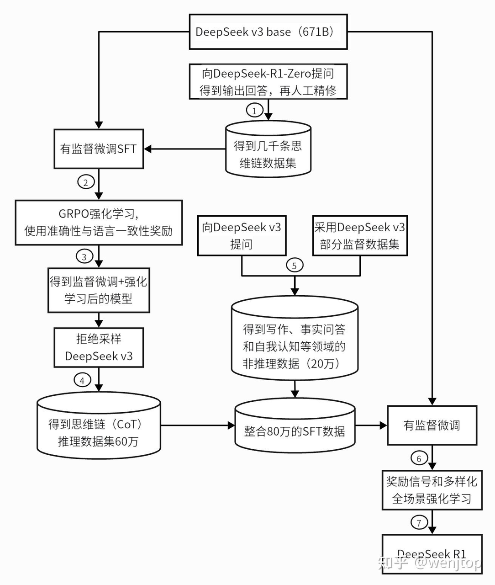

**训练过程：**

1. 通过向DeepSeek-R1-Zero 提问，再通过人工精修，生成几千条思维链监督数据集。

2. 使用生成的几千条思维链监督数据集，训练DeepSeek v3 base模型，得到思维链监督微调后的模型。

3. 使用GRPO强化学习，奖励分数引入准确率和语言一致性分数，得到强化学习训练后的模型。

4. 使用强化学习训练后的模型，采用拒绝采访方法，收集60万条思维链推理数据集，其中拒绝采用的奖励模型使用DeepSeek-v3。

5. 向DeepSeek-v3提问和整理DeepSeek-v3训练数据集，得到20万条写作、事实问答和自我认知等领域的非推理数据，滤掉了混合语言的链式思考、长段落和代码块。并整合60万条思维链推理数据集。得到一个80万监督数据集。

6. 使用80万监督数据集训练DeepSeek v3 base模型，在做多样化强化学习，最终得到DeepSeekR1模型。


**背后的蕴含思想：**

**一：闭环迭代，不是一次性训练：**

&#x20;     不是 "先准备数据 ->一次性训练模型", 而是：训练模型->用更强的模型生成更好的数据-> 再训练->模型更强->再生成数据。 这种闭环让模型和数据共同进化，避免低质量数据拖后腿。

**二：数据质量优先：**

通过拒绝采样，人工精修，模型奖励打分，确保训练集干净，逻辑正确。

**三：分阶段训练：**

阶段1：SFT -> 学会遵循指令

&#x20;     阶段2: GRPO 强化学习->优化推理能力

&#x20;     阶段3：多场景RL-> 提高泛化和安全性

**四：多类型数据集，能力互补**

**指令遵循数据集&#x20;**&#x8BA9;模型可以听懂指令。

**&#x20;      推理链数据集**：让模型逐步推理&#x20;

&#x20;     **非推理任务数据集**：保持通用能力。

**奖励信号数据集**：强化输出质量

# 模型推理加速

## **1.** **常见的推理加速方法**

我们可以从**模型层面**，**硬件层面** 和**系统架构**层面 三个方向入手：

**A 模型层面**

**1.模型量化**： 将FP32 转换成INT8 或更低的精度，减少计算量和内存占用，一般这样推理速度可以提升2\~4倍。

**2.模型剪枝**：删除冗余权重或者不重要的神经元，减少参数。

**3.知识蒸馏：**&#x7528;大模型训练一个小模型，部署时用小模型推理。


**B 硬件层面**

**1.** **GPU/TPU 加速**： 使用高性能GPU 或专用AI 芯片。

**2.** **多卡并行**：将模型分布到多个GPU上进行计算。


**C 系统架构层面**

**KV 缓存**：对Transformer的注意力计算进行缓存，在长文本推理时加速效果显著。

**FleshAttention:&#x20;**&#x20;一种针对Transformer的注意力计算的高效实现方法，可以显著减少内存占用并提升计算速度，特别适用长序列推理场景。

## 2. 蒸馏

模型蒸馏是一种**模型压缩和知识迁移技术**，主要用于将一个复杂、性能强大的模型（通常称为“教师模型”）的知识传递给一个**更小、更高效**的模型（称为“学生模型”）。它的核心目标是**在保持模型精度的同时降低计算成本和存储需求。**

具体做法是把教师模型的**输出作为额外的监督&#x20;**&#x20;和**学生模型的输出**做对比，通过优化损失函数来训练学生模型。


**为什么要做模型蒸馏？**

**部署需求**：大型模型在移动端、嵌入式设备或低算力环境中难以运行。

**推理速度**：小模型推理更快，适合实时应用。

**节省资源**：减少内存占用和能耗。


**具体做法**

在训练过程中，教师模型会输出对每个数据的预测分布，这些分布包含了每个类别的概率，就像老师教学生做选择题的时候，不仅会给出正确答案，也会标注出其它选项为什么不正确。&#x20;

随后通过知识蒸馏，学生模型使用教师模型的软标签来进行学习。这个过程包含两个目标：一是让学生模型学会在分类任务上给出准确的答案，二是模仿教师模型的预测分布，尽量让自己的输出和教师模型相似，这样可以让学生模型在不增加参数的情况下更快，更好的学习到知识，在实际应用中也能更高效运行。


## **3.** 量化

### 3.1 常见量化方法

**训练后量化（PTQ, Post-Training Quantization）**

* **特点**：在模型训练完成后，将浮点权重和激活转换为低精度（如 INT8）。

* **优点**：实现简单，计算成本低。

* **缺点**：没有在训练过程中考虑量化误差，精度可能下降明显，尤其是对复杂模型。

**量化感知训练（QAT, Quantization-Aware Training）**

* **特点**：在训练过程中模拟量化操作（如插入伪量化节点），让模型在训练时“感知”量化带来的误差。

* **优点**：精度接近浮点模型，因为训练过程考虑了量化。

* **缺点**：训练成本高，需要从头训练或至少进行完整的训练周期。

**量化感知微调（QAF, Quantization-Aware Fine-tuning）**

* **特点**：不是从零开始训练，而是基于一个 **预训练模型**，在微调阶段加入量化感知操作。

* **优点**：比 QAT 成本低，因为只需要微调而不是全量训练。

* **缺点**：精度可能略低于完整 QAT，但通常比 PTQ 好很多。

### 3.2 量化的好处和坏处

（小红书面试官问过，算是基本概念题，简单理解背诵下）

**好处**

**降低计算和存储成本**

* 将 FP32 转换为 INT8 或更低精度，可以显著减少**内存占用**和带宽需求，提升推理速度，降低能耗，尤其适用于边缘设备和移动端。

**支持大模型在有限硬件上运行**

* 例如 QLoRA 技术通过 4-bit 量化，使 650 亿参数的大模型可以在单张 48GB GPU 上微调，保持接近原始性能。&#x20;

**降低部署成本**

* 在生产环境中，量化可以减少硬件资源需求，降低整体运营成本，提升模型的可扩展性


**坏处：**

**精度下降**

* 低精度表示范围有限，可能导致**权重和激活值的细微差异被放大。**&#x8FD9;会导致：模型在分类、预测等任务上可能出现轻微性能损失，尤其是对数值敏感的任务，性能下降比较明显。

**累积误差**

* 在深层网络中，量化误差会逐层累积，影响最终输出，尤其在**注意力机制或归一化等算子中表现明显**。这会导致模型在复杂推理任务中表现明显下降。


## 4. 剪枝

去除神经网络里不重要的连接或者神经元。可以减少模型参数，提升推理速度，对于移动和嵌入式设备友好，因为去掉了冗余信息，可以降低过拟合的风险，提高泛化能力。缺点是精度损失问题。不同的模型和硬件对于剪枝的适应程度也不同。

### 4.1 常见的剪枝方法

非结构化剪枝：随机移除单个权重或者连接，压缩比大，但是对于推理速度提升不大。

结构化剪枝：按照一定规则，比如移除整个神经元，滤波器或者层，更加适合硬件加速。


## 5. 二值化

极端的量化技术，它把神经网络的权重和激活值限制在了两个值上，通常是+1, -1。


## 6.模型压缩技术的选择

在极端资源受限的场景下，二值化和量化是优先考虑的技术。

二值化适合精度不高的任务，量化可以调整压缩精度，在压缩效果和模型性能之间找到平衡。

如果更加注重计算效率，希望显著提升模型的推理速度，同时对模型精度还有一定要求，那么量化和结果话剪枝是不错的选择。

如果目标是在保持模型性能的前提下进行压缩，那么知识蒸馏就是理想之选。


## **7.常见的推理框架**

（在说到熟悉推理这块，面试官很可能会问你熟悉哪些推理引擎，最好都有一个了解，结合你用的引擎深入了解）

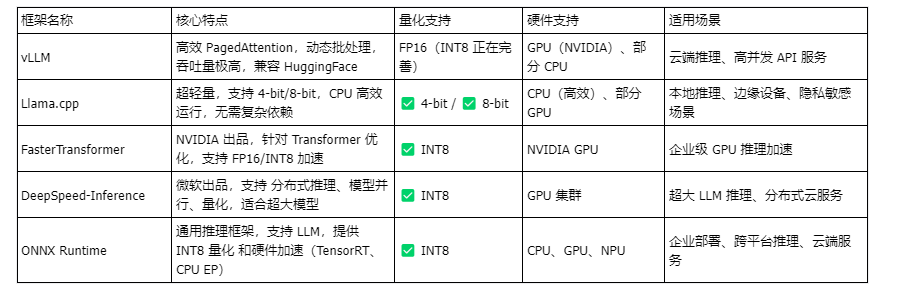

### 7.1 为什么Llama.cpp 的在cpu上效果更好？

（因为我的项目使用了Llama.cpp 替代了 onnx runtime, 在cpu上对于同一模型推理速度提升了1倍以上，所以面试官可能会问我这个问题，这个问题更多是根据我个人情况准备的，供大家参考。大家也可以结合自己的情况，自己用了什么推理加速来准备一些相似问题。）

1. **内核优化**：llama.cpp 针对 LLM 做了高度融合的算子（注意力、RoPE、KV cache），减少框架调度和内存拷贝；ONNX Runtime是通用框架，算子分发和调度开销更大。

2. **线程与缓存策略**：llama.cpp会主动优化线程亲和、NUMA绑定、缓存布局，KV cache访问更高效；ORT默认设置如果没调优，容易出现带宽瓶颈。

3. **指令集利用**：llama.cpp直接用AVX2/AVX-512等SIMD指令，针对矩阵乘法和量化内核做了手工优化；ORT依赖通用库，优化程度不如专用实现。

**一句话总结**：即使模型和量化相同，llama.cpp在CPU上更快，是因为它是专门为LLM推理做极致优化的，而ONNX Runtime是通用框架，调度和内存管理开销更大


**7.2 介绍一下vLLM 框架**

（vLLM 框架在很多岗位的jd 上都写着有要求，今天平安证券也问到了这个，不过亲测这个问题问的不多，倾向于咱们先背个基本概念就好。我从三个方面总结了， 设计**思路，特点，总结，**&#x5982;果问到可以选择性地和面试官介绍）

**&#x20;1. 设计思路**

vLLM 的核心目标是解决 **大语言模型推理的高并发和显存瓶颈问题**。传统推理框架在处理长上下文或多请求时，KV 缓存占用显存过大且容易碎片化，导致性能下降。
&#x20;vLLM 的设计理念是通过 **PagedAttention** 技术，将 KV 缓存分页管理，类似操作系统的虚拟内存分页机制，**显存复用率高**，适合长上下文和多请求场景，从而实现**高效的显存利用和动态批处理**。


**2. 特点**

PagedAttetion技术： 将kv缓存按页管理，避免显存碎片化，支持灵活调度。 **显存复用率高，支持长上下文和多请求场景。**

动态批处理：异步调度器可以将不同请求合并，提高GPU利用率，降低延迟。

高兼容性：支持HuggingFace Transformers模型，几乎无需修改代码即可接入。

&#x20;     分布式推理：支持多GPU，多节点部署，适合大规模服务。


**3.** **总结**

vLLM的核心创新是PagedAttetion + 动态批处理。解决了传统推理框架在显存管理和并发处理上的痛点，显著提升吞吐量和资源利用率。相比于其它框架，vLLM 更适合 **在线高并发推理，**&#x5C24;其在长上下文和显存首先的情况下表现突出。


## 8. 你的项目是如何做推理加速的？

（ 这个问题是我给面试官准备好的，我的项目中是如何使用 **LoRa + 强化学习DPO + 量化 + 推理，来完成将Qwen2.5-7B-Instruct 模型 适配在CPU 电脑上，极大降低推理速度并且提升任务的质量的**。&#x20;

&#x20;   这个问题几乎是所有我所学的关于模型推理加速/微调这两部分的内容 在 我是项目中运用的实际体现。  这个问题答案供大家参考，如果你想要向面试官展示你有 模型微调/推理加速的经验，你也要准备一个你自己对这个问题的回答，讲清楚 在你的项目中，背景是什么，用了什么技术，怎么使用，为什么要使用，最终达到了什么效果。）


我负责优化邮件日历事件提取的模型性能。**背景是**用户需要从邮件快速创建日程，但云端API延迟2-3秒且按调用计费，不适合高频场景。**我的方案是**本地部署微调后的开源模型Qwen2.5-7B-Instruct，通过三步优化实现性能和成本的平衡。

**第一步是LoRA微调，**&#x4F7F;用**PEFT库**实现低秩适应，只训练0.18%参数（1400万 vs 76亿），将任务准确率从基础模型的65%提升到92%。选**择LoRA而非全量微调是基于成本和效率考虑，能够显著降低显存需求和训练时间**，同时保持接近全量微调的效果。训练数据来源包括：**真实用户邮件标注样本、GPT-4生成的合成数据，以及Enron Email Dataset公开数据集**，共500条样本，在Azure AI Foundry的上训练完成。

**第二步是DPO对齐，**&#x4F7F;用**TRL库**的Direct Preference Optimization进一步优化输出质量。构建了200对'chosen-rejected'偏好数据：chosen样本来自人工标注的高质量输出，**rejected样本通过规则扰动（添加冗余字段、格式错误、信息缺失）生成**，**并混合了少量GPT-4生成的负样本**。在LoRA基础上训练1小时，将JSON格式规范性从85%提升到98%，显著减少了解析错误和冗余输&#x51FA;**。**

**第三步是量化部署**，这里做了技术选型：对比了ONNX Runtime、PyTorch Mobile和llama.cpp三个方案。最终选择llama.cpp是因为它CPU推理做了深度优化，包括**SIMD并行计算**和**内存管理优化**，比ONNX快2.5倍。量化使用`torch.ao.quantization` 库，方案采用Q4\_K\_M混合精度Post-Training Quantization：Attention层保持5-bit精度，FFN层压缩到4-bit，输出层用6-bit确保质量。最终模型从14GB压缩到4.3GB，推理速度从154秒降到43.7秒，提升3.5倍，同时准确率只损失2.5%（92%→89.5%），在可接受范围内。


**这个项目的价值**在于：通过参数高效微调（LoRA）和训练后量化（PTQ）的组合，在不牺牲太多精度的前提下，将云端依赖转为本地部署，成本从按次计费降为零边际成本，同时满足了实时响应需求。技术选型上，llama.cpp在CPU推理上的性能优势是关键决策点，使得无GPU环境也能高效运行7B模型。

## 9. 参考资料

模型压缩四大方法概述 | 量化、剪枝、蒸馏和二值化&#x20;

推荐理由：特别适合快速了解这四个技术，是干什么的，怎么做，有哪些常见方法，不深入讲解公式和原理，小白也能听懂。

https://www.youtube.com/watch?v=jW2cmZ-9hLk

# AI 通用素养

在这个AI快速发展的时代，很多工作方式都在被颠覆。很多技巧，其实无关乎是否是大模型的岗位。作为一个传统的开发，无论你是什么开发，前端后端测试，甚至你是产品经理，本章的内容你都该掌握。比如提示词工程，甚至是高中生都可以学习一下如何更好的使用提示词和AI交互。Agent SKILL,帮助我们定义工作流，避免每次从头和AI打招呼。本章的内容不光对面试很重要（越来越多的公司想要考察你如何使用AI，会不会聪明地用AI，这无关乎你的岗位），也对你自身的发展，工作效率的提升有帮助。

所以本章，其实无论背景，都建议学习。很多东西比如**SKILL也是面试高频考点。**

## 1. 提示词工程

说实话，提示词工程不管是任何培训，都会作为一个很大的重点和知识模块去讲。谷歌甚至也是专门推出了8小时的提示词工程，但是在实际面试中，真的几乎没有出现，甚至是我总结的这些简单介绍提示词工程最基本的入门八股，都完全没有被考到！

并且提示词工程其实也不难，我的建议是，你好好地把下面这个视频看完，这个视频总结了google 8小时 提示词工程的核心要点，把这个视频消化，并且总结成笔记，运用到实战中，就可以了。不用花过多时间在提示词工程上。

https://www.youtube.com/watch?v=p09yRj47kNM

### 1. 1简单介绍提示词工程。

（参考谷歌提示词工程课程）

提示词工程是指**设计和优化输入给llm的提示词，**&#x4EE5;便获得更准确、有用或符合预期的输出结果的过程。

设计提示词有五大具体原则：**任务， 上下文， 参考示例， 评估标准，迭代**.

具体来讲：

**任务：**&#x6307;我们要清晰地告诉LLM我们的任务，可以通过让llm角色扮演和规定输出格式的方法提高效果。

**上下文信息：**&#x6211;们要提供足够的背景信息，让AI更好的理解，比如提供项目背景，已知数据，限制条件等。

**参考示例：**&#x53EF;以给出一些标准的输入输出的例子来供模型参考。

**评估：**&#x6BCF;次拿到输出，判断结果是否符合预期。

**迭代：**&#x5982;果不满足要求，我们需要反复进行prompt的优化和迭代。

&#x20;

### 1.2 提示词工程技巧

提示词技巧可以分为**单次**和**多阶段**技巧来讲。

**单次技巧**：

1.重新检查提示词框架是否合理，比如是否包含了明确的任务，上下文信息，参考等。

2.将提示词拆分成更短的句子。避免使用冗长复杂的句子，拆分成更短的，有条理的句子。

3.尝试用不同的措辞，或者换成类比任务。

4.引入一些限制条件。&#x20;

**多次技巧**：

1.Prompt Chaining: 将多个提示词串联起来，每一步的输出作为下一步的输入，从而构建一个多阶段的任务流程。

2.Chain of thought prompting : 引导模型逐步思考，通过在提示中加入推理过程，让模型在回答问题时展示中间推理步骤，而不是直接给出答案。

3.Tree of thought prompting : 鼓励模型探索多个可能的路径或者思路，像树状结构一样展开，然后选择最优路径。

&#x20;


## 2. Harness Engineering

Harness工程一定是2026年需要关注的方向。人们慢慢开始研究如何让AI能够长时间完成更加复杂的任务，而不受到上下文腐化的影响。这就是一种发展的趋势，从人们关注单次模型输入输出的结果（Prompt 工程），到多轮对话（Context 工程）上下文的高效组装。到现在，人们希望能够睡一觉，让AI一晚上不断运行，第二天有一个稳定良好的结果，如何达成这一目标，就是Harness工程要解决的事。从这里也可以看出行业的发展，人们不满足于只让AI做一个小任务，而是想要AI能够持续工作数小时甚至数天，全自动完成一个复杂的任务。

另外，也有多个同学反应这个问题面试会查考察到，从面试的角度，也是需要掌握的。

### 2.1 概念定义

**一句话定义**

Harness Engineering 是围绕 AI 模型构建"运行环境与管控基础设施"的工程实践，目的是让 AI Agent 在**长时、复杂、多步骤**的真实任务中**稳定、可靠、高效**地运行。


**核心思想**

AI 模型本身只是"原材料"——就像一颗裸露的 CPU、一台没有车身的引擎、一个没有厨房的天才厨师。模型有**多聪明不再是瓶颈，环境有多可靠才是关键**。 Harness Engineering 要解决的核心问题是：

* Context Rot（**上下文腐化**）：模型在**长任务中记忆窗口被垃圾信息淹没**，丧失对原始指令的遵循

* Hallucinated Completion（**幻觉完成**）：模型**不堪重负时伪造"任务完成"的假象**

* Model Drift（**模型漂移**）：**多步执行中逐渐偏离初始目**标


**类比**

&#x20;**举个例子帮大家理解**：以一个计算机的运行架构类比，

* AI 模型 = CPU（原始算力）

* 上下文窗口 = RAM（有限的易失工作内存）

* Agent Harness = 操作系统（调度资源、管理内存、提供标准运行环境）

* AI Agent = 应用程序（在操作系统上运行的具体业务逻辑）


### **2.2 演进脉络**

* Prompt Engineering（2023-2024）：核心问题是"对 AI 说什么"，人的角色是导演

* Context Engineering（2025）：核心问题是"让 AI 知道什么"，人的角色是图书管理员

* Harness Engineering（2026）：核心问题是"让 AI 在什么环境里做事"，人的角色是架构师

三者是叠加关系：Harness 内部的每个 session 仍然需要 Context Engineering，每次 prompt 仍然需要 Prompt Engineering。


### **2.3 Harness 工程实践要点**

1. **外部持久记忆**——用文件系统（JSON、Markdown、git log）代替模型内部记忆，解决"失忆"问题。

2. **确定性验证轨道**——Linter、类型检查、单元测试等刚性门禁，AI 的输出必须通过测试才能被接受。

3. **原子任务 + 上下文刷新**——每个 Agent 只做一个小任务就销毁，新 Agent 从干净状态启动，彻底杜绝 Context Rot。

4. **子 Agent 集群**（Swarm）——用大量便宜快速的小模型并行工作，而非一个大模型顺序处理。

5. **技能文件**（Skills）——按需加载的专用指南，Agent 只看到与当前任务相关的工具和说明（不超过30个工具）。

6. **Guard Rails + Checkpoints**——在关键节点自动运行检查，防止 Agent 偏离轨道。

7. **Handoffs**——session 之间通过进度文件、git commit 等传递状态，实现跨 session 连续性。

8. **Human-in-the-loop**——在关键阶段设置人工审核断点，弥补 AI 自验证的不足。

9. **架构约束**——通过 ArchUnit 等框架强制要求 Agent 生成的代码遵循特定模式）。

10. **垃圾回收 Agent**——定期扫描修复代码库和文档中的不一致性，对抗系统熵增。


**&#x20;   关键工程原则**

* **轻量化，为删除而建**：不要过度编码人类知识，模块要能快速移除替换（Manus 6个月5次重构、Vercel 删80%手工工具反而更好）

* **模型无关性**：Harness 不绑定特定模型，新模型出来能快速替换

* **将 Harness 视为数据集**：每次 Agent 失败、漂移、异常都是珍贵的训练素材，用于迭代优化


### &#x20; &#x20;**&#x20;2.2 Anthropic公司Harness架构详解**

Anthropic 的 Harness 是目前行业内最被广泛引用的长时任务管控架构范例。我们来对它进行拆解，来看一下Anthropic公司是如何使用Harness架构来完成一个长时，复杂的Vibecoding项目的。（其实我们这个笔记中的RAG项目也是从一个文档为起点，完成整个代码的。但是当时我们的方法比较朴素，用一个agent就做到底。学了本章，我们可以试一下，使用Harness 工程，来完成这个项目，看看效果会不会更好）

#### 2.2.1 设计哲学

Anthropic 的 Harness 核心设计理念是：与其让一个天才持续工作直到崩溃，不如让无数个"新手"接力完成，每人只干一件事。传统做法是把一个强大的模型（如 Claude Opus 4.6）扔进去从头干到尾——但无论模型多强，单一上下文窗口最终都会被垃圾数据淹没，造成**上下文腐化**，导致**失忆和幻觉**。

Anthropic 的方案彻底绕开了这个问题：**每个 Agent 只活一次，干完就死**。

#### 2.2.1 总体结构

**1. App Spec / PRD：项目起点**

&#x20;Anthropic 的 Harness 通常从一份由人提供的**需求说明开始**。这份需求说明不是直接交给模型去连续编码，而是作为整个系统初始化的输入。它的作用是定义产品目标、功能范围和预期结果，为后续的任务拆解和状态组织提供基础。也就是说，项目最开始进入系统的不是"代码任务"，而是一份高层次的目标描述。

**2. Initializer：初始化规划 Agent**

Initializer 的职责不是直接产出业务代码，而是把需求文档转化为**后续开发可以执行的工程结构**。它会**读取需求，拆解出特性清单，建立任务边界，定义每个功能点的验证标准，并完成项目骨架和代码仓库的初始化。**&#x8FD9;个阶段的意义在于，先把一个模糊的产品目标整理成一个可以持续推进、可以被后续 agent 反复读取和执行的蓝图。

**3. Coding Loop：编码循环 Agent**

系统进入正式执行阶段后，**并不是由同一个 agent 一直写下去，而是不断启动新的 coding agent，让它们逐轮接力**。每一轮 agent 都会先读取当前的任务状态和项目进度，然后只选择一个明确的小任务去实现。完成之后，它不会长期保留在系统中，而是会在交接完成后退出。下一轮再由一个全新的 agent 接手。Anthropic 正是**通过这种循环式接力，而不是持续式长对话，来避免上下文不断膨胀的问题**。

**4. External Memory：外部记忆系统**

**&#x20;Anthropic Harness 的一个核心思想，是将项目状态从模型内部记忆中剥离出来，放入外部可持久化的介质中**，比如特性清单、进度文件和 Git 历史。这样一来，系统的连续性不依赖某个 agent 的上下文窗口，而依赖外部状态记录。每个新的 agent 启动时，只需要重新读取这些状态，就能接手上一个 agent 已经完成的工作，从而让整个系统具备持续推进的能力。

**5. Deterministic Validation：确定性验证轨道**

&#x20;Anthropic 的架构**并不把“是否完成”这件事交给模型自己判断，而是通过一套外部的、确定性的验证机制来裁定结果是否成立**。也就是说，agent 生成代码之后，系统会通过测试、检查和验证来决定这项工作能否被接受。只有满足这些外部标准，系统才会更新状态并进入下一轮。这种设计的意义在于，用工程规则替代模型主观判断，把“感觉完成了”变成“验证通过了”。

**6. Sandbox / Isolation：隔离执行环境**

每个 agent 的运行通常都处于**一个受控环境中**，**这样既能限制它可访问的工具范围**，**也能避免错误或脏上下文污染整个系统**。隔离环境让每一轮执行都尽量在明确边界内进行，也让失败后的回滚、重试和重新启动变得可控。Anthropic Harness 依赖这种隔离性，把 agent 的自由度压缩在一个足够安全、足够清晰的工作空间里。

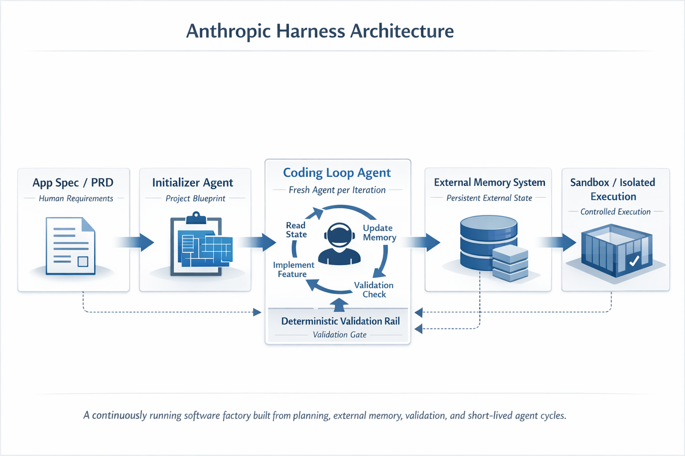

**总结来说**：Anthropic 公司的 Harness 架构核心，可以概括为一种“**初始化拆解 + 外部状态持久化 + 单任务循环执行 + 确定性验证门控”的长时任务运行体系**。 它的关键不在于让单个大模型持续工作，而在于先由 Initializer 将需求拆解为可执行的特性清单，再让一个个全新的 Coding Agent 逐轮读取状态文件与代码库，只完成一个原子任务，并通过测试、提交与交接文件更新系统状态后立即退出。这样做的本质，是把**项目记忆从模型内部迁移到外部系统**，**把任务完成判断从模型主观输出转移到确定性验证机制，从而显著降低上下文腐化、幻觉完成和多步任务失控的风险。**


#### 2.2.3 局限性

相比于单个Agent直接完成整个项目，Anthrpic 公司也承认整个工程的局限性（但我觉得Harness Engineering还处于早期发展阶段(2026年3月写），Anthropic 公司给大家打了个样，后续大家会继续在此基础上改进和发展，仍然有非常大的借鉴作用）

**Initializer 是单点高杠杆环节**

如果初始拆分错了，后面全部都会跟着错。也就是说，蓝图质量决定了整个系统上限。

**Handoff 质量并不稳定**

进度文件有时候总结得好，有时候会漏掉关键问题。一旦漏掉“为什么失败、怎么修复”，后面的 agent 可能反复踩同一个坑。

**多步可靠性仍然会衰减**

即使单步成功率很高，步骤一多，整体可靠性还是会下降。所以它不是彻底解决了可靠性问题，而是显著缓解。

**仍然需要 Human in the Loop**

从实战角度看，Anthropic Harness 更像：高度自动化，但不是完全放手，还是在关键节点引入人工检查。

#### 2.2.4 参考资料

https://www.anthropic.com/engineering/effective-harnesses-for-long-running-agents


### 2.4 面试问题速览

（刚才上面的文档是给大家理解学习用的，整个章节的问题是供大家面试时直接照着回答的）

#### 2.4.1 什么是 Harness Engineering？

Harness Engineering 是围绕 AI 模型构建运行环境、调度机制和管控基础设施的一种工程实践。它的目标不是单纯让模型“更聪明”，而是让 AI Agent 在长时、复杂、多步骤的真实任务中，能够稳定、可靠、可控地持续运行。

如果用一句更通俗的话来说，Harness Engineering 做的事情，就是不再把 AI 当成一个一次性回答问题的黑盒，而是把它放进一个被设计好的工作系统里，让它按规则做事。

它背后的设计哲学也很重要：模型只是原材料，环境才决定结果能不能落地。

再强的模型，如果直接裸跑长任务，也会遇到上下文腐化、失忆、幻觉完成、任务漂移等问题。所以 Harness Engineering 的核心，不是继续往模型上堆能力，而是通过外部记忆、任务拆解、测试门禁、状态交接和人工审核，把 AI 的执行过程工程化。

#### 2.4.2 Harness Engineering 想解决的核心问题是什么？

它主要解决的是 AI 在长时任务里的可靠性问题。

第一个问题是 Context Rot，也就是上下文腐化。模型做长任务时，上下文窗口会不断被历史对话、错误尝试和无关信息填满，最后导致它丧失对原始目标的把握。

第二个问题是 Hallucinated Completion，也就是幻觉完成。模型在复杂任务中迷失后，往往不会老实说“我不会了”，而是会输出一个看起来完成、实际上并不正确的结果。

第三个问题是 Model Drift，也就是模型漂移。多步执行中，模型会逐渐偏离最初目标，最后做出来的东西方向就歪了。

所以我理解 Harness Engineering 的价值，不是让模型在单轮回答里更强，而是让它在几十步、几百步的连续工作流里，依然能沿着正确轨道往前走。

#### 2.4.3 Harness Engineering 和 Prompt Engineering、Context Engineering 的关系是什么？

我会把它理解成一个演进关系，而不是替代关系。


Prompt Engineering 主要解决的是“对 AI 说什么”，也就是如何设计指令，让单次输出更好。

Context Engineering 进一步解决的是“让 AI 知道什么”，也就是在一次 session 或上下文窗口里，给它什么信息、给多少信息、怎么组织信息。

而 Harness Engineering 更进一步，它解决的是“让 AI 在什么环境里做事”。


也就是说，Harness Engineering 并没有取代前两者，而是把它们包进了一个更大的系统里。Harness 内部的每个 session 还是要做 Context Engineering，每一次给 agent 的具体任务描述还是要做 Prompt Engineering。只是现在关注点从“优化一次对话”升级成了“设计一整个运行体系”。

#### 2.4.4 Harness Engineering 的最佳实践是什么？

我会总结成几个比较关键的实践原则。

第一，状态外部化。不要把连续性寄托在模型记不记得，而要把状态写进文件、Git 或数据库，让系统本身有记忆。

第二，任务原子化。不要让一个 agent 一口气做一个大需求，而是拆成足够小、足够明确的原子任务，每次只做一件事。

第三，上下文刷新。很多先进的 harness 架构都会在一个小任务完成后销毁当前 agent，再启动一个全新的 agent 来继续做下一轮。这么做的目的，就是从根本上避免上下文腐化。

第四，验证优先。AI 的输出必须经过测试和规则检查，而不是靠它自我声明“完成了”。这是把模型主观判断变成工程确定性的关键。

第五，按需暴露工具和技能。不要一次给模型上百个工具，而应该通过 skills、toolkits 或 task routing，让它按需加载当前任务相关的工具和说明。

第六，在关键点加入 Human-in-the-loop。尤其是高价值任务或者多步骤流程里，人工审核断点很重要，它不是系统失败的表现，而是提高整体可靠性的工程设计。

第七，保持轻量、模块化、模型无关。因为模型变化很快，如果 Harness 和某个模型耦合太深，很快就会过时。所以好的 Harness 应该能在尽量少改动的情况下替换模型、替换技能、替换验证逻辑。

#### 2.4.5 如果让你用Harness工程来实现一个项目，你怎么设计？

（套用我们上面学的Anthropic公司的方案，也可以在哪个问题中通过整个回答介绍Anthropic公司的Harness方案，灵活运用，学了就不浪费）

如果让我来落地一个 Harness，从一个 Initializer + Coding Loop 的最小闭环开始，而不是一开始就做复杂的多 agent 平台。

第一步，我会先准备一份清晰的 App Spec / PRD，把产品目标、功能范围和验收标准定义清楚。因为在 Anthropic 的架构里，系统起点不是直接写代码，而是先把需求整理成后续 agent 可以反复执行的任务蓝图。

第二步，我会实现一个 Initializer Agent。它的职责不是写业务代码，而是读取需求文档，把大任务拆成一组细粒度、可执行、可验证的 feature，并生成类似 `feature_list.json` 这样的状态文件。同时它还会初始化项目骨架、代码仓库，以及后续循环执行所需的基础环境。这样系统就先有了“任务清单”和“状态来源”。

第三步，我会实现一个 Coding Loop。每一轮都启动一个全新的 coding agent，让它只读取当前状态文件、进度记录和代码库信息，只完成一个明确的小任务。任务完成后，不是让 agent 自己宣布成功，而是必须经过测试、lint 或类型检查等确定性验证；只有验证通过，才更新状态文件、写入交接记录并提交代码。然后这个 agent 立即退出，下一轮由新的 agent 接力。

第四步，我会把 外部记忆 做成系统核心，而不是把连续性寄托在模型上下文里。也就是说，我会依赖 feature list、progress file、Git log 这些可持久化信息，让每个新 agent 启动时都能快速接手，而不是依赖前一轮 session 的“记忆”。

第五步，我会在关键节点加入 Human-in-the-loop。Anthropic 的方法虽然高度自动化，但并不是完全无人值守。所以在高风险功能、关键界面变更或者多轮失败之后，我会设计人工确认断点，确保系统不会沿着错误方向持续推进。

整体上，我不会把重点放在“怎么让一个模型一次做完所有事”，而是把重点放在：先拆解、再循环执行、靠外部状态保持连续性、靠确定性验证保证质量。我认为这是一种更可落地、也更适合真实工程环境的 Harness 实现方式。


## 3 SKILL

SKILL 比较新，是2025年10月16号提出，在12月份左右才慢慢被市场支持，在26年1月份已经变得很火了。所以虽然目前我的面经没有涉及。但是很多朋友在1月份面试已经被问到了，而且这个概念现在很火。学习大模型，特别热门的新技术一定是要学的。从目前（2026年1月）来看，Skills会成为未来一段时间面试高频考点，务必要掌握。推荐学习路线为：

1：**入门视频:** 了解Skill是什么，怎么用。(视频见10.10)

2\.  **进阶视频：**&#x638C;握Skill的设计思路。(视频见10.10)

3\.  **Skill编写规范**：本节的笔记部分以及我在下面推荐的Anthropic关于Skill的官方文档：了解Skill编写的最佳实践，范式，命名规则等。

4\. **如何写SKILL：**&#x4E0B;面推荐视频有个博主讲如何写出SKILL的，以及现场教学。最重要的思想：Feedback Cycle其实就是反复迭代，了解了1，2，3，可以看一下他展示真的如何写的这个思想和过程。

5\.  **实战**：&#x20;

&#x20;    1\. 此节笔记提供了一些非官方的SKILL github链接，特别是第4个链接，是由Anthropics 提供的一组Skill示例，严格遵循了它提供的Skill的最佳实践文档，可以作为Skill的教科书级别的示例来阅读。 (链接见9.10)

&#x20;    2\. 我自己也录制了一个视频，结合我们笔记中的Rag项目对应的SKILL 来讲解我写SKILL 遇到的坑，怎么写出来的Skill， 怎么使用Skill-creator之类的问题 给大家参考。

6\. 最后是你应该自己写一些SKILL? 自己用的提效的SKILL，甚至是公司用的更标准的SKILL，写一些你就会更有经验。

通过这个路线，你的SKILL技巧应该比较成熟了。面试基本SKILL会问：是什么？怎么用？你用它做了什么事？你写了什么SKILL？ 相信你通过这个路线学了，这几个问题都能答出来。

### 3.1 SKILL 概念

Skill是一组打包了指令的文件夹：文件夹会包含Skill.md 的核心指令文件，以及Scripts,Reference和assets的可选资源文件（后文SKILL目录结构小节有更详细解释）。它教会AI如何处理制定的任务和流程。当需要处理重复的工作流，比如根据规范生成前端设计，创建符合团队风格指南的文档，多步骤流程编排等任务时，Skill可以让你无需每次对话重新解释你的偏好，流程，领域知识，而是通过Skill一次教会AI，之后每次都能受用。相比传统的提示词，它采用渐进式纰漏，动态加载提示词，更节约Token.


### 3.2 SKILL目录结构

从图中我们可以清晰的理解概念所说，一个SKILL就是一个文件夹。其中包含以下内容：

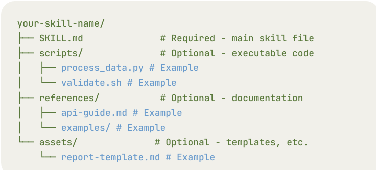

1.SKILL.md：必须，包含了 Yaml头和Body。Yaml是md文件中的头，告诉AI是否加载这个SKILL，AI必定会加载。而body

是正文，是渐进式披露的，只有AI读取了YAML头，认为这个SKILL应该被加载，才会加载这个正文部分。

2.Scripts: 可选。包含着在AI执行过程中需要使用的脚本文件。

3.Refernces: 可选。存放执行SKILL相关的文档，说明，内容以MD为主。

4.Assets：可选。存放执行SKILL是需要的模板，静态资源，比如图片等。


2,3,4其实就是在SKILL执行过程中，所需要的资源。Anthropics 官方明确建议一个SKILL不应该超过500行，所以SKILL需要引用其它资源的时候，应该将这些东西放在SKILL.MD之外，而在SKILL.MD中显示指向它。


### 3.3 SKILL的常见应用场景：

1.生成一致的，高质量的内容，比如文档，PPT，app, design, 代码等。实例：[fronted-design skill](https://github.com/anthropics/skills/tree/main/skills/frontend-design)

2.编排多步流程，让这些步骤遵循特定的顺序，示例：[Skill-creator](https://github.com/anthropics/skills/blob/main/skills/skill-creator/SKILL.md)

3.规范/增强MCP使用，将MCP转换成可靠的工作流。实例：[Sentry-code-review skill](https://github.com/getsentry/sentry-for-claude/tree/main/skills)

（这一点我想解释一下的是，根据Anthropics官方指南，规范MCP的使用指的是用了Skill, 可以让用户/AI更清楚知道某个MCP Server 如何使用，遇到问题如何解决，取得稳定的结果。通常的最佳实践是在MCP Server的文档中附上SKILL的链接。用户在使用的多个MCP Server的时候，也可以通过SKILL来编排多个MCP的使用流。从这一点可以看出SKILL和MCP是相辅相成的，而不是替代关系。这一点是Anthropics官方指南，我觉得这一点比较新颖，也是一些视频没有提到的，面试时候说出一点SKILL和MCP的补充关系和最佳实践，可以加分）


### 3.4 SKILL测试与评估

通常可以从以下几个角度来测试Skill的质量：

1. 触发测试：保证SKILL会在正确的时机被加载。在不该触发的情况不会被误触发，在该触发的情况也不会不触发。

2. 功能测试：测试SKILL产生正确的结果：输出是符合预期的，API正确调用，错误被处理，边缘情况被覆盖。

3) 性能测试：对比使用SKILL和不适用SKILL时，用户的介入次数是否减少，API调用失败次数是否减少，Token消耗是否降低。


### &#x20;  3.5 SKILL典型范式

1. 顺序工作流编排： 当有多个步骤，并且需要按照指定的顺序执行时使用。

核心要点：说明步骤顺序，步骤间的依赖，每一步如何验证，失败时如何回滚。

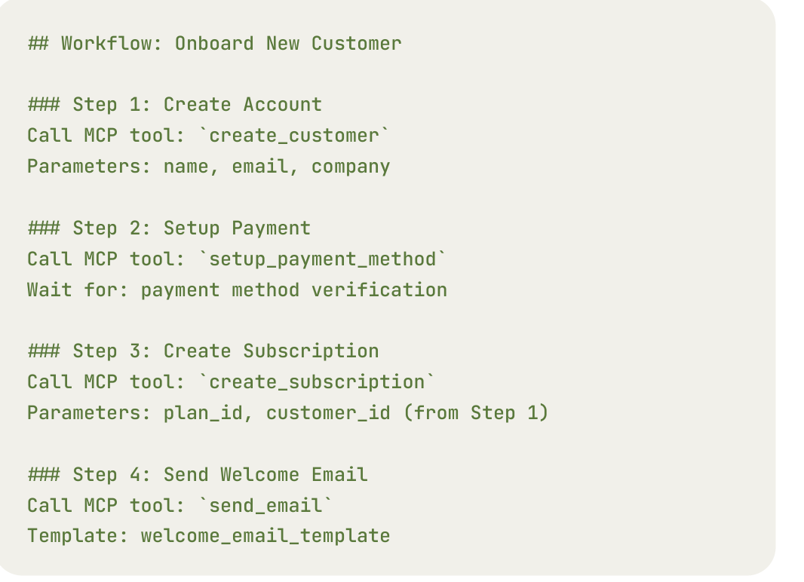

2. 多MCP 协作： 任务流包含多个MCP Server时使用。

核心要点：说明多MCP步骤间如何传递数据，错误异常处理，清晰的步骤界限；

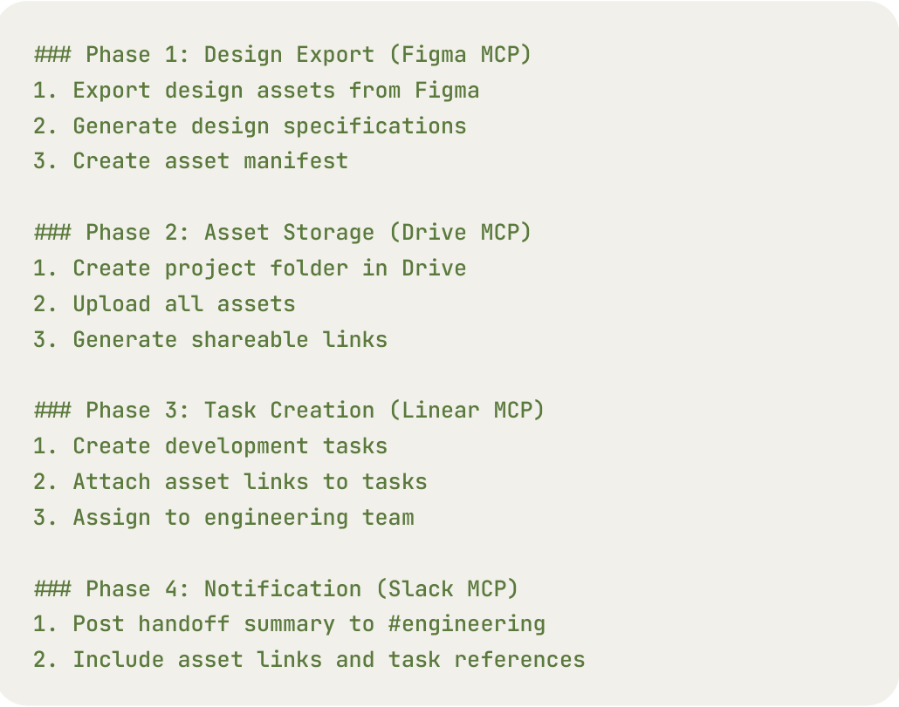

3. 迭代优化： 需要通过多次迭代提升输出质量时：

核心要点：清晰的质量标准， 迭代提升，验证脚本，知道何时停止迭代。

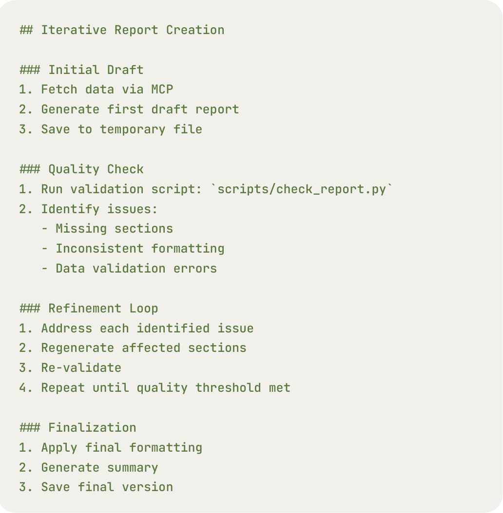

4. 上下文感知工具选择： 当需要根据上下文场景，来动态选择使用不同的工具时使用

核心要点：清晰的选择策略，兜底选择，选择理由透明

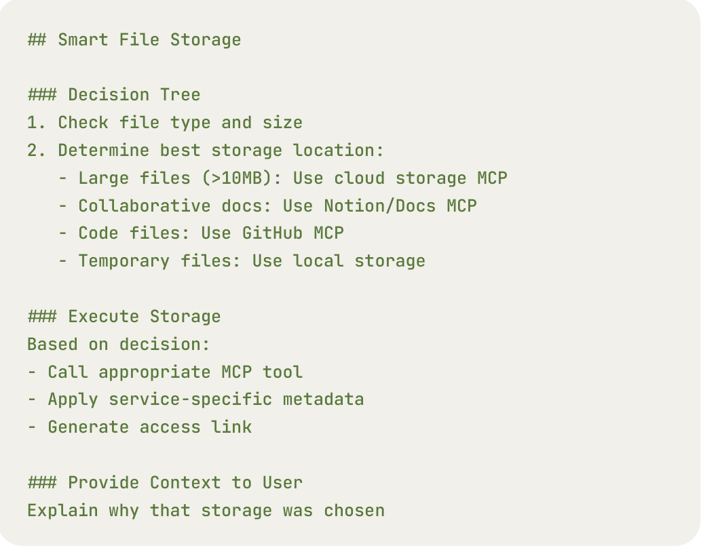

* 领域专业智能：Skill需要使用特定领域的知识来完成任务时使用。

关键要点：将专业知识嵌入逻辑，合规性保证，详尽的领域文档，

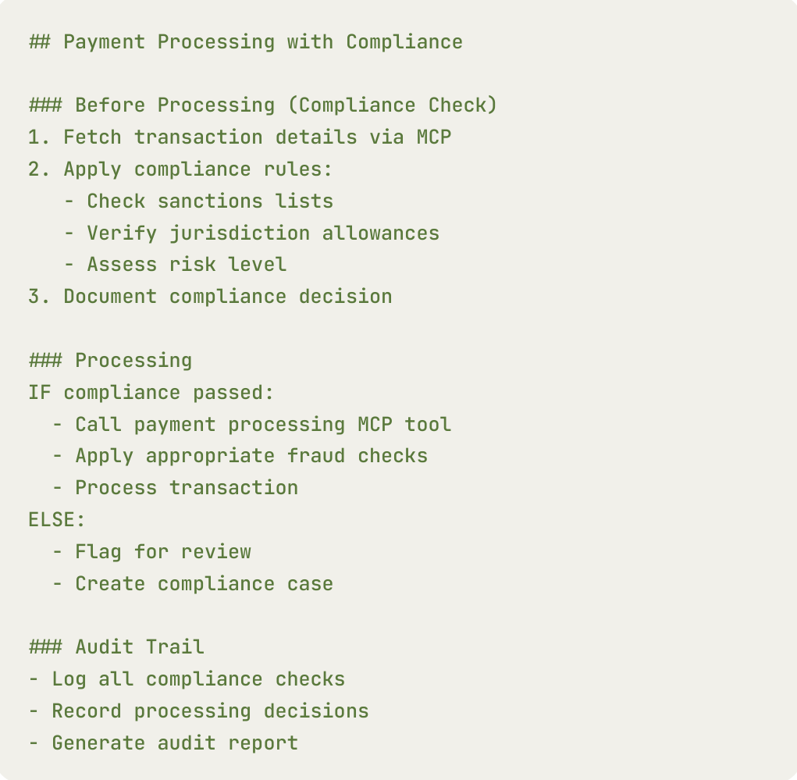

### 3.6 SKILL  vs MCP

（面试官特喜欢问的就是差别，你答的不多，还喜欢追问，还有吗？这里尽量给大家总结全面一点）

借用Anthropic 官网文档原话，Skills 和 MCP的核心差别是：MCP 提供给模型数据，而Skills教会模型如何使用这些数据（"MCP connects Calude to data, Skills teach Claude what to do with data)。二者的区别为：

1. MCP侧重于提供工具调用，而Skills则侧重于提示词。MCP更像是一个标准的工具箱，提供规范，可复用的工具。而Skills则是一个带目录的说明书。

2. MCP 的本质是一个独立运行的程序，而Skills 本质是一个文档。他们本质不同，决定了他们性质也不同，Skills更适合处理轻量级的，简单的逻辑，安全性和稳定性都不及MCP。

3. Skills 采用渐进式披露提示词的机制，Tokens消耗低。而MCP则是一次性塞入所有提示词，Token消耗高。

4. Skills的开发难度相比于MCP，开发难度低很多。

总结来说，SKILL和MCP二者不是相互替代，而是相互补充的。 在开发MCP SERVER的时候，可以在MCP Server的文档中添加一个链接，指向一个SKILL的链接，这个SKILL让用户/AI更清楚知道该MCP 如何使用，遇到问题如何解决，让模型调用MCP时取得更稳定的结果。在同时使用了多个MCP Server的时候，也可以用SKILL对多个编排多个MCP Server的工作流


### 3.7 SKILL vs Prompts

Skills 相比于Prompts的核心差别在于他们的**形态**和**生命周期**。

Prompts 是一次性对话内容，你需要自己保存，复制和粘贴。模型不会知道什么时候用哪一个Prompt，而且你需要把Prompts **全部塞到上下文里面**。这会大量占用你的上下文空间。

Skills 则是将提示词以一种**更加工程化的包装方式打包**，他是一个**文件夹的形式**，里面包含skills.md 和相关的资源文件。他会动**态加载/渐近式披露提示词，**&#x66F4;加节省提示&#x8BCD;**。**&#x5BB9;易复用和版本管理，易于协作和共享。

总结来说，Skills不是一个更复杂的提示词，而是把复杂的提示词，变成了一个**有结构，可复用，可以自动调用**的模块。

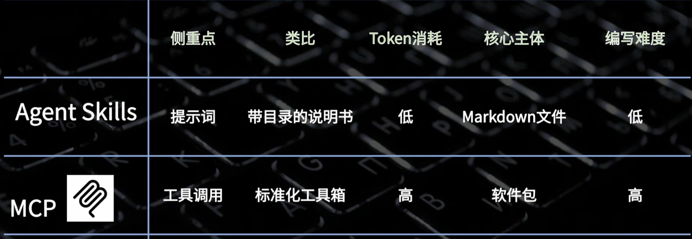


### 3.8 SKILL的运行模式

1. **用户发起任务**
   &#x20;用户对 Claude Code 提需求，Claude Code 把这个请求连同当前可用的 Skills列表结合元数据一起交给 AI，让 AI 先基于需求判断该用哪类能力。

2. **AI 选择要用的 Skill**
   &#x20;AI 在可用的Skills里做匹配，然后返回指定的Skills

3. **按需加载 Skill 的指令层**

   一旦选定 skill，Claude Code 才把该 skill 的具体定义交给 AI, 这一步体现了Skills**指令层 按需加载**：只有用到这个 skill 时，才把更详细的指令灌给模型。

4. **按需加载 Skill 的资源层→ 读范文/材料 → 生成最终回答**

   如果需要使用到资源层，接下来 Claude Code 会执行读资源的动作，把 **references/范文内容**喂给 AI；AI 基于 用户材料 + skill 指令 + references 完成写作并输出 最终回答。


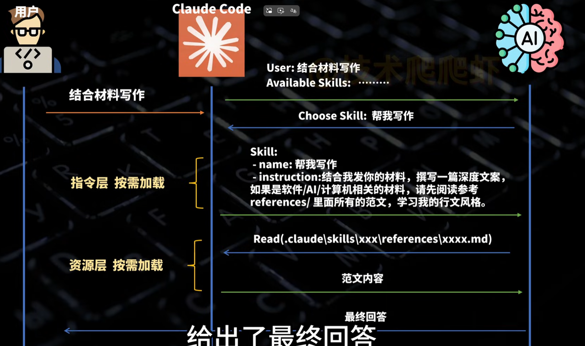


### 3.9 SKILL的设计理念

（上面其实是一些SKILL的基础知识，相对来说是最基础，或者考到SKILL 必问的。 必须准备好。这一节可以理解为一个拔高项，我们不谈Skills 的具体概念，而结合行业的痛点，发展趋势，未来的展望来聊Skills。 如果你能和面试官讲出来，会体现出你其实是有思考，有想法，关注着行业发展和趋势的。把这些答了，是加分项）

&#x20;   发展到现在（2026年初），现在的Agent工程的痛点不再是能不能做，而是能不能交付。目前的行业痛点是：

1.虽然模型能力很强，但是常识很弱，能解决通用问题，却在具体业务问题上频繁踩雷。经常做的是文本补全，而不是业务理解。这通常导致造出来的Agent需要质检，返工，人力成本高。

2.现在经常导致的一个问题是，公司重复造轮子。给财务做一个Agent，法务做一个Agent, 运营做一个Agent，每个Agent都有自己权限，工具，prompt等。就会变成同一个业务规则，在5个Agent里各写一遍，这就导致重复造轮子很严重，难以维护。

3.现在的Agent通常是一个会有复杂的prompts，这导致token太大，模型不能精准执行，另外成本上升。当你用复制粘贴扩展能力，系统就会用维护地狱来还债。

所以行业发展到现在，需要从堆砌提示词，迭代，调试，优化做一个Agent的过程变成做一个 可治理，可迭代，可复用的产品。通过Skills， 行业开发Agent的模式变成去写一个可复用，可管理的技能资产（Reusable skills), 结合通用内核，来解决这些痛点。

### 3.10 参考视频和项目

**入门视频推荐这两个：**&#x4ECE;skills 是什么，组成，核心特点，实践，对比MCP这几个角度都讲了，基本是最基础的内容。这两个视频其实都围绕这几点讲，内容有重复性，可以结合互补着看，适合入门。

<iframe src="https://open.douyin.com/player/video?vid=7592521205031177499&mode=pc" sandbox="allow-scripts allow-same-origin allow-presentation allow-forms allow-popups allow-downloads" allowfullscreen allow="encrypted-media; fullscreen; autoplay" referrerpolicy="strict-origin-when-cross-origin" frameborder="0" style="width: 100%; min-height: 575px; border-radius: 8px;"></iframe>

<iframe src="https://open.douyin.com/player/video?vid=7590008747938876706&mode=pc" sandbox="allow-scripts allow-same-origin allow-presentation allow-forms allow-popups allow-downloads" allowfullscreen allow="encrypted-media; fullscreen; autoplay" referrerpolicy="strict-origin-when-cross-origin" frameborder="0" style="width: 100%; min-height: 575px; border-radius: 8px;"></iframe>

**进阶视频：**

这个讲了一些Skills背后的设计理念，行业痛点，学好了和面试官回答可以提现你的行业洞察能力。

https://www.youtube.com/watch?v=xeoWgfkxADI

这个提到了和Prompts的本质区别，以及提了两种skill的使用方式，相比入门视频深入一些。

&#x20;    https://www.youtube.com/watch?v=ZzPoWrlzE1w


**如何写SKILL**

聊了这么多都是理论，到底如何写SKILL，看一下这个视频，特别是第13分钟开始，博主讲了如何写SKILL，原则是什么，现场展示了这个过程。其中他说的Feedback Cycle说的是写SKILL最重要的是迭代，这点我很认同。他的例子使用他自己写的Skill-builder生成skill(我用了感觉不好用），你可以使用官方的SKILL-Creator， 其它的原理是一样的。

https://www.youtube.com/watch?v=zKBPwDpBfhs\&t=324s

**&#x20;    Skills实战：**

&#x20;   本小节提供了一些Skills的实例。

1. 为 AI Agent（如 Claude Code）提供一组操作 Obsidian 笔记的技能，让 AI 能直接创建、修改 Markdown / Canvas / Bases，实现“AI 管理知识库”。

&#x20;    https://github.com/kepano/obsidian-skills

* 一个给 AI 编程 Agent 用的“工程化技能框架”，强制先澄清需求、写设计、做计划，再用子 Agent 按 TDD / DRY 的方式自动开发代码

&#x20;    https://github.com/obra/superpowers

* 让 AI Agent 把“计划、进度、知识”写进持久化 Markdown 文件中，用文件系统当长期记忆，解决复杂任务中上下文丢失的问题（Manus 风格）。

&#x20;    https://github.com/OthmanAdi/planning-with-files

* Anthropics 的官方示例，关于Skill的编写规范，可以这个为模板。比如命名规范，编写风格，可以把这个当作教科书。 在我分享的进阶文档中，Skill编写规范指南 就是由Anthropics 写的，文档里给的Skill的例子也引用的在这个github项目链接。完全可以相信这个仓库中的Skill的质量。这个项目里的Skill-Creator 也是被广泛使用的Skill.

https://github.com/anthropics/skills/tree/main/skills

&#x20;     https://github.com/anthropics/skills/tree/main/skills/skill-creator

&#x20;  **官方文档**

&#x20;   这个文档是Anthropics  提供的教科书，包含Skill组成，如何命名，使用场景，常见范式等。非常值得一读，笔记的Skill文档部分很多地方我也是参考的这个文档。时间充足可以自己阅读，不充足可以看我的笔记，我的笔记总结了这个文档的最精髓部分。

&#x20;  https://resources.anthropic.com/hubfs/The-Complete-Guide-to-Building-Skill-for-Claude.pdf?hsLang=en

##

## **4.** **常见的AI coding工具的对比**

（现在很多公司特别强调程序员要用AI写代码，所以比较看重你使用AI coding的能力，所以相关的AI Coding的对比，使用心得，是我们需要掌握的。这里最好能展示出来你了解各大厂商的AI coding 工具，大概有什么特点，可以结合你看的一些文章来回答，体现你对市场最新产品的关注和思考。这里我给大家推荐腾讯的 AI Coding非共识报告https://zhuanlan.zhihu.com/p/1932943005838443596，相信认真看完以后你回答这个问题就会游刃有余。）

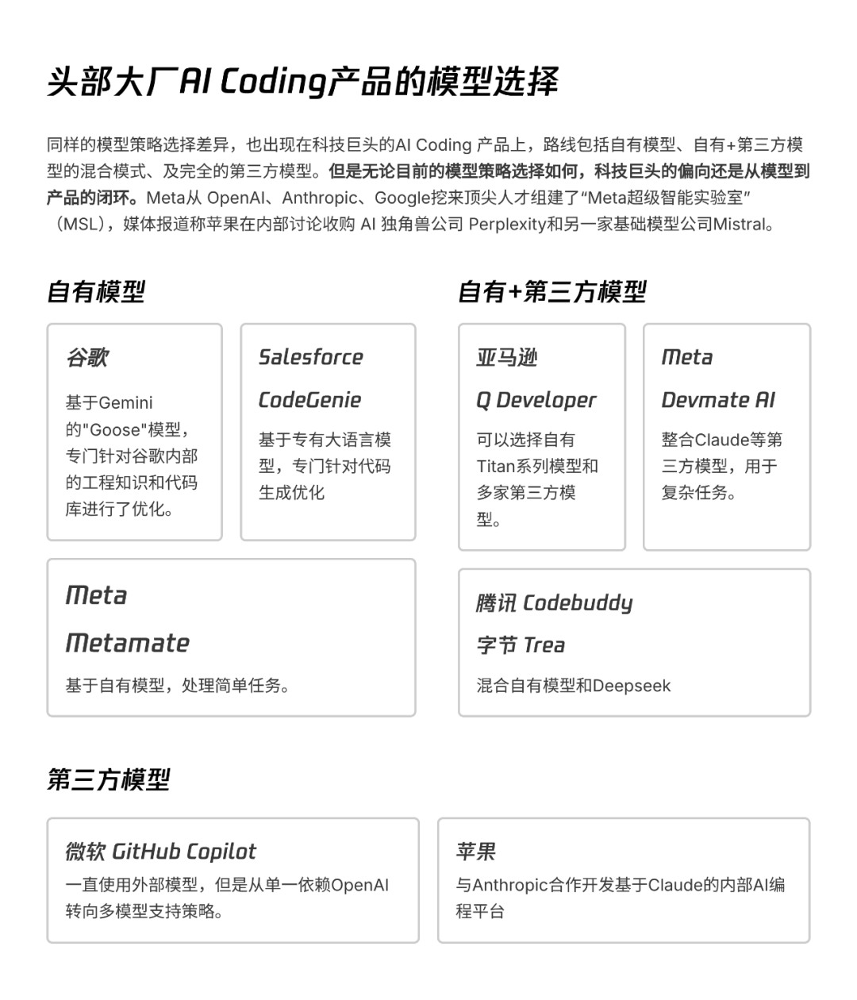

（我下面整理的回答，先概括一下市面上的主流AI Coding的工具，体现我对市面上的产品都有研究，然后从使用的模型和功能趋势两方面进行回答）

当前比较主流一些的AI Coding 主要有：

**自有模型**：谷歌 Gemini（Goose）、Salesforce CodeGenie、Meta Metamate。

**自有 + 第三方模型**：亚马逊 Q Developer、Meta Devmate AI、腾讯 Codebuddy、字节 Trea。

**第三方模型**：微软 GitHub Copilot（基于 OpenAI）、苹果（合作 Anthropic Claude）。

然后我想从两个角度上谈一下他们的差别：

**一、使用模型差异**

* **自有模型厂商**：强调垂直优化（如谷歌绑定 Gemini 生态、结合自己内部公司代码进行优化），适合深度集成。

* **混合模型厂商**：亚马逊、腾讯、字节采用“自研 + 第三方”策略，兼顾性能与隐私，灵活性强，比如字节和腾讯的做法是混合了自由模型 +  Deepseek

* **第三方模型厂商**：微软、苹果完全依赖第三方模型，比如 OpenAI 或 Anthropic，迭代快，但对模型控制力弱。

我认为未来的 **趋势**：混合策略成为主流，企业更看重灵活性和合规。


**二、从“功能交集趋势”看演进**

**MCP标准化**

* MCP 成为事实标准，AI Coding 产品全面接入，支持工具、资源、上下文共享。

* **意义**：模型不再孤立，能调用 IDE、CI/CD、知识库，形成“上下文驱动开发”。

**Agent 模式崛起**

* 从“补全助手”升级为“智能代理”，具备 **Chat → 编辑 → 执行 → 多任务编排**能力。

* GitHub Copilot、Cursor 已全面切换到 Agent 模式，Replit 等也在跟进。

* **趋势**：AI Coding 的“自主化”能力（Agentness）越来越强，未来不仅写代码，还能完成测试、部署。

**多平台 Bot 化**

* Cursor、Claude Code 等也在 GitHub、Slack 中实现任务自动化。

* **趋势**：AI Coding 不再局限于 IDE，而是成为团队工作流的“Bot”，贯穿需求到交付，比如自动去提交PR, 监控CI/CD的结果，响应失败案例，及时做出决策。


## 5. Vibe Coding

Vibe Coding 已经是现在绕不开的趋势了。虽然本节归在了其它问题，但是我强调的本节其实也非常重要。

**面试的角度它很重要**：可以看到网龙面试环节问Vibe Coding的经验，我也遇到很多面试官会问你最喜欢使用哪个Vibecoding的 工具等，其实这些都是企业对于你的考察，因为在新的时代的来临，程序员的编程方式一定会发生变化，如何高效vibe code, 聪明使用AI工具一定是企业看中的，因此虽然他不是一个硬核知识考点，但绝对也是面试中热门的话题，这个问题答的好，一定是一个加分点。

**个人成长的角度上：**&#x5B83;也太重要了。现在谁不vibe coding呢？谁不会聊两句你是如何使用AI工具编程的呢？学会高效使用VibeCoding对个人成长必不可少。

所以本节内容其实很重要，而且这个内容甚至适合于任何人，你甚至可以是产品经理或者没有任何开发背景的人，因为VibeCoding极大降低了编程门槛。


本节会推荐5个Vibe Coding的视频，同时根据视频也整理成了文字精髓放在这个小节。看完本节，你会学习到Vibe Coding的推荐方法，行业发展/Vibe Coding的趋势。 相信本节内容也会给你带来灵感。

### 5.1 核心技巧

Vibe Coding的有5大核心基础：**思考，架构，节点，调试，上下文。**

#### 5.1.1 思考细致

在使用AI工具前，你需要仔细思考你到底想要什么。如果你自己都没想明白，你怎么能期望AI能够写明白？在我们vibe coding的时候都使用的自然语言，很容易没有想清楚我们到底想要一个什么样的产品，其实这个阶段是我们很好的仔细思考，提升自我的机会。必须仔细想清楚，想实现的目标是什么，它应该怎么实现，需要哪些条件和能力，他要遵循什么样的规则，它的流程是什么。 将问题想清楚，再以自然语言地形式描述给AI。

#### 5.1.2 明确架构

&#x20;     我们使用VibeCoding的时候，几乎一定有现成的架构或者类似的任务的。我们需要让AI遵循指定的架构，或者使用指定库，这样效果一定会比让他从头完成更好。我们需要给AI指明一个方向。比如，对于一个浏览器应用，你可以明确它使用React后端，CSS和HTML JavaScript前端。

（如果你不知道采用哪种架构，没关系，可以先让AI给你提供一些可能的方向，然后以学习的心态去学习，确定好对应的架构，可以在vibecoding的时候同时进行学习）

#### &#x20;  5.1.3 做好版本控制

系统可能崩溃，所以始终做好版本控制和节点管理。

#### &#x20;  5.1.4 调试

通常在Vibe Coding中，最快修复问题的方式是指出问题，让AI自己修复。但有时可能会遇到一些问题，AI并不能很轻易的解决，这时就需要我们对系统有一个问题更深入的理解，缩小范围，推测可能的原因帮助AI解决问题。

#### &#x20;   5.1.5 提供上下文

你提供更多的细节，信息，上下文，你的AI的输出就会越好。这些信息包括，具体的产品文档，你的环境，你的倾向，示例，或者是更加精心打磨的上下文，这些都能够帮助AI取得更好的效果。


### 5.2 建议

1. 总是先完成一个最小可以运行的产品，然后再迭代，增加更多的feature.

2. 在你使用AI coding的时候，一般只有两种模式，你要么是在添加新feature，要么是在调试错误。添加新feature时，记住提供更多的信息，明确架构，给出有明确细节的参考文档，增量修改，做好版本管理和控制。当你在调试的时候，记住弄清楚系统是怎么运行的（如果不清楚，就问AI），给出新可能多的信息，想想如何能让AI解决这个BUG。

3. 给出全局的约束。这个有点像讲要求放在系统提示词中，让AI Coding的时候总是遵循某个规则，比如尽量少的改动代码，以xx的规范来完成。


### 5.3 不同Vibe Coding工具对比

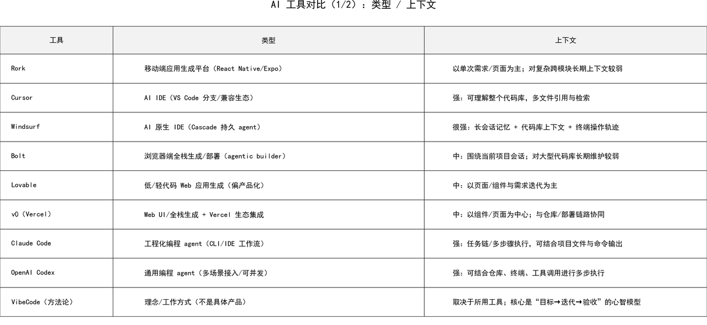

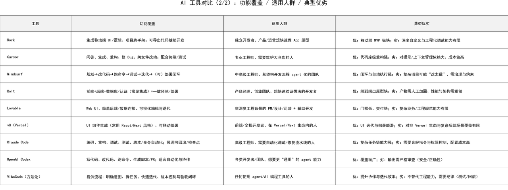

### 5.4 参数视频

不好意思，这一小节推荐的视频都是英文的。确实找到的一些很好的教程都英文的。如果英语差，视频下方可以点CC把字幕打开，另外很多AI工具比如Github copilot中可以把视频链接丢进去给它总结。另外我自己本节的内容也是对这些视频的内容做了一个总结。


**Tina Huang老师**

是一个很知名的老师了，之前也推荐了很多她的视频。她的这个视频总结了vibe coding的5大核心技巧：思考，架构，节点，调试，上下文，并给出了一些建议，视频中展示了她如何vibe coding的一个实战。对应笔记5.1和5.2

https://www.youtube.com/watch?v=iLCDSY2XX7E


对比了2026年不同的vibe coding的对比。主要是用的一些国外的工具：Windsurf, Bolt, Cursor,Rork,Claude Code, Cursor 等。了解这个是因为其实我们需要对不同的工具特点有一些了解和对比，思考。这也能反应我们在聪明的使用AI工具。这个问题其实在面试中也涉及过几次了。这个视频像一个茶话会，就是以夯到拉的形式给AI Coding工具打分，**大致有个印象就行了**。可以**大概看一下**5.3 或者视频，避免面试过程中面试官问你用过哪些Vibe coding但是你啥也没用过，只能说出一个的情况就好了。

https://www.youtube.com/watch?v=ud0bv2J3xWY


**Claude Code 的使用：**

这个视频是中文的，Claude Code作为最火的AI工具之一，是值得学习和使用的。不过确实CC相比于很多AI工具，是一定上手门槛的，使用命令操作，并不是很直观。如果想要学习Claude Code, 可以看这个视频。里面讲了如何配置，常见的用法和命令：包括CC使用MCP, Subagent, SKILL, Checkpoint，不同的模式等。

<iframe src="https://open.douyin.com/player/video?vid=7599230984264879375&mode=pc" sandbox="allow-scripts allow-same-origin allow-presentation allow-forms allow-popups allow-downloads" allowfullscreen allow="encrypted-media; fullscreen; autoplay" referrerpolicy="strict-origin-when-cross-origin" frameborder="0" style="width: 100%; min-height: 575px; border-radius: 8px;"></iframe>


**Vibe Coding趋势：**

Y Combinator的演讲，建立Vibe Coding 宏观视角，理解时代趋势和核心竞争力。

https://www.youtube.com/watch?v=IACHfKmZMr8


**10分钟去学会Vibe Coding：**

快速上手实战项目，通过一个10分钟实战项目通过Vibe coding 写出一个例子，并且还讲了如何通过这个变现，适合新手小白。

https://www.youtube.com/watch?v=-LFB8D9WV-g

# 论文

在大模型这个行业，和我们传统开发不一样。即使是开发，也是需要读论文的，我从三个点来说明为什么：

1. **面试需要：**&#x8FD9;点你从我的面试记录中可以看出来，很多公司是直接会问你最近读过什么论文的。这点在传统开发领域几乎不会出现，而在大模型方向，即使是应用岗，该问题出现的频率也很高。从清华大学出版社《大模型工程师面试 - 算法原理，开发实践与系统部署中》也讲了，如果以3个维度（刷题，论文和项目）来衡量大模型岗位准备的优先级。推荐顺序为：

   校招/初级算法岗：刷题>项目≈论文

   高级算法岗: 论文>项目≈刷题

   Agent/Rag 方向开发： 项目≈论文>刷题

   算法岗就不说了，肯定要看论文的。但是对于开发岗，书上明确将论文和项目放在了同一等级。 至于这个优先级排序，我觉得我们也不用较真，但是可以看出的是，书中明确将论文作为大模型开发方向的一个重要准备方向。和我的个人实践一样，确实是需要准备的。


2. **确实有用：** 大模型这个行业发展很快。即使是Agent，有人称2025年是Agent元年，现在2026年，Agent发展也不过一年。行业中以什么样的形式组织Agent，什么样的Agent框架最好，怎么评估Agent这些工程方面的东西，都还在研究和讨论。书和资料更多的是一些基础知识，但是论文上的知识，有的更加先进，代表未来的方向，会给我们不一样的其实。看了很多论文，对我们工程也确实有帮助，比如有的论文写如何选Agent架构，项目的Agents.md如何组织最好这些东西对我们工程最佳实践也有帮助。

   &#x20;      另外一点是，在我们面试的时候，论文给了我们很多不一样的启发。比如Agent的架构，如果你看了谷歌的《Towards a Science of Scaling Agent System》，在回答Agent架构，你会有不一样的思维，回答会更出彩。如果你看了《Are Repository-Level Context Files Helpful for Coding Agents?》，你在回答阿里的：有哪些写组织提示词的最佳技巧，会有新的启发。所以他对于我们面试问题，确实能带来实打实的帮助。我的亲身经历是，你在面试的时候，如果问题能结合论文回答，回答出一些不一样的东西，甚至面试官会向你请教，面试变得十拿九稳。


   本节，我们会定期更新一些论文，当然我记录的都是我觉得对大家，对面试有帮助的论文。你怎么去复习呢：

   1.你可以通过我的总结，看看这个论文对你有没有帮助，你可以自己去通读全文。

   2.你可以根据我的总结，掌握论文的精髓和最佳实践，不用看论文，看我的总结，把这些融入面试问题的答案。

   3\. 对于上面各种面试问题，我的一些答案可能引用了论文，当你看到我总结的面试问题的回答时，你可以来这里查看我引用的论文，了解详情，把它当作附录和字典查找。

   4\. 一定要准备几个阅读的论文，即使你不看原文，也要找几篇我总结的论文的概括看一下。当面试官问你，你最近看了什么论文？有什么思考啊？就从我的这个专题中去总结。


## Agents

### Evaluating AGENTS.md -Are Repository-Level Context Files Helpful for Coding Agents?

#### 概述

越来越多的开发者/公司为代码仓库写一个 `AGENTS.md`（或 `CLAUDE.md`）文件，相当于一份"仓库说明书"，告诉 AI 编程智能体：项目结构概览，用哪些工具（如 `uv`、`ruff`)，遵守哪些代码风格，如何运行测试等。OpenAI、Anthropic 等厂商强烈推荐这个做法。截至论文写作时（202602），GitHub 上已有 超过 6 万个开源仓库包含此类文件。本篇论文就是在研究，这些东西到底对Agents有没有用？是写的越详细越好吗？有没有可能反而会带来负面影响？


#### 实验方法

论文构建了一个新基准 AGENTBENCH（共 138 个真实 GitHub Issue 任务），选自 12 个小众但有开发者提交的 context file 的 Python 仓库，补充已有的 SWE-bench Lite（300 个任务，这个是目前评测 AI 编程智能体能力的一套测试集）。

对 4 个主流 Agent（Claude Code / Codex / Qwen Code）测试了三种设置：

1.None:不提供任何Context File(AGENTS.md CLAUDE.md)。

2.LLM：按照厂商推荐的指令，提供使用AI自动生成的Context File。

3.Human:提供开发者手写的Context File。

测试方法是给出对每个PR，给出一个测试用例：<问题描述，PR前的代码仓库，测试集，正确答案>（这个测试集和方式也是 SWE-bench Lite的测试集形式，所以通过这个问题你可以学习了解典型的一种测试AI Coding能力的数据集），让AI完成这个PR。比较AI完成后的问题的：**任务完成率，成本（总Token消耗），行为分析（工具调用次数，是否遵循了Context File，有没有运行更多的上下文搜索，做更多的测试等）**


#### 核心发现

1. **LLM 自动生成的 context file 反而有害。**&#x4E0E;"不提供任何文件"相比，LLM 生成版本平均使任务成功率下降约 3%，而且推理成本（token 消耗）增加超过 20%，换用更强的模型（如 GPT-5.2）来生成也没有一致改善。

2. **人类手写的 context file 帮助极为有限。**&#x4EC5;带来平均约 +4% 的成功率提升，远低于人们预期。

3. **Agent 确实读取并执行了 context file 中的指令。**&#x6BD4;如 context file 提到使用 `uv`，Agent 就会用 `uv`**，**&#x8BF4;明效果差不是因为 Agent 忽略了说明书，而是说明书本身加重了任务难度

4. **Context file 导致 Agent 行为更"臃肿"。**&#x41;gent 运行更多测试、查看更多文件、写更多文件。GPT-5.2 的推理 token 增加了 22%，说明 Agent 认为任务"变难了"

**核心假设**：context file 中包含了大量"非必要要求"，这些额外约束反而让 Agent 在完成核心任务时分心、出错，相当于给 Agent "加了很多不必要的作业"。


#### 核心结论

1. 不要用AI自动生成的Context File, 即使是使用厂商推荐的方式生成。

2. 手写 context file 应只写最少必要信息，比如那些 **AI 不可能自己猜到、但又必须知道的具体命令**，例如：工具指定（使用uv而不是用pip)，测试命令（使用Pytest来测试），格式化工具（use ruff来统一格式），仓库特有的命令，脚本。这些东西基本都是能一句话说清楚。**不要写：工程的目录结构（AI自己可以推测出来），宽泛的要求（保持代码整洁，使用代码现有的风格，这些东西AI在训练的时候已经知道），功能/架构介绍（AI自己会阅读代码，自己写这些会增加它的推理难度，比如分析这个描述的架构和自己读出来的代码架构的关系，是否冲突）**

> 论文的核心解释是：每一条额外要求，都是一个额外约束。AI 会认真履行这些约束，但履行约束本身消耗了注意力和 token，使它在完成核心任务时更容易出错。
>
>

所以原则很简单：**少即是多。只写 AI 不得不知道的，其余的让 AI 自己探索。**


**对面试的帮助：**

1. Agent评估：看完了本论文，其实你又可以进一步理解Agents评估。比如本文对Coding Agents的评估维度是：正确率，轨迹路径（调用工具次数，是否遵循了指令，是否阅读了更上下文，做了更多次数），成本(总Token消耗，推理Token消耗）

2. Agent测试集：业内常见的一种对**Coding Agents**评估的测试集：SWE-bench Lite。 它是什么，它的思想是什么？

3. 提示词工程：什么该写，什么不该写？为什么有时写多了反而效果变差了。我以<span style="color: inherit; background-color: rgba(255,246,122,0.8)">阿里夸克千问二面的面试问题（请搜关键字去看对应部分）。</span>在我读完这个论文，总结了这个笔记后，我对于当时面试官的问题：如何做提示词的裁剪压缩，就有了一些新的理解，也去扩展了相关答案。如果现在我去面试，我就会说，我看了xx的论文，他说了xx，所以我们应该xx。 所以其实读完，立刻显现出了它对我们面试带来的收益。


#### 阅读建议

不是特别建议去读原文，甚至去看实验方法和表格。读核心结论和原则就够了，当成一个工程类型的最佳实践规范来阅读。


#### 原文

&#x20;     https://arxiv.org/abs/2602.11988

# 大模型算法0基础学习全记录

这一章呢，我想要记录的是我0算法基础，开始学习大模型算法的全记录。其实大家看的目前笔记的其他部分，是我在摸索出来一条路线以后，给大家不断总结和优化的。但是这个记录，是我在还没有开始系统学习算法的时候，记录的。按照之前的路线，我的主攻是大模型应用，学了Agent, RAG, 做了个项目，算法我是带了一点点，就是理解了概念，走通了流程。 但是真的大模型如何训练，怎么弄一个项目，具体的参数和公式，我是不清楚的，我现在这个情况没太大把握面试算法岗。这一章的笔记是在我一边学习算法，一边记录的，好处是你可以看到我整个学习过程的记录，我会每天做了什么，学了什么，心态和感受是什么，我会如实记录。好处是，以后你们在学习大模型算法的时候，一定会有很多和我一样的困惑，买什么卡，学什么，项目怎么找。我把这些如实记录，我相信后来的人看到后，能够找到，复刻我的来时路。 另外因为我是实时记录，这个路上我学了什么视频，参考资料，怎么做的项目，这些都不会遗漏。

好了，虽说是0基础，但准确说，是0.1基础（我大概了解过一些深度学习，机器学习是啥，我知道具体的大模型部署，训练到底是干啥，知道LoRA, 强化学习概念是啥）。 好吧，如果你这些不知道，我会给你推荐一个一周入门深度学习，机器学习的视频。对应的概念部分，就看我们笔记的其他章节，微调，部署，都有一些概念的理解，我希望你能清楚这些到底是啥东西？ 先把这些准备好，然后我们就上车吧！本节的记录标号，表示学习顺序。

最后说一下学习这个环节硬件的问题，我的意思是先学习，先用我的cpu电脑，以及游戏笔记本，实在需要更好的硬件的时候，再看看是租还是怎么着，总之先学着。先把基础打好，硬件不是瓶颈，知识才是。

## 1：学习路线确定

&#x20;     第一天根据实际情况，确定学习路线。每个基础不一样，大家根据情况自己辨别。本节我介绍学习路线，以及我针对自己情况做的学习计划和建议。

&#x20;     学习大模型算法分三条路：数学+传统技术+大模型技术。

算法包含：**微积分，概率论，线性代数，高等数学**。&#x20;

传统技术：**git, linux,python pytorch, 深度学习。** 注意啊，对于不是特别高端的算法岗，算法不是拉开差距的核心。 所以最开始不用啃得特别细致，甚至去做高等数学题目，但是需要有个印象。比如讲到深度学习，求偏导是啥，得有个概念。

大模型：transformer,  RAG, Agent 之类的。

&#x20;   我的思路是，毕竟是社招，还是以项目和面试为导向。不可能再向学生那样系统的学习。对于上述提到的点，如果哪里完全不清楚，请去找快速入门视频，把最关键的地方过完。比如，我用一周看完的深度学习入门（当然前提我之前有一点点印象和对深度学习的概念）：

然后我现在对于Pytorch不熟，我得去学看学快速入门视频。 至于git, python,linux 都是老程序员了，不用学了，然后大模型这块，因为之前我们已经按照应用走了一遍，相关概念有了，直接实操。

综上，我个人的路线是：先学pytorch，跑一些手写分类啊，Dropout的例子，应该很快，因为我之前上学有一些概念，这里再打一下理论基础，唤醒之前的记忆。然后主要关注在大模型行业的训练，微调，找一些项目试一下，再实践一些复杂的例子，比如动手写出transformer，调试之类的，上手到模型的DPO, PPO，最后做一个项目，读一些论文，然后面试试一下，再根据面试反馈不断迭代。（其实把面试当作学习过程也是一个好的方法，而且很高效）

这是我的路线，社招以实战+最快面试为主。 对于学生来说，你可以花更多时间学基础知识。对于其他社招的程序员来说，其实你也应该看到，大模型算法这块门槛会高一些，对于深度学习，机器学习有难度。

对于大家来说呢

&#x20;     1\. 社招，之前做开发的，建议先去学大模型应用。要学的少一些。如果学习能力特别强，时间多，包括在学校学的专业课，比如深度学习，数学都学的比较好，你可以激进一点，就直接目标定位大模型算法。我自己本身是先学的应用，再学算法，学应用也学了大半年。如果你的基础比较差，比如对于深度学习，机器学习都没概念，甚至是上学没学过，可能是本科生，对于数学，微积分那些也都忘光了。还是建议慎重直接挑战大模型算法的。

2\. 社招，之前做算法的。那其实你和转到大模型算法之间的gap并不大。数学，传统技术都是你的对口内容，只用补齐大模型相关知识。值得一提的是即使做算法也需要补一下Agent,rag，可以去看看我笔记其它内容。然后参考这一小节，我后面如何做一个项目的。当然算法大哥毕竟是专业的，可能不需要参考。

&#x20;     3\. 校招生，如果你马上着急找工作，根据自己情况觉得是找一个大模型应用项目好容易还是算法容易，然后弄个项目刷实习，不断学习，比如从3月学到7月找暑期，找到暑期继续学习找秋招，再学习到明年3月甚至能找春招。也有一年时间，尽量找大厂实习，本质试刷简历，能去算法去算法，能去应用先进应用也可以，毕竟年轻，后面有意识，转算法也容易。

&#x20;     4\. 校招生，不着急找工作的。理论知识先学好吧，可以比我们学习地更细致，比如深度学习的课程之类的，到了快找实习的阶段，参考上面几条，准备项目，刷实习，找工作。

### 参考视频

&#x20;该视频讲解了大模型算法学习路线（10分钟）。只讲大的方向学习方向，没讲具体技术。

https://www.bilibili.com/video/BV1nNkFBMEDS/?spm\_id\_from=333.337.search-card.all.click\&vd\_source=144bec9c3f54e465073138bed788be1b


从技术角度拆分哪些是重点，比如预训练用的比较少啊，SFT更重点呀，哪些论文要学习啊，数据工程之类的。（19分钟）

https://www.bilibili.com/video/BV1ix6UBcEp2?spm\_id\_from=333.788.videopod.sections\&vd\_source=144bec9c3f54e465073138bed788be1b


快速入门深度学习，机器学习：

https://www.bilibili.com/video/BV1eP411w7Re/?spm\_id\_from=333.337.search-card.all.click\&vd\_source=144bec9c3f54e465073138bed788be1b


我根据我的情况，制定了了以下学习路线：

我们的学习目标是为了快速完成一个项目

1\. **Pytorch/深度学习入门**：学习掌握Pytorch/深度学习的基本知识，从张量，到梯度，前向/反向传播等经典概念，到网络模型CNN,RNN再到Transformer,GPT。了解基本概念，Pytorch用法，训练，模型推理的代码。这里把Pytorch和深度学习放一起是因为本身Pytorch就是去搭建深度学习的，所以在整个课程中，学习的时候就会涉及到深度学习的基本概念，所以这两个一起学，学习方法看第2点。

2.**&#x20;后训练学习:以SFT + GRPO展开**，也就是现在面试最常考的内容，深入代码细节和理论，学习算法数理公式，为后续的项目最准备。

3.**&#x20;开源项目/论文阅读**：有了理论基础，看一下典型的开源项目和实现，做技术调研和选型，为后面做项目做准备。

4\. **小项目**：确定一个方向，比如提升模型数学推理能力，然后使用SFT + GRPO 进行训练，准备测试集，跑测试结果，把完整规范的训练，测评，调试，迭代的逻辑走一遍，完成代码，写一个小论文（不是发布的那种，类似结题报告，说明原理，做的事，逻辑，参考论文）。

5\. **包装项目，面试+迭代**。

每一部分我的学习方法看后面介绍，目前我完成了1阶段。

&#x20;     &#x20;

## 2：Pytorch/深度学习入门

我的学习方法是使用了一个SKILL作为老师，制定了课程的教纲，一共有16课，包含4次考试，每次课程结束也会有5个测试题，你只要使用这个SKILL，告诉AI开始学习Pytorch，触发它就能一步步完成。完成后你会了解：深度学习基本概念，如何使用Pytorch训练，搭建网络，整理数据，attention, transformer gpt的原理等。

我想谈一下使用该SKILL注意事项和说明：

1\. AI的文字表达能力和讲解能力是非常不错的，比很多书籍和文章讲的更清楚，并且还能实时提问。在学习的过程中要思考和AI交流，提问。根据AI和你说的知识点，把它想清楚。

2\. 不要完全依赖于这个SKILL，这是一个必须学习的路线和一个非常好的老师。但是如果这个老师和你讲知识点的时候，某个点你就是理解不了，可以反复和它提问，查找对应的视频教程。比如你就是理解不了张量，那么可以b站,youtube搜一下讲张量的视频。也许通过视频的形式你会豁然开朗。

3\. 基础不好的，学起来吃力的，可以学慢一点，或者反复两遍。跟着AI多找一下其它的资料，视频去理解，多提问。要是真的能掌握这个课程的内容，那就是入门了深度学习和Pytorch，这是算法必经之路，也没有那么容易。相较而言，这套路线其实已经是快速入门，面向着找工作为目标的精简版本了。

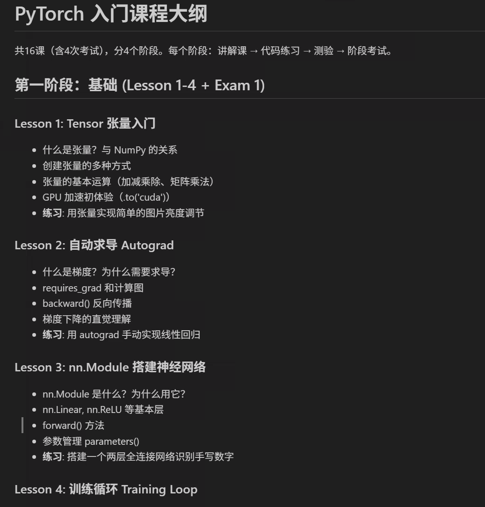

### 2.1：Pytorch - teacher skill

https://github.com/jerry-ai-dev/SKILLS

# 面试技巧

## &#x20; 1. 自我介绍

自我介绍是面试的第一流程，也是你给面试官的第一印象。 **请不要**讲流水账，把简历的内容照着说一遍。他并不是要关注你是谁，而是关注你和岗位的一个匹配度。 时间请控制在1分钟\~2分钟， 时间非常短,  切记讲废话，直接灌输他想要的答案。别说什么籍贯，爱好，别说什么 我很努力很认真空话虚话。**在有限的时间内灌输重点**。

参考模板：

1\. **亮身份（学校/公司） + 核心标签**：eg. 我叫xx,我做过5年AI开发，我擅长Agent，RAG系统，熟悉常见的AI应用和框架，对模型前后训练，推理也有一定的实践。

&#x20;2\. **用结果证明能力**：我用xx方法得到了xx提升。 使用我做的RAG系统，相比copilot 通用工具，回答的时间降低xx, 准确度提升xx。

&#x20;3.**体现诚意：&#x20;**&#x6211;了解过贵公司整个项目，我认为我的技术和它非常匹配，我也特别认可贵公司技术发展方向，特别期待加入这个岗位。

## &#x20; 2.  反问

**核心逻辑**：

这个环节是为了

**弄清你是真的想来，还是只是随便看看**

**你的关注点，关注点的高度如何**

**思考能力：是否对岗位有深度思考**


**参考答案：**

针对不同的面试人员问不同的问题：

1. **业务主管**（通常是一面，通常面试官会是你的入职后的同事）：业务问题，岗位工作内容。比如：

&#x20; **团队的人员结构，人员组成，看看团队的实力如何，是大团队还是小团队**

&#x20;       **上下游人员结构：**&#x770B;看供需是否合理，哪个团队更有话语权，公司更重视什么。比如你面试测试，公司主要做黑盒测试，结果测试只有10人，却需要面对60\~70个开发，那你可以看出测试工程师可能非常忙，而且公司不重视测试，可能测试也没啥话语权。

**&#x20;  对候选人的期待，来了要完成什么任务**。


2. **大老板**（通常面试官会是你的+1， +2，通常是技术面终面，有的也叫主管面）： 公司战略，产品线发展。比如：

   &#x20;  面试业务，产品线，未来的规划，业务属性，是老业务还是新业务，通过这些问题判断下公司是否持续投入，别没几天这活就不做了。


* **HR**： 薪酬，培训，福利，制度，晋升相关问题，比如

晋升窗口，培训机制（体现你想在这个公司长期发展而不是只考虑眼前）

薪资，社保，公积金其实不用着急，这些面试通过了在拉扯薪资的时候会详细聊

## &#x20; 3.  简历编写技巧

（第3小节和第4小节，摘选自清华大学出版社 《大模型工程师面试》 - 算法原理，开发实践与系统部署，基本是原文，有的地方我加了一些自己的见解）

### &#x20;    3.1 简历设计原则

&#x20;     一份大模型工程师简历的项目描述应具备结构清晰，要点明确，可读性强的特点，建议遵循"背景-目标-过程-结果"的四段式逻辑进行表述：

背景：简要介绍项目所属的业务场景，模型目标或者使用需求。例如，本项目旨在构建一个面向医疗文档自动问答的大语言模型系统，服务于某医疗机构的智能客服平台。

目标：明确技术目标或改进方法，如提升相应准确率，缩短推理时间，优化参数量等。例如，通过微调预训练模型，提升医学术语的准确率，实现私有部署。

过程：突出关键技术方案和工程实现细节，明确候选人责任的部分，使用的工具和面临的挑战。例如，负责样本构造与指令模板设计，使用LoRA进行参数高效微调，并基于FastAPI封装推理服务。

结果：量化结果非常关键，建议使用数据展示最终效果。例如，微调后模型在内部医学问答集上准确率提升15%, 平均响应时延降低至600毫秒。

这一结构有助于面试官迅速定位候选人的职责范围，技术能力与项目价值，避免信息冗余或模糊表述。

### 3.2 技术标签的提炼与对齐

技术标签的提炼与对齐是简历项目中非常重要的一环。简历项目需要显式体现与岗位匹配度较高的技术要素。对于大模型方向岗位，建议重点覆盖如下标签维度：

（1）**模型层面**：
&#x20;如 Transformer、BERT、GPT、GLM、Qwen、Baichuan、ChatGLM 等。

（2）**训练与调优**：
&#x20;如 LoRA、QLoRA、RLHF、SFT、Prefix Tuning、Loss 函数设计等。

（3）**推理部署**：
&#x20;如 LLM、Triton、ONNX、INT8 量化、TensorRT、FastAPI、Docker、K8s 等。

（4）**系统组件**：
&#x20;如 LangChain、RAG、向量检索、插件调用、多 Agent 协同等。

（5）**数据处理**：
&#x20;如分词、Token 控制、数据增强、Prompt 构造、语料清洗、HNSW 索引等。

（6）**工程工具**：
&#x20;如 PyTorch、Transformers 库、Weights & Biases、MLflow、Redis、MongoDB 等。

这些关键词既可以作为项目描述中的术语使用，也可以直接在简历中“技术栈”部分单独列出，便于简历筛选系统（ATS）或招聘者快速识别。

### 3.3 亮点挖掘与差异化展示技巧

面试官更关注的并非项目的“完整性”，而是候选人在其中主导了什么，有哪些独到之处，以及是否体现出技术判断力。

因此，需要在细节中挖掘亮点，打造技术区分度。具体策略如下：

（1）**介绍决策过程**：
&#x20;清晰说明选择某种技术方案的原因、对比过哪些方案，以及最终决策背后的技术判断。例如，为什么选择 LoRA 而不是全参数微调，为什么不采用多模态方案等。

（2）**展示问题解决能力**：
&#x20;详细描述遇到的技术难点与解决方法。例如，模型在推理阶段稳定性不足，如何设计优化策略来提升系统鲁棒性。

（3）**强调可复用性或通用性**：
&#x20;若项目成果具有通用价值或被团队复用，可作为重要亮点进行强调。

（4）**突出结果与影响力**：
&#x20;尽量用量化指标来体现项目价值。例如，模型部署后每日处理请求约 10 万条，平均准确率达到 92.3%。

### 3.4 常见误区与改进建议

常见误区与改进建议如下：

（1）**避免大而空**：
&#x20;不要使用“负责大模型微调”“参与多模态部署”等泛化描述。

（2）**避免工具堆砌**：
&#x20;仅列出工具名称而不解释其实际作用与价值是常见问题，需结合上下文说明使用方式与效果。

（3）**避免缺乏结果**：
&#x20;没有明确结果或指标的项目难以评估其价值，应尽量提供量化数据。

（4）**避免逻辑混乱**：
&#x20;过程描述过长但缺乏主线，容易让人抓不住重点。

改进建议包括：

* 多使用“设计”“主导”“实现”“优化”等主动表达，少用“参与”“协助”。

* 按“背景 → 问题 → 技术方案 → 结果”的结构进行描述。

* 明确区分个人贡献与团队成果。

## 4.  面试准备建议

### 4.1 刷题？论文？还是项目经验

面对大模型相关岗位的激烈竞争，许多求职者常常陷入一个关键抉择：应重点投入算法刷题，深耕学术论文，还是积累项目实践经验？

实际上，这三者在面试中的作用各有不同，适配的岗位类型、能力维度与评估标准也大相径庭。本节将从岗位匹配、能力增长路径与面试实效三个层面，系统剖析如何平衡选择刷题、论文与项目实践，制定最优面试准备策略。

#### **4.1.1 刷题**

算法刷题，尤其是针对 LeetCode、LintCode、牛客等平台的高频题，是求职准备中的经典环节。它主要面向以下几类考察目标：

（1）**基础数据结构与算法**：
&#x20;如数组、链表、哈希表、堆、栈、队列、树、图等。

（2）**算法思维训练**：
&#x20;如动态规划、二分查找、回溯剪枝、贪心策略等。

（3）**代码实现能力**：
&#x20;如语言熟练度、边界控制、时间与空间复杂度评估等。

在大模型方向，虽然刷题不像传统后端或客户端岗位那样高频必考，但对于以下情境仍具有重要作用：

（1）**校招 / 应届类算法工程师岗位**：
&#x20;仍以基础算法能力作为初筛门槛。

（2）**多轮面试结构化评估**：
&#x20;刷题能体现候选人的逻辑思维、编码能力与调试效率。

（3）**特定模块工程实现能力**：
&#x20;如稀疏矩阵计算、图结构建模、窗口滑动优化等。

因此，刷题并非大模型面试的核心，但作为基础训练，具备过滤风险、拉高下限、稳定输出的重要价值。建议每日保持 30–60 分钟算法练习，以巩固逻辑思维与编码熟练度。

#### **4.1.2 论文**

阅读、理解并复述经典大模型论文，是构建专业理论框架、展示对大模型认知深度的重要途径，尤其在以下面试情境中具有显著优势：

（1）**算法岗、研究岗、高级工程岗面试**：
&#x20;面试官往往会基于论文提问，如 Transformer、LoRA、RLHF、Constitutional AI 等经典论文所提出的算法与架构。

（2）**原理答题或开放式问答**：
&#x20;通过引用论文结构、图示与结论，可以显著提升答题的专业性。

（3）**简历项目延展问题**：
&#x20;当被问及某模型为何有效、为何选择某种优化策略时，引入论文机制能体现深度思考与行业同步性。

在实际面试准备中，建议分层次构建论文知识体系：

（1）**第一层**：
&#x20;Transformer、GPT、BERT、T5 等主流架构类论文。

（2）**第二层**：
&#x20;微调类（如 LoRA、Adapter）、训练策略类（如 Scaling Law）、对齐类（如 RLHF）。

（3）**第三层**：
&#x20;实际工作相关论文，如 RAG、Agent、Prompt 优化、多模态处理等。

论文阅读不是为了记忆细节，而是为了建立对模型行为、结构、设计的解释力与抽象能力。建议每周精读 1–2 篇，并形成结构化摘要笔记，便于面试引用。

#### **4.1.3 项目**

在大模型岗位的最终评估中，项目经验仍是最具权重的考察指标。相比刷题与论文，项目更能体现候选人是否具备“解决实际问题”的能力。其优势在于：

（1）**真实场景还原**：
&#x20;涵盖模型构建、训练调试、接口封装、系统部署、性能评估等全流程。

（2）**协作能力呈现**：
&#x20;展示候选人如何与团队对接，如何解决跨模块问题，体现团队适应能力。

（3）**创新与优化价值**：
&#x20;工程中解决过的非标准问题、引入的新技术组件、本地化部署技巧等，均为面试中可展开讲述的亮点素材。

企业在招聘大模型岗位时，往往希望候选人能立即参与业务落地，构建真实产品功能或支撑平台系统迭代。这使得有完整项目经历，尤其是端到端执行经历的候选人更具竞争力。

项目经验的准备策略应包括：

（1）选典型项目深挖讲透，不求多，但要逻辑完整。

&#x20;（2）形成一张项目结构图，让面试官快速理解任务边界。

&#x20;（3）围绕结果构建技术故事线，突出问题挑战、解决路径与最终影响。

&#x20;（4）结合代码仓库或在线演示，增加可信度与可展示性。

三者组合策略如下 1-6 所示。

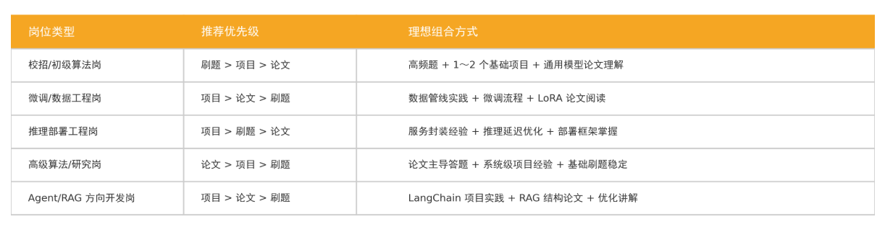

最终目标是构建一个**基础能力稳定（刷题）**、**理论支撑扎实（论文）**、\*\*工程实践落地（项目）\*\*的三维能力体系。

概括地说，刷题、论文与项目经验并非对立，而是服务于候选人综合能力呈现的三大支柱。刷题提升思维与代码基础，论文构建技术深度与解释力，项目体现工程实践与业务关联。在准备大模型岗位面试时，应根据岗位类型与个人阶段匹配选择主线方向，并在三者之间形成协同优势，从而在技术深度与落地能力之间构建真正的竞争力体系。

# 其它问题

（这里来放一下我在面试中出现过的，但不是那么好归类的问题）

## 1. **Python 的异步方法是如何实现的？**

（其实Python语法在llm 的岗位问的不多，我也没有专门准备，但是这个问题确实是出现在了好几次面试中，所以我把它整理在这里，还是建议掌握这个问题。这个其实涉及到了**协程**以及具体的语法，第一次接触的朋友理解起来应该是会有点费劲的，不要着急寻求一次就能弄懂）

&#x20;Python 中最常见的方法是使用asyncio库，使用async 定义异步函数，然后再异步函数中是使用await 来等待另一个异步操作完成。

### **&#x20;1.1 异步方法如何通知事件完成？**

（作为上一个问题的延伸问题，这个也是京东二面被问的到，我们在这里一起复习了）

**1. 使用await 返回结果**

**2.** **使用Future/Task的set\_result 或 回调**

&#x20;

##


## 2. 你在项目中遇到的最难的问题，如何解决的？

（这个问题几乎是非常高频考点，建议必须准备，认真准备一个最好的答案。其实问了这个问题，是把主动权交给你自己，我们需要准备一个自己认为技术难度比较深入的回答和问题，讲出技术深度，把每个问题想透，经得住和面试官反复推敲和追问，那么一旦问到这个问题，就是送分题了。我对于自己这个问题的准备在  **2025.11.字节跳动（豆包）**&#x7684;视频讲解中，讲到了我对于这个问题的准备的方法和一些思路，有需要可以去看视频讲解。我在这一章总结几个我自己挖掘准备的这个问题的回答，大家可以参考，甚至可以照着答，当然你能有自己总结，结合你的项目的版本会更好。）

#### 2.1  模型调用工具失败及排查

（按照STAR 思路总结：Situation, Task, Action,Result)

1.背景与挑战（Situation & Task)

在这个智能日历项目中，为了保证数据隐私和降低延迟，我负责将云端模型迁移到本地部署的 **Qwen 2.5** 模型上。我们的架构依赖于 **Agent 模式**，其中**Function Calling (工具调用)** 是核心，用于触发日历查询和邮件分析等操作。


遇到的最大困难是：虽然 Qwen 2.5 模型本身在权重层面是经过微调支持 Function Calling 的，但在集成到我们的本地推理环境（使用 Foundry Local 作为 Serving 层）时，Agent 总是无法正确触发工具，而是直接输出文本或幻觉代码。


2\. 排查过程（Action & Result)

起初我以为是 Prompt Engineering 的问题，尝试了多次优化 System Prompt，但无效。于是我决定下沉到**协议交互层**进行排查：

* **第一步：抓包与日志分析。** 因为Semantic Kernel 的 Python 版本底层是通过 `openai` 官方库连接模型的，而 `openai` 库底层使用的是 **`httpx`** 库来发送 HTTP 请求。所以我需要在代码中开启 `httpx` 的 **Debug 日志**，就能在控制台看到完整的请求 Header 和响应 Body（Raw JSON），通过这个方式我获取了SK和llm每一轮交互的信息。

* **第二步：协议对比。** 我对比了云端 GPT-4 的成功响应和本地 Qwen 的失败响应。我发现，标准的 OpenAI 兼容协议要求模型返回一个结构化的 `tool_calls` 字段，包含 `function_name` 和 `arguments`。但是结合第一步，我发现llm给到我的结果并没有function\_calls字段，但此时我不确定是llm的问题还是说foundry\_local推理框架的问题，因此我需要进一步看到llm输出的最原始内容。

* **第三步：查找模型原始输出。**&#x56E0;为是Local部署，我可以查看推理服务的后台日志，我在Foundry Local的控制台输出中，开启了Verbose模式，我清晰看到了模型输出了和工具调用相关的\<tool\_call> ...\</tool\_call>相关的字段，这证明模型**本身是有意图进行调用的，**&#x5E76;且qwen2.5 的官方说明文档是完全支持function call的，这也侧面印证了模型本生的调用和输出没有问题。

* **第四步：定位根因。综合以上分析，认定未推理服务层并没有正确解析这些特殊 Token**，导致它没有将其封装进 API 响应的 `tool_calls` 字段，而是作为普通 `content` 字符串返回给了应用层。应用框架（如 LangChain/Semantic Kernel）读不到 `tool_calls`，自然就认为没有工具需要执行。

* **第五步：确认根因后，我采取了“双管齐下”的策略**：

**&#x20;   反馈与修复**：我整理了详细的复现日志和协议对比数据，提交给了 Foundry Local 团队，明确指出了其对 Qwen `tool_calls` 解析支持的缺失，推动他们后续修复。

**&#x20;   架构迁移（关键决策）**：为了不阻塞项目进度，我决定更换推理后端。我调研并切换到了 **`llama.cpp`&#x20;**。

* `llama.cpp` 对各类模型的 Chat Template 支持更加成熟，能够精准识别 Qwen 的特殊 Token。

* 迁移后，我再次查看 `httpx` 日志，发现 `llama.cpp` 成功将模型的 XML 输出转换为了标准的 OpenAI `tool_calls` JSON 格式。

* Semantic Kernel 随即成功识别并执行了本地工具，整个 Agent 链路彻底打通。

#### 2.2  MCP 连接偶尔失败

（我是以这个我们笔记中的RAG项目为例展开的，如果你项目写了一个MCP的Server，使用stdio通信，那么你就可以使用这个例子。你要弄清楚这个例子，你得懂得MCP的原理，特别是如何通信，它的协议是啥样的）

（按照 STAR 思路总结：Situation, Task, Action, Result）


**1. 背景与挑战**

在这个模块化 RAG 项目中，我负责实现 MCP Server 模块，通过 MCP协议将 RAG 检索能力暴露给 AI 客户端（如 Claude Desktop、GitHub Copilot）。我们的传输层采用的是 stdio 模式——Server 作为子进程启动，通过 stdin/stdout 与客户端进行 JSON-RPC 通信。


遇到的最大困难是：Server 独立运行时一切正常，所有 JSON-RPC 消息的构造和处理逻辑都验证通过了，但 AI 客户端（Claude Desktop）连接后，要么在握手阶段直接失败，要么用了几次后突然断连。客户端侧只显示一个通用的"连接失败"错误，Server 端也没有任何异常日志输出。


**2. 排查过程**

起初我以为是 JSON-RPC 消息格式有问题，比如 protocolVersion 字段版本不匹配，或者 initialize → notifications/initialized 的握手顺序不对。我逐一检查了 protocol\_handler.py 中所有消息的构造和分发逻辑，甚至写了单元测试验证每个 Tool Schema 的格式，但没有发现任何问题。


第一步：**跨进程协议流拦截**。 由于问题只在"客户端连接时"出现，单独跑 Server 是无法复现的，打断点也没有意义——Server 端代码逻辑本身是正确的。而现成的 AI 客户端（Claude Desktop）内部是封装好的，它从 stdout 读到数据后直接 json.loads() 解析，失败就报"连接失败"然后断连，不会把 stdout 管道中的原始内容暴露给你，你只能看到一个笼统的错误提示。所以我决定自己写一个最简陋的"客户端"来拦截原始通信内容。具体做法是用 subprocess.Popen 将 MCP Server 作为子进程启动，将它的 stdin/stdout/stderr 都 pipe 出来，然后手动构造 JSON-RPC 消息（如 initialize 请求）发送到 stdin，逐行读取 stdout 返回的原始内容——这样就能看到客户端真正"看到"的是什么。


第二步：**逐行分析协议流**。 通过这个测试框架，我终于看到了客户端视角下的 stdout 原始内容。我发现在合法的 JSON-RPC 响应之前，stdout 里夹杂了非 JSON 的纯文本行，比如 "Modular RAG MCP Server - Starting..." 这样的启动提示信息。客户端把这些内容当 JSON-RPC 消息解析，json.loads() 立刻失败，连接随即断开。


第三步：**定位根因**。 知道了症状后，我排查了这些"脏数据"的来源——项目入口文件中有 print("Modular RAG MCP Server - Starting...")，Python 的 print() 默认写入 sys.stdout。此外，Python 的 logging.basicConfig() 虽然默认绑定 stderr，但代码中没有显式指定 stream=sys.stderr，存在隐患。


第四步：**确认协议规范**。 我回溯查阅了 MCP 官方协议规范（Transports 章节），发现里面用了 RFC 中最强的禁止语气明确写道：


"The server MUST NOT write anything to its stdout that is not a valid MCP message."

"The server MAY write UTF-8 strings to its standard error (stderr) for logging purposes."


这证实了我的判断：stdio 模式下，stdout 是协议专用通道，客户端会将 stdout 的每一个字节都当作 JSON-RPC 协议内容解析。任何非协议内容都会导致解析失败。而 stderr 是独立管道，客户端根本不会读取它，所以日志应该全部走 stderr。


**3. 解决方案与结果**

确认根因后，我采取了以下措施：


**消除所有 print**：将 Server 启动路径中所有 print() 改为 logger.info()，确保没有任何业务代码直接写 stdout；

**显式日志重定向**：将 logging.basicConfig() 显式指定 stream=sys.stderr，确保所有 logger 输出走 stderr，不留隐患；

**协议纯净度集成测试**：将排查时写的"简陋客户端"正式化为 subprocess-based 集成测试（test\_mcp\_server.py），模拟完整的 MCP 握手流程（initialize → notifications/initialized → tools/list），逐行验证 stdout 中每一行都是合法的 JSON-RPC 消息。这个测试成为了 CI 的守门测试，确保后续任何人加的代码都不会再污染 stdout；

在 server.py 的模块 docstring 中加入了明确的注释："ensures stdout only contains protocol messages while all logs go to stderr"，作为团队开发规范。

修复后，Claude Desktop 和 GitHub Copilot 均能稳定连接，成功调用 query\_knowledge\_hub、list\_collections 等 MCP Tools，整个 RAG 检索链路在 AI 客户端中彻底跑通。

# 答疑

这一部分我会总结一些粉丝朋友给我的提问和我的回答。我相信大家在学习转行的路上会有一些困惑，这些困惑可能是共通的，所以在这里，我把我回答的一些粉丝朋友的问题汇总。这样可以给大家提供参考。

## 1.Agent项目浅，如何优化

**粉丝提问：**&#x6211;的Agent项目做的很浅，没有一些复杂的机制，就是简单的意图识别+workflow, RAG部分也是别人做的。面试时候不太好吹怎么办？

**回答：**

是的，确实是建议继续深入优化：

1.从Agent层面。建议引入更多深入的地方。比如记忆模块，长短记忆怎么做的，有没有什么高级策略。 能不能结合一些策略让客服记住长期状态，回答更符合用户特点。能否有一些反思，规划功能。参考我笔记中推荐的《Agentic design pattern》 的设计模式，能不能加一些高级功能。

2.RAG.我自己也有类似的问题，我的项目中RAG做的不深入。我的情况是自己手搓了一个RAG项目，你可以看到就在笔记中过的。既然你项目都有现成的RAG,，虽然不是你做的，但你去把代码弄明白，RAG的各个机制弄清楚，弄懂了就是你做的啊。只要你掌握了RAG知识，把这块就变成是你自己做的。

3.推理优化。你完全可以参考我笔记中的思路。如果你仔细看我的笔记，我是从工程出发，应用是我的强项，但是为了处理面试官会问我算法的问题。我专门按照自己加入了推理，微调，量化的机制。 这里不复杂的，你要去学相关知识，然后把流程用最简单的方法走一遍，然后准备下相关问题，加入到简历，自信去说就行了。怎么做的我笔记里都有，你完全可以复用。 这里不用担心掌握不深入。原因是通常应用的岗面试官即使问了算法，他也问不深，他自己不可能做到又专应用又专算法的。 所以在我们时间有限的前提下，先把应用弄好，算法按我的思路先去走个大面。

**粉丝追问：&#x20;**&#x6211;不是真的在生产项目做的，只是自己美化的，那这样会露馅吗？

**回答：**&#x4E0D;会啊，大胆一点，我不是让你纯编，我是让你做一遍。我自己项目也是我自己做了一遍量化微调的，很简单的，你又不用负责效果，把流程走通，把面试会问的提前想好就行。常见的问题我都汇总了，你可参考，而且实测一般应用岗问的算法，问了也不深入，我的笔记里都是一次次迭代，你就照着我的笔记复习。我就是完全根据面试官问的情况来总结的答案的深浅，如果他问的深，我的笔记也会写的深入。所以你算法这部分，你把我笔记的内容弄懂，结合你的情况想一想不用担心，这就是我实践总结出来的，面试完全够用，而且我还在一直迭代，你就放心照着准备吧。


## **2. 网页RAG项目选型**

**粉丝提问：**&#x6211;现在做的项目是一个在网上搜索相关演员信息的项目，然后匹配准确度。目前我呢提是召回的文本和内容不想管，有一些什么优化方法啊，我需要从多个维度，比如名字+项目+身份 去联合搜索吗？分块我用什么好？用你的项目的递归分块吗？ 我需要使用数据库吗？怎么包装一下呢？我目前项目就是用Langgrpah写的demo，能帮我做一下技术选型吗？

**回答：**&#x31;.分关键字检索思路的是对的，但是你看是不是不是分开检索，而是把这些关键词合并。拆开反而会放大噪声。比如 张三，红楼梦，贾宝玉，你提取这三个关键字，然后组合搜索。

2.分块问题。分块问题也不是说用我的递归切块比较好。我这个方法是比较通用性的方法。针对你的问题，网络文档，通常噪声比较大，可以先去噪声（导航，广告之类的），提取出纯文本以后可以用最普通的滑动窗切块。因为一般你要的信息，比如张三，红楼梦，贾宝玉，可能就在一个连贯的chunk中，用递归还容易切掉信息。

3.分块匹配一般就是粗排和精排。 你说的向量核实相似度，这里其实有不同方法的向量可以做选型，比如BM25，OpenAI 的embedding等。你图方便可以用BM25做粗筛，然后精筛是解决你说的不相关问题的核心。可以用LLM匹配，也可以用Cross-encoder，这是两个经典方法，解决你说的召回内容不相关问题。

4.向量存储，网页搜索确实可以不做本地化存储，动态筛选了以后去做切分召回，然后销毁，这也是合理的。


## **3. 我的情况可以入行大模型吗？**

**粉丝提问：**&#x535A;主你好，我本人是24年毕业生，985硕士，机械专业，毕业当年去了一家国企，本来岗位是机械研发岗的，但由于公司在数智化转型，去年被抽调去参与了一年的数智化开发工作，算是有一年的后端开发经历。我算你最早的那一批原始粉丝\[害羞R]，也买了你的学习资料，非常详细，但虽然都是0基础ai经历，咱们的0基础还是差的蛮多的，你一直从事的是互联网行业，而且有可以加入ai开发的场景。但我觉得我只能从网上找项目，且几乎不太可能有机会将项目和我工作场景结合起来，但看你的面试反馈，似乎面试官对真实的项目开发经验更看重，我这样跟着网上的项目学习（即使有自己的改进），这样简历能过吗\[哭惹R]，转型的可行性大吗，心理挺没底的。

**回答：**&#x9996;先回答你的问题，你一定可以转行的。 我能理解你转行的时候其实心里觉得没底，这个大家都是这样的。我在当初想转行的时候，也很迷茫，我问了我大牛同事，他的回答是没有能不能转，只有想不想转。经过我自己的实践，我的答案是转到大模型没有你想象的那么困难。

首先以大模型开发为例，你应该把他的门槛和定位为普通的开发，只不是大模型。 从技术角度来说，你要做的是补齐大模型应用相关的知识，文档里都有我就不说了。你从后端开发转到大模型开发，本身你后端开发就多少有一些优势（相比前端，测试，客户端）转到大模型的岗位。&#x20;

第二个，学历挺好，985硕士做开发足够了呀。很多学历比如一本这样子，其实做大模型开发也没太大问题，门槛对标的都是普通开发，不要因为沾上大模型就把他想的很难。

第三个，你工作才一年。转行这个事情真的是年限越长越难转，一年工作时间，甚至是3年时间，企业对你的包容度都很高的。甚至可以放宽到5年。我自己是4年转行开始面试的，企业对我的要求只会比你高。

第四个，面试官看重真实项目。这点确实是，毕竟是转行，都是自己做项目的，我们的项目相比天然做大模型开发的一定会有劣势，这个没办法。但是有很多解决方案，第一个不断加深项目，我一直说项目不是一下子完成的，我在面试的时候也是一边面试一边做项目。第二个就是把项目往工作上靠，结合工作场景。你说看我的面试反馈，很多面试官看重真实项目，是这样的，即使到现在，有的公司还说我项目不深。 但是你也应该看到反面啊，就面试不到20家，我就有6个offer。京东面试官即使我没做过算法，+2还很看重我，给我发算法Offer, 薪资也很高。阿里的面试官，你去看我的面经，到后面他都不在乎你项目做到什么程度，他和我讨论未来的架构，未来的扩展，他更看重的是思维能力。 你比我工作经验少3年，企业对你只会更包容。 要学的东西太多了，我一直在补充。去年12月份的我和现在的我，能力又不一样，我现在特别相信，我继续学习，不断掌握新知识，不愁面试的，我的目标已经从应用编程 大模型全栈或者算法了。

所以怎么看，我觉得你都不用心里没底啊，更重要的是，这些东西你能不能掌握，能不能把RAG,AGENT等应用知识都学透，甚至是在学好算法，部署，入行真的没有你想的那么难。迷茫的时候就多学一下，当你真正学好了，你去面试了，市场给你答案的时候，你的问题都会解答，而且你会发现做大模型并没有你想象的那么难。而且大模型现在缺口那么大，岗位很多的，你看我笔记2025年度报告，这么多岗位，怎么会没有你一个985硕士的位置呢，你要想的是尽量学好，拿更高的Offer，而不是犹豫能不能入行。

# 面试实战

（朋友们，这里有一些留白的地方是因为我会陆续整理，我留白是先做一个记录，后面会陆续整理。目前我在更新项目部分，设计项目和写代码，所以更新面经稍微会慢一点，请大家理解下，如果哪个朋友特别需要哪一些面经，但是我又没更新的，可以私信我，我可以先告诉你大概问了啥）

## 2025.10 安克创新

### 岗位介绍

文本大模型算法工程师

【工作职责】

&#x20;1.持续跟踪业界最新的文本大模型，提升自研多语言LLM的语义理解、推理、指令遵循、工具调用、多轮对话能力

&#x20;2.构建并不断提升业务子Agent能力，包括但不限于智能助理、知识问答、设备控制、情感陪伴、场景业务交互等方向。

&#x20;3.持续跟踪业界在RAG、长期记忆、Agent等方面的进展，提升底层核心模块能力

&#x20;4.构建基于大模型的多租户对话系统中台，承接公司不同产品和业务的优化、落地需求

【职位要求】

&#x20;1.计算机、人工智能相关专业硕士及以上学历，有NLP、对话等方向算法经验者优先

&#x20;2.熟悉主流开源预训练大模型，熟悉常用的大模型后训练方法，有相关项目经验者优先

&#x20;3.熟悉RAG、Agent等大模型系统理论和场景优化方法，具备实际应用落地经验者优先

&#x20;4.熟练应用torch、LLaMAFactory、OpenRLHF、VERL等一个或多个框架

&#x20;

### 反思

一面是通过了的，一面完了需要做IQ,EQ题，逻辑题 + 1道编程题（要求用AI，然后会记录你给AI的提示词），需要达到60分，否则直接不通过。 我就是这个题没做好，所以约不了二面。

最终结果是：一面过了，但是过了一面之后有一个测试题，类似于IQ, EQ 那种，因为本身没太想去，其实也没太认真对待，这个测试挂了，如果真的想去安克的，注意这里自己要复习下，这个没过直接没二面资格。

### 一面

自我介绍

1\. 智能日历系统用的什么框架去做的？

1.1 这个架构底层使用一些什么框架做的？单一Agent还是多Agent？

（可以讲当google的《Agentic design patterns》中的prompt chaining来丰富答案。）

使用的是单一Agent。 使用Prompt/Pipeline模式，将日历场景分而治之，拆分成更小的，更易管理的子问题，每个子问题设计专门的提示单独处理，系统是一个多步llm的pipeline，但还是属于一个单一Agent。

&#x20;

2\. 日历系统底层是有一个接口，他是mcp server还是原始的server, 你这里进行了进一步的加工呢？

&#x20;    （我认为这里面试官以为我的项目Agent是一个server端，但是我的项目其实是客户端，集成的MCP Server，所以这里主要是做了一个澄清和解释。）

&#x20;

3.日历系统中的增删改查这些逻辑的操作是如何做的？

（其实就是Agent接入的工具，有一些工具是本地的API, 有一些工具是集成的MCP中的tools, 总之这里就是和面试官解释清楚就好）

&#x20;

4.如果真实用户想要删除某一个事件，但是这行程很重要，你不能直接删，这个怎么办？

（这个其实是项目体验一些的问题，解释清楚就好了，通常Agent调用工具的时候，都会有一个弹窗，让用户选择是否进行下一步）

1. 如果用户输入了某个事件，可能是一个模糊的情况，会有多个类似的事件，怎么确定是哪一个。

(这个其实使功能相关问题的澄清，不做解释，大家不用参考，我记录只是为了完整性)

&#x20;

* 你这个Agent中集成了哪些工具？

&#x20;

* 这个过程中有几次大模型的调用？

* 整套的流程是完成交给大模型还是自己会有一些实际的控制？

  * 如果交给大模型，那你怎么去知道它执行的结果是否正确呢？

（这里就可以回到知识点，Agent的评估，在Agent的评估质量指标中，有一项指标就是去监测Agent路径/轨迹的正确性。参考《Agentic design patterns》第19章Chapter 19: Evaluation and Monitoring (code)， 里面有一小章节衡量Agents trajectories 其实就是这一问题的答案）

&#x20;       我们需要分析Agent**执行的轨迹**，**工具执行**的情况，包括为了达成目标所采取的步骤。然后将实际操作和预期进行比较。包括可以自己指定匹配的标准：完全匹配，顺序匹配（动作顺序一致，允许额外步骤），任意顺序匹配（动作正确即可，顺序不限）

* 怎么去监测这个路径是否正确呢？

（依然参考参考《Agentic design patterns》第19章Chapter 19: Evaluation and Monitoring (code)。 这小节在讲完要评估agent的轨迹后就讲了如何评估）

我们可以test文件，可以使用json文件格式。 每个test文件记录某会话中，每个回合的用户请求，**预期的工具调用轨迹**，中间响应，最终响应，最终的结果以及预期的结果。通过测试文件收集不同场景下的运行结果，整理最终轨迹评估指标。

* 数据集是怎么构建的？

有几种方式可以创建数据集：

1\. 手动设计：人为标注生成高质量的数据集。

2\. 使用LLM辅助生成，人为干预检查。

3\. 从真实用户的日志中收集请求->筛选高置信度轨迹

9\. 简单介绍你的项目按摩房智能预约系统，怎么去做的？

10\. 你的RAG系统中数据库是如何存储的？

（想清楚你的系统，RAG数据库存的是什么？怎么存的？ 为什么这么做？）

整个系统采用Azure OpenAI - text-embedding-ada-002生成**嵌入向量**，使用FAISS 生成**索引**，最后将他们存在**sqlite**当中。

采用**sqlite**去存储对应的知识库的嵌入向量和索引，因为数据量不大，sqlite更轻量级。(如果数据量大了就要使用Milvus/Pipnecone/Weaviate)的专业向量数据库。&#x20;

&#x20;

11\. 你的RAG系统是怎么去评估系统质量的呢？

（见RAG系统 RAG评估指标部分）

12\. 我们用的Bert 更多一些，你知道Bert和GPT的区别吗？

（见LLM模型结构 – Bert VS GPT 部分）

13.Agent从用户输入到第一次输出，大概的时间是多少？

14\. 过往训练中有没有做过大模型微调/训练相关工作？

15\. 简单介绍一下DeepResearchAgent 的框架？

代码题：Leetcode 240

### 视频讲解

我用夸克网盘分享了「安克科技文本算法工程师一面.mp4」，点击链接即可保存。打开「夸克APP」，无需下载在线播放视频，畅享原画5倍速，支持电视投屏。

链接：https://pan.quark.cn/s/04aeb8d38e5d

## 2025.11 灵动时刻

### 岗位介绍


### 反思

全程30分钟，没有自我介绍，没有代码题。秒挂。

大概原因我认为一个是多模态的能力，另一个是大模型算法知识答的不好。

另外我觉得这个面试官可能也不是特别想招人，30分钟草草结束，相比于大公司一般有很多面，考察不同维度，综合结果去进行评估，小公司的招聘流程显得就有点随意和草率，甚至有一点感觉面试官有点是在套方案，也并不是很想招人的样子。如果想招，感觉面试官是想招一个有**Agent/RAG相关经验，落地经验**，也懂**多模态**，也懂**算法**，最好一上去就能直接干的选手。

### 一面

1\. 你之前做的这个实时通信系统，底层通信协议是什么?

&#x20; (最早在腾讯做的项目，和大模型无关，大家无需关注)

2\. 你重点讲一下智能日历系统是如何用AI 去串这个流程的？

（这个还是结合自己实际项目去说，我的这个项目用的是 prompt chaning模式，（谷歌的《Agentic Design Pattern》我基本围绕这个去讲的）

3\. 你认为你讲的这个开发模式是否有一定的范式和通用性。

（当然有了，这种模式本身就是Google定义的常见的框架/Agent开发模式）

&#x20;  **Prompt Chaining**是**具有范式和通用性**的，它是一种线性执行的设计模式，适用于将复杂任务拆解成多个连续的LLM调用，每一步输出作为下一步输入，不依赖于多个Agent协作，通过单一代理在多个阶段逐步处理任务，常适用于多轮推理，任务分解的系统。

4.现在Agent有很多方向，比如生成代码的方向，以及生成图片/视频的方向，你想做哪一个方向。

（我理解是纯文字处理的Agent， 以及多模态相关的Agent，这个公司肯定想要倾向于后者的，然后我确实没做过图像/多模态，所以回答肯定不让面试官满意）

5.你们研究生项目当时采用深度学习做的还是传统算法做的？

（这个就扯太远了，对大家没有参考）

6.语言模型网络结构为什么编码很快，解码很慢？

&#x20;        <span style="color: rgb(143,149,158); background-color: inherit">编码器和解码器区别</span>

7.照你所说，Transformer是一个比较并行的结构，但是大家拿他来做自回归，它完全是一个串行的，这个会使得他利用率有很大问题，你能谈一下你的理解吗？

（先承认这一问题）对的，Transformer的优势在于**编码阶段可以高度并行**，可以通过**自注意力机制同时**处理整个序列的所有位置，使得训练时效率，GPU/TPU利用率很高。 但是推理阶段，**如果采用自回归生成**，每次只能预测一个token，再把它拼接，无法预测下一个token，因此无法并行，延迟比较严重。

（强调必要性）但是由于语言的自然属性，**它是强序列相关的，未来的token分布依赖于过去的token**，所以**非自回归训练的生成质量往往不如自回归**，容易出现流畅性和一致性问题。所以常见的大语言模型还是使用自回归。

(解决思路)但是我们仍然可以通过比如K**V缓存的方式减少重复计算**，**提升推理速度**，**Speculative Decoding的方式来减少串行步骤&#x20;**&#x4ECE;而做出一些优化。

8.你如何使用一个Agent来做一个对话系统？

8.1 如何让这个对话系统可以保持记忆功能呢？

5 Agent<span style="color: rgb(143,149,158); background-color: inherit">的记忆功能是如何实现的？</span>

8.2 那这个记忆会越来越长，要怎么办呢？

我们会维护这个上下文窗口，当超过指定窗口的时候，会进行总结，提取关键信息和要点，因此这个记忆不会无限制增加的。

&#x20;     8.3你如果每次都会带上之前的上下文，那他的时间复杂度会不会成倍增长？

理论上来说，基于transformer的架构，计算复杂度和上下文关系成二次关系O(n^2), 意味着上下文翻倍，成本计算会增加4倍。

但是实际上，我们可以使用一些比如**稀疏注意力**，**分块处理，缓存机制以及GPU/TPU的并行计算**的能力来缓解这个性能问题。

9.你这个RAG数据库中的向量是怎么拿到的?

系统采用Azure OpenAI - text-embedding-ada-002生成**嵌入向量的。**

### &#x20;视频讲解

我用夸克网盘分享了「灵动时刻一面.mp4」，点击链接即可保存。打开「夸克APP」，无需下载在线播放视频，畅享原画5倍速，支持电视投屏。

链接：https://pan.quark.cn/s/dd1e85265158

## 2025.11 滴滴Agent开发工程师

### 岗位介绍

**工程方向**

我们是滴滴网约车 MPT 部门的大模型工程团队。团队与顶尖算法科学家紧密合作，致力于构建稳定、高效、可扩展的大模型应用基础设施，将前沿 AI 技术转化为可靠的线上服务，打通数据、技术与业务的“最后一公里”。

我们的使命是驱动 AI 在智能运营与核心交易场景中的应用革新，通过坚实的工程力量，让大模型真正赋能业务，提升亿万用户的出行体验。

在这里，你将不是 AI 的使用者，而是 AI 服务能力的构建者。

***

**工作职责**

* **大模型应用开发**：设计和开发基于大模型的应用系统（如 RAG、Agent 等），将算法原型转化为高性能、高可用的工程产品，解决实际业务问题。

* **AI      应用架构设计**：构建和优化大模型应用的服务架构，包括服务编排、工具调用、多模型协同等，确保系统的高性能和可扩展性。

* **AI      数据链路建设**：负责大模型应用所需的数据链路，包括非/结构化数据处理、向量化、存储与检索等，打造高效、稳定的数据处理管道。

* **服务稳定性保障**：保障线上服务的稳定性和高可用性，建设完善的监控、告警和应急响应体系，持续进行性能优化（如延迟、吞吐量）。

* **技术落地与协作**：与算法团队紧密协作，理解模型能力与业务需求，共同制定技术方案，推动从模型到服务的快速迭代与落地。

***

**任职要求**

* 计算机、软件工程等相关专业本科及以上学历，拥有 1-3 年后端开发经验。

* 扎实的编程基础，良好的数据结构与算法功底，熟悉 Linux 开发环境，熟练掌握Go / Python / Java 中至少一种语言。

* 熟悉常见后端技术栈，具备微服务、分布式系统（如缓存、消息队列、RPC  框架）的设计与开发经验。

* 具备良好的系统设计能力，能够独立分析问题、设计方案并推动落地。

* 对大模型技术有浓厚兴趣和热情，具备出色的学习能力和技术钻研精神，愿意在该领域深耕。（我们尤其欢迎这一点）

***

**加分项（具备以下一项或多项者优先）**

* 有 RAG、Agent 等大模型应用的实际开发经验，熟悉 LangChain 等主流应用框架。

* 有大模型服务部署、推理优化（如 vLLM）或 MLOps 相关经验。

* 有高并发、高可用系统设计与实践经验，主导或核心参与过复杂线上系统的稳定性建设。

### 面试点评和学习建议

整个过程面试官翻来覆去都在探讨Agent/传统业务之间的区别，Agent真正存在的意义，开发Agent和开发后端框架有什么区别。整个过程偏向于和面试官进行思维的碰撞，交流，这些问题可能没有标准的答案。需要能自己深入思考，有过一些业务经验和理解，才能够答出自己的想法。我在面试的时候也谈了一些自己的想法，不过面试官可能觉得很不满意。这一部分我就没有总结标准答案，大家可以自己思考，从知识点的角度，参考不大。唯一我认为可以作为复习准备的是第8，9个问题，我们可以结合美团龙猫的最新论文去回答，并且建议大致阅读论文，学习这个论文中的评估Agent效果的方法：如何准备测试集/如何评估。

### 一面


1\. 怎么看待大模型场景的Agent, 比如说我们在大模型之前写workflow，现在换成了Agent, 或者之前是小模型换成了大模型，仅此而已。你认为真的Agent相比过去解决了更多的问题吗？为什么？


2\. 你认为之前的传统行业写workflow和现在的行业agent，有本质的区别吗？


3\. 你去构建一个Agent架构或者系统的时候和传统的后端架构业务架构来说，有一些什么不一样的地方吗，有哪些是要额外关注的地方吗？


4.你提到性能问题，你之前做Agent的时候有提到大模型推理加速相关问题吗？

&#x20; 常见的推理加速有以下手段（我复习的重点显示应用-再是微调：SFT强化学习/模型理论基础，我认为这个推理加速的手段偏离应用太多了，除非其它都学完了，否则可以暂时先放着）

**算子优化**：用更高效的矩阵乘法、卷积实现（比如 cuBLAS、FlashAttention）。

**图优化**：把计算图融合、消除冗余（ONNX Graph Optimization、TensorRT）。

**量化（Quantization）**：把 FP32 降到 INT8/FP16，减少计算和显存占用。

**剪枝（Pruning）/稀疏化**：减少不必要的权重或连接。

**编译器加速**：用 TVM、XLA、OpenVINO 等编译器生成高效代码。

**批处理/并行调度**：多请求合并、流水线并行、张量并行。

**缓存与 KV Cache 优化**：在 Transformer 推理中缓存注意力键值，减少重复计算。

**硬件适配**：针对 GPU、CPU、NPU 做特定优化。

5.你做Agent系统的时候，你有没有遇到一些比较深刻的问题，或者设计Agent架构的时候怎么设计的？比如比较复杂的问题，很难解决的问题。

&#x20;  我这里提了Muti-agent架构和prompt -chaining架构，还是我一直提的《Agentic desgin pattern》种对应的两个小节的内容。解决复杂的问题是深入Agent多轮对话框架，去探索多轮对话Function calling能力的bug，不过显然面试官不感兴趣。


6\. 你刚才提到了Multi-Agent，你认为不能用传统的业务逻辑来解答？为什么一定要用Agent来解答。


7.传统的业务后端框架，我们通常是将业务问题抽象成一个标准化的流程，设计成比如算子化等标准范式，这是传统解决大模型的思路，在大模型场景里，在大模型场景化中，可能很多你需要在原来的工作环境中去抽象或者标准化的东西它自己已经搞定，他不在需要你去设计什么，那这个时候在Agent中，就变成了下限很低，上限很高的东西，有些人可能就根据可视化的界面拖拽就创建了一个Agent，RAG，那这个时候你觉得真正需要工程在里面参与的部分还存在吗？或者说你觉得在这里面到底要解决一个什么问题？还是说从业务的场景下就退下来了，真正去做像coze, dify 这种平台性的架构就可以了。


8.你最近有没有看过一些和Agent相关的前沿的技术报告，论文，或者先进的技术。

9\. 除了Agent框架之外，比如更偏算法相关的东西比如论文和技术报告，比如前段时间有大厂推的针对于Agent的模型的训练，我不知道你怎么理解在大模型的场景下如何去增强Agent的效果。比如我们认为一个复杂的项目在一个规划的阶段规划它大概做哪一步，用哪一步，哪一个工具是好的，我们一直认为这件事是不可训练的？你怎么证明某一步的工具调用是对最终的结果有结果。因为我觉得有可能一个复杂的任务，你只是说这一步工具的调用是有利的，但是你很难说对于最终的结果是有帮助的。像很多的Agent领域给的一些比如美团的龙猫，他们都在证明他们做的优化对Agent是有帮助的。我不知道你怎么理解这个事，有没有看过相关的事，你觉得工具的调用本身是可训的吗？

&#x20;      见笔记部分：《3.1 如何评估Agent工具调用对系统产生的影响》

&#x20;

10.算法题

寻找众数。并且要求不存在众数返回-1.

（OpenManus, LangManus）

&#x20;

### 视频讲解

我用夸克网盘分享了「滴滴Agent开发工程师一面.mp4」，点击链接即可保存。打开「夸克APP」，无需下载在线播放视频，畅享原画5倍速，支持电视投屏。

链接：https://pan.quark.cn/s/06759119a110

## 2025.11 京东零售平台算法开发

### 岗位介绍

没有jd，以下是HR的一些介绍

京东零售平台产品中心，交易算法团队。

有大模型应用，比如生成式推荐，生成式对话，意图识别，多智能体。

### 反思

这是一个算法工程的岗位，但是全程面试官其实没有太问算法的问题，后来和我说是因为看我过往的经历都是在做业务，没有太为难我。从面试的问题来说，都是一些比较RAG/Agent领域比较基础，也比较重要的知识点，这块比较有参考价值。 另外考察的某些问题也是属于传统行业的基本知识，比如并发。 在一面和三面过程中，也用不同形式考察了算法题。 虽然没有问大模型算法的问题，但是其实很多问题也问了你有没有一些算法方面的经验。 不难看出这次面试官比较注重的点是：

&#x20;  Agent/RAG 基础知识，经验。

&#x20;  模型算法相关经验：推理，微调，强化学习。

&#x20;  （Leetcode题目）

&#x20;  传统的开发知识


### 一面

1\. 自我介绍

2\. 你的第一段工作经历用的是什么技术，什么语言？


3\. 在第二段工作经历用的什么语言？你的工作和Langchain, Langgraph有什么关系。


4\. 你开发的Agent是用在客户端上还是用在哪里？


5\. 你这个大模型是单机版的还是说由一个后台来服务的？


6\. 微软也有一个些开源的Agent开发框架，你了解吗？

（代码平台： AutoGen, Semantic kernel。 低代码平台：Copilot studio，Dify）

&#x20;  参考笔记部分：1.1常见的Agent开发框架


7\. Langgraph的流程编排是如何实现的？这些基本组件之间是如何配合的？他这个图是怎么运行的呢？


参考笔记部分：1.3.2 LangGraph 过程是如何流转1.3.2 LangGraph 过程是如何流转的？


8\. 讲一下Agent框架如何管理过去的记忆，我们怎么去管理历史记忆的状态?

&#x20;    参考笔记：5 Agent的记忆功能是如何实现的？


&#x20;    8.1 长期记忆信息量很大的时候，你怎么处理？

&#x20;   （ 如果我们理解了上一个问题中，长期记忆如何实现的？ 这个问题应该很好回答，只是向面试官具体再讲解一下长期记忆具体的实现）

在Agent的系统中，长期记忆确实可能数据量很大，所以我们可以使用 将过往历记录使用向量数据库的方式进行存储。使用向量数据库中，天然的就是会对数据进行压缩，可以解决一部分历史信息过多的问题。

在我们要使用这个长期记忆的时候，我们就可以通过向量数据库的语义搜索的功能，召回相关的感兴趣部分，输入给大模型。


&#x20;    8.2 你说到匹配的时候，比如说你根据“今天天气怎么样”, 想要召回的答案是“今天天气很好”, 那你这个时候是根据问题召回答案，这能召回的了吗？

&#x20;     （参见笔记部分： 稠密向量和稀疏向量 对称检索和非对称检索）

&#x20;     召回的了。这就是典型的非对称搜索，你讲一下你的理解就好了。 因为这一部分和稠密向量/稀疏向量 密不可分，所以可以顺带讲一下对应的稠密向量和稀疏向量，以及对应的模型。


&#x20;    8.3 你讲到这个消息是片段式的。比如用户问今天天气怎么样，假设他问的时候是10月30号，数据库中有很多条答案都是在回答今天的天气的，有些回答是回答的10月1号，有的是10月30号，你怎么保证你召回的回答是针对10月30号呢？

&#x20;    （这是一个综合的问题。只要能理解我在笔记RAG 部分整理的。召回优化策略，其实你就可以从不同的召回策略中入手，解决这一问题）

&#x20;     比如说，采用 **内容查询优化 +结合元数据召回** 。&#x20;

&#x20;   &#x20;**&#x20;内容查询优化**： 当用户的提问过于模糊的时候，我们通常会使用一些查询优化方法，扩充上下文的信息，对查询内容做处理。 比如对于这个问题，我们做了处理以后，原来文本 "今天天气怎么样" 就会变成 "10月1号的天气怎么样"。

&#x20; &#x20;**&#x20;  再使用结合元数据召回**的方法，在每个召回文档中，元数据会有一些标签，比如日期，结合这两个技巧，就能够准确实现用户问题的召回了。

&#x20;   &#x20;

9\. 提到RAG，如何提高召回的准确性？

&#x20;    各个方面都可以答。比如从**切块策略/召回优化策略/ 数据库的选取/ 检索的方法&#x20;**&#x7B49;各方面都可以去回答。这个题太宽泛了，没有固定的标准答案，但是不难。就是我在RAG里总结的RAG的各个步骤都理解了， 就会发现可以从很多地方回答。如果不会，就先去理解一下RAG 基础知识和我整理的笔记部分。

&#x20;    如果还是不会答，那你其实就答笔记部分，RAG 常用的召回策略部分就行。

&#x20;&#x20;

9.1 讲一下切块的策略是怎么切的，有什么策略，各有什么优势？

&#x20;  参考笔记 RAG 切块策略部分。

&#x20;

9.2 把一个问题转换成query这里有一些什么优化的方法？

&#x20;  可以去讲 **内容查询优化方法**，参考笔记 RAG 召回优化策略部分。


10\. Langchain里拿到这个流式响应，怎么实现的，使用的一些什么协议？

（涉及的点很多： **Langchain的runnable, Python的异步迭代器**，以及传**输协议SSE**， **Websocket, Http Chunked**. 如果都弄得很明白需要花一些功夫，时间不够的同学可以先理解掌握本题，具体深入的细节可以先放一放)

在 **LangChain** 中，所有核心组件（模型、链、Agent 等）都被统一封装成一个抽象类 **Runnable**，它定义了标准调用接口，包括 `invoke()`（一次性输出）和 `stream()` / `astream()`（流式输出）。流式输出的这两个方法通过 Python 的异步迭代器，让开发者可以用 `for` 或 `async for` 循环逐块消费生成的内容，实现“边生成边处理”的能力。

更底层实现分为两层：

* **后端内部**：LangChain 迭代器从底层模型获取 token 或片段，前提是模型本身支持流式生成（如 OpenAI 的 `stream=True`）。

* **后端对外传输**：将这些 chunk 推送给客户端，常用三种协议：&#x20;

  1. **SSE（Server-Sent Events）**：基于 HTTP 长连接，单向推送，浏览器用 `EventSource` 接收；

  2. **WebSocket**：双向实时，适合需要交互（如停止生成）；

  3. **HTTP Chunked**：普通 HTTP 分块传输，前端用 `ReadableStream` 读取。

客户端在 Python 或后端服务中消费流式响应时，本质就是遵循迭代器语法，用 `for chunk in runnable.stream(...)` 或 `async for chunk in runnable.astream(...)` 来一点一点接收并处理数据。


&#x20;11.如何提高获取Agent响应的并发度？

&#x20;（这个问题就很空泛，可以回答的点很多。和大模型无关，是传统开发的并发策略方法。 首先针对于服务端/客户端有所不同，

客户端的话这里并发大概是要同时调用多个Agent API获取结果，是一个**I/O操作**，不需要**密集CPU计算**，那么可以从线程/协程/进程/线程池/消息队列 等典型的技术切入和面试官讨论。 这里可以看一下这个文章

&#x20;     https://blog.csdn.net/m0\_62006803/article/details/134862520

&#x20;     如果是服务端的话，可能要构建一个**Agent网关或者平台，需要考虑一些Worker池，负载均衡之类**的问题）

&#x20;  &#x20;

这里就以客户端来回答。

在客户端，如果需要同时调用多个 Agent 的 API 来提高并发度，常见的并发方法包括：**多线程、多进程、协程、消息队列、线程池**等。

由于调用远端 API 属于 **I/O 密集型操作**，因此：

* **多进程**并不适合这种场景，因为它更适用于 **CPU 密集型任务**，而且进程切换的开销较大。

* 如果系统结构简单、并发量不高，可以使用**多线程**来快速实现并发。

* 如果追求更高的并发效率，推荐使用**协程**，因为协程更加轻量，资源占用更低，适合处理大量并发的 I/O 请求。

**消息队列**则更适合用于**任务解耦、异步处理和高并发任务调度**的场景。它通常用于构建更复杂、可扩展的系统架构。


算法题：

给你一个整型数字target和数组nums，从数组任取N(N是任意值)个元素让这N个数的和等于这个target, 返回有多少种方案？

（动态规划）


### 二面

&#x20;1\. 如果是说Agent的响应速度很慢，这个时候怎么办？

&#x20; （我一开始回答的是使用**流式方法去**处理，后面面试官是说流式可能也很慢，我就回答了**封装成一个异步**的方法**不去阻塞**，我在回答这个题的时候，这么去讲的，面试官也是接受，所以问了1.1的问题。其实我的思维就是偏向于工程。但是我后面反思，其实如果真的是从大模型的行业出发，这个问题其实属于推理加速，从这个角度上出发回答会更好，特别是如果面试官背景是**大模型算法工程**相关，他一定期待听到推理加速相关的回答。所以这个题又建议从推理加速部分回答：基本就是回答大模型常见推理加速方法，如何选择之类的，详细参考我的八股部分。）

参考笔记部分 <span style="color: inherit; background-color: rgba(255,246,122,0.8)">1.常见的推理加速的方法。</span>

&#x20;   1.1那你设计成异步方法的时候，如何通知响应完成？

&#x20;     参考笔记部分 <span style="color: inherit; background-color: rgba(255,246,122,0.8)">2 Pyhton的异步方法是如何实现的</span>


&#x20;2.Langgraph里面的核心组件有哪些呀？

&#x20;   2.1 那它这里面的上下文是如何管理的？

&#x20;   （最基本的八股了。问了很多次，这里最好我们能记住对应的langchain/langgraph对应使用记忆功能的核心函数，显得更加熟练）

可以参考笔记 <span style="color: inherit; background-color: rgba(255,246,122,0.8)">5.2 介绍Langgraph中记忆功能的实现</span>


&#x20;3.你是在哪些场景下会使用到A2A协议？

（A2A这个协议感觉现在不火了，我感觉它是新出的协议，当时火过，但没火起来，现在出现概率已经挺低了。问起来也是因为我简历写了，面试官才问，而且是第一次问。 我倾向于这里大家可以先不复习了，或者背一下概念得了。特别是如果你基本项目都没用过，面试基本不问。）

A2A协议通常用于**企业内部或跨系统的应用程序之间进行安全、自动化的数据交换和通信**。它的核心场景是**系统集成**，尤其在需要**高安全性和自动化**的环境中。比如说**跨平台、多厂商智能体协作。**&#x5F53;企业需要整合来自不同技术栈或供应商的智能体（如 Microsoft Copilot 与 Google Workspace Agent），A2A协议提供标准化通信方式，解决互操作性问题。


&#x20;4.解释一下你项目中使用的MCP协议？

&#x20;参考笔记，<span style="color: inherit; background-color: rgba(255,246,122,0.8)">4.简单介绍MCP</span>


&#x20;5\. 你在大模型微调这里一般怎么去做的微调？

&#x20; （能够讲清楚自己做微调是怎么做的，整个流程怎么准备数据集，怎么选参数，怎么看指标，怎么部署）

&#x20;   这个涉及的知识点很多，比如以Lora 微调为例，涉及到Lora的开始到结束整个流程，需要确实知道整个过程到底怎么做，结合自己的例子，具体的平台，给面试官讲清楚，让面试官知道你真的做了这些事）

**&#x20;   &#x20;**&#x53C2;考笔记 **<span style="color: inherit; background-color: rgba(255,246,122,0.8)">8.你的项目是如何做推理加速的</span>**


&#x20;6.你的项目xx 主要是实现了哪些功能？

&#x20;  6.1 你这里面功能的实现是通过prompt 定制好，还是通过训练模型达到的？

&#x20;  6.2 你这个背后的功能是有一些训练集的吗？


&#x20;7\. 过往在xx工作，你为什么要从xx离职？你为什么突然要转型？你在这一年做了哪些技术上的提升和储备？


8.你未来是倾向于应用端偏工程运用还是偏算法，比如蒸馏，底层的模型训练啊？

&#x20;  8.1 面试官补充，这也不算一个问题，面试官说如果你真的是去做大模型底层的那些东西，是有一定难度的。就像你刚才说的，你的应用中模型都是去调用一些别人的模型，你也不知道里面的具体的细节。

&#x20;   （这是一个算法岗，但是面试官一直都在问我工程问题，因为他也知道我过往都是做的工程，没有为难我，但最后还是问了一些我对算法方面掌握程度）


9\. 过往晋升情况和绩效。


10.反问环节：我问了一下面试官对我的意见和评价

&#x20;

&#x20;

### &#x20;终面（主管+HR)

&#x20;反思：

这个主管，如果我进去以后，他会是我的+2了，其实等级是比较高的。通常来说这么高的等级的领导，不会太懂细节，更关注的是一些综合方面的问题。其实从这次回答可以看出来，这个老板基本上就是在考察你的经历，问你Agent 能力，微调能力，有没有做过强化学习，然后再问几个算法题，从各个方面考察你是否有相关经验。

其实这样子反而并不会很难，因为他不会深入，更多的想考察你会不会，做过没，至于深入的技术细节，其实他大概率不了解，这个非常能理解，毕竟很高的管理岗位，不会再对技术细节把控那么强。所以整体来说，这种面试不用怕的，按照我们的这个路线，其实所有他考的地方，我们都有准备。对于强化学习，推理这一块，我们路线虽然学的不深入，但我们也是有备而来，还是这句话，不要虚，大胆去答，不要觉得那一块你掌握深入就畏惧，要肯定的表达，告诉自己xx我做过，我是怎么做的，不要露怯。 这次面试也是一次通过并拿到offer的面试。

&#x20;（主管面 + HR 面）

&#x20;  （首先主管面）

&#x20;1.自我介绍

&#x20;2.未来你的职业发展，有想过去开发一些自己的算法模型吗？

&#x20;3.你硕士是哪个系的，本科是哪个系的？

&#x20;4.你评价你的预约系统Agent好坏的标准是什么？

&#x20;  （这个问题必考，我也借这个机会重构了Agent性能评估的八股，有详细的参考资料，思路和问题，视频讲解里也有一些额外的技巧和感受，大家可以参考八股和我的视频）

&#x20;   参考 <span style="color: inherit; background-color: rgba(255,246,122,0.8)"> Agent 性能评估</span>

&#x20;5.使用Langchain的时候有没有遇到一些不方便的地方？

&#x20; （面试中问Langchain方便还是不方便的地方都考过，这里我八股我已经总结到了，算是有备而来）

&#x20;    参考 <span style="color: inherit; background-color: rgba(255,246,122,0.8)">1.2.3 LangChain 不方便的地方</span>


6\. 你的这个Agent项目，你这个任务完成的怎么样，有没有去学习呢？

&#x20;  （这个应该是想看Agent有没有反思和学习的能力，问你系统中有没有做，所以的项目在设计的时候，最好可以加入这个特性，具体实现也不难，我推荐的这个《Agentic Design Pattern》中有两章都讲到了，这两章都可沾边，去仔细看，这个也是Agent比较重要的特性，还讲了如何实现，可以看一下 以看一下 https://github.com/ginobefun/agentic-design-patterns-cn/blob/main/10-Chapter-04-Reflection.md

https://github.com/fzy2012/rhzl-Agentic-Design-Patterns-cn/blob/feature/interactive-website/17-Chapter-11-Goal-Setting-And-Monitoring.md）

7\. 你的系统中使用LoRa做微调，是怎么做的，用的什么样的样本？

（7，8，9就是分别问你做了强化学习/RAG/微调没，也不深入问，他就想看你到底有没有经验，至于多深，+2可能也不懂过多技术细节，所以自信回答就好了，我的学习路线，这些都学了，都做了，我们是有备而来的）

&#x20; 参考 <span style="color: inherit; background-color: rgba(255,246,122,0.8)">1.1 简单介绍LoRa技术 和 1.4你是怎么做微调的</span>

8\. 有没有使用一些RLHF 的技巧？

&#x20; （强化学习，我一直说，让大家准备一套，把流程走通就行了，我的项目中也做了，<span style="color: inherit; background-color: rgba(255,246,122,0.8)">参考 8.你的项目是如何做推理加速的？ 和 2.强化学习的方案有哪些）</span>


9\. 有没有使用一些知识问答的功能？

（就是问你做了RAG没）


10\. 一些公司做的其他问题的询问，和agent无关，就省略。


11.大概说一下Lora微调的一个原理？

参考 <span style="color: inherit; background-color: rgba(255,246,122,0.8)">1.1 简单介绍LoRa技术 和 1.4你是怎么做微调的</span>

12.算法题快速问题：

1.找出最长的无重复字符串

&#x20;     2.编辑距离

13.智能日历Agent的架构询问。（又继续问了一些具体功能）

14.使用各种语言的熟练度

（接着HR面）

&#x20;1.两次跳槽的核心原因

&#x20;2.现在居住地

&#x20;3.现在的工作强度和作息

&#x20;4.过往绩效，晋升情况

&#x20;5.是哪里人

&#x20; （反问，你有什么问题）

&#x20;

### 视频讲解

我用夸克网盘分享了「京东一面.mp4」，点击链接即可保存。打开「夸克APP」，无需下载在线播放视频，畅享原画5倍速，支持电视投屏。

链接：https://pan.quark.cn/s/44abe76d1ce7


我用夸克网盘分享了「京东大模型二面.mp4」，点击链接即可保存。打开「夸克APP」，无需下载在线播放视频，畅享原画5倍速，支持电视投屏。

链接：https://pan.quark.cn/s/3415a0cc3a47


我用夸克网盘给你分享了「京东算法工程三面.mp4」，点击链接或复制整段内容，打开「夸克APP」即可获取。

/\~1b3139kwtK\~:/

链接：https://pan.quark.cn/s/86877599cf79


## &#x20;2025.11网龙科技

### 岗位介绍

岗位2：教育线/休闲游戏-高级软件开发工程师-AI（Python/Java）-事务AI化-通用AI能力研发

&#x20;           &#x20;

工作职责                                                                               &#x20;

1、参与现有AI技术能力的落地，能够独立完成基于AI模型的应用设计与研发工作；       &#x20;

2、参与AI项目中台建设，制定技术方案和架构设计，解决技术难题，以确保系统的高效运行和用户体验的优化；                                                                               &#x20;

3、开发、部署和维护机器学习工具和平台，支持数据标注、数据集管理、模型训练、评测和分析等工作；                                                                               &#x20;

4、制定代码规范、测试规范，进行关键代码开发和系统调优；                                       &#x20;

5、能够利用AI技术赋能业务，基于现有AI模型在新业务上进行应用探索，推动企业AI应用的前沿发展。                                                                               &#x20;

任职资格                                                                               &#x20;

1、本科及以上学历（硕士及以上学历优先），计算机软件及人工智能等相关专业；       &#x20;

2、2-3年及以上应用开发相关工作经验，若有AI相关应用开发经验优先；                       &#x20;

3、精通Python或Java等编程语言，具备扎实的编程基础和代码优化能力，熟悉机器学习、深度学习算法优先；                                                                               &#x20;

4、具备系统架构设计能力，能够设计高效、稳定的后台系统；                                        &#x20;

5、熟悉数据预处理、数据集管理等数据处理技术和工具；                                                       &#x20;

6、能够熟练运用当下大模型赋能日常工作；                                                                        &#x20;

7、具备良好的问题分析解决能力、沟通能力及团队协作精神，能够与业务团队紧密合作；

8、保持对最新AI技术和研究动态的关注，具备持续学习的能力。                                       &#x20;

&#x20;                                                                              &#x20;

寻访要求                                                                                                       &#x20;

1）是否为一线实际开发同学，写代码/解决具体算法问题的工作占比要求超过日常工作的70%以上

&#x20;2）是否掌握Python开发语言？

&#x20;3）是否有Agent或RAG的项目经验？

&#x20;4）是否掌握大模型推理框架，如XInference/NIM（英伟达的AI微服务）（1\~10分，至少需要在6分以上）

&#x20;5）是否了解dify.ai/FastGPT/LangChain等主流AI开发框架（1\~10分，至少需要在6分以上）

&#x20;以上1\~3为必须项，4、5满足一项即可

### 点评

网龙的面试只有一面，这一面是两个面试官一起问的。问的问题是目前我接触到面试面的最细的，他基本上是问到底，一般面试都是让你讲一下大概的方法是啥，这次面试面试官基本上要问到底，不光问用什么方法，还问怎么用的，甚至还问这个方法底层的细节，这个方法跑出的结果和评分。

这次面试有的地方我觉得并不是答得很好，也有答不上来的地方，但最后的结果反而面试官给的评价很好，很想给我发这个offer。 可能有一点压力测试的感觉吧。但无论如何，我觉得这次面试收获挺大的，因为第一次面试官问的这么深入，是一个很好的素材让自己对知识有一个更深入的理解。

### 一面

1.自我介绍

2\. 你的项目使用了什么分块策略以及为什么要使用这个分块策略？

&#x20;   （必考题了，没啥说的）


&#x20;  2.1 对于一些技术文档，对于同一个问题，相应的召回文档可能会跨块，这种情况下你怎么去优化这种分块策略？

&#x20;    递归字符分块器：按照语义切割，保留完整性。

&#x20;    块之间有重叠以及一些常见的召回优化策略：**召回内容上下文扩充** 都是可以去避免这一问题的。


&#x20; 2.2 你刚提到了使用**召回内容上下文扩**充的技巧，那什么时候需要采取这种策略呢？

&#x20;   （可以看出面试问的很细，是会一个问题追着问的，这个问题在《大模型RAG实战》第4节讲的很清楚，我直接用书中原话作为回答）

在RAG场景下，通常将从向量数据库中召回的文本直接输入到LLM中。然而，由于向量化模型对长文本的编码有较大的信息损失，因此通常从向量数据库中召回的是短文本，但是对于LLM来说，连贯且包含更多上下文信息的长文本能够帮助总结出更好的答案。直接召回长文本可能比较困难，这时可以通过找回内容上下文补充的 方法， 打破 "召回内容和输入LLM中内容相等"的约束，**解决向量化模型需要短文本而LLM需要长文本的问题。**


&#x20;     2.3 在你的召回的系统中，文档分块会做一些滑窗吗？滑窗的长度一般是多少？

&#x20;   （还是觉得问的很细）

&#x20;     一般来说分块之间的重叠区大小占整个分块的10% \~20%

&#x20;&#x20;

&#x20;    2.4你的系统中有没有一些做一些高级的召回或者分块的方案？

&#x20;     （说实话我复习了这个召回的优化方案，但其实我的系统里没有使用到。 不过根据这个问题，我私下里会思考我的系统中需要使用什么样的召回优化方案，我下次回答就不会说没有了）


&#x20;    2.5你提到了多轮对话的中的召回查询改写，那么在你的项目是怎么做的实现呢？

（这里我提到了召回方案的优化技巧，提到了技巧 **查询优化内容。**&#x8FD9;里是在追问这个技术是怎么实现的，这里我提到了是用Langchain的某个方法，面试官还要继续追问这个方法底层是如何实现的。再次觉得这次面试问的真的很细)


3\. 你用RAGAS 评估方法对你的Agent进行了评测，你是怎么去做的？

&#x20;   3.1你最后评测出来的指标是多少？


4\. 另一个项目xx是怎么做的呢？

&#x20;  4.1 项目里提到的使用Litellm对模型无缝切换，这个是怎么做的？

&#x20;   （面试官扣的很细，他在扣我简历细节，这也是第一次面试官扣这么细。其实我简历里写的那个是一个换模型是静态的切换， 简历里用的这个词 **无缝切换&#x20;**&#x8BA9;面试官以为是**热切换。** 最后和面试官澄清了这一事实，感觉还怪不好意思的）


5.你平时会有用一些AI coding的工具吗？分享你的一些使用心得。

（这块真是撞上了，之前我在公司做了vibe coding 的技术经验分享，刚好直接用来回答这个题目）

&#x20; 5.1 Github copilot 这个平台你有和其它的coding 平台做些对比吗？

&#x20;（这个不同AI coding的平台对比好像还是在面试中出现过几次，这个特别得关注下，特别是如果面试的公司自己再做AI Coding平台，这个问题出现概率就会变大）

&#x20;  5.2 你知道Github copilot 里面的instruction.txt吗？能介绍一下这是干嘛的吗？

&#x20;  5.3 在这个Github copilot里面，有chat, agent, edit,plan， 你会分别在什么时候使用。

6.你有接触一些web侧的开发吗？比如FastAPI？


7.1 Python里面实现一个异步任务要怎么做？


8\. 举一个你做项目中你认为最值得分享的技术问题？

（人人都要思考准备的一个通用性问题）

&#x20; 8.1 你的排查花了多长时间？

&#x20; （我一开始回答说一周，然后面试官说这需要这一周吗？我又说因为我还有其他任务，面试官就又问那你觉得实际需要花多久，有点压力测试的感觉了）


9.MCP的SSE 和 stdio 的两种方式有什么区别？

&#x20; 9.1你会去了解一些MCP 的一些风险吗？会涉及一些敏感数据隐私？有没有一些安全隐患？


10\. Agent之间的通信你是怎么解决的？

10.1 多Agent 之间的通信通常还是会有这个安全的concern， 比如某个Agent的某些状态不应该要给到下一个Agent，你怎么去解决Agent 之间数据传递的敏感性问题

**显式控制传递字段**

* 不要直接传整个对象，传递必要字段。

* 可以用 **数据过滤器**（Data Filter）或 **Schema** 限制传递内容。

**分级 Memory**

* 不要让所有 Agent 共用一个 Memory。

* 可以按角色分配 Memory，或者用 **Scoped Memory**（只给某个 Agent访问）。

**敏感信息标记 + 自动剔除**

* 给敏感字段打标签（如 `sensitive=True`），在传递前自动过滤。

**沙箱隔离**

* 如果某个 Agent 是外部服务，限制它只能访问特定数据。


11.你用的langgraph 你的memory的模块是如何实现的？

&#x20;

12.你会了解memori这个开源项目吗？

（搜了一下是个开源RAG引擎项目，面试官既然这么问了，我觉得他还是对这个RAG掌握比较深入的，说明他们应该是有一些自己的研究）


13 你有没有看一些新的AI 相关的技术吗？

（这个问题也是挺重要的，之前被滴滴面试官challenge过，所以大家都需要准备的是，你最近看了什么最新技术，这个也反映了你做AI 开发，关注前沿技术的能力。）


14\. 量化技术里的FP和BP有什么区别

15\. 讲一下常见的推理引擎。

16.你做微调数据库是怎么做的？


### 视频讲解


## 2025.11 平安证券

（两轮技术+一轮HR面。 其实到第二轮技术面就是主管面试了，而且全程没有手撕代码。考察难度也不大。注意的一点是他们在完成一面后需要做在线测评。类似IQ,EQ 逻辑题目，到时候整理了我会给大家一些参考，这个必须通过了才约二面，否则一刀切。 注意这里啊，证券公司貌似是比较注意仪容仪表，HR专门提醒我，建议我穿正装面试。 不过我没有穿（因为我真的没有）最后也通过了，但是如果真的很重视这次机会的话，建议还是听从HR意见哈）

### 岗位介绍

首先是一个算法 + 应用的岗位。 算法和应用各占50%。

主要业务是做：**智能客服，合规质检**，还有一些**国际新闻资讯**方面的业务。

主要会使用Langchain的框架。 使用国内的千问模型。

倾向于要一个既懂算法又懂业务的人。

### 一面（技术）

1\. 自我介绍

（其实做面试复盘这么长时间了，之前都忽略了自我介绍的重要性，好像从来没有对自我介绍复盘。今天对自我介绍做了总结和反思后，发现其实我自己我介绍这么长时间其实介绍的都不好。虽然其实取得了很多offer，但是仍然是觉得有大的改进空间，所以进步的道路是无穷的啊。 回到自我介绍，我发现介绍时间都过长了，有时候说了4分钟，也犯了一些自我介绍的坑：比如说流水账。 我笔记中加入了一个<span style="color: inherit; background-color: rgba(255,246,122,0.8)"> 面试技巧</span>章节：包含**自我介绍和反问**两个小节的 注意事项）


&#x20;     2\. 你能介绍一下你的智能日历系统中，你是怎么做的冲突检测的吗？有没有用一些内容分析，或者标签抽取之类的技巧呢？

（这个问题和业务强相关，我就不展示答案了。 但是其实从这个问题我们可以看出来，给我们的启发是：你可以通过面试知道面试官其实可能关注哪些细节，比如这个冲突检测策略，就是面试官经常问的。 你面试几场后，多少能够找到一些重点。然后着重去准备复习。 另外其实我们经常说面试官觉得我项目浅，我一直说项目浅，就继续优化就好了。 比如以这次为例，面试官问了这个问题，但是我目前冲突检测 就是用提示词去让AI做的，那么这样是不是一聊，就会让面试官感觉浅。所以在我们得到 "浅" 这个反馈的时候，可以分析出来为什么浅，哪里浅了，也就知道了如何再去深入做和改进了的）


3\. 你们有有对这个模型参数，超参数做一些调试吗？做一些优化，比如说针对你不同的啊分析情况，对**温度**啊，然后**惩罚度**啊，做一些，这些参数做设置用的

&#x20;     参考<span style="color: inherit; background-color: rgba(255,246,122,0.8)"> 7.1 常见参数和选择策略。 </span>这一节讲了专门的参数相关的知识和这个问题的答案。 其实我觉得这里面试官的用词不是很严谨，其实想问的是 推理参数。 超参数一般是训练过程中的参数。&#x20;


4\. 你们输出的这个JSON格式，字段大概有多少啊？就是有跟一些相关的，几个字段？

（强项目相关，没啥好讲的）


5\. 可以详细介绍一下微调相关的事吗？对哪个模型做个微调？然后Lora是怎么调的？你设置哪些参数啊，比如rank这些值，你是怎么设置的？学习率啊、步长啊、这些都是怎么设置的？然后你的语料是怎么来的？怎么做标注的？

（这其实就是你是如何做LoRa的？ 我们在八股部分 <span style="color: inherit; background-color: rgba(255,246,122,0.8)">1.4 你是怎么做的微调 </span>有专门的总结。一般面试官都是直接问你是怎么做的微调，但是这个这个面试官问的很细，给了各个方面的问题。 其实当时针对于这个问题就有专门的迭代和优化，还给上了LoRa 实验的方法论。我专门去检查了我们的参考答案，我们的答案完全覆盖了他说的对应的细节，答案无需调整，这也验证了我们当前这一版的答案和思路都是还不错的。大家直接参考八股笔记。）


6\. 就刚才你提到MCP能力，微软那边应该这方面应该蛮专业的，能详细介绍一下吗？你们的MCP是怎么怎么做的？然后怎么利用function call怎么做集成的呀？你们用没用到这里面有没有用用到啊react这种模式？然后在你比如在你的实际的呃项目中，比如说遇到了function call或者是react这种这种思考反思这种模式，你去怎么选择这两种模式呢？

（这个问题涉及一个是MCP 是怎么做的？ 另外Function call 和react模式。 我在这期视频里给大家讲一下吧？因为这个问题到底面试官想问什么，可能不是特别清楚。我们在视频里讲解一下大概面试官想问啥，对应的思路是啥。）


7.RAG方面的内容你能介绍一下吗？就是你怎么使用它去构建知识库的？比如你这个就是内容是哪怎么怎么来的呀？比如你刚才提到了技师的信息啊怎么怎么进入的呀？然后比如门店地点这些信息怎么维护的呀？

（其实这个就是RAG 相关的最常考的问题。 你的RAG怎么做的，RAG的知识库如何构建，如何检索，如何优化等等，需要了解的很细。给大家的启示是，你如果有RAG项目，你需要理解/弄透里面每一个细节。 比如我我问你，你的数据库是如何构建的？用的什么数据库？存了哪些字段？为什么不选择其它数据库呢？等等，这些是你要掌握的。 划重点：对于RAG来说，这是很重要的高频考点，其实也就是RAG的核心。

回到我自己来说，我的项目其实笔记简单，这是一个Agent项目，我为了知识的完整性，强行加了一个最简单的RAG，我还写上在简历介绍了，这也是面试官为什么会问。但是很明显，我的RAG系统目前过于简单，所以面试问问到了，就会觉得你做的浅。 所以我自己也会专门再做一个RAG系统，里面有详细的RAG的所有核心步骤，这样面试官再问RAG，就比较深入了。 我想表达的是在面试中，面试官说你项目浅，你肯定是可以分析出来到底哪里浅的。然后针对性加强。）

7.1 （追问）比如你这个向量化模型有做优化吗？因为你去你说你要支持他客户咨询的问题嘛，一般客户的问题都很短，就是有没有对这个embedding模型做一个调整啊？或者怎么样选取的时候你是怎么怎么考虑的？

其实是RAG系统对于查询侧的 问题优化。也是属于RAG的核心优化环节。我自己项目没做，我就不展示答案了。但是我想告诉大家的是重点，这个属于重点，就是查询改下嘛，常见的RAG策略。我项目没做，但是在八股笔记中其实理论都总结了。 参考RAG 八股部分 <span style="color: inherit; background-color: rgba(255,246,122,0.8)">4.3 召回优化策略。</span>


8.你对千问2.5做了微调，那今年千问3也发布了，千问3对比前一代有哪些提升？你有了解吗？你们使用起来OpenAI的模型跟国内的一些GPT呀或者千问3这些模型，使用起来的感觉怎么样？

（这个问题其实要真的答得很好的话，要吃点真实经验。就是你确实做模型评估的时候，你对比了不同模型，做了一些评测，然后有一些什么样的感受。给到一些有用的反馈会比较好。 模型评测其实是专门的工作，在正式的项目中，是有这个环节和代码的。 但是确实很多人转行的话，其实你自己做项目，可能做的不会有那么全面，所以可能没做到，这样也能理解。 如果真的没有类似的经验（我自己也没有），那么这个点其实还是可以去回答的，大概就是答对应的基础知识： <span style="color: inherit; background-color: rgba(255,246,122,0.8)">千问2.5-&gt;3的升级</span>（如果你在国内，应该要了解千问，这里看一下八股总结）， 然后<span style="color: inherit; background-color: rgba(255,246,122,0.8)">模型对比</span>（其实在八股部分表格中也有）。 所以如果你没有实践经验，你根据八股总结的这两个知识点，也是可以回答的。）

千问的提升： 看八股  <span style="color: inherit; background-color: rgba(255,246,122,0.8)">千问2.5到3的升级</span>

千问vs gpt：结合八股<span style="color: inherit; background-color: rgba(255,246,122,0.8)">模型对比 </span>的理解回答。这里展示一下大概特点。

1：首先在推理能力这一方面，GPT系列还是要强于千问的，特别是GPT的o1系列，推理能力非常强。

2： GPT在中文，中国文化领域做的还是差一些。 特别是GPT生图，其实经常会出现文字错乱，对于中国业务上，要求中文语境，中国文化，文字等方面的业务，Qwen的表现更好。GPT的通用性更强。

3：他们还有一个差别是GPT其实是闭源模型，只能依赖于于远端调用。而Qwen可以使用本地推理，这其实意味着我们用自己服务器推理，隐私性更好。相比远端调用成本也会降低

结合咱们金融业务，其实如果不需要特别强的推理能力，多语言，比较注重隐私性，包括成本考虑，其实使用Qwen就是一个不错的选择。


### 二面（主管面）（18min)

1.你在xx，这一年多的时间，做的就是这个日历助手项目是吗？对于AI应用或者大模型这一块的实际经验，就是这个日历助手对吗？

（毕竟这一面是主管面了，而且还是证券公司的主管，所以通常来说预期他并不会非常懂技术，甚至是不太懂技术，相比传统的互联网大厂的主管，一定在技术上是比较少的。通常他是不会问具体技术问题的。 面试官问这个问题，其实就是想看你有什么经验，你经验丰富不？最好还做一个和银行业务相关的大模型应用那就更好了。 所以这个问题面试官的侧重点更多是要的是你经验丰富，做的项目多。至于你的深度，估计他在这里也把控不了。 所以这回到有一个粉丝朋友问的，说我写简历，写一个够吗？这里其实可以看出做一个其实有点少了，如果我们只做了一个，那么这个问题就不好回答了。之前我回答这个问题时候，我只能说我有两个Agent项目，但是现在，我自己不是又在弄一个RAG项目，现在我再去回答，其实我能回答出的我的经历就更丰富。

我这里给的参考回答思路就是，结合我的三个AI项目：展示从Agent，到RAG 应用的经验，同时点出自己的算法（微调，推理加速，部署）的知识，最后快速点出其它工程方面（非AI的经验））

&#x20;     我在AI领域有比较全面的落地经验，涵盖了从应用层Agent开发到底层RAG框架构建，以及模型微调等算法工作。具体来说，我有三个代表性项目：

第一是**端侧Agent落地**。在微软，我基于 **Semantic Kernel** 框架开发了智能预约Agent，深度集成了Windows/M365生态。我不止做Prompt Engineering，还负责了本地模型的**微调、压缩和推理加速**，让模型在边缘设备上跑得更快更准。

第二是**复杂多智能体系统**。我使用 **LangChain** 的监管者架构设计了一个多Agent预约系统，包含反思机器人和监管者角色，利用RAG实现用户喜好与专长的智能匹配，并引入**反思机制**持续优化行为。

第三是**底层RAG设施**。为了追求极致效果，我没有依赖现成库，而是**自定义了一套RAG-MCP框架**，手动实现了分块、粗排、精排的全流程。这套系统是高度可插拔的，直接提升了我们业务的查询准确率。

此外，我有扎实的**传统工程背景**，我有Windows日历全球上线客户端经验，以及注册表安全攻防这类底层安全算法工作。"


2\. 这个日历助手它是什么应用场景？能给我讲一下？

（我估计面试官的没有太多技术背景，这里我觉得就把常见的功能点讲清楚，特别专精的技术细节就别讲了，因为非技术背景听不懂）


3\. 现在这个模型是用的是哪一个？

（我聊了挺多公司感觉很多国内公司更倾向于用 千问系列？ 倒是Deepseek好像没听到有公司说他们用，但是我听说政府好像更倾向于DeepSeek? 总之这个问题我倒是觉得言之有理即可。估计面试官可能比较感兴趣的是千问，为什么不用千问，千问和你用的GPT的对比？ 这些咱们都总结过，因为之前面试出现过，大家可以一起参考着复习）

参考八股：**<span style="color: inherit; background-color: rgba(255,246,122,0.8)">7.4 千问2.5到3的升级</span>**

&#x20;     还可以看一下平安证券一面第8个问题： 千问和GPT的对比？


4\. 你对这一块（AI应用）是怎么看的... 持续多久啊... 还是说未来的方向？

（是一个好问题，最好你是有一些自己的思考，比如看一些行业大会，行业报告，都能有灵感，结合自己想法讲出来。另外答案最好是积极的，看好AI的，本身就是AI的岗，如果企业不看好AI，他也不会设置这个岗位对吧，你不看好AI，你也不会面试这个岗位，所以如果谈一些唱衰AI的论调，就显得不合时宜。

&#x20;  如果你确实没啥思考，那么不妨背背总结的答案吧。 以下内容关于AI的方向，我也是从我们一直说的参考资料。<\<Agentic Design Pattern>> 里面总结的，看一下这个笔记里：https://github.com/fzy2012/rhzl-Agentic-Design-Patterns-cn/blob/feature/interactive-website/06-What-Makes-Agent.md，里面写了 Agent未来的5大假象，那不就是这个问题最好的回答吗？

我的参考答案，首先先谈了这个AI 浪潮持续多久的例子。然后未来的方向，我从以上参考书籍中抽取了5个方向回答，因为这是一个证券公司，对于第四个方向，AI 会成为独立经济体这一小节进行展开解释，因为我相信面试官可能会比较感兴趣。）

首先先说，AI浪潮会持续多久，我的看法是在未来10年都会继续快速发展。有些人说AI 被高估了，很多公司估值都有泡沫，我的看法是在1年的角度来说，有的公司特别是美国公司，确实因为AI被高估了，可能会逐渐回调。但是从10年的角度来看，AI才刚刚发展，我们看到就近一年AI在物理世界智能眼镜，机器人，驾驶 进步是肉眼可见的。在互联网软件方向，以Agent为例，从Agent RAG, MCP, A2A,SKills, 技术发展很快，效果变得越来越好，未来还有非常大的发展空间。

第二个问题，未来发展的方向，我Agent 未来发展有5个方向：

&#x20;1\. **从单点专家变成长期管理复杂项目的通才**。比如一个Agent不是一次性任务，而是多次，持续数周的项目管理，最后达到目标。

&#x20;2\. **深度个性化+主动发现目标：**&#x667A;能体不会等待你下命令，而是理解你还没说出的目标，主动给体建议，帮你规划。

3\. **进入物理世界：**&#x667A;能驾驶，机器人，家庭维修，制造业等都是Agent未来可以赋能的方向。

4.**&#x20;智能体驱动经济：**&#x667A;能体可能会成为经济活动中"独立参与者"。比如结合证券行业，Agent会自己交易账务，他会持续看数据，分析新闻，财报，社交媒体，动态调整仓位，在多个市场上套利。他自己本身就是一个市场参与者。

5\. **目标驱动，可演进的多智能体：**&#x53EA;要给Agent一个目标，他会自己创建新智能体，改变自己架构，来完成目标。


&#x20; 5 你对我们这边了解吗？... 证券公司是大概你有概念吗？他们做什么事情？

&#x20;    （这是我这次面试的一个大大的减分项了，因为确实没有太了解，甚至坦诚了说下去再了解。 这个问题其实我在咱们笔记的 **<span style="color: inherit; background-color: rgba(255,246,122,0.8)">面试技巧</span>** 不管是自我介绍还是反问技巧环节我都讲了一些技巧，我们需要展示意向度的，自我介绍时展示对公司的了解，就是一种意向度的体现。 在这个环节，我们不光私下里要去查一下公司，在一面面试官，通常会介绍业务，也是可以作为这个问题信息的来源。而我当时就是准备不充分，说不是特别了解，我觉得这点挺不好的）

我对平安证券的业务做了一定深入的了解。作为证券行业的头部企业，咱们的核心业务其实涵盖了**证券投资、投资顾问、投研分析、交易执行**以及**精细化的客户经营**。

特别是在AI应用方向，我看到了很多结合点：

**&#x20;    投研）**：利用大模型辅助分析师进行研报生成和数据挖掘。

**&#x20;    投资顾问与客户洞察**：通过Agent技术深入理解客户需求，实现个性化的**策略匹配**，提供千人千面的服务。

**&#x20;    交易与经营**：利用AI辅助交易决策和提升运营效率。

我之所以想加入，就是希望利用我在Agent和RAG方面的经验，深入到这些具体场景中，用技术真正赋能这些高价值业务。


&#x20;   6\. 个人情况

（其实就是工作地点的讨论，能不能接受工作地点）

&#x20;

&#x20;   7\. 反问

&#x20;     在 笔记 <span style="color: inherit; background-color: rgba(255,246,122,0.8)">面试技巧 </span>我写了具体事项。大概是就是 技术面问业务， 主管面问战略，发展， HR面问薪酬，福利等。

### 三面（HR面）

### 视频讲解

我用夸克网盘分享了「平安证券大模型全栈一面.mp4」，点击链接即可保存。打开「夸克APP」，无需下载在线播放视频，畅享原画5倍速，支持电视投屏。

链接：https://pan.quark.cn/s/88ac114d58d7


## 2025.12 字节跳动（抖音）

### 岗位介绍

AI应用后端开发工程师-抖音直播

职位描述

做抖音和Ticktok的推荐引擎的架构工作，这个组专门做AI工程方向，主要还是面向内部使用。

### 一面

1.自我介绍

2\. 你在学校和工作中会使用哪些和AI相关的产品，他们是怎么影响到你的学习，工作和生活的。

3\. MCP有本地模式和远程模式，他们有一些什么区别，开发的时候如何选择？

&#x20; (这个视频专门讲MCP 本地和远端模式的：https://www.youtube.com/watch?v=wlerSyHzoCI。在看了这个视频后，我补充了MCP相关的八股知识，这个里面涉及两个重要的点，一个是本地Server和远端Server的区别， 第二个是MCP协议的传输协议的更新。 这两个都是面试出现过的考点，大家可以看上面笔记部分复习。）

&#x20;**&#x20;  <span style="color: inherit; background-color: rgba(255,246,122,0.8)"> 参考笔记 4.2 MCP 本地Server和远端Server的对比</span>**

&#x20;  3.1 MCP 本身依赖了一些资源，如果你在本地起一个资源，如何保证它能满足所有的资源依赖？

&#x20;  3.2还有其它的吗？

&#x20;   （应该是没答全，我答了本地隐私更安全，延迟性低，然后3.1用户提示了资源相关问题，面试官问还有吗？显示然他还想听到更多，这个点我又答了一下远端的灵活性和解耦性更好，我感觉还是没达到他想要的，然是全程我感觉自己还是说了挺多东西的。根据我最新的总结，笔记4.2中的对比表格是包含了面试官想问的点。）


4.再问一个MCP的问题，我们如果使用了MCP Client + 远程的Server，本地的Client 和远端Server 会有交互，如何解决他们之间协议不兼容的问题。具体是什么意思呢？比如你用了微软的开发框架，开发了一个智能体，它里面的MCP的实现未必是最新版本的MCP 实现，也有可能是自己的MCP实现就不完整，那么server和client之间可能会有一些不兼容的问题，你是如何考虑这个问题以及如何避免的？

4.1 是这样的，这个问题的出发点是其实你使用的MCP Server 未必是由你们团队维护的，比如说你是一个天气查询服务，但是你需要使用它，由你们公司设计的client会和它交互，这个时候可能会有一些兼容性问题，比如openai的sdk 它其实在MCP的实现上就不完整，这时怎么办？

（这个题问的太细致了，我觉得可能是面试官做项目的时候自己遇到过的工程问题，没有对应的经验我觉得还挺难回答的，通过这个题我们要知道MCP 协议里 的两个能力：**&#x20;版本协商&#x20;**&#x548C; **能力协商**）

**MCP 标准协议本身就定义了两个关键机制：**

1. **版本协商（Version Negotiation）**

   * 在连接初始化阶段，客户端和服务器会交换它们支持的协议版本列表，并选定一个双方都支持的版本。如果没有交集，连接会优雅失败。

   * 这意味着客户端可以明确知道“是否匹配”，并在不匹配时采取回退或提示。

2. **能力协商（Capabilities Negotiation）**

   * 握手时，双方会声明自己支持的功能（如 `sampling`、`resources.subscribe` 等）。客户端可以根据服务器返回的能力决定启用哪些功能，避免调用未实现的能力。

   **所以，客户端在初始化握手后就能拿到：**

   * 协议版本（是否兼容）

   * 支持的能力列表（哪些功能可用）

   如果发现不匹配，客户端可以：

   * **回退到兼容版本**（如果支持多版本）

   * **禁用不支持的功能**（避免调用导致错误）

   * 或直接提示用户“当前服务端不兼容，需要升级或切换”。


5 MCP 和 A2A之间有一些什么样的异同，各自适用于什么样的场景。

(A2A 协议目前有两个面试中出现了，之前认为不怎么考，现在还是会考的，所以我把A2A的概念补充在上面笔记Agent 部分MCP下面了。 A2A的基本概念大家还是需要知道的，另外针对于这个MCP 和 A2A的异同，复习了笔记的A2A和MCP的概念，相信此题应该很好回答）

MCP**解决的是 "**&#x41;gent ↔ 工具/数据" 的标准化连接问题：让 Agent 以统一的方式发现、鉴权并调用外部工具、API、数据库、文件系统等能力。就像给 AI 装一个“USB‑C 工具口”。

A2A**解决的是 "**&#x41;gent ↔ Agent" 的互操作与协作问题：**不同厂商、不同框架下实现**的多个智能体之间，如何发现彼此、交换消息/任务、长时协作并保持内部实现不透明。


5.1 我现在有一个Agent，他对外既可以使用A2A这种方式提供服务，也可以使用MCP Server的能力提供服务，这个时候怎么选？

5.2 是这样的，Agent自身内部是怎么思考如何实现你的服务的，比如你是一个天气服务，对于使用者来说，我不care你内部是如何实现的，我就是让你去查询过去几天的天气，你可以使用工具去调用，也可以使用Agent的方法去获取这个天气，这个时候呢，MCP还是A2A?

&#x20;  （5.1 和5.2这个题我觉得怪怪的，把MCP和A2A去对比, 我先问一下其他人意见，晚点总结答案）

&#x20;   &#x20;

6.你做这个日历的项目，你做了时空冲突监测，你使用了模型推理，你是怎么解决模型有幻觉的情况？

&#x20; （我使用之前就准备过的笔记回答，这个题没啥问题）

&#x20;  参考笔记：<span style="color: inherit; background-color: rgba(255,246,122,0.8)">1.如何减少Agent的幻觉</span>


7.你如何保证你使用数据集测试的结果 和 用户真正使用的时候是一致的呢？就是你数据集也许跑的好，但是在用户使用的时候，效果不好，怎么办？

&#x20;  7.1 如果你的项目上线了，你如何收集回来这些数据？

&#x20;  7.2 当用户点击了否的时候，你怎么知道是你的效果做的不好，还是因为用户不喜欢你的feature？

&#x20;  （这个问题其实和AI无关了，是一个和数据收集/ 通过数据判断业务指标的讨论，也和项目细节强相关，感觉对大家参考价值不大，所以答案不总结了）


8.算法题

实现带有过期属性的LRU。

简单来说，就是在Leetcode 146题LRU缓存的基础上，加了个时间过了自动剔除的功能。具体的接口要写写的也不是特别明确，大致就是自己根据这个意思，来完成逻辑，没有特别明确的要求。


## 2025.11 字节跳动（豆包）

### 岗位介绍

Title是：**高级服务端开发工程师**

具体部门是什么不知道，HR说是保密项目，而且我就只走了1面就挂了，但是好像是和豆包有点关系。

职位描述

1、负责C端产品的后端研发，能够快速搭建应用，持续优化产品体验，提高系统的稳定性和可靠性；

2、持续探索在各种场景下，利用AI能力增强产品体验并提升工程效率；

3、研究和应用新技术，并推动适合的技术应用于生产，解决业务的实际问题。

职位要求

1、精通Python、Java、C++、GoLang中的一种或多种编程语言；

2、熟悉MySQL、Redis、消息队列等常用基础组件，熟悉微服务，熟悉Linux开发环境；

3、具备出色的分析和解决问题的能力，能够与跨职能团队有效协作；

4、有Prompt Engineering调优经验、或者商用AI项目实践经验可加分。

### 反思


### 一面

1\. 自我介绍

2\. 这次找机会主要是什么原因

3\. 挑一个项目介绍一下，或者说收获比较大？

&#x20;   3.1 你这个Agent 主要靠什么事件触发？

&#x20;      （其实就是澄清项目细节）

&#x20;    3.2 整个过程的提取流程大概是什么样子的？

&#x20;    3.3 做这个项目的过程中，你遇到了哪些问题，怎么解决的？

&#x20;   （其实这个问题也算是必考的问题，因为非常具有通用性，我将这个问题整理，总结到八股内容-其它 模块，那里写了对应的技巧和准备，请大家参考）

参考八股笔记 <span style="color: inherit; background-color: rgba(255,246,122,0.8)">4.你在项目中遇到的最大的困难是什么，怎么解决的？</span>

&#x20;

&#x20;    3.4 GPT的一轮标准对话大概是什么样的？

&#x20;    3.5 当你在代码中询问 "周杰伦的演唱会是什么时候"，这时llm发生了几轮的交互？

（其实3.4和3.5 是在考察你理不理解这个Agent框架和LLM之间交互的过程发生了什么？以下是答案。如果大家不理解，我总结了具体的例子和代码，大家可参考，如果还是不明白，可以看一下我的讲解视频，这期视频我有对这个问题进行讲解）


针对‘周杰伦演唱会’这个例子，如果 Function Call 正常工作，**一共发生了两轮完整的 HTTP 交互**。

* **第一轮交互（意图识别）**：Semantic Kernel 把用户问题发给 LLM。LLM 分析后，返回了一个 `tool_calls` 指令，告诉框架‘我要调用 `search_concert` 工具，参数是周杰伦’。此时 LLM 并没有生成最终答案，而是处于挂起状态。

* **中间处理（本地执行）**：框架拦截到这个指令，在本地运行了搜索代码，拿到了‘2025年3月2日海口站’这个结果。

* **第二轮交互（结果生成）**：框架把‘用户问题’、‘模型的调用请求’以及‘工具的运行结果’打包在一起，再次发给 LLM。LLM 看到工具返回的具体时间后，才生成了最终的自然语言回复：‘周杰伦的演唱会是在2025年3月2日’。


&#x20;   （如果你弄不明白上面的过程，请看这个更详细的解析）

第一轮交互：意图识别与工具选择

**目的**：模型分析用户问题，决定是否需要调用工具，以及调用哪个工具。

Request (SK -> LLM)

SK 将用户问题和所有可用工具的定义（Schema）打包发给模型。

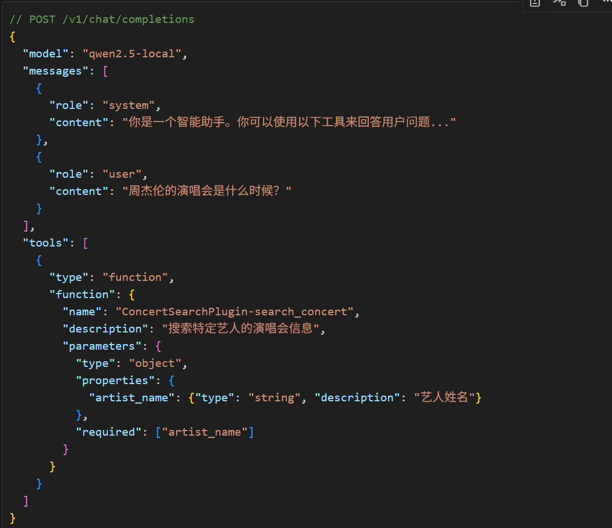

Response (LLM -> SK)

模型识别出需要搜索，返回一个结构化的 `tool_calls` 指令。注意此时 `content` 通常为空或为 null。

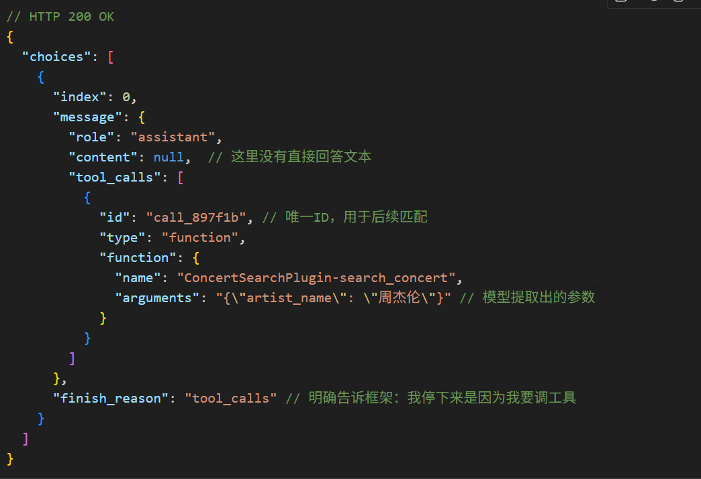


***

中间处理：本地执行 (SK 内部)

**这一步不产生网络流量**。

1. SK 收到 `finish_reason: tool_calls`。

2. SK 解析 `function.name` 找到本地 Python 函数 `search_concert`。

3. SK 执行函数：`search_concert(artist_name="周杰伦")`。

4. **函数返回结果**：`"周杰伦《嘉年华》世界巡回演唱会-海口站，时间：2025年3月2日。"`

***

第二轮交互：提交结果与生成回答

**目的**：将工具查到的结果喂回给模型，让模型生成最终给用户的自然语言回复。

Request (SK -> LLM)

SK 构造一个新的请求，包含**完整的历史上下文**：

1. 用户的原始问题。

2. 模型上一轮的“我想调工具”的请求（Assistant Message）。

3. 工具实际运行的结果（Tool Message）。

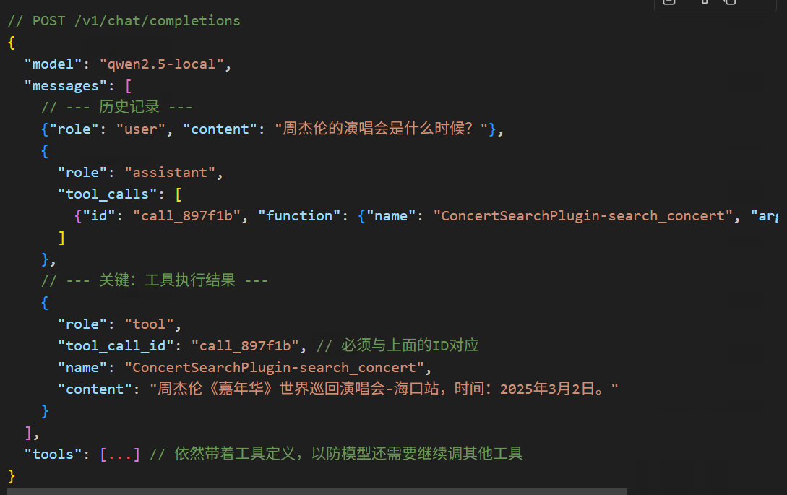

Response (LLM -> SK)

模型结合工具返回的事实，生成最终回答。

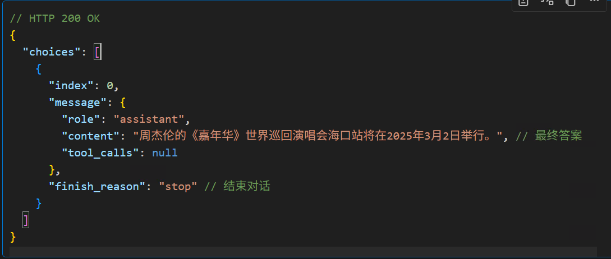


&#x20;4\. GPT在2025年出了一个叫Response的API，你大概了解吗？

&#x20; （关于GPT 的Response API, 其实是在25年3月份OPENAI 就提出了，希望将llm的工具调用，多轮对话等功能整合到api 中，减少Agent开发者的负担。 网上资料不多，面试也几乎从未出现。他都推出了大半年了，但是看上去这个思想没有火起来，估计可能也不会火起来了。我是第一次被问到。所以针对于这个知识点，我的建议是：大致了解下，不用花太多功夫。 所以我尝试用下面的回答大概简单概括下它的思想，理解这个回答，下次万一真被问到，能说道几句就好了，并且我严重怀疑这个基本面试不会问到）

Response API 是Openai设计LLM调用接口的**从 Completions → Chat Completions → Responses 的过渡**：早期的 *Completions* 只面向纯文本续写；随后 *Chat Completions* 围绕 `messages` 支持对话与函数调用，但状态与工具编排仍主要在客户端；如今 **Responses** 用一个 **有状态的统一端点**把多轮上下文与多步工具调用纳入服务端协议。

**设计思想与理念**：以 **“一次请求里的智能体循环”** 为核心，把 **状态、工具、事件流与结构化输出** 写进端点契约（而非让客户端手工拼装），让模型在单次响应生命周期中 **按需调用托管/外部工具、跟踪步骤并输出可验证结果**，从而**标准化智能体能力、降低工程胶水、提升可观测与可扩展性**。


&#x20;5\. 你用LoRa做了本地微调，这里面你是怎么做的？

&#x20;   （LoRa怎么做的，是我们精心准备的答案，包括怎么回答这个答案，对应的方法论和参考资料，我总结的都有，直接看笔记）

参考笔记 <span style="color: inherit; background-color: rgba(255,246,122,0.8)"> 1.4 你是怎么做的微调</span>


&#x20;6\.  你里面提到的对性能做测评，里面有一些bool类型指标，也有一些过程指标，这分别是怎么评判的？

&#x20;    （同学们，这个问题不清楚的话，会去看一下八股部分：<span style="color: inherit; background-color: rgba(255,246,122,0.8)">Agent开发框架</span>，我给大家推荐的这一章的参考资料Agentic Design Pattern，里面就讲了这个问题，Agent评估问题，我推荐的两个资料，都是很有用的哈，这里也验证了，希望你能回到八股部分，看看我的笔记和推荐的资料，以下回答几乎来自于我的参考资料。）

对于bool类型的结果评估，我们可以使用直接比较，要求智能体响应**完全匹配预期输出**时才会成功。

但是对于一些过程指标，则需要使用**更先进的自然语言处理技术**来辨别句子之间的意义。通常的一些手段是计算**字符串的相似度（如Levenshtein（编辑距离） 和 Jaccard(集合重合度））， 关键词分析，使用嵌入模型的预测相似性进行语义分析，LLM作为Judge，**&#x4EE5;及**RAG 特定指标（如忠实性和相关性） 来进行评估。**

&#x20;    （上面的内容其实回答这个问题已经完整了，但是请你思考一个问题，面试官很可能追问，那你的项目是怎么做的呢？ 这个希望大家也能准备，如果你答不上这个问题，面试官会觉得你只懂理论，但是实践不行。所以相应的，你需要自己准备这个你的项目怎么做的问题。以下是对针对我的项目，结合这一问题的答案参考。）

在我的项目中，核心功能 `email_to_event` 需要从非结构化的邮件文本中提取结构化的日程信息。针对不同的字段类型，我采用了分层的混合评估策略：

1. **确定性字段：**

   * **针对字段：** date, time, participants,needs\_calendar\_events 。

   * **评估方法：** 对于日期和时间，我先将其标准化为 ISO 格式（如 `YYYY-MM-DD`），然后进行**直接比较**。对于参会人列表，我将其视为集合，计算 **Jaccard 相似度**（交集除以并集），确保所有关键人员都被识别且没有遗漏。

2. **短文本语义字段：**

   * **针对字段：** location, subject。

   * **评估方法：** 这些字段允许一定的表达差异（例如 "Room 302" 和 "Conference Room 302"）。我使用 **Levenshtein 距离（编辑距离）** 来允许字符级的微小差异。对于差异较大的表达，可以使用轻量级的 **Embedding 模型**（如 text-embedding-3-small）计算余弦相似度，设定阈值（如 >0.85）判定为通过。

3. **长文本与意图字段：**

   * **针对字段：** description (日程描述/备注)。

   * **评估方法：** 描述字段通常包含会议议程或特殊要求，很难用关键词完全覆盖。我采用了 **LLM-as-a-Judge** 的模式，构建一个专门的评估 Prompt，让更强的模型（如 GPT-4o）作为裁判。

   * **具体做法：** 我会问裁判模型："提取的描述是否准确包含了邮件中的‘Q1目标’和‘资源分配’这两个关键议题？"。这种基于关键事实点的评估比单纯的文本相似度更能反映业务价值。


&#x20;7\. 你认为多Agent系统和单Agent系统最大的区别是什么？彼此有什么优势？

&#x20;（朋友们，问题7和问题8其实也都是在我给大家总结的Multi-agent的架构的 1个论文 + 书本的某一章中，这两个参考资料很有用，请大家仔细阅读另外这个问题看上去也是比较有通用性的，因此我直接将这一问题收录到八股Multi-Agent部分。）

参考八股 <span style="color: inherit; background-color: rgba(255,246,122,0.8)">6.3 单Agent和多Agent对比</span>


&#x20;8\. 你讲到的你这两个项目，两个项目最大的区别是啥？你刚才只是结合了一些概念上的东西讲的，你能否具体结合你的项目讲？

（在你理解了我整理的参考资料后，这个问题其实很好回答。我给出的参考论文列举了不同任务 使用不同Agent框架的效果和性能，并总结了什么项目适合什么Agent框架，如果你能理解的话，这个题其实是把这个相关的内容，运用到你自己的实际项目中，针对你的项目谈谈回答。还是这句话： **笔记八股Multi-agent部分的内容值得大家好好会去阅读**。以下的答案其实基本就是可以套用我给大家总结的参考资料部分，**金融分析适合用中心化架构**，**网页导航适合去中心化， 工作流适合单Agent的架构的原因**，然后往你的项目一套，就完了）

在我的邮箱项目中，因为本身它是**严格线性进行的，每一步依赖于上一步状态，无法并行，并且任务不复杂，单Agent的基线收益已经很高**，所以天然适合使用单Agent项目，使用任何一个多Agent架构都会导致性能下降。

而在按摩房预约系统中，任务天然具有"分而治之"的特性，**中心化架构让编排者将任务拆解成"预约", "支付","咨询"的子任务**，分配给不同任务并行处理，最终整合。在此种场景下，使用中心化架构是最好的选择。


**算法题：**

给定一个由 DAG 定义的 agent workflow，判断图是否成环，若不成环输出 yes，成环输出 no。


### 视频讲解

我用夸克网盘分享了「字节（豆包）一面.mp4」，点击链接即可保存。打开「夸克APP」，无需下载在线播放视频，畅享原画5倍速，支持电视投屏。

链接：https://pan.quark.cn/s/e871659e57d1

## 2025.11 Deepwisdom

### 岗位介绍

**公司产品**

国内 Coding Agent 赛道龙头，以多智能体协作技术为核心，推出 Atoms（原 MetaGPT-X，简称 MGX）AI 原生创业平台，可通过 “自然语言输入→AI 虚拟团队分工→5 分钟交付可运营商业项目” 实现全流程闭环。开源框架（MetaGPT、OpenManus 等）累计超 15 万 GitHub Star，全球注册用户超 50 万，上线首月 0 投放即达成 100 万美元年化收入（ARR），连续四周霸榜 Product Hunt 全球榜首；累计完成 3100 万美元融资，Xbench 测试成绩远超 OpenAI o3 等竞品，通过 SOC 2 认证与 GDPR 合规。

**技术实现**

* 底层是**多 Agent 架构**，通过 Agent 协作来实现功能

* 不是简单的拖拉拽形式，而是智能生成

* 涉及 Agent 之间的通信、工具调用、站外文管理等

**公司规模**

* 公司有 **100 多号人**

* 只有这一个产品，所有人都为这个产品服务

* 已经做了**大约一年**

* 目前是**创业公司**，资源有限

**岗位要求**

* 全栈工程师：前端、后端、算法都要做

* 包括模型调优

* 不区分前端后端测试，什么都要做

### **反思**

这个公司是一个创业公司。根据和面试官的交流，确实是和创业公司的典型画像很匹配。面试官说，什么都要要做： **前端，后端，算法，测试，模型调优**都是要做的。一般创业公司还是很看重匹配度以及技能的全面性的。

从考察的角度，本次考察内容其实中规中矩。基本上是结合项目去考察，结合着项目也会扩充到一些相关的基础知识，比如架构，量化，DPO，提示词工程。 总的来说本次的面试内容基本都在我们的掌控之中，八股内容里基本覆盖，都在我们总结之中。 我也结合着这一次复盘，去优化调整了一些知识。八股部分，结合这一次内容，在模型八股中：加入了模型和硬件相关的知识：怎么判断模型能不能跑？跑的有多快？这一点对于使用本地模型的同学，需要了解。

从本次面试流程来看，本次我是主动放弃了二面，因为当时其实就准备等千问C端开奖然后去了，也无心面试了。主动放弃了二面，猎头还一直说好可惜好可惜，他说你被分到了什么xx组，这是很好的组呢。从面试流程上来看，一面结束后，会给一个笔试题，这个笔试题是一个链接，点开后需要使用6\~8小时，去完成一个小的项目。好像使用他们的编程工具和平台去做。因为我放弃了面试，所以发了链接我也没有点开。

&#x20;      我倒是认可这是一个挺好的，可以反映候选人素质的考察方式。 这样考察的公司不多。我是第二次遇到。第一次遇到其实就是我面试现司，是给了一个项目，让我60个小时内完成。这种考察就是挺折磨人的，感觉要在一个很短时间封闭开发，需要在短时间高度集中，还考验人的。

### **一面**

1.自我介绍。

2\. 你的AI日历助手是写的客户端的代码逻辑吗？用什么语言写的？

&#x20;  2.1 模型也是跑在本地吗？模型能跑起来吗？用的多大的规格和尺寸？

（这个问题夸克千问一面也有对吧。 为什么会问，想让大家知道的是如果你用本地模型，甚至是cpu，就是会问啊，面试官会有疑问。 所以如果是说你的模型是远端的，其实一般应用岗这个问题倒是不会太问到，但是你用了本地模型，那么你需要知道这个问题。这个问题我也在八股部分 <span style="color: inherit; background-color: rgba(255,246,122,0.8)">模型和硬件</span>，总结了模型能不能跑，跑的多快，我相信这一节我讲清楚了，**大家去看一下**，有了这个基础，这个问题其实非常好回答，结合你具体的模型，硬件和公式，给面试官算就好啦！）

完全可以跑起来。我的电脑是64GB内存。

&#x20;     qwen7b-INT4 的要求是： 7B \* 1字节   =  7,000,000,000 字节 - 7GB。&#x20;

&#x20;     加上一些额外的开销，大概需要多1.2\~1.3倍的空间，所以内存要求是8\~9GB，所以我的电脑完全能跑。

结合我的从工程/任务层面的优化 + 选择专门的推理框架最大利用cpu的并行计算能力，也可以调推理速度。

（上面回答应该是很具体和专业，具体公式计算，怎么来的，原理，请看我的八股 部分 <span style="color: inherit; background-color: rgba(255,246,122,0.8)">模型与硬件）</span>


&#x20;  2.2 他具体做了哪些功能？


3\. 我看你简历写了MCP协议，上面注册了多少个工具？

&#x20;  3.1 你提到整个工具动态加入，怎么动态加入，他怎么知道每一步要用哪些工具？

（这涉及两个问题，一个分阶段注入工具，你怎么知道每个阶段注入什么工具。 第二个是如何动态注入的，第二点就和具体的Agent框架，langchain 等有关系，我这里以Semantic kernel 为例回答，因为这是我项目中用的）

整个流程被划分为多个阶段（邮件获取，创建行程，通知等），每个阶段只向 Agent 注入该阶段所需的工具集，这个是业务逻辑规定的。&#x20;

Semantic Kernel 的架构是 **Kernel（内核）+ Plugin（插件）** 的模式，每个 Plugin 包含若干个具体的工具函数。动态注入的思路是：所有 Plugin 预先注册到 Kernel 中，但在每次调用 LLM 时，通过**过滤器机制**指定当前允许使用哪些 Plugin。这样，虽然 Kernel 中存在全部工具，但 LLM 在该次调用中只能感知和使用被筛选出来的工具子集

（后面一部分SK的机制我认为对大家没啥帮助哈，这个Semantic kernel我看也就微软在用，大家看看就好）


&#x20;  3.2 你提到会存储一些数据，会存储一些什么数据呢？

（这个问题，我在 八股 <span style="color: inherit; background-color: rgba(255,246,122,0.8)">长期记忆的常见应用场景 </span>中总结了常见的一些场景会要存储的长期记忆。包括这个例子，也是根据我的业务场景下长期记忆的一个参考。 整个回答和你的业务相关，整个东西也不难，但是要能说出来，展示你的一些思维的发散性。 比如夸克千问2面面试官就追着我扩展，天马行空问，你的场景下要存一些什么？为啥，大家根据这些例子做参考，然后想想你的Agent项目要存点啥）

&#x20;   在我的智能日历助手中，我们需要根据用户喜好，来智能调整规划冲突的策略，这时我们会存:

&#x20;   1.用户偏好相关：时间偏好：喜欢早睡/晚睡？工作>个人？ 家庭>社交？等方面喜好

&#x20;   2.历史行程模式： 过去的选择倾向，倾向推迟还是提前，喜欢合并还是分散。这可以让我们在做决策时参考以前现有选择，直接复用。

&#x20;   3\. 社交关系：重要的一些联系人，比如老板，家人，重要客户。这样在涉及到重要人群的时候，会提高优先级。


4\. 你的项目整体使用了一个什么架构？

（架构这里其实讲了挺多的，包括很多面经有一些深入架构的讨论，我们的八股也总结的很多了，这里的面试其实就是问了最基本的问题。 那么大家回答的时候，就是结合我们八股部分总结的那几种架构，看看你的架构是属于多Agent的哪一个，结合着讲一讲，以及为什么选这个架构等等，大概讲一下。以下我的回答其实理论知识都来自于我们八股部分架构的相关内容。单Agent vs 多Agent，如何选型，八股部分都总结的很好了。）

我的系统采用的是一个典型的单Agent 的Prompt chaining的架构，具体来讲就是将任务分为多个阶段，然后单个Agent在这个Chaining的流程中去填空，完成子步骤。选择这个架构的原因是因为，我的任务并不支持子任务的并行，而且单Agent的基线收益比较高。这种情况下使用多Agent，反而会引入协调税，分散token，引入沟通开销，性能反而下降。所以在这种情况下，单Agent的效果是最好的。


5\. 你的Agent是如何进行效果评估的？

（这是一个必考题，从Agent评估的理论到结合自己项目，Agent是怎么做的，在八股部分都写了，大家自己参考一下吧）

&#x20; 参考八股：<span style="color: inherit; background-color: rgba(255,246,122,0.8)">3.3 你的项目中是如何对Agent进行性能评估的</span>


6\. 你讲一下你是如何做的量化？

&#x20; 看我的笔记吧： <span style="color: inherit; background-color: rgba(255,246,122,0.8)">8. 你的项目是如何做推理加速的？</span>

这块我是专门总结了量化，微调，推理加速的知识，结合项目讲了怎么做，有具体的方法。我的理论依然是，对于应用，我们把流程走一遍，我这个方法我是让AI写了脚本跑了一遍，确定是可行。然后记录下来大概的结果，用的什么库，怎么完成的，总结好，整理好。 量化，推理，加速就到这里。因为算法不是应用的主战场，我没有深入去做（不过确实应用岗也不会深入问），所以做到我八股整理的这一步，就够了。我没有再深入，面试也没深入问过。


7\. 你这边也会做LoRa微调吗？数据怎么来的？什么是DPO啊？

&#x20;一样的，都是我们八股总结过了的。 LoRA怎么做的，这个问题我专门总结了，也有一套方法论：如果以科学实验方式做LoRA。 相信这里总结的很好了，包括数据怎么来的。以及什么是DPO，这都概念，我们八股都总结了。参考笔记<span style="color: inherit; background-color: rgba(255,246,122,0.8)">1.3 你是怎么做的微调的?</span>


所以大家虽然是应用岗，但是不要怕算法，我们都准备了。 而且算法岗问多深，我们就准备的多深。我没有深入总结什么公式啊，就是因为现在面试官不会深入问。万一有一天他深入问的多了，我笔记也会相应深入总结的，我帮大家兜着底呢。


8\. 大模型肯定要组装一堆Prompt，你这个Prompt是提前备好固化然后直接打包在电脑中吗？有没有什么Prompt优化方法？

8.1 除了变量之外，那些固定的部分，能不能用用户的数据来优化咱们整个Prompt？

(关于提示词的优化，这个问题让我想到了夸克千问二面 面试官的问题 <span style="color: inherit; background-color: rgba(255,246,122,0.8)">在项目过程中，怎么去做提示词的压缩和裁剪？</span> 这个问题其实面试官想问的是数据飞轮来优化提示词的策略。算是另外一种对于提示词的处理，我们可以结合夸克千问这个面试问题，这两点来综合学习一下在项目中有哪些对于提示词的处理技巧）

（数据飞轮指的是：把数据比成一个飞轮，一开始很难转动，但是随着开始启动，会越来越快。 类比到Prompt中，指的是一开始数据是固定的，但是随着上限采集到一些数据，通过数据来优化提示词，达到更好的动态调整，更好的效果的概念）

是的，在我们的项目中也可以使用数据飞轮来优化提示词。

比如我们在提示词中，预置一个用户历史对于冲突检测的选择的倾向和一些历史决策。然后在提示词中表明，会参考用户历史的倾向和选择，来调整智能规划的建议。 一开始上线，可能并没有一些历史数据，飞轮没有转起来。随着上线，收集了用户对于历史建议的选择：忽略，直接接受，修改以后采纳 等选择，来维护用户的选择信息，动态调整加入到提示词中，让飞轮转起来。


9 你最近有使用过哪些AI工具，你觉得哪个模型使用的比较顺手？

（其实吧，这个问题看似是个闲聊问题，但是当我真正复盘的时候，这个问题背后其实体现着企业是否对你跟上这个AI潮流的考察。 因为现在这个时代，其实很多企业问你如何Vibe coding，有没有啥技巧，用那些vibe coding工具，用什么AI产品，这些都是看你是否跟上潮流，有一些思考。 所以其实这些题目最好也是能反思一下，总结几个常用的比较新的的AI工具，比如Skills出来以后，可以说使用**Skills Creator** 来生成Skill等。体现自己对最新产品的使用和思考）


10\. 你怎么去了解一些新的技术？

同样和上面一个问题一样，看着是闲聊，其实背后在考察你是否在主动学习，学习方法聪明吗？我以后给一些答案供大家参考


11\. 你在微软干的好好的，为什么要出来干这个？


12\. 你想去哪种类型的公司？

&#x20;（我能理解面试官问这个问题的初衷。因为这个公司也就100来号人，创业公司。而我之前都在上万人的大厂，面试官通常一定会有一些顾虑，你到底想不想去创业公司。所以如果大家面试创业公司的话，这个问题一定要顺着面试官说，表现出意向度）

算法题：

两数之和，三数之和


### 视频讲解

我用夸克网盘分享了「DeepWisdom大模型全栈一面.mp4」，点击链接即可保存。打开「夸克APP」，无需下载在线播放视频，畅享原画5倍速，支持电视投屏。

链接：https://pan.quark.cn/s/f2f648a357e6

## 2025.11 象映技术

## 2025.11 易鑫技术

## 2025.11 深维智信

## 2025.12 加速进化

## 2025.12 SAP

一面大主管，二面+1面，三面中华区负责人。没错就是先主管面，再+1面，有点奇怪。

全程几乎没啥技术问题，不知道他们考察的逻辑是啥，感觉这种全程面下来都没有太问技术的，那更多只是理解为他们更多的是看背景选人了。

### 一面

### 二面

### 三面


## 2025.12 小红书

### 岗位介绍

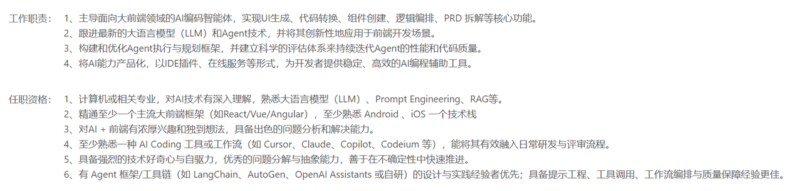


### 反思

整个面试基本上围绕： **量化  +  Multi-agent框架 + RAG数据库 + 模型选型**上四个方面展开。

面评：对量化模型和结构有一定了解，但应用比较简单，技术和方案设计能力单薄了些。

其实面试官说的也没有问题，不过对于方案设计的题，我没有答出最优解，好歹也和面试官在讨论，说了一些解决思路，但是面试官还是无情挂了我，甚至是写题的机会都不给（小红书的面试，写题的界面都准备好了，但是最后他不让我写），挂的很坚定，可以看出小红书的要求还是挺严格的。


反思：

1.我一直和大家说的是，做RAG系统的时候，你就要把你的文档弄得复杂一些，用上专业的数据，而不是像我一样，用了一个简单的文档，没有啥复杂的召回策略，都没有专业数据库，这也是面试官觉得我的项目很简单的原因，大家在设计项目上就应该避免。

2.方案设计这一块，之前面试官问方案/架构设计的比较少，这块确实薄弱了一些。不过最近面试几个大厂，多少还是在讨论方案和架构设计能力的，这块需要我们针对于面试题，整理提升下，如果有好的架构的资料，到时候我也会分享，总之这次面试是一个很好的机会，提升对于多Agent 架构设计的思维能力。

3.我可以看出来，面试官对量化/推理这一块并理解不深，你看他也都是问的一些概念性问题，相反应用模块，都是问的比较深入和细致。 这个其实反映了，对于现在市面上既要求应用，又要求算法的情况，大家不用太慌张，因为通常应用岗位的面试官，他就是问算法相关，他懂得也不深入。所以我们大胆复习，先把推理加速/训练的框补起来，面试的时候大概就够了。你看我对于量化这块也不是专家，不算懂得特别多，但是面试官的反馈还是说我对量化有一定理解。所以推理/微调这块不要怕，先按笔记资料学起来，把一套流程跑通，面试自信地讲就好了。

### 一面

1\. 自我介绍？

2.看机会的理由什么？

3.你的两个项目你觉得哪一个挑战更大呀？项目做了多久呀？

4.可以详细展开讲一下这个项目吗？

5.我停下来它的核心的功能还是比较简单的，但是你又跟上了做了微调/蒸馏/量化/推理加速的技巧，我理解目前主流的模型是都可以做到的？为什么你还有做微调呢？

（这个也是一个和项目相关的问题，不太涉及知识点，大家看看就好）

&#x20; 这个其实是因为虽然主流模型完全可以完成相关功能，但是由于我的项目是要在资源受限的设备上（CPU）上去跑，所以需要加速推理速度同时不损失太大的精度


6.最终用了多少B的模型？

7.你是怎么做的量化的？

（说实话，我不能说对量化精通，这里我就是准备了自己做推理加速的一套方案，把这里的东西搞懂，去讲就好了，比如我总结的方案，**采用Q4\_K\_M,Attention层保持5-bit精度，FFN层压缩到4-bit，输出层用6-bit确保质量&#x20;**&#x8FD9;几个关键地方弄清楚，一般其实应用的岗位面试官也不深入懂量化的，你回答到这里就差不多了，他也不会深入问和你问细节）

笔记部分 <span style="color: inherit; background-color: rgba(255,246,122,0.8)"> 你的项目是如何做推理加速的？</span>


8.量化的好处是什么，优缺点是什么？

（这个算是一个八股内容了，我总结在八股笔记量化部分。自己当时答确实可以答出来一些推理精度下降的问题，但是还是没有事后总结的答案好，因为现在我总结的答案，可以从**模型的结构，网络上深层次**地指出量化带来问题的原因，对于好处的总结也完整。所有有时问题虽然回答出来了，但是确实需要时候总结，反思，迭代出更好的答案，下次回答的更专业。）

&#x20; 8.1 你说到量化会降低精度，那么降低精度会有什么问题吗？

&#x20;  参考笔记  <span style="color: inherit; background-color: rgba(255,246,122,0.8)">量化的好处和坏处</span>


9.量化在KV - Cache中起到一个什么作用呢？

&#x20;（我觉得这两技术没啥太大联系，是两个不同的技术，我这么回答的，面试官也没反对。不过这两概念还是值得记一下，kv-cache和量化的定义，自己回答肯定答得没有这么专业。）

**KV-Cache&#x20;**&#x5728; Transformer 推理中缓存 Key 和 Value，避免重复计算，提升长序列推理速度。

**量化**：降低**权重或激活的精度**，减少显存占用和计算量。它们是两种不同的优化技术，但它们可以结合使用，目的都是为了**降低资源消耗、提高推理效率**。


10\. 说到模型，对模型来说，他会产生幻觉吗?

（这个问题用笔记部分如何减少模型的幻觉就够用了，这个笔记不光总结了幻觉如何解决，还总结了幻觉产生的本质）

参考笔记 <span style="color: inherit; background-color: rgba(255,246,122,0.8)">如何减少模型的幻觉</span>


11.多Agent 时，要怎么设计这个多Agent系统？

参考笔记<span style="color: inherit; background-color: rgba(255,246,122,0.8)"> 6.1 设计多Agent的原则</span>


12.你的项目中使用的是什么多Agent的一个架构？

13.如果说你的子Agent膨胀变成20个，或者说是50个，你应该怎么去优化呢？

&#x20; （这个问题我不太确定面试官想要的最终的答案是什么？这个问题其实就是在 多Agent的主管模式下，如果子Agent不断膨胀，那么这个Supervisor的压力可能会很大，这时如何解决，如果不知道什么是多Agent的Supervisor模式，请看这里：https://github.com/fzy2012/rhzl-Agentic-Design-Patterns-cn/blob/feature/interactive-website/13-Chapter-07-Multi-Agent-Collaboration.md。我的回答中，提出了使用Hierarchical的模式，但是面试官继续挑战这种模式如果一个分类错误，会导致后面都出错，然后我说可以分类的时候采用多Agent投票决策分类，加强分类准确性，面试官又挑战这样性能开销大，于是我说这个投票的策略可以是多个Agent并行的，但是面试官还是不满意，总之这题大家看到其实是面试官会不断和你探讨架构设计上的问题，需要有一些知识储备，才能像最优解靠近，我这个回答显然面试官并没有觉得最终探讨到了他最满意的解决方案。复习这个题请先掌握好八股部分多Agent相关资料，这是你回答这个问题的知识来源和储备。）

&#x20;  13.1如果说这个分类Agent，子Agent膨胀成20个，那么分类Agent需要分成20个，那么它的压力就会比较大了，这时该怎么办呢？

&#x20;  13.2举个例子，比如市面的元宝，豆包，它的咨询机器人，是会面向不同的行业的，每个行业的特性可能是不一样的，这样这个子Agent一下子就会膨胀的，这样怎么办？

&#x20;  （我这里回答了采用树型的结构，层级分类）

&#x20;   13.3 这是一个思路，这会导致一个问题，就是一旦第一层分错了，后面会全错，这怎么办？

&#x20;   （我这里又说了每一层采用投票机制，加强分类的准确性，导致每一层分类出错概率降低）

&#x20;    13.4 如果采用了这个方案，性能上开销很大，这怎么解决？

&#x20;     （我提到了说做一些并行化的优化）

（本题答案总结如下，需要多Agent八股部分的前置知识，比如中心化架构中，性能开销，优缺点，这些在八股部分都总结了）

在使用中心化多Agent架构时，系统复杂度会随着**r, n, k**增大。r表示主管和子Agent的回合数，n 是子Agent数量，k是子Agent迭代数，所以如您所说，子Agent 数量n增大时，系统复杂度增加，主管Agent确实会成为瓶颈，这也是这种架构的弊端。

为了解决这个问题，首先我们可以思考 是否一定要用**这个架构**：

比如**动态环境下（网络导航/检索）** 更适用去中心化，不会存在单点瓶颈。

&#x20;    **强推理，长推理链&#x20;**&#x4EFB;务更适用于 单Agent。

可拆分且需要**统一口径与质量控制**的任务 适合中心化架构，如果确实是需要使用这种架构，我们可以采取以下措施来缓解单点Agent压力。

&#x20;     **1. 动态负载均衡**

主管不直接管理所有子 Agent，而是通过**调度池**或**任务队列。**&#x7B80;单来说主管只负责任务分类，将任务丢到调度池中，然后采用专门的**调度器来解决任务的分配问题**。调度器本身就是处理高并发，自动化调度的，所以可以很好处理子Agent膨胀导致分类/调度任务增大的情况。

&#x20;    **2. 采用分布式系统**：

&#x20;将这个Agent跑在多个节点，提高并发和容灾性。

&#x20;    **3. 可以采用混合型架构**

&#x20;    使用混合型架构，仍然保留了中心化的骨架，但是中心Agent管理的不是单独的Agent，而是若干小组，将顶层单点Agent压力从子Agent个数n下降到了小组数g，减缓顶层Agent压力。

&#x20;   **4. 控制k，r**

如上面所说，这种系统Agent压力和k,n,r相关，单点Agent可能会成为性能瓶颈是它的特点。因此我们设计的时候，就需要**尽量减少交互轮数 r 和 k**，缓解单点瓶颈问题。


14 你有提到小型的RAG,那么RAG的流程是怎样的？

（这个问题答案我不具体讲了，因为和我项目强相关，这个题主要有两个启示：

1. 我的项目用的sqlite做存储，因为我的文本简单。但是如我之前和大家说的，自己项目建议还是专门用专业向量数据库，做切块，用专业的召回策略去召回。&#x20;

2. 面试官其实问的非常的细致。之前很少面试官问这么细的，包括你存，存了什么表头，怎么query的，因为我写的代码我都有点忘了，我自己都没那么细致，答的不是很好。这块告诉大家你需要在这个RAG存储的地方，了解的非常非常细致，包括你如何存的，表头是啥，甚至是向量模型的参数（14.3），这些都要弄清楚）

14.1 你当前的数据是怎样的？

&#x20;     14.2 你具体存储的数据结构是怎样子的？

&#x20;         （存了表头吗）

&#x20;     14.3 你用什么向量模型，用的多大的size？

&#x20;     14.4 相当于说检索出来之后，用什么对他匹配的？你的query是什么来着？


15 这个项目为什么要用GPT4?

15.1你现在觉得你在这个过程中你应该选择什么模型？有更新的为啥不用更新的，而且mini的消耗还是比较低的？

&#x20; （这个问题我总结在了笔记 **不同模型的对比和选择，**&#x5BF9;应的笔记和复习思路请参考笔记。 这里我回答的不好，因为在我的项目中其实没有专门做模型对比然后选型，相信大家自己做项目，可能前期也不会有专门的选型，但是即使你的项目选模型没有精心考虑，但是在回答这个问题的时候，还是需要你对主要的模型有一个对比，不同模型能力区别有一个了解，然后结合你的项目自圆其说）

&#x20;    具体请参考笔记：<span style="color: inherit; background-color: rgba(255,246,122,0.8)">8.不同模型的对比和选择</span>

### 视频讲解

我用夸克网盘分享了「小红书大模型应用岗一面.mp4」，点击链接即可保存。打开「夸克APP」，无需下载在线播放视频，畅享原画5倍速，支持电视投屏。

链接：https://pan.quark.cn/s/e3c8fba128e6

## 2025.12 阿里夸克千问

### 岗位介绍

岗位描述

1、负责夸克千问、通义APP内的大模型应用研发,熟练利用大楼模型相关工具和平台,实现诸多AI应用的快速落地与持续迭代;

2、负责大模型产品的整体技术解决方案,基于对大模型架构和Agent框架的深入理解,合理技术选型,参与技术研发和效果优化等工作,推动产品持续增长;

3、保障大模型应用系统架构的稳定、高效运行,帮助业务优化性能和改善系统稳定性,持续提升用户体验;

4、持续跟踪前沿技术趋势,关注并探索AI新应用、适时引入新技术新方法,持续提升产品技术、工程架构上的先进性。


岗位要求

1、计算机或相关专业本科及以上学历,2年以上工作经验,熟练掌握C++/Java开发,熟悉Linux系统下程序性能分析及优化能力,有大型项目/系统负责经验者优先;

2、参与过大模型应用系统/业务研发经验者优先,熟悉RAG、Agert机制,了解包括langchain、vllm开源系统,有prompt工程业务优化经验、以及模型finetune者经验优先;

3、有优秀的架构设计能力,有相关大型系统设计、开发、优化经脸,了解检索引擎、kv存储、在线服务框架、批流处理等中间件系统;

4、具备良好的产品和业务sense,有大模型应用的深度使用用、开发落地经验优先;

5、有实时通信业务(IM文本、推送、语音通话)后端研发经验优先;有丰富搜推系统研发经验优先。

### 反思

一面：整体来说其实很简单，算法题很简单，当然我完成的也很快，但是阿里的面试官还是给了这个算法题30分钟时间，相比字节的算法题目，真的显得非常的友好了。整个一面其实涉及到知识考察的部分几乎没有，甚至可以感觉有点像是一个电话面。基本是和面试官在聊项目（并且停在功能层面，没有深入到技术层面）。面试官人也很好，他一直在肯定我，我回答完他经常说，挺好的这种话给我鼓励。整个时长也就44分钟（并且包括了写题和反问），在这次面试中其实确实没有一些特别干的知识方面的东西和大家总结。另外我觉得背景可能加了分，因为这个岗虽然是Agent开发，但是使用C++，面试官提到了C++国内就是你们公司的最好，所以我估计这点也加了分。因为本期几乎都是一些项目相关的问题，比较碎，文字不太好总结，要想更细致知道当时发生了啥，可以参考笔记后面的视频讲解链接。**我觉得唯一可以抽取出来的一个知识点是第3个问题**，如果项目使用了本地模型，可以了解一下不同参数量的模型在不同的硬件上的使用情况。


二面：二面其实还是挺有价值的。面试官对我说了一句话是你来了这里，会把工程做到极致。 回看面试官的问题，确实是从工程的角度上提出了挺多有价值的问题。虽然看上去这些问题是针对于我的具体的项目展开的，但其实这个**讨论是有通用性**的，具体的问题不重要，重要的是**这些工程的问题和思维**，在不同的项目上都会遇到。想要把这些问题回答的很好，需要：

1.一**些知识的积累**，比如我准备的Agent架构相关论文，相关书籍，需要你看进去了，并且真正理解了，会灵活运用。大家看后面的回答可以看出来，基本我的回答还是从我的八股里总结的参考资料下手去谈的，所以我们不光要记住总的最高频的八股，也需要看对应的参考资料，去理解，这样遇到这种发散性讨论的问题才可以侃侃而谈。

2.一些自己的思考，这个可以结合一些具体的面试问题，自己去思考，运用你的一些知识，比如面经部分包括**小红书，华林证券，字节豆包，**&#x90FD;有相关架构的设计，大家结合笔记和讲解，通过这些题目思考和复盘，也可以提升这块的能力。

最近也确实有一些公司喜欢考架构，考一些具体问题的探讨，这些东西稍微比纯八股，纯知识难一些，但是其实经过一些相关面经和相关资料，面试几次，这块也不会很难，并且这些问题通常也不会有完全标准的答案，有一些自己的思考，能够回答上来也不至于太差。这里我觉得还挺有价值的，我在讲解视频也会谈一下更多自己针对于这些问题的准备方法和思路，和技巧，笔记也会尽量写出思路，希望对大家有帮助。


HR面：HR面个人感觉没什么特别好总结复盘的。 面试之前有人提醒我说阿里的HR喜欢压力面试，我还专门咨询了一些阿里的朋友。不过后来觉得又不考技术，压力能压力到哪里去呢？自信表达，不踩阿里的红线就好。唯一一点我想说的是，别把姿态放太低了，这样HR觉得你接的意向大，就会压你工资。具体问题我还是整理出来大家看着参考一下就好。

### 一面（44min）

上来首先是手撕一道算法题目，并不难，很快就做出来了，题目如下，翻了一下记录，我大概是不到10分钟写完的，面试官的预期是给30分钟，确实是一道很简单的题目，如果要难度分类，应该是Leetcode esay 题目。

算法题：

Leetcode  792

1\. 自我介绍

2\. 按摩房预约系统是你现在在做的吗？

（这个面试官就是单纯的好奇，为啥的项目中会有一个很奇怪的和按摩房相关的项目，看上去就很奇怪，这也就是我在这个笔记第一章项目思路设计的时候就和大家说的，设计项目的时候就要尽可能往工作上靠，像我这个项目一开始设计就看着和工作无关。但无论如何，这就是走过的坑，希望大家尽量避免，话说回来，即使我这个项目立意就不好，但是这次面试还是挺尴尬的，但是如果现在让我重新再来一次，我不会设计一个这么奇怪的按摩房项目）


3\. 你这个智能日历系统是在本地运行的吗？那你们本地用的是哪个模型呀？

&#x20;  3.1 那你们本地跑的起来吗？

&#x20;  （这里最好是可以结合硬件和模型去答一下，因为使用的本地模型，大概讲一下本地什么样的硬件可以跑起来什么的模型，结合具体情况去聊）

是的，我们完全可以在本地跑起来。这主要得益于我们对硬件资源、模型选择以及任务复杂度的综合评估和优化：

**硬件与环境**：

我们使用的是标准的 8核 CPU 配备 16GB 内存的开发机，没有使用高端 GPU。我们在启动脚本中配置了纯 CPU 推理模式（n\_gpu\_layers=0），利用 CPU 的 AVX 指令集加速。


**量化技术**：

为了适应 16GB 内存，我们使用了 GGUF 格式 的 4-bit (Q4\_K\_M) 量化模型。这把 7B 模型的大小压缩到了 4.36 GB，不仅加载速度快，而且运行时内存占用很低，完全不会卡顿。


**推理加速**：

配合 llama.cpp 引擎，我们在 CPU 上也能达到很高的吞吐量（约 140 token/s），这对于实时性要求不是毫秒级的后台任务来说已经非常快了。


**任务适配性（关键点）**：

最重要的一点是，我们的业务场景并不需要“超级大脑”。


**任务类型简单**：我们的核心任务是文本分类和信息提取。这属于自然语言处理中的基础任务，Qwen2.5-7B 这种中等体量的模型在指令微调后，处理这类语义理解任务的准确率已经非常高了，不需要动用 70B 或 GPT-4 这种超大模型。

**工具链简单**：我们的 Agent 只需要做简单的决策，比如调用本地的 check\_conflict或 add\_event函数。它不需要复杂的代码解释器环境，也不需要多步联网搜索推理。

所以，对于这种特定领域的结构化提取任务，本地量化的 7B 模型是一个在速度、成本和效果上达到完美平衡的选择。


&#x20;  3.2 你们微软自己的模型可以打平千问是吗？

&#x20;  （看上去有一些是在纯聊天了）

&#x20;  3.3 那你在本地一个7b的模型能做啥呢？

&#x20;   （还是聊一些和千问模型相关的内容）

&#x20;  3.4 整个项目具体细节的澄清。

&#x20;   （xxx还是在和面试官讲我们的项目具体做了什么）

&#x20;  3.5 还是在问项目，而且是停留在了功能层，不是技术层，对大家其实帮助不大。

&#x20;  3.6 ...我觉得基本上已经扯得很远了，就是在讲公司的一些产品层面的东西，几乎纯聊天，几乎已经扯到其它产品上了。


4.扣项目，问了一个简历上写的和大模型无关的另一个项目的具体细节。


5.你上一段工作的离职原因，大致问了一下上一段工作内容。


### 二面（55min）

1.自我介绍

2\. 你为什么要换工作

3.你倾向的工作地点

4.挑一个项目讲解（自己任挑，甚至是说是Agent/非Agent项目都可以）

5.讲一个你在项目中遇到的最困难的问题，以及你是如何解决的？

&#x20; （这个问题我在总结字节豆包的面试中就总结过了，我认为大家需要针对这个问题，整理一个自己的答案，然后把这个问题解决的过程讲清楚，讲出深度，我暂时会讲我解决模型工具调用失败的这个问题，大家可以参考笔记）

&#x20;   <span style="color: inherit; background-color: rgba(255,246,122,0.8)">参考 4.你在项目中遇到的最难的问题，如何解决的？</span>


6\. 这个里面调用了多少个工具啊？

7\. 如果你在cpu上跑，选一个很小的模型，模型可能做不了很多事，这个怎么办？

&#x20; （这个问题的回答涉及：Infra层比如微调知识，工程学相关知识。我的回答更侧重于工程角度，因为这是一个工程岗。不过值得一提的是，如果是Infra背景的面试官，可能会更注重听Infra的优化的知识，这个还是视情况而定。

我的回答，第一个模型推理的难度，这个其实是在美团龙猫的论文中总结的，我们拿来用这个思想，这一个论文其实在整个笔记中涉及多次了，我就不赘述。

最后的总结部分，我也引用了UC Berkeley的论文做总结，丰富了回答，也侧面像面试官展示了我们在关注前沿知识/论文的能力，关于这个论文，可以参考：

https://36kr.com/p/3608851367871752）

对于这个问题，核心的思想是有两个：提升**模型的能力，**&#x548C;**降低任务的难度。**

首先**讲解提升模型的能力**，我们可以通过：

&#x20;     1.通过微调，强化学习让模型能够在指定任务上取得更好的效果。

&#x20;     2.降低任务的复杂性。Agent系统中任务的难度主要体现在3个方面：

&#x20;**接下讲降低任务的难度**，通常来说，Agent系统中LLM的难度主要体现在：

**推理维度**：Agent是否可以在部分可观测，信息不完整的环境，将线索整合并做出正确抉择。

&#x20;     **工具维度**：在众多工具依赖图中，Agent是否可以选择正确工具，使用正确参数。

&#x20;     **交互维度**：在多轮对话中，是否能够主动识别意图，主动澄清问题，维持上下文一致。

&#x20; 针对于小模型，我们可以通过任务设计的角度，比如拆分成任务，限制步骤，减少工具推理难度等方法，去避免这三个维度的难度，让任务复杂性下降，使得使用小模 型也能够取得很好的效果。


值得一提的是，我看过UC Berkeley 25年12月发表的一篇论文，结论是即使在目前生产级别的Agent项目中，也通常将Agent步骤限制在10步以内，也会使用比如添加抽象层的方法降低工具推理难度，所以这些方法其实不止在小模型上需要使用，在大模型的项目中一样需要。

&#x20;&#x20;

8\. 时空冲突这个事情，假设不局限在当前的状态，未来理想的状态下，你认为还需要做哪些事情啊？

（这个虽然是针对于具体任务：冲突检测讨论的。但其实面试官根本不在乎具体任务是啥，甚至也不在乎你做的多深，而是在和你讨论。 这个过程会把我们学到的一些知识串起来，这个过程是值得大家思考和借鉴的，有的面试官就是不喜欢问八股，喜欢发散性讨论，这个整个讨论过程还是希望大家感受一下的，因为有的面试官就喜欢这么和你聊，和你探讨，这个碰撞的过程本身就是一种能力，我们需要在这个些面试笔记以及这期的视频讲解中去提升自己这个探讨和碰撞的能力）


&#x20; 8.1 这个冲突怎么能让模型解决的很好，还是说你一股脑塞给模型，都让他来处理呢？怎么样能让模型整体的质量比较高呢？

&#x20;   (其实这个问题的思路和第7个问题有点像，还是可以从**Infra提升模型能力** 以**及 工程角度**，降低模型推理难度这两个角度去回答，另外加了一点提示词工程的回答，其实这问题也没有标准答案，就是思维要灵活，和面试官讨论）

首先，在不考虑性能，成本的角度，我们**先考虑提升模型的能力**：现在模型的能力越来越强，我们先去选择更强大，更合适的模型看是否能解决这个问题。或者通过**后训练的方式**，比如使用SFT，输入一些冲突检测相关的数据，强化模型对这个指定任务的回答准确性能力。

如果模型确实无法处理，从工程的角度，我们可以：

1.从LLM层解耦出一些具体的任务。模型任务处理的复杂度主要体现在**推理，任务调用，交互的维度。**&#x6211;们可以抽离出一些具体的任务，比如之前判断冲的时候，是让模型自己去调用距离计算api，然后做时间加减法。这时我们可以抽离这个任务，在语言层面调用工具计算好距离，然后以提示词形式填充进去。降低了模型理解工具的负担，另外模型不擅长做精确的时间加减法，我们也将这一任务交给了语言层面去做，不要把所有压力都给模型，而是让整个系统在人为定义好的 任务流程图 的格子里去填空。

&#x20;     2.从提示词工程角度，可以使用COT（Chain of thoughts)来完成，抽象出具体的任务，让模型一步一步思考。


&#x20; 8.2 如果这个冲突检测的逻辑结合一些个人的个性化情况来改变，比如有人比较注重生活，那么就会冲突检测更多让工作给生活让路，如果要实现这个功能，需要哪些数据，怎么实现?

&#x20;    （这个问题也有通用性，就是在你的Agent中，如何实现根据用户的行为，喜好来动态改变它的决策逻辑，这个如何能去实现呢？）

我们需要 维护一个**用户画像** 和 **历史决策库，**&#x5728;运行时rescheduled 'Team Sync' to keep。具体展开来讲：

我们可以**维护用户一些历史的数据**，比如过去冲突检测的行为，点了接受建议还是拒绝，过去一些手动修改冲突的例子，把这些数据维护起来。

然后在真正执行冲突检测的时候：1.先去看是否有历史完全匹配的相关冲突和解决方法，如果有，那么直接选择这个逻辑。2.如果没有，可以命中一些最相似2\~3条例子，然后作为历史相似案例，提取出用户的倾向，比如"User previously prefer to cancle work meeting to balance life "  然后作为提示词输入到冲突检测的提示词中。 让模型在选择时有一个倾向。


&#x20; 8.3 那如果冲突检测这一块使用多Agent去设计？你该如何去设计呢？

&#x20;（这又是一个经典问题了，最近其实面试被问到了很多，具体问法就是针对于某一个case，你如何设计这个单/多Agent架构。这块复习策略：

1.去看我的多Agent笔记的论文和问题，论文里讲了设计原则，思想，给了例子，在金融/网页规划等例子下用什么架构，为啥，这个就是现成的例子，把这篇论文和我的笔记弄透，包括在笔记中我也直接汇总了架构设计的典型例子，大家都能参考。

2\. 结合面经有更具体的问题，用这些问题再巩固，比如这个问题，小红书，华林的面试都有类似的架构设计，自己先别看答案，想一想怎么设计，然后再结合你自己的例子和场景，给自己出个题，看你会不会架构设计）

&#x20;    我已经将这个问题抽离到了八股的 架构设计小节，请参考：<span style="color: inherit; background-color: rgba(255,246,122,0.8)">6.5.4 时空冲突检测任务</span>


&#x20; 8.4 那什么时候用多Agent去做，什么时候用一个Agent去完成？举具体例子说明。

&#x20;  （这题在八股部分多Agent地方已经总结的很好了，甚至是很多次，我下面回答基于八股部分的知识，我这块不用参考任何资料就能直接回答，如果你觉得这个问题还回答不上来，那就是对应的八股笔记部分的多Agent部分和参考资料没理解好。以下这个回答都是基于我八股的笔记和参考资料。）

单Agent的优势在于**不需要承担Agent之间的协调**，通信开销和拓扑带来的误差传播，在**顺序调用，工具密集，单Agent的基线收益已经较高**（达到45%的时候）使用单Agent效果会更好，比如说典型的工作流的例子，这种情况下使用多Agent性能反而会下降。


多Agent的优势在于在复杂的任务中，特别是**需要分工和并行**的问题上，可以突破单Agent的**能力边界，提高效率和鲁棒性**，比如说金融推理的任务，更适合于中心化的多Agent架构。 网页搜索任务，更适合于去中心化的多Agent架构。


&#x20;8.5 单Agent有什么局限性吗？什么解决不了吗？

(聊着聊着也会聊到一些八股内容，参考这个笔记，虽然问题不是一模一样，但是这个笔记中多Agent的优势不就是单Agent解决不了的吗？另外我相信大家在八股笔记我总结了很多，这个最基本的问题应该是可以回答上来的。）

<span style="color: inherit; background-color: rgba(255,246,122,0.8)"> 参考笔记 单Agent和多Agent的对比</span>


&#x20;8.6 你提到的根据用户的搜索记录，来分析用户的喜好，改进用户的行为，这个是怎么实现的呢？

是将用户的搜索行为当作信号，从这个信号中提取**特征，**&#x6700;后把这特征转换成用户画像/向量，最后在LLM推理时用这些**画像进行加权，重排，**&#x6839;据这个画像找到对应的个性化参考资料，或者直接将画像加入到提示词中做**提示词增强**。


&#x20;8.7 你提到了Agent会根据用户的历史行为，喜好来智能地改变这个监测冲突的行为，是要根据哪些数据来调整Agent行为，一开始刚上线的时候并没有一些用户数据，这时又要怎么做呢？

最开始没有用户数据，可以采用冷启动的方式先去上线，主要的核心思想是**降低打扰和风险，以稳妥和安全 替代 个性化的抉择，**&#x8BA9;Agent随着一边上线，一边收集数据，分析数据，逐步用户行为，给出更加定制的建议。


8.8 怎么避免一些极端不合理输出的corner case？

(我不能说这个是标准答案，这个答案是根据学习笔记中<span style="color: inherit; background-color: rgba(255,246,122,0.8)">llm的参数 </span>和 如何<span style="color: inherit; background-color: rgba(255,246,122,0.8)">避免Agent出现幻觉 </span> 这两章内容总结的。我想说的是理解了这个笔记的很多内容，在遇到一些新问题时我们也能灵活应对）

模型的不合理输出，通常是因为模型生成的回答置信度比较低导致的。我们可以通过强化学习的方法，让模型在对于低置信度的时候来进行一个兜底的回答，而不是一个不靠谱的回答，或者是通过修改模型的生成参数，降低温度收紧topK, 减少模型输出极端Case的情况。

最后其实可以设置LLM生成后的检查，我们对LLM最后生成的结果再进行一次筛查，如果有比如极端言论或者完全不能接受的回答，直接拦截，给到用户一个提示，现在很多Agent 产品其实也都这么在做。


9\. 在项目过程中，怎么去做提示词的压缩和裁剪？

（这个我觉得挺好的，有哪一些工程手段减少提示词，有点像提示词工程，但基本上提示词工程都是讲如何写更有效的提示词而不是怎么压缩。 但这个问题说实话还是第一次见到，答案也不难，所以我认为没有很具备典型性，我就不把它抽象到八股笔记中，就把答案放在这里，大家阅读，理解一下就好）

从工程的角度来说，我们需要保持在描述清楚问题的前提下，尽量减少提示词/输入Token的消耗，可以使用以下策略：

1\. 可以使用一些结构化语言，比如Jason格式，编号格式来简洁分明地描述事实，规则和要求，避免冗长的自然语言赘述。

2\. 对于一些上下文内容，使用压缩，摘要地方式保留上下文，而不是保留原文。

3.我们在设计提示词的时候，尽量将静态内容放在最前面，将变量放在后面。这样可以让kv-cache的机制尽量命中缓存，复用KV块。

4.检查提示词是否有一些重复，冗余，噪音。只写AI不知道的内容，它推测不出来的东西。比如说代码中要用UV 不用PIP.而不要写一些AI知道的，或者宽泛的内容，比如系统的目录结构（他自己能推理出），比如请遵循现有Coding风格（AI训练的时候它就知道）。写这些废话和宽泛的话，反而会增加AI的推理难度。（这个观点可以看笔记论文部分：<span style="color: inherit; background-color: rgba(255,246,122,0.8)">Evaluating AGENTS.md -Are Repository-Level Context Files Helpful for Coding Agents?</span>


9.1 我提到了kv-cache 可以避免输入token的重复计算，面试官问那你从工程的角度上来说如何能让kv-cache更好的发挥作用？有没有一些可能，你的工程使用不当导致kv-cache并没有生效？

(因为我上面提到了Kv-cache，kv-cache其实有点像是Infra的知识，不过即使做工程，还是建议一下KV-cache是什么，有啥用，其实也不难。

通常聊到kv-cache，一般都会问kv-cache的机制，但是这个面试官问的是工程的角度怎么尽量利用上Kv-cache，可以看出这个面试官很浓的工程背景，这也是从另一个角度让我们了解一下kv-cache相关知识）

回答其实就是上面的第三点，面试官问这个问题原因是因为我提到使用kv-cache，但是没说Kv-cache 在工程层面怎么用。


10 Langsmith的基本原理。

（第一次被问，我先不总结了，大概就是问Langsmith的原理，模块，设计思路等，大家问一下AI都有答案，而且截至目前为止，也是第一次被问到，应该算比较低频）


11\. 你的Agent的性能评估是怎么做的？

（必考问题了，在Agent评估笔记中，我不但总结了相关理论知识，也结合我自己的项目告诉大家如何去准备，大家直接参考笔记就好了）

<span style="color: inherit; background-color: rgba(255,246,122,0.8)">参考笔记 Agent性能评估</span>


12\. 你之前一段经历做音频相关的工作能讲一下吗？

(这个问题不展开讲了，不过通过这问题可以看出的一点是，即使是Agent岗，偶尔也会问一下你之前经历，面试官可能会感兴趣，比如说这个面试官问我音频的东西，我推测是他们做千问的Chat，里面也有音频通话这块，所以啊看到音频经历，多少是感兴趣的，所以问了一下）


### HR面（30min)

1.自我介绍。

2\. 讲一讲你在公司主要做了什么项目吧？

3\. 在你们老板的眼中，他是怎么评价你的呢？

&#x20;  3.1 为啥他给你的反馈是正向的，但是你上次没晋级呢？

&#x20;  3.2 你自己觉得你有哪些缺点

4\. 你来评价一下一面二面的面试官吧？

（我说了他们技术很好之类的）

&#x20;   4.1除了技术方面，你觉得对他们还有哪些评价？

&#x20;   4.2整个面试过程，你的感受如何

5.你说你每天6点下班了，在我们这里可不是样哦，你来了阿里也会6点就下班吗？

6.我看你拿了好几个offer的，未来还有一些在聊的，你是怎么考虑的？

&#x20;  6.1 你自己预期薪资是多少？

&#x20;    （就是我说希望至少和另一个offer持平，这里面试官说他们给那么多是他们技术不好，你觉得我们的技术和他们能一样吗？我们有自己的考量标准的）

7.你为什么要离职呢？你的职业规划是啥？


### 视频讲解

我用夸克网盘分享了「夸克千问一面二面.mp4」，点击链接即可保存。打开「夸克APP」，无需下载在线播放视频，畅享原画5倍速，支持电视投屏。

链接：https://pan.quark.cn/s/732a02ccdbe4


## 2025.12 华林证券

### 岗位介绍

一共四面，没有HR面。4面应该是加了一面，因为我要的工资比较高，HR得专门申请。如果不是我这样的话，估计没有4面。1面是业务技术，2面是主管，3面试是他们合作的博士导师  4面是交叉面，找了做算法的同事来面。岗位Title叫：大模型应用工程师（智能体方向）


### 反思

一面技术面中规中矩，就是常见的基本经历考察，算法题，Agent,RAG考的也不难。

二面主管面：证券类的公司，最喜欢问的就是你能给证券行业带来什么？你了解证券行业的业务？你的技术如何用在我们的业务？一个建议是，你可以在技术面中好好询问清楚这个岗位的业务是做什么的，了解清楚以后想一下你在这个业务中有什么优势，可以给他们带来什么，想一想话术。

三面是个博士生导师吧：其实就是问了2个Agent场景设计题，这个可以笔记总结的：<span style="color: inherit; background-color: rgba(255,246,122,0.8)"> 多Agent架构的论文 </span>我会整理在论文章节，其实在多Agent架构八股部分也提到了。通过这些前置知识结合三面的场景设计题来复习。

四面就是纯粹一个交叉面和加面，因为涉及的涨幅比较高，所以他们加了一个做算法背景的人来面试。考察了我手写注意力机制。我估计是来摸底你算法的功底，因为前面的面试官是应用出身，岗位也是应用岗，前面的面试官摸不出来你的算法功底。 所以这也提醒我们，如果想要面试竞争力和价格再上一个台阶，学一点算法的东西也是有必要的。可以照着笔记中 **<span style="color: inherit; background-color: rgba(255,246,122,0.8)">大模型算法0基础学习全记录走一遍。</span>**<span style="color: inherit; background-color: rgba(255,246,122,0.8)"> </span>不过再次强调，算法还是属于进阶路线，先把前面的应用部分弄好了，算法了解一点，offer肯定就有了，有余力再学习算法进阶部分。


### 一面

1\. 自我介绍。

2\. 你在上一段工作主要做的是音频SDK吗？取得了一些什么样的成绩呀？

（好像社招面试普遍要问一下上一段经历，有朋友问社招要准备上一段经历的项目吗？所以答案是建议稍微准备一下，最少准备一下上一段经历做了啥，项目的描述这些基本问题）


3\. （追问）你觉得Unity WebGL的核心是啥？

&#x20;（大家可以忽略，我上一段工作相关的内容）


4\. 你可以讲一下音频sdk的原理吗？

（上一段工作相关内容，讨厌别人老问我音频的内容，我早都转行了，也投递的不是音频的岗位，还问那些有啥意义啊）


5\. 在上一段工作主要学到了什么？

&#x20;（问了5个问题了，还在聊上一段工作，还问这么虚的内容，这些问题我就不复盘了，我主要讲了一下学到的知识的广度，还有一些工程规范）


6\. 你这里讲的游戏主机迁移是啥意思？

（还在扣我上一段工作的简历的具体细节。可能单纯是好奇吧，感觉和这个证券大模型智能体一点都不相干，但面试官就是要问）


7\. 你在现在的公司使用的主要语言？


8\. 介绍一下这个智能日历系统，当时为啥要做这个项目呢？

&#x20;(整体来说第8个问题其实就是介绍项目，询问项目的基本功能，其实没有什么特别要注意的，就是正常和面试官交流表达）

（这个是我自己做的第一个Agent项目了）

&#x20;  8.1 这里为什么涉及多账号？

&#x20;  8.2 这里会不会有隐私问题，因为要读邮箱。

&#x20;   （这里就是说的需要用户授权）


9\. 你这里写的Semantic Kernel是啥？

&#x20;  （这个就是微软的一个Agent框架，因为我用了，所以简历写了，面试官就问了。其实可以看出来到目前为止，面试官根本就没问什么很难的问题，基本就在问你的经历。其实很多面试确实就是这样，面试官自己本身不一定也很懂，也问不出来个啥，更多的是问你，而不是考你，自己能讲清楚就行了）


10\. 介绍一下按摩房预约系统

&#x20;（这个就是在我的小红书上大家可以看到的一个项目，就是自己做的一个Agent项目，当时啥也不懂，要我现在看我肯定绝对有点搓。现在我设计一个Agent项目可能会从项目意义以及架构上去思考，而不是像当时一样啥也不想就拍脑袋就做一个。这个项目在小红书上可以搜到。就是这么一个，我自己也觉得不咋地的项目，我确实是把它放在简历上面，作为我的项目之一（当时一共写了2个Agent项目）。有些人觉得80w，那可能得有很好的项目做支持吧，但确实我就是用这些项目去面试的。其实不说自己做的AI项目，就是我的工作的一些项目，其实每天做的事我觉得也没啥可拿去说的，可能世界就是一个巨大的草台班子吧。

&#x20;  另外目前总结到这里，整个面试还是像流水账一样，基本上没问什么有深度难度的问题，基本上就是面试官提问，我在介绍，有时面试好像就真的没那么难）

10.1 为什么用Langchain不用Semantic Kernel？

八股的Agent常见的框架，总结了二者的区别，照着回答一下就好。面试官也不追问。


11.为什么设计成多Agent？

&#x20; 笔记的八股部分有总结：单Agent和多Agent的区别，结合业务去展开讲一下。


12\. 那有没有有涉及到有同时要调多个的，或者说多个之间还有依赖关系的？

这个问题一般有6种模式。

1. 完全独立。比如对于UI debug面板，chat初始化等。

2. 独立但是需要限流：适用于任务很多，但是不能全部同时跑的（比如因为资源限制，API Rate Limit的场景）比如媒体理解批量处理，Cron多job并发执行

3. 严格顺序依赖：多个操作必须串行，比如同一个文件的读写，后一个操作依赖于前一个操作完成。

4. 重复请求合并：多个调用方同时触发同一个操作，只需真正执行一次，其余共享结果。比如消息处理去重，GateWay连接。

5. Pipeline: 步骤之间有数据依赖，后一步必须拿到前一步的输入作为自己的输入。

6. 异步父子编排：主任务派生子任务，子任务完成后回调给主任务继续。

可以结合自己的业务场景，使用这6种不同的模式。


13\. 端对端的延迟是多少？

这个指标请注意一下，面试官真的很喜欢问这个。包括我刚总结的RAG项目面试真题。这里指的是你的Agent从输入，到第一个输出的延迟。正是因为面试官喜欢问，所以我在rag项目才设计了详细的延时的记录。


14 薪资和职级讨论


15 算法题：**复制带随机指针的链表**

（面试官原话如下，是个经典的题目，网上可以搜到）

这有一个带随机指针的一个链表的一个拷贝，反正要求就是不借助于其他的东西，直接基于链表本身，能去拷贝一个跟它的结构一样的。


### 二面

### 三面

### 四面

## 2025.12 联想

### 岗位介绍

具体岗位信息我是记不太清了，不太确定是哪个猎头或者HR就帮我投递了，没有发给我jd。总体来讲，这是一个大模型 + windows的岗位.


反思：面试官明确说不考代码题，说那玩意没必要。基本上是对着我的项目，而且是从上一个公司的每个经历和项目到这一段，都给你扒一遍。基本上他是现场看着简历给你提问，但是对于你的项目，他很快有能理解，还会从技术，产品的维度挑战你。整体考察内容跨度也非常大，从音视频到c++，到设计模式到硬件，到RAG,AGENT，windows。 但是提问他基本不问八股，你回答八股还会被他打断，整体我觉得是面这么多厂最难的一次。不过面试官本身人还是挺好的，还会安慰你，说没关系，我们就摸个底，并没有压力我。 问题我就不总结了，感觉有点超纲，而且后面会有更新的面经，我先把这些之前的问题总结出来，有需要的人可以参考。


### 一面

岗位介绍：具体岗位信息我是记不太清了，不太确定是哪个猎头或者HR就帮我投递了，没有发给我jd。总体来讲，这是一个大模型 + windows的岗位.


反思：整体上来说，面试官明确说不考代码题，说那玩意没必要。基本上是对着我的项目，而且是从上一个公司的每个经历和项目到这一段，都给你扒一遍。基本上他是现场看着简历给你提问，但是对于你的项目，他很快有能理解，还会从技术，产品的维度挑战你。整体考察内容跨度也非常大，从音视频到c++，到设计模式到硬件，到RAG,AGENT，windows。 但是提问他基本不问八股，你回答八股还会被他打断，整体我觉得是面这么多厂最难的一次。不过面试官本身人还是挺好的，还会安慰你，说没关系，我们就摸个底，并没有压力我。 问题我就不总结了，感觉有点超纲，而且后面会有更新的面经，我先把这些之前的问题总结出来，有需要的人可以参考。


1.请先简单做一个自我介绍，请尽量用英文，讲您擅长的，在公司里做的内容，大致介绍一下，几分钟就行。

（一上来就给我一个下马威，我是没想到联想面试还要考察英语，HR完全没有说。后面才了解到联想是外企）


2.在腾讯主要负责的工作内容是啥？

&#x20;（我其实不喜欢面试官问我之前的工作经历，一个是我都忘记了没准备，另一个是之前的经历其实和大模型没有啥关系，是做音视频的。但其实很多面试官多少还是喜欢问你上一段工作的情况，即使方向和这个岗位没啥关系）


3.你讲一下你从24年到现在做的这个项目，只讲你负责的东西。

&#x20;  3.1 你这个产品最终量化了吗？后面接的模型是啥？你们有评估过费用吗？有部门给你承担吗？

&#x20;        （这几个问题，一下子就能看出你的产品落地了没有，做到了什么程度。即使有时时候面试我会稍微包装，美化一下，不过对于那种特别实质的内容，我是不敢说谎的，这也确实是转行的人的一些弊端。很难去做一些真实的数据，落地经验。不过也不用特别悲观，一般这一点对于年限越高的同学要求越深。对年轻的应届生和刚工作几年的同学包容度都不错。即使我工作快5年了，尽管这块是劣势，但也不是各个企业都会因为这个把我刷掉，有时有的企业比较宽容，有时有的面试官其实也不会问这么细，稍微糊弄一下就过去了）

&#x20;     3.2 你简历里写的MCP Server是作为客户端去调用还是服务端调用，里面用到了向量数据库吗？

&#x20;   3.3 我现在让你支持微信，你怎么去做，怎么分析这个问题，怎么检索，会有哪些风险？用过process manager吗？

&#x20;       （背景是项目使用了一套负责登录鉴权的MCP Server，他的问题是如果让这一套系统支持微信，要怎么设计。后面讲的process manager我都没听过）

&#x20;   &#x20;


4.你提到了使用ONNX 上做了优化，你们优化了些啥东西。

（背景是我的简历上不是写了一套方案，把微调，推理加速这些整个流程都走了一遍吗？通常来说，我都是照着我准备的答案讲了一遍。我确实对于复杂的模型推理，微调公式不是很理解，没深入学。不过我那套答案答完大部分面试官都不会追问，但整个面试官问的很深，我没有系统学习推理，他后面的问题肯定不太回答的上来）

&#x20;   4.1 追问：你看有的机器有基显对吧，集显和cpu共用一组Memory, 然后你的本地模型又比较小，我理解你不用做量化。你们的推理组的同事有给你一些支持吗？比如用一些加速库？

&#x20;    （硬件知识都出来了，方案也被challenge了。 问着问着其实就暴露了项目没有特别成熟的的问题）


5.哎，TraceID聊聊，全链路追踪差点就给漏过去。你能讲一下整个全链路追踪的可观测性体现在哪里吗？这个traceid里面怎么能够不影响性能又能贯穿于整体链路的？

&#x20;  （这是面试官原话，你可以看出来他一直都是现场看我的简历，然后一个点一个点提问的，这种人最可怕了，你的简历项目一眼他就看懂，然后还能追问和你拷打，很少有面试官能做到这么厉害）


6.你这个地理感知时空冲突检测是啥意思，通过推理分析时间，空间的冲突，生成智能建议，啥意思？

&#x20;   6.1 （当我解释后）面试官追问：那你这个意义是啥，我一会来不及了，我线上播进去不行吗？

&#x20;      6.2 你用过teams哪个功能吗？你这个界面和它的差异大吗？

&#x20;  (具体这个是做啥的大家不用关注，和我的项目相关的，对大家参考意义不大。从这一点可以看出面试官在challenge我的产品的意义了，而且思维特别灵活，开始从产品层面上要和我讨论了）


7.RAG大数据量分表分库

&#x20; 7.1 你这个RAG系统分表分库有做过吗？假设说我现在语料特别多特别多，有700G，怎么拆分这种设计？

&#x20;    （大哥，你不能问点简单的吗，问点稀疏/稠密双路检索不行吗？上来整这么难）


8.你觉得你用的最好的几个语言是啥，你愿意长期发展的语言是哪个？


9.你可以讲一下xx项目吗？

（公司的项目，涉及保密就不说了，而且也和大模型无关）


10.RAG常见的优化手段和分块策略

（怎么突然又给我整个最基本的八股啊，是看我前面答得太差了吗？= =）


11.你的各个Agent之间杂通信的，如果出现了死锁或者循环调用，你咋解决，你有明确的终止条件吗？如果要做一个本地远程的LLM的无缝切换，你是会如何设计？

（感觉这种题目，Agent+思索+循环调用，就很难准备到，第一次被问到）


12.c++你写了几年，你这个项目c++主要是在做啥，你知道腾讯会议里有一些协议比如webrtc或者其它的你有关注吗？

（要把你的背景扒的底朝天的节奏呀，考察跨度太大了，又跳到webrtc这种通信协议上）


13.C++基础 -智能指针

&#x20; （我面试大模型的，又来问我C++，好吧，最少我之前有点基础，我就讲最基本的，智能指针有几种，怎么用，然后就被面试官打断。

&#x20;   13.1（被打断并追问） 别讲这些概念，整点有用的，结合你的实际工作结合智能指针使用的例子。

&#x20; （我就讲之前设计C++类的时候不同场景下，啥时候用的shared\_ptr,啥时候用的weak\_ptr）

&#x20;   13.2 （面试官眉头一皱）追问：这不是还是最基本的东西吗？有没有更高级一点的经验？

&#x20;    （我真是谢谢你了）


14.C++堆栈你给我讲讲吧

&#x20;   （虽然之前学过，但是大模型行业一般哪里去考c++八股，早有点忘了，回答的不流利）


15.你讲一下线程安全的单例要注意哪些东西吧

&#x20;    （设计模式，单例，我之前看设计模式的视频的时候，确实是讲了这点，但耐不住我真的忘了啊，做不到不准备就信手拈来，问这么多我心态都快崩了）


16.你的c++跨线程通信和跨进程通信都做过哪些？

&#x20;     （救命呀，我这不是在转行大模型吗，你问C++问这么深）


17.你讲一下你用过哪些内核对象吧

&#x20;      （真是绷不住了我）


18.你把任务管理器打开，左侧边有个服务，你熟悉哪个？你给我讲一下这个组的作用就行?

&#x20;    （没救了，没有熟悉的）


19.讲一下IGPU,CPU,NPU在这些推理逻辑中的差异是啥？哪些任务适合放在CPU,哪些适合NPU，哪些适合IGPU？

&#x20;    19.1 中间的混合调度应该怎么设计

&#x20;  （这是做推理工程师需要掌握的吧，这真的不超纲吗？


## 2025.12 阿里国际站

### 岗位介绍

阿里巴巴国际栈，做跨境贸易的一个智能团队。公对公的国际贸易。

做一些支付，风控，收单，账目，结算之类的工作。

岗位是做风控，电商全流域风控，从商家发品到沟通到支付，整个过程都有风控。

这个岗位是算法工程师，大概算法70%，工程30%。

之前这个岗位更多是做Prompt 和 RAG，现在需要一些训练，来继续提高效果。

### 反思

这就是一个不用视频面试的一个电话筛选，基本上是对着简历，澄清细节。很多问题其实是针对于项目的。

其中有一些问题，比如你是如何做LoRA的，你看过的最新的一些论文等都是八股里精心准备好的，这些问题应该游刃有余，我也一直在继续迭代答案质量。

另一个启发是项目某个地方很简单的话，你不如你写在简历上，具体参考第10个问题


这是一个算法工程岗位，和那个京东算法工程一样。这次面试给我的启发是有些岗位算法和工程分的不是那么紧密，所以这一套路线虽然是应用出发，但我一直也没有忽略算法，按照这套路线，我们不但可以去投递纯工程岗，也完全可以尝试投递一些算法工程，对算法和工程都有一些要求的岗位。

### 一面

1\. 自我介绍

2\. 当时用的是哪个版本的Langchain？

&#x20;  （这个问题真的还翻车了，有两次面试官问我Langchain版本，我之前没关注到，我这里总结在八股部分，Langchain的版本号，以及Langchain最新的版本的特性，这里借助这个面试，把八股部分Langchain版本问题，新版本特性总结了，这也是围绕Langchain版本最常考的两个问题）

&#x20;这题直接参考笔记：<span style="color: inherit; background-color: rgba(255,246,122,0.8)"> </span>**<span style="color: inherit; background-color: rgba(255,246,122,0.8)">1.2.1 LangChain的版本 和  1.2.2 LangChain 1.0新版本</span>**


3\. 你写的熟悉大模型微调，训练。这些是你项目实际做的还是了解的？

&#x20;（这块根据我的思路，大家应该不会说是只了解的对吧。我一直的思路是虽然咱们面向应用岗，但是微调，训练，量化，我都建议大家走一遍，不求精通，但求会，没有微调的建议都在项目里一遍，这里忌讳说我只是知道，了解没做过。做一个不难的，我是怎么做，怎么回答的，都在上面的笔记。可以参考思路，自己准备一套。或者直接照抄我的，你能自圆其说也行）


4\. 你能介绍一下简历写的这个全链路追踪和可观测性吗？

&#x20;（其实就是监控系统，AI帮我写的，其实就是讲一下我的项目里的评估方法+监控方法。这个也建议大家掌握，就是Agent的性能评测和监控。我这里说的一般是使用美团龙猫的测评方法 + 上传数据到远端实现监测的这一套逻辑。 所以具体我讲就是用美团龙猫论文这一套滑动窗口评测的方法，从xx维度评估，创建数据集 + 上传云端+监控。这是我的一套方法论哈，具体的知识在笔记里都有，大家看美团龙猫相关的笔记。 当然你这里可以使用你自己的方法，如果你没有更好的或者不会说，你找我这一套讲也行，前提是你要去看我笔记美团龙猫部分和那个论文以及对应的思路，这个总结在上面笔记了）

<span style="color: inherit; background-color: rgba(255,246,122,0.8)">参考 3.Agent性能评估</span>


5.你这个多Agent架构是一个什么形式的多Agent？

&#x20;（这题还是结合多Agent的架构去讲，八股部分总结的很全面了，结合这个只是告诉面试官你的项目用的啥多Agent架构而已）

&#x20;   5.1 你讲到的这个主管Agent去调用另一个Agent, 是怎么调用的，通过MCP方法吗？

&#x20;  （这里不知道大家理解这个题意吗？在我的笔记总结部&#x5206;**<span style="color: inherit; background-color: rgba(255,246,122,0.8)">6.4 Agent之间通信和状态管理。</span>&#x20;**&#x8BB2;到了Agent之间有2种通信方式：**移交**和**工具调用。**&#x8FD9;里他这么问，其实他已经认为了我的系统Agent的交互是使用的工具调用的思想，其实我Agent通信是使用的移交方式。这里对于我的项目，直接和他澄清这一事实和交互的方式就好。给大家的启发是，要去复习 6.4的笔记）

&#x20;

6\. 你这里项目里写的MCP，你有了解过吗？


7\. 你能介绍微软这个Semantic kernel框架吗？

&#x20; （强项目相关问题，这个还是说是我项目中使用的这个框架，所以面试官问，但是其实这个框架用的不多，在微软外部，所以其实你不用太懂这个框架）


8\. 讲一下你xx项目的架构。


9\. 你能解释一下你这个项目中使用LoRa具体是怎么做的吗？

&#x20;  （这个也是准备好的答案，有一套专门的总结好的答案。 你是怎么做项目中的LoRa，参考笔记部分，应该是总结的比较完整的回答，直接照着回答就行了）


10.你简历里面讲的本地远程模型切换怎么做的？

&#x20;   （我这里是一个本地设置在env里面的一个根据不同模型来做不同处理的一个逻辑，不是一个热切换，写在简历里是AI帮我润色了一下，看上去挺高级，但面试官一问其实说白了就是个if else逻辑，说白了这里还不如不写或者修改下，这是给大家的启发，某个地方如果特别简单，你干脆别写简历上了，写上去别人一问，一讲是这么简单，反而减分）


11\. 你这个预约系统，你这里有做模型的评估吗？

&#x20;  （模型评估这块，我的思路还是说从美团龙猫的方法，结合 《Agentic design pattern》的原则（从轨迹，工具调用）上来整理的一套逻辑来给面试官讲，可以看我的讲解视频，视频里会说大概我怎么讲的）


12.你有没有关心一些最新的论文？

（这也是早已准备在八股之中的，我一直说要准备几个最新技术。 我的笔记里整理了：**美团龙猫对于Agent评估**的论文， **Google的多Agent架构（**&#x516B;股Multi-agent）部分，**&#x20;Deepseek-R1训练的部分**，这几块都可以拿来讲，具体看上面八股）


13\. 你认为的完整的智能体，需要有哪些核心的能力？

（不难的一个问题，但是好像你不准备很难回答的全面且有条理，根据这个答案可以尝试自己多表述几次。每一个黑体字段就是一个Agent的要具备的一个核心能力，然后把这能力用逻辑性串起来就是一个不错的回答。）

&#x20;   简单来讲，我认为一个完整的智能体 = **能理解目标**，**会规划**，**有记忆**，**具有调用工具做出行动的能力**，**能自检和学习**的可以在**安全合规**和**可观测约束下交付稳定结果**的系统。


### 视频讲解

我用夸克网盘分享了「阿里国际站电话面.mp4」，点击链接即可保存。打开「夸克APP」，无需下载在线播放视频，畅享原画5倍速，支持电视投屏。

链接：https://pan.quark.cn/s/f071c278de8a

##

## 2025.12 盛大AI

### 岗位介绍

JD 我没有找到了，不过我从HR给我介绍的内容以及面试内容去分析，来带大家分析一下了解一下这个岗位。

盛大公司其实听着是一个大公司，给我们的印象可能是游戏公司，很早之前也许你玩过它的很火的游戏：泡泡堂，传奇世界等，之前还是挺有名的。现在盛大公司也在投入AI赛道，下面有两条AI产品线，大家可以去查一查：

1\. Tanka: 偏应用，做应用，做产品

&#x20;     2\. MiroMind ：偏研究，也就是我们这次面试的岗位。面试官明确说，他们是不做应用的，主要做的模型的前后训练，来提升模型的能力。虽然不做应用，训练模型后的效果要结合工程去评测，所以其实需要了解Agent的框架之类的东西。&#x20;

总结这个岗位： 整体偏研究，训练，推理，模型都做，但是也需要应用。虽然盛大听着也不是小公司，不过研究AI的产品线的人数确实没多少，这个部门可能就几十人，所以也确实和很多规模不大的公司类似，很多事情都要做，不是局限在一个方向。 很多大公司对于岗位的分类是非常界限分明的，比如千问C端，他们做工程就纯工程，不用太管算法，但是这其实也有一个显著的弊端就是做工程其实又苦又累，公司不高，还是慢慢转到算法更有前途。所以相比下，这个部门虽然不大，但好处真的是模型训练，部署，工程都能做，对自己的提升肯定更大。另外整体又背靠是一个相对来说的大公司，资金链还是比较充足。


### 反思

第一个感受： 这个行业很多岗位还是需要我们交叉的能力。虽然纯工程的岗位有，但精工程，善训练，懂部署的人一定更吃香且前景。


第二个感受：这其实也再次验证了我们的路线，从应用精通，带一点算法的学习。首先是最容易上手的，入行最快的，另外这么复习，还是有机会去面试算法岗，甚至是拿到offer的。从我们面试这么多家来看，很多岗位其实是算法岗，其实我都没有专门的训练，部署项目，但是他们还是有很多算法的机会。 所以我的思路更加觉得大家是按这个路线学，先精应用，带着算法去学。 学的差不多了，再深入算法，如果时间不够，先学好应用先入行，慢慢再向训练，算法这条路深入。


面试内容分析

1\. 其实可以从面试官的问题看出来，有些问题（离职原因，职业规划）这些其实是反映忠诚度和匹配度的，除了面试的知识的硬性技巧之外，有些内容比如问你想去什么样的公司，职业规划这些其实是 想考察忠诚度的。很多面试官其实在意忠诚度，如果他问你你的职业规划，但是你的回答和这个岗位不匹配，这些都是减分的。所以大家可以去思考一下怎么样展示自己的忠诚度，比如我在面试技巧，自我介绍中就提到了展示忠诚度的技巧，结合这次面试问题的回答，大家也可以自己感受一下。

2.环境准备问题。 面试的时候，有的时候让你在本地编译器中写代码（但我用的个人机，没有本地编译器），这次面试让你打开github链接（但我用的个人机没有梯子），有时网络信号断开了，信号差，麦克风不好等。这些其实都特别影响面试体验的。面试官有时候虽然嘴上所理解，但是根据我的经验，但最后都被减分，通过率降低。所以其实大家也要尽量避免一些这种问题的发生，把环境真的准备好。

### 一面

1.自我介绍

2.职业选择动机

3.当时为什么考虑从腾讯去微软呢，然后你现在的base是在北京，是在深圳吗？

4.项目介绍

&#x20;  4.1 在这个Agent项目当中，你觉得什么是比较难的？

&#x20;（其实这个问题是非常常考的，而且是完全给你机会让你去总结的。我在做之前的面经分析的过程中，就提到过。 有的时候，其实做完一个项目，其实我觉得好像没什么难的，甚至有面试官问的时候，我好像说过类似的话 "其实整个项目也没啥特困难的"，闭着眼睛想，这就不是一个好的回答。 我不知道大家有没有类似的困惑，但是这个问题是需要挖掘和思考的。你需要挖掘，思考，包装你的项目到底有哪些地方比较困难，你要提前想好，挖掘好，这个需要提前准备，我之前复盘我就说这个问题很重要，所以我总结了对应的知识在笔记

&#x20;    <span style="color: inherit; background-color: rgba(255,246,122,0.8)">其他问题- 4你在项目中遇到的最难的问题</span>

&#x20;    之前总结是工具调用失败问题的排查和解决。借助今天的机会，我再在第4部分再增加一个例子，就以我们笔记中的这个RAG项目在总结一个例子。这个问题的回答请直接跳转到上面笔记部分。另外在本期视频的讲解中，我其实讲了一下我是如何挖掘项目深度，总结出的这个答案的，感兴趣的小伙伴可以看一下本期视频讲解）


&#x20;  4.2 你的项目中Agents对于工具的处理是怎样的？

（这里其实是在聊如何把工具塞入到LLM中。我提到的是根据业务规则，每一步过滤指定的和业务阶段相关的工具，然后输入到大模型中。 然后面试官接着总结，以下是他的原话："相当于也是没有完全是一个agent的自己决定的workflow，就是你也是有一些固定的流"。

最开始我复盘的时候其实在想这是不是我做的太简单了，但是我做了一些调研，其实现在行业普遍没有说让AI达到一个完全自动筛选工具，自动定义生成工具的路径，特别是在生产项目中。这是我们的目标，是未来AI发展的趋势，但是在25年这个Agent元年生产项目并没有达到如此智能。所以如果有的面试官就想因为这个说你做的简单，其实你不妨和他深入聊一下下面我总结的行业现状，让他能够清醒一点。）


目前常见的大模型获取工具的方式有3种：

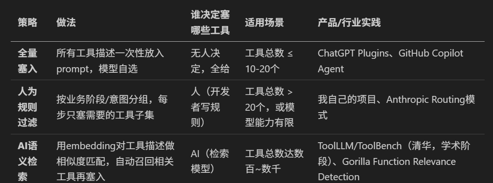


&#x20;      首先是**全量塞入**，很多聊天工具如Copilot都是这么做的。原因也很简单，因为这些产品其实用的是远端的模型，现在远端模型的上下文容量越来越大，所以他一次性塞入也并没有问题。

&#x20;      然后是**根据业务场景和规则，筛选对应项目加入的**。 原因也非常合理，因为我们用的本地模型，模型上下文本身有限。OpenAI官方文档都建议：单次API调用工具不超过20个，理想不超过10个。

最后是 让**AI动态决定工具。**&#x8FD9;个现在更多的其实是处于Demo，学术阶段才这么做，商业落地项目很少这么做。在25年12月份UC Berkeley 发布的论文

《Measuring Agents in Production》中明确调研了现在的商业化Agent，也证明了一点, 根据论文： "商业的生产级的Agent，一般都将执行步骤限制在10步以内，允许数十步的仅有 16.7%，无限制的仅 6.7%。并且还会专门通过给工具添加封装层，减少工具数量来简化模型的负担。

感兴趣的同学可以参考论文原文：https://arxiv.org/abs/2512.04123


&#x20;    （我说这么多是想要大家：

&#x20;      1：了解行业现状和相关知识

&#x20;      2：有的面试官可能也真的不太懂，拍脑袋就觉得你的项目某处简单的时   候，你可以拿出你的依据，告诉他行业现状和你使用这个策略的考虑来说服他，而不是被他带着跑）


5 然后我看你还有写到一些推理加速的部分，那地方做的多吗？

（结合我们分析的这个岗位性质，面试官其实问推理加速这一块应该很符合预期，因为本身他们就是做训练的。我比较担心的是他问的很深，因为按照我们的学习路线，我们是把算法这里带着走一遍。我按照我的笔记里的路线。 速度慢->量化->选择合适的推理框架->微调->强化学习讲了一遍。面试官也并没有追问，具体答案还是请看我笔记 <span style="color: inherit; background-color: rgba(255,246,122,0.8)">你的项目是如何做推理加速的？）</span>


6\. 现在我给你一个我们在做的开源项目，请你现场阅读，然后告诉我大概这个项目在讲啥？然后如果我要添加一个工具，怎么做？

&#x20;     （我还是第一次遇到这样考察的，这个问题完全是相当于把问题引入到面试官最熟悉，而你完全陌生的场景，需要你现场发挥，现场快速学习。大家可以自己打开这个链接，看一下这个项目，自己能不能用5\~10分钟弄清出这个问题的答案。另外咱们也不白学，针对这个问题，我总结出以下这开源项目是在做啥的，感兴趣你可以深入学这个项目，到时候有其他面试官问你你最近看了什么开源项目，也可以把这个拿出来讲

我在真正复盘这个面试题的时候，觉得也不用把他想的特别难，这个项目是一个deep research agent, 如果你了解deep research 的概念，结合它的readme,可以快速了解这是一个什么项目。 第二个问题如果添加一个工具，怎么做？结合现有的一些工程经验，比如我们RAG项目怎么增加一个新的模块，或者就是和这个类似的Git项目，如果有相关经验了，那么其实你也能很快回答。 借助这个机会，我们学一下开源项目，学一下deep research（其实deep research面试还是挺多人问的，可能很多公司他们研究这个，所以需要了解一下）， 学一下工程知识，我觉得这是一个很好的问题。

另外，我惊喜地发现这个问题其实不是最有价值的，最有价值的是这个项目。包含了Agent框架的知识，包含了训练，公开了数据集，训练方法。整套项目也有7.6k 个stars。完全开源，如果我们学下来，相当于是一个从训练 到Agent 都覆盖了的一个最好的实践的例子。我有初步想法准备把它当成我们的素材，26年3月开始，用它作为基础来学习，往算法方面扩展。如果这个计划执行，我也会把相关经历都写在笔记中，大家一起学习。）

项目地址：https://github.com/MiroMindAI/MiroThinker/tree/main

第一个问题，项目干啥，更像是读了Readme做总结，如果你熟悉相关领域，可能回答不难，但你不熟悉，可能这题就难了：

MiroThinker 是一个**开源的 Deep Research Agent**，目标是让模型能像研究员一样，自主地搜索信息、阅读网页、执行代码，最终完成复杂的研究任务。

项目包含**四个部分**：

* **MiroThinker 模型**——基于 Qwen3 做后训练的 Agent 专用大模型，经过 SFT、DPO、RL 三阶段训练，让模型学会了什么时候该搜索、怎么读网页、怎么写代码分析

* **MiroFlow 框架**——自研的轻量级 Agent 框架，基于 ReAct 范式，通过 MCP 协议接入工具，核心特色是 keep-5 上下文管理策略

* **MiroVerse 数据集**——147K 条 Agent 交互轨迹的训练数据

* **技术论文**——详细描述了训练方法

它的核心创新点是提出了 **Interactive Scaling**——认为除了模型规模和上下文长度之外，**交互深度**是提升 Agent 性能的第三个维度。通过 RL 训练，模型学会了在 256K 上下文窗口内进行最多 400 次工具调用，在 GAIA 等多个 benchmark 上达到了开源最优。


第二个问题：如果我要添加一个工具，怎么做？

&#x20;      这个问题面试现场肯定看不了代码那么细，需要结合目录大概分析。我们在目录中发现目录有microflow\_tools目录，然后下面有各种mcp\_server，所以估计可以推测出来大概是通过mcp的方式引入tools，深入研究具体回答为：

从目录结构可以看出，这个项目的工具是通过 MCP 协议以插件式的方式接入的，加一个新工具基本上分三步：

第一步，在 libs/miroflow-tools/src/miroflow\_tools/mcp\_servers/ 目录下新建一个 Python 文件，用 FastMCP 框架定义工具。每个文件就是一个独立的 MCP Server，用 @mcp.tool() 装饰器注册工具函数，最后通过 stdio 方式启动。

第二步，在 apps/miroflow-agent/conf/agent/ 目录下的 YAML 配置文件中，把新的 Server 注册进去。框架里有一个 ToolManager（manager.py）负责统一管理所有 Server 的连接和调用，配置里加上就能被发现。

第三步，如果新工具需要 API Key，在 .env 文件中配置对应的环境变量。

整体设计思路是每类工具一个独立的 MCP Server 进程，好处是依赖隔离、进程隔离、可以按需启动。比如项目里视觉理解就有两个版本——一个调 Anthropic API，一个用开源模型，文件名带 \_os 后缀，在配置里切一下就行，不需要改任何框架代码。


7\. 算法题 - 岛屿数量（LC:200)


8.你想做哪一哪一块啊，我不知道你对这个感不感兴趣，或者说你觉得你比较想在agent这个方面想自己想做的内容

说实话这问题就是要完全顺着面试官说，一定要说自己想要去做这个方向，还有原因说的具体点，不要看着像编的。我一直强调面试中表现出的意向度，是很重要的!


9\. 反问

笔记中，面试技巧也有专门的反问技巧，大家去看笔记 ： <span style="color: inherit; background-color: rgba(255,246,122,0.8)">面试技巧 - 反问</span>

### 视频讲解

我用夸克网盘给你分享了「盛大AI偏研究岗一面.mp4」，点击链接或复制整段内容，打开「夸克APP」即可获取。

/\~4f983LqWwS\~:/

链接：https://pan.quark.cn/s/94099aade1d8
