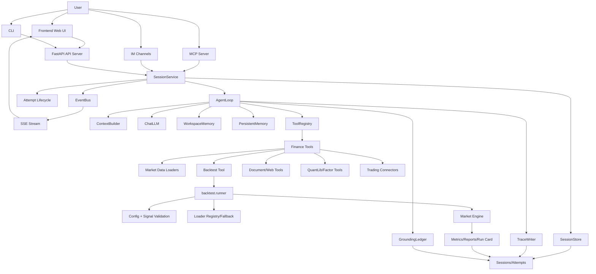

一句话定义

> **这是一个给"有交易想法但不会编程的投资者/交易员"解决"如何把交易想法快速变成可验证的量化策略并回测验证"的个人交易智能体系统。**


**Vibe-Trading = LLM Agent (推理引擎) + 74个金融技能(知识) + 74个工具(能力) + 29个DAG多Agent团队(协作流程) + 7个回测引擎(验证) + 20+数据源(情报)**

数据流动路径永远是：**用户输入 → 入口层 → SessionService → AgentLoop(ReAct循环) → (Skills / Tools / Swarm / Backtest) → 结果聚合 → SSE推送 → 用户看到报告**

AgentLoop 是整个系统的"大脑"——它决定什么时候调用什么工具、什么时候启动多Agent团队、什么时候写代码跑回测、什么时候生成报告。其他所有模块都是它的"手和脚"，被它按需调用。


价值
1. 自然语言得到回测代码，这跟掌柜问数项目（text2sql）类似，聚焦业务而非代码
2. 内置的74个金融技能（因子分析，期权定价，风险审计...），就是简单的规则skill，这里有问题，怎么评判到底评估的好与不好？74个工具注册表又是什么？预设的29个swarm DAG引擎？
3. 上下文组装系统提示词是什么东西？
4. 多agent团队，这里跟金融技能差不多，怎么评判结果好与坏？
5. 多数据源，从哪来的？如果是免费的怎么保证准确性？
6. 回测的验证怎么判断的？是什么逻辑？


前置知识
1. **Swarm 配置化** ： 没有硬编码，需要变得参数写在yaml、json里面
2. DAG：有向无环图，制定数据流转流程
3. 


# 核心流程

典型场景：用户说"帮我做一个高股息低估值的中证500选股策略，回测2024年"

用户post，api-server/cli/mcp-server


# 框架

## 交互层 presentation

web（react19）、CLI（richTUI）、MCP（Stdio）、Rest API（FastAPI）
这几个都是前端可以用的东西，可以浏览器web，也可以命令行cli，也可以ai直接调用mcp，这个rest api 好像是说前后端通信的规则！不像是一个输入框


MCP：这里代码提供的是mcp-server，也就是llm可以访问这些server，那么就要了解这里的server是如何写的？假设某个server可以调用天气预报，那么是怎么实现的？这个很细，先不考虑


## 会话管理 session

会话怎么创建的？怎么恢复？怎么查询？

消息怎么路由到AgentLoop？

SSE 事件怎么推送到EventBus的？

并发怎么控制的？


## Agent 

ReAct怎么设计的？怎么思考？怎么调用工具？怎么看结果？

5层压缩对话怎么压缩的（长对话自动压缩避免超 token 限制）？

工具怎么批量处理的？

这里的会话持久保存怎么做的？（FTS5 全文搜索？）


## 工具执行

7个回测引擎是什么？

20个数据是怎么加载的？

265个quantlib量化计算库是什么？

13个交易连接器怎么做到的？

4种组合优化器是什么？

风险审计（VaR、MC、Bootstrap）？反正就是三个计算亏损概率的方法


# 细节问题

```
Vibe-Trading/
├── agent/                          # Python 后端
│   ├── api_server.py / cli.py / mcp_server.py  # 入口点
│   ├── backtest/                   # 回测引擎 + 数据加载器 + 优化器
│   ├── src/
│   │   ├── agent/                  # AgentLoop 推理核心
│   │   ├── tools/                  # 74个工具（每个一个文件）
│   │   ├── skills/                 # 74个金融技能（每个一个目录）
│   │   ├── swarm/                  # DAG 多 Agent 编排
│   │   ├── providers/              # LLM 提供商抽象层
│   │   ├── session/                # 会话管理
│   │   ├── memory/                 # 持久化内存
│   │   ├── quantlib/               # 量化计算库
│   │   ├── trading/                # 交易连接器
│   │   ├── live/                   # 实盘交易相关
│   │   ├── governance/             # 模型风控
│   │   ├── goal/                   # 交易目标管理
│   │   └── strategy_discovery/     # 策略发现
│   └── tests/                      # 测试
├── frontend/                       # React 19 前端
├── wiki/                           # 文档
```

**组织方式的优点：**
1. **关注点分离** — agent（推理）+ tools（能力）+ skills（知识）三层解耦
2. **插件化设计** — 新增一个工具 = 在 tools/ 加一个文件，自动注册
3. **策略与实现分离** — 技能用 SKILL.md（Markdown）描述，LLM 通过 `load_skill` 按需加载
4. **Swarm 配置化** — 团队协作流程用 YAML 定义，无需改代码


1. 数据来源碎，多，杂，如何统一处理输入模型的？
2. 为了解决可信，如何持久化保存记忆的？让来源可溯源
3. 任务多，如何解决并发，session如何处理？eventbus，sse，都是什么？


