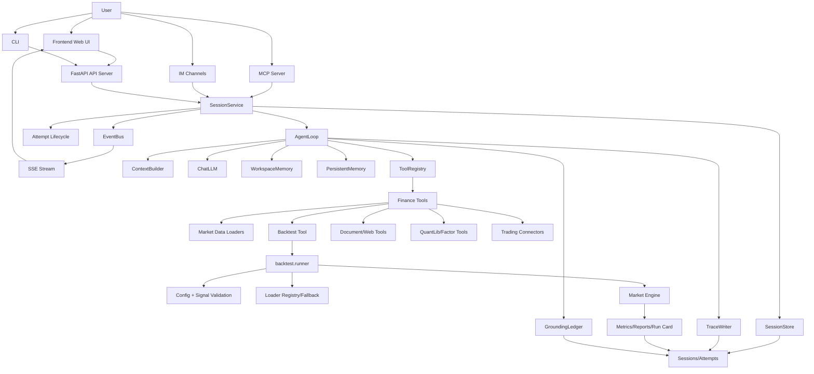

```mermaid
flowchart TD
    U[User] --> FE[Frontend Web UI]
    U --> CLI[CLI]
    U --> MCP[MCP Server]
    U --> CH[IM Channels]

    FE --> API[FastAPI API Server]
    CLI --> API
    MCP --> SVC[SessionService]
    CH --> SVC
    API --> SVC[SessionService]

    SVC --> STORE[SessionStore]
    SVC --> BUS[EventBus]
    SVC --> ATTEMPT[Attempt Lifecycle]
    BUS --> SSE[SSE Stream]
    SSE --> FE

    SVC --> AGENT[AgentLoop]
    AGENT --> CTX[ContextBuilder]
    AGENT --> LLM[ChatLLM]
    AGENT --> MEM[WorkspaceMemory]
    AGENT --> PM[PersistentMemory]
    AGENT --> REG[ToolRegistry]
    AGENT --> TRACE[TraceWriter]
    AGENT --> GROUND[GroundingLedger]

    REG --> TOOLS[Finance Tools]
    TOOLS --> DATA[Market Data Loaders]
    TOOLS --> BT[Backtest Tool]
    TOOLS --> DOC[Document/Web Tools]
    TOOLS --> QUANT[QuantLib/Factor Tools]
    TOOLS --> TRADE[Trading Connectors]

    BT --> RUNNER[backtest.runner]
    RUNNER --> VALID[Config + Signal Validation]
    RUNNER --> LOADER[Loader Registry/Fallback]
    RUNNER --> ENGINE[Market Engine]
    ENGINE --> ARTIFACTS[Metrics/Reports/Run Card]

    STORE --> PERSIST[Sessions/Attempts]
    TRACE --> PERSIST
    ARTIFACTS --> PERSIST
    GROUND --> PERSIST
```

# 框架

# 细节问题

数据来源碎，ru'h

