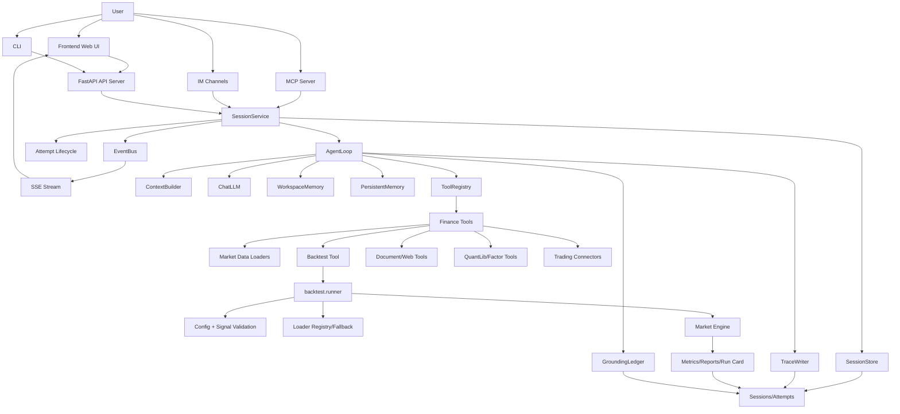

一句话定义

> **这是一个给"有交易想法但不会编程的投资者/交易员"解决"如何把交易想法快速变成可验证的量化策略并回测验证"的个人交易智能体系统。**

**Vibe-Trading = LLM Agent (推理引擎) + 74个金融技能(知识) + 74个工具(能力) + 29个DAG多Agent团队(协作流程) + 7个回测引擎(验证) + 20+数据源(情报)**

数据流动路径永远是：**用户输入 → 入口层 → SessionService → AgentLoop(ReAct循环) → (Skills / Tools / Swarm / Backtest) → 结果聚合 → SSE推送 → 用户看到报告**

AgentLoop 是整个系统的"大脑"——它决定什么时候调用什么工具、什么时候启动多Agent团队、什么时候写代码跑回测、什么时候生成报告。其他所有模块都是它的"手和脚"，被它按需调用。

价值
1. 自然语言得到回测代码，这跟掌柜问数项目（text2sql）类似，聚焦业务而非代码
2. 内置的74个金融技能（因子分析，期权定价，风险审计...），就是简单的规则skill，这里有问题，怎么评判到底评估的好与不好？74个工具注册表又是什么？预设的29个swarm DAG引擎？
3. 上下文组装系统提示词是什么东西？
4. 多agent团队，这里跟金融技能差不多，怎么评判结果好与坏？
5. 多数据源，从哪来的？如果是免费的怎么保证准确性？
6. 回测的验证怎么判断的？是什么逻辑？

# 框架

## 交互层 presentation

web（react19）、CLI（richTUI）、MCP（Stdio）、Rest API（FastAPI）

## 会话管理 session

会话怎么创建的？怎么恢复？怎么查询？

消息怎么路由到AgentLoop？

SSE 事件怎么推送到EventBus的？

并发怎么控制的？

## Agent 

ReAct怎么设计的？怎么思考？怎么调用工具？怎么看结果？

5层压缩对话怎么压缩的？

工具怎么批量处理的？

这里的会话持久保存怎么做的？

## 工具执行

7个回测引擎是什么？

20个数据是怎么加载的？

quantlib量化计算库是什么？

13个交易连接器怎么做到的？

# 细节问题

五个层次：入口，ai控制，回测，

1. 数据来源碎，多，杂，如何统一处理输入模型的？
2. 为了解决可信，如何持久化保存记忆的？让来源可溯源
3. 任务多，如何解决并发，session如何处理？eventbus，sse，都是什么？

