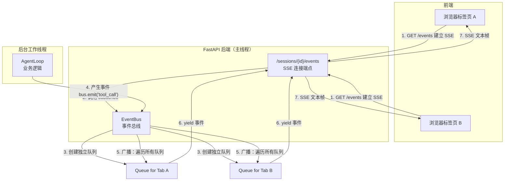

EventBus 的作用就是解耦：发布者不需要知道谁会收到事件，订阅者不需要知道事件从哪里来。它像一个智能路由器，确保了在不同线程和异步任务之间安全、可靠地传递消息
每一个会话有一条独立的“传送带”，发布者（业务代码）只管把事件放到传送带上（emit/publish），订阅者（SSE 连接）只管从传送带上取（subscribe/yield）
传送带内部处理：线程安全切换（call_soon_threadsafe）、历史事件重放（replay）、缓冲清理（clear）

队列（asyncio.Queue）是每个 SSE 连接专属的“实时状态收件箱”，用来临时存放 Agent 执行过程中产生的动态事件（如 tool_call、attempt.started）。

subscribe() 的无限循环不断从队列取出事件，通过 SSE 推送给前端，让 UI 实时更新。而完整的对话历史则永久保存在 messages.jsonl 中，两者分工明确。

**前端发起 SSE 连接 → 后端 `subscribe()` 为此连接创建一个专属队列 → AgentLoop 执行时通过 `emit()` 产生事件 → `publish()` 将事件广播到该会话的所有队列 → 每个 `subscribe()` 循环从自己的队列取出事件 → `yield` 返回给 FastAPI → 通过 SSE 推送到前端。**

为什么一个线程只能有一个事件循环？**因为 `asyncio` 的设计哲学就是“单线程协作式多任务”。**，单线程说明整个应用只有一个主线程在执行所有代码。协同式说明任务主动让出控制权（通过 `await`），而不是被操作系统强制切换。

**`asyncio` 规定：一个线程只能有一个事件循环**。FastAPI 已经在主线程中创建了一个事件循环（通过 `asyncio.run(app)` 或 `uvicorn` 的默认行为），`EventBus` 必须使用**同一个**事件循环，而不是自己再创建一个新的。所以它只能通过 `set_loop()` 接受外部注入的 `loop` 引用。
**`set_loop()` 只是把 FastAPI 创建的事件循环引用保存下来。真正的异步能力来自 `asyncio` 框架本身：`call_soon_threadsafe` 让后台线程可以安全地把任务“寄放”到主线程的事件循环中，由主线程在合适的时机执行，而不阻塞后台线程。这实现了跨线程的异步协作。**

如果 `AgentLoop` 在主循环中运行，`EventBus` 在自己的循环中运行，两者无法通信。publish()` 需要把事件放入 `asyncio.Queue`（队列属于主循环），跨循环操作会导致报错。
